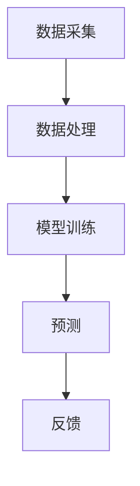

                 


# AI Agent在智能材料性能预测中的角色

> 关键词：AI Agent, 智能材料, 性能预测, 机器学习, 材料科学, 系统架构

> 摘要：本文探讨了AI Agent在智能材料性能预测中的应用，从背景介绍、核心概念、算法原理到系统架构，结合实际案例，详细分析了AI Agent在智能材料性能预测中的角色及其技术实现。

---

## 第1章: AI Agent与智能材料概述

### 1.1 AI Agent的基本概念

#### 1.1.1 AI Agent的定义
AI Agent（人工智能代理）是指能够感知环境并采取行动以实现目标的智能实体。它可以是一个软件程序，也可以是硬件设备，通过传感器和执行器与环境交互。

#### 1.1.2 AI Agent的核心特征
- **自主性**：能够在没有外部干预的情况下自主决策。
- **反应性**：能够实时感知环境并做出反应。
- **目标导向**：所有行为都以实现特定目标为导向。
- **学习能力**：能够通过数据和经验不断优化自身性能。

#### 1.1.3 AI Agent与传统算法的区别
| 特性       | AI Agent                   | 传统算法                   |
|------------|---------------------------|---------------------------|
| 自主性     | 高                         | 低                         |
| 学习能力   | 强                         | 弱                         |
| 环境交互   | 高度互动                   | 无交互或低互动             |
| 可扩展性   | 高                         | 低                         |

### 1.2 智能材料的基本概念

#### 1.2.1 智能材料的定义
智能材料是指能够感知外界环境变化（如温度、压力、光线等）并做出相应反应的材料。这些材料具有记忆、响应和自适应能力。

#### 1.2.2 智能材料的分类
- **形状记忆合金**：在外力作用下变形后，在特定温度下恢复原状。
- **压电材料**：受压力作用时产生电荷。
- **光电材料**：对外界光刺激产生电响应。

#### 1.2.3 智能材料的应用领域
- **医疗领域**：如形状记忆合金在医疗器械中的应用。
- **能源领域**：如压电材料用于能量收集。
- **建筑领域**：如智能材料用于自适应结构。

### 1.3 AI Agent在智能材料性能预测中的应用价值

#### 1.3.1 智能材料性能预测的挑战
- 数据复杂性：智能材料的性能受多种因素影响，数据收集和处理难度大。
- 预测准确性：传统方法难以捕捉复杂的非线性关系。
- 实时性要求：需要快速预测以应对动态环境。

#### 1.3.2 AI Agent在性能预测中的优势
- **高效性**：AI Agent能够快速处理大量数据，提高预测效率。
- **准确性**：通过机器学习算法，AI Agent能够捕捉数据中的复杂模式，提高预测准确性。
- **自适应性**：AI Agent能够根据环境变化自适应调整预测模型。

#### 1.3.3 应用场景与实际案例
- **医疗领域**：预测形状记忆合金在不同温度下的恢复性能。
- **能源领域**：预测压电材料的能量收集效率。
- **建筑领域**：预测智能材料在不同负载下的结构稳定性。

## 第2章: AI Agent与智能材料的关系

### 2.1 AI Agent与智能材料的核心概念对比

#### 2.1.1 对比表
| 特性       | AI Agent                   | 智能材料                   |
|------------|---------------------------|---------------------------|
| 核心功能   | 数据处理与决策            | 感知环境并做出反应        |
| 输入       | 数据流                     | 物理信号                   |
| 输出       | 决策或行动指令            | 物理变化或响应            |
| 目标       | 实现特定目标               | 实现材料性能优化           |

#### 2.1.2 实体关系图
```mermaid
erd
    cthouse {
        title 智能材料性能预测系统
        Student 实体 {
            属性: id, name, age
        }
        Course 实体 {
            属性: id, name, duration
        }
        Enroll 实体 {
            属性: student_id, course_id, enroll_date
        }
        关系: Student --> Enroll --> Course
    }
```

### 2.2 AI Agent在智能材料性能预测中的系统架构

#### 2.2.1 系统组成模块
- **数据采集模块**：负责收集智能材料的相关数据。
- **数据处理模块**：对数据进行清洗、转换和预处理。
- **模型训练模块**：利用机器学习算法训练预测模型。
- **预测模块**：基于训练好的模型进行性能预测。
- **反馈模块**：根据实际结果调整预测模型。

#### 2.2.2 系统架构图


## 第3章: 基于AI Agent的性能预测算法

### 3.1 监督学习算法

#### 3.1.1 线性回归算法
- **原理**：通过最小化预测值与实际值之间的平方差之和，找到最佳拟合直线。
- **公式**：
  $$
  y = \beta_0 + \beta_1x + \epsilon
  $$
  其中，$\beta_0$ 是截距，$\beta_1$ 是斜率，$\epsilon$ 是误差项。

#### 3.1.2 支持向量机算法
- **原理**：通过找到一个超平面，使得数据点与超平面的最小距离最大化。
- **公式**：
  $$
  y = \text{sign}(w \cdot x + b)
  $$

### 3.2 无监督学习算法

#### 3.2.1 聚类分析算法
- **K均值聚类**：将数据点聚成K个簇，使得簇内数据点的相似性最大化。
- **公式**：
  $$
  J = \sum_{i=1}^{K} \sum_{j=1}^{n} \frac{1}{k_i} \sum_{x_j \in C_i} (x_j - \mu_i)^2
  $$

### 3.3 深度学习算法

#### 3.3.1 神经网络算法
- **多层感知机（MLP）**：由输入层、隐藏层和输出层组成，通过非线性激活函数进行特征变换。
- **公式**：
  $$
  y = f(Wx + b)
  $$
  其中，$f$ 是激活函数，$W$ 是权重矩阵，$b$ 是偏置向量。

## 第4章: 数学模型与公式解析

### 4.1 线性回归模型
- **损失函数**：
  $$
  \text{MSE} = \frac{1}{N} \sum_{i=1}^{N} (y_i - \hat{y}_i)^2
  $$
- **优化目标**：最小化MSE，调整权重参数。

### 4.2 神经网络模型
- **前向传播**：
  $$
  h = \sigma(Wx + b)
  $$
  其中，$\sigma$ 是sigmoid函数。
- **损失函数**：
  $$
  \text{损失} = \text{交叉熵损失}(y, \hat{y})
  $$

---

## 项目实战

### 3.4.1 环境安装
- **Python 3.8+**
- **TensorFlow 2.0+**
- **Scikit-learn 0.24+**
- **Jupyter Notebook**

### 3.4.2 核心代码实现

```python
import numpy as np
from sklearn.linear_model import LinearRegression
from sklearn.metrics import mean_squared_error

# 生成数据
X = np.random.rand(100, 1)
y = 2 * X + 1 + np.random.randn(100, 1) * 0.1

# 训练模型
model = LinearRegression()
model.fit(X, y)

# 预测
y_pred = model.predict(X)

# 评估
mse = mean_squared_error(y, y_pred)
print(f"均方误差: {mse}")
print(f"回归系数: {model.coef_}")
print(f"截距: {model.intercept_}")
```

---

## 总结

通过以上分析，我们可以看到AI Agent在智能材料性能预测中的巨大潜力。它不仅能够提高预测的准确性和效率，还能够通过自适应学习不断优化预测模型。未来，随着AI技术的不断发展，AI Agent将在智能材料领域发挥更加重要的作用。

---

**作者：AI天才研究院 & 禅与计算机程序设计艺术**

