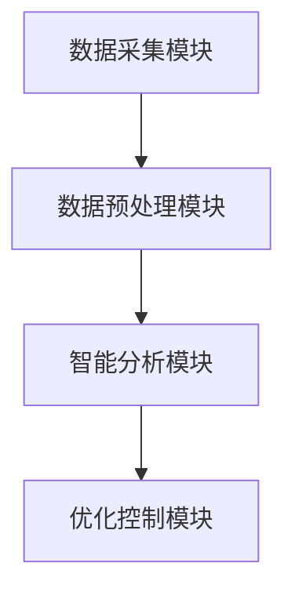
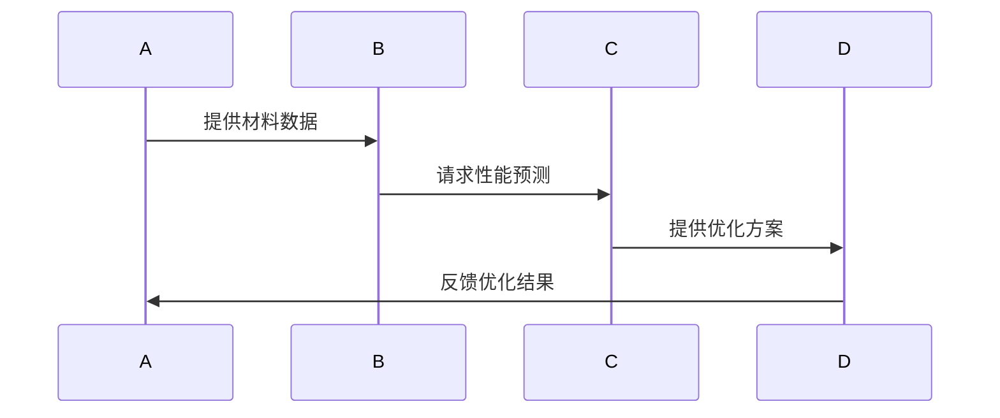

                 


# AI Agent在智能材料科学研究中的角色

**关键词**：AI Agent、智能材料科学、机器学习、材料数据库、知识图谱、深度学习、系统架构

**摘要**：本文探讨了AI Agent在智能材料科学研究中的重要角色。通过分析AI Agent的核心原理、算法实现和系统架构，结合实际案例，详细阐述了AI Agent如何推动材料科学的进步。文章还总结了当前研究的局限性，并展望了未来的发展方向，为研究人员提供了宝贵的参考。

---

## 第1章：AI Agent的定义与核心原理

### 1.1 AI Agent的基本概念

#### 1.1.1 AI Agent的定义与分类
- **定义**：AI Agent（人工智能代理）是指能够感知环境、做出决策并执行任务的智能实体。
- **分类**：根据智能水平，AI Agent可分为简单反射型、基于模型的反应型、目标驱动型和实用驱动型。

#### 1.1.2 AI Agent的核心特征
- **自主性**：能够自主决策。
- **反应性**：能感知环境并实时响应。
- **目标导向性**：具有明确的目标导向能力。

#### 1.1.3 AI Agent与传统计算工具的区别
- 传统计算工具依赖于明确的编程指令，而AI Agent具备自主学习和适应能力。

### 1.2 智能材料科学的定义与研究领域

#### 1.2.1 材料科学的基本概念
- 材料科学研究材料的组成、结构、性质及其应用。

#### 1.2.2 智能材料的定义与特性
- **定义**：智能材料是指能对外界刺激（如温度、压力）产生响应的材料。
- **特性**：具有响应性、适应性和自我调节能力。

#### 1.2.3 智能材料科学的研究方向
- 新材料开发、材料性能优化、材料数据库构建。

### 1.3 AI Agent在智能材料科学中的结合背景

#### 1.3.1 材料科学研究中的挑战
- 数据量庞大、复杂性高、实验成本昂贵。

#### 1.3.2 AI技术在材料科学中的应用潜力
- 数据分析、预测建模、优化设计。

#### 1.3.3 AI Agent在智能材料科学中的角色定位
- 作为智能工具，辅助材料科学研究，提高效率和准确性。

---

## 第2章：AI Agent与智能材料科学的核心概念

### 2.1 AI Agent的核心原理

#### 2.1.1 智能感知与数据处理
- 使用传感器和数据采集技术获取材料数据。

#### 2.1.2 知识表示与推理
- 利用知识图谱和逻辑推理分析材料特性。

#### 2.1.3 自适应决策与执行
- 根据推理结果制定优化策略并执行。

### 2.2 智能材料科学中的关键概念

#### 2.2.1 材料性能的多维度分析
- 包括力学、热学、电学等多个维度的性能分析。

#### 2.2.2 材料结构与性能的关系
- 结构决定性能，优化结构可提升性能。

#### 2.2.3 材料数据库的构建与应用
- 数据库用于存储和分析大量材料数据，支持AI Agent的决策。

### 2.3 AI Agent在智能材料科学中的核心功能

#### 2.3.1 数据采集与处理
- 从实验或文献中获取数据并进行预处理。

#### 2.3.2 智能分析与预测
- 利用机器学习模型预测材料性能。

#### 2.3.3 自适应优化与反馈
- 根据预测结果优化材料设计并实时反馈。

---

## 第3章：AI Agent在智能材料科学中的核心算法与数学模型

### 3.1 基于机器学习的AI Agent算法

#### 3.1.1 机器学习的基本原理
- 机器学习通过数据训练模型，使其具备预测能力。

#### 3.1.2 常见的机器学习算法
- 分类：随机森林、SVM。
- 回归：线性回归、神经网络。

#### 3.1.3 深度学习在AI Agent中的应用
- 使用神经网络进行材料性能预测。

### 3.2 智能材料科学中的数学模型

#### 3.2.1 材料性能预测的数学模型
- 使用回归模型预测材料强度。

#### 3.2.2 材料结构优化的数学模型
- 利用优化算法寻找最优结构。

#### 3.2.3 数据驱动的材料科学模型
- 基于机器学习构建数据驱动的材料模型。

### 3.3 AI Agent与材料科学结合的数学框架

#### 3.3.1 数据流与模型的结合
- 数据通过模型进行分析和预测。

#### 3.3.2 知识图谱与材料数据库的关联
- 知识图谱整合材料数据，支持AI Agent的推理。

#### 3.3.3 多目标优化的数学表达
- 使用多目标优化算法平衡多个性能目标。

---

## 第4章：AI Agent在智能材料科学中的系统架构设计

### 4.1 系统架构概述

#### 4.1.1 系统整体架构
- 包括数据采集模块、智能分析模块、优化控制模块。

#### 4.1.2 各模块的功能划分
- 数据采集模块：收集材料数据。
- 智能分析模块：分析数据并预测性能。
- 优化控制模块：优化设计并反馈结果。

#### 4.1.3 系统的输入输出接口
- 输入：材料数据和目标参数。
- 输出：优化方案和性能预测。

### 4.2 数据流与信息处理流程

#### 4.2.1 数据预处理
- 清洗数据，提取特征。

#### 4.2.2 特征提取
- 使用主成分分析等方法提取关键特征。

#### 4.2.3 模型训练与预测
- 训练机器学习模型，预测材料性能。

#### 4.2.4 结果分析与反馈
- 分析预测结果，优化模型参数。

### 4.3 系统功能模块设计

#### 4.3.1 数据采集与预处理
- 使用传感器采集材料数据，进行数据清洗。

#### 4.3.2 智能分析与预测
- 利用机器学习模型预测材料性能。

#### 4.3.3 优化与反馈控制
- 根据预测结果优化材料设计，实时反馈。

---

## 第5章：AI Agent在智能材料科学中的算法实现与案例分析

### 5.1 环境配置

#### 5.1.1 系统环境
- 操作系统：Linux。
- 开发工具：Python、TensorFlow、Keras。

### 5.2 核心代码实现

#### 5.2.1 数据预处理
```python
import pandas as pd
data = pd.read_csv('material_data.csv')
data = data.dropna()
```

#### 5.2.2 模型训练
```python
from tensorflow.keras.models import Sequential
model = Sequential()
model.add(Dense(64, activation='relu', input_shape=(n_features,)))
model.add(Dense(1, activation='sigmoid'))
model.compile(optimizer='adam', loss='binary_crossentropy')
model.fit(X_train, y_train, epochs=100, batch_size=32)
```

#### 5.2.3 结果分析
```python
from sklearn.metrics import accuracy_score
y_pred = model.predict(X_test)
accuracy = accuracy_score(y_test, y_pred.round())
print(f'Accuracy: {accuracy}')
```

### 5.3 案例分析

#### 5.3.1 案例背景
- 开发一种新型高强度材料。

#### 5.3.2 系统功能流程
- 数据采集 → 数据预处理 → 模型训练 → 性能预测 → 优化设计。

#### 5.3.3 mermaid系统架构图


#### 5.3.4 mermaid交互流程图


---

## 第6章：总结与展望

### 6.1 总结

- AI Agent在智能材料科学中具有重要作用，能够显著提高研究效率和准确性。

### 6.2 当前研究的局限性

- 数据质量问题、模型的可解释性、系统的可扩展性。

### 6.3 未来展望

- 更加智能化的AI Agent、跨学科的深度结合、更高效的优化算法。

### 6.4 最佳实践 tips

- 确保数据质量，选择合适的模型，关注模型的可解释性。

---

作者：AI天才研究院 & 禅与计算机程序设计艺术

---

本文详细探讨了AI Agent在智能材料科学研究中的角色，通过理论分析和实际案例，展示了其在材料科学中的广泛应用和潜力。希望本文能为研究人员提供有价值的参考和启发。

