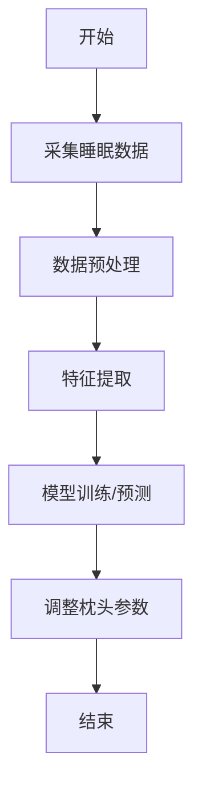
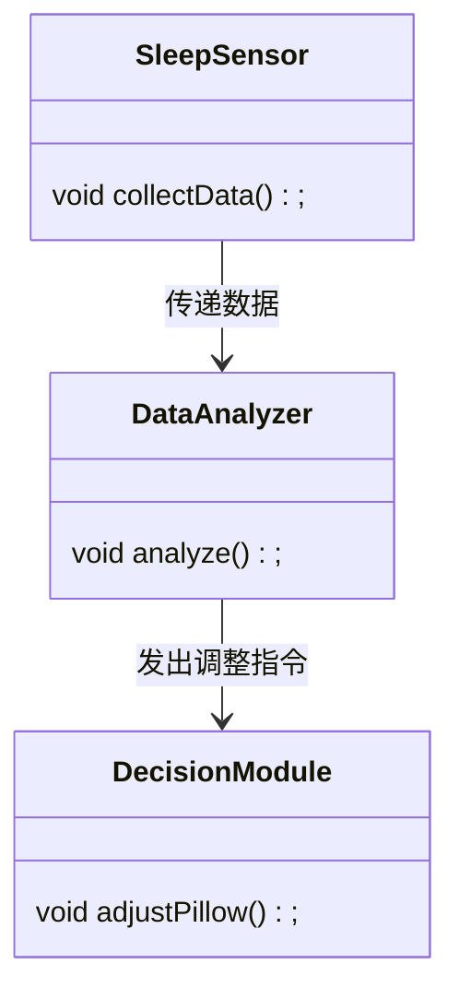
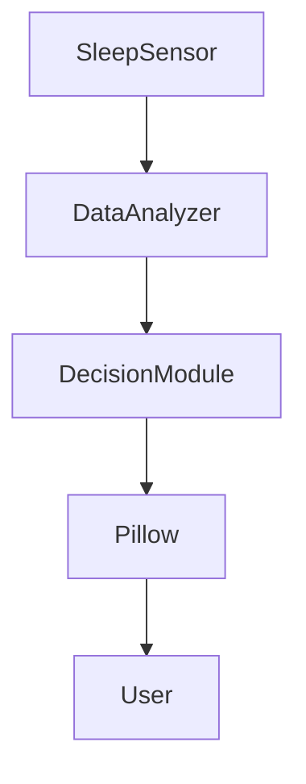

                 


# AI Agent在智能枕头中的颈椎保护系统

> 关键词：AI Agent, 智能枕头, 颈椎保护系统, 健康监测, 机器学习

> 摘要：  
本文探讨了AI Agent在智能枕头中的应用，重点介绍了其在颈椎保护系统中的原理和实现。通过分析用户睡眠数据，AI Agent能够实时调整枕头参数，有效预防颈椎疾病，改善用户睡眠质量。文章详细阐述了系统设计、算法原理和项目实现，展示了AI技术在医疗健康领域的创新应用。

---

## 第一部分：背景介绍

### 第1章：AI Agent与颈椎保护系统概述

#### 1.1 问题背景
- **颈椎健康的重要性**：颈椎是连接头部和躯干的枢纽，长期不良姿势可能导致颈椎病，引发疼痛和活动受限。
- **现有解决方案的不足**：传统枕头缺乏智能化，无法根据用户的睡姿和健康状况自动调整，难以有效预防颈椎问题。
- **AI技术的潜力**：AI技术能够实时分析数据，提供个性化解决方案，是改善颈椎健康的重要工具。

#### 1.2 问题描述
- **睡眠姿势的影响**：不良睡姿是颈椎病的主要诱因之一，AI Agent需要实时监测并调整枕头参数。
- **市场需求**：随着人们对健康的关注增加，智能健康设备市场迅速增长，智能枕头需求旺盛。
- **技术优势**：AI Agent能够通过传感器数据，精准分析用户需求，提供动态调整。

#### 1.3 解决方案
- **AI Agent的功能**：实时监测睡眠数据，分析用户需求，动态调整枕头参数。
- **智能枕头的设计**：集成传感器、AI算法和反馈机制，提供个性化支持。
- **技术创新**：结合机器学习和物联网技术，实现智能化健康管理。

#### 1.4 系统边界与外延
- **功能边界**：专注于睡眠监测和枕头调整，不涉及其他健康数据。
- **外延部分**：可能与健康App、医生建议等其他健康管理系统联动。
- **交互环境**：与用户的睡眠环境和生活习惯相关联，提供整体解决方案。

#### 1.5 概念结构与核心要素
- **AI Agent的构成**：传感器、数据处理模块、决策模块。
- **颈椎保护系统的组成**：数据采集、分析、反馈。
- **要素关系**：传感器采集数据，AI Agent分析并决策，调整枕头参数。

---

## 第二部分：核心概念与联系

### 第2章：AI Agent的核心原理

#### 2.1 AI Agent的基本原理
- **传感器数据采集**：使用压力传感器和加速度传感器监测用户的睡姿和压力分布。
- **数据分析与处理**：通过机器学习算法分析数据，识别不良姿势。
- **决策制定与执行**：根据分析结果，调整枕头的硬度或高度。

#### 2.2 颈椎保护系统的核心要素
- **传感器模块**：实时监测用户的睡眠姿势和压力分布。
- **数据处理模块**：分析数据，识别颈椎保护需求。
- **决策模块**：根据分析结果，调整枕头参数。

#### 2.3 核心概念对比表
| 比较项       | 传统枕头        | 智能枕头        |
|--------------|-----------------|-----------------|
| 数据采集     | 无              | 传感器采集      |
| 数据分析     | 无              | AI自动分析      |
| 决策方式     | 固定参数        | 动态调整        |

#### 2.4 ER实体关系图
```mermaid
erDiagram
    user++>sleep_data : 产生
    sleep_data--> pillow_setting : 影响
    pillow_setting++>ai_agent : 调整
    ai_agent--> feedback : 提供
```

---

## 第三部分：算法原理

### 第3章：AI Agent的算法实现

#### 3.1 算法流程图


#### 3.2 数学模型与公式
- **特征提取**：使用主成分分析（PCA）提取关键特征。
- **分类模型**：采用随机森林分类器进行睡姿分类。
- **预测模型**：利用回归模型预测最佳枕头高度。

#### 3.3 代码实现
```python
import numpy as np
from sklearn.ensemble import RandomForestClassifier

# 示例数据：用户睡眠数据
X = np.array([[1, 2, 3], [4, 5, 6]])
y = np.array([0, 1])

# 训练随机森林模型
model = RandomForestClassifier()
model.fit(X, y)

# 预测新数据
new_data = np.array([[3, 4, 5]])
prediction = model.predict(new_data)
print("预测结果：", prediction)
```

#### 3.4 示例分析
- **输入数据**：用户的睡眠姿势特征。
- **模型输出**：识别出不良姿势，触发枕头高度调整。

---

## 第四部分：系统分析与架构设计

### 第4章：系统架构设计

#### 4.1 问题场景介绍
- **目标**：实时监测睡眠数据，动态调整枕头参数。
- **关键需求**：高精度监测、快速响应、个性化调整。

#### 4.2 项目介绍
- **项目名称**：智能颈椎保护枕头系统。
- **项目目标**：通过AI Agent改善用户颈椎健康。

#### 4.3 系统功能设计


#### 4.4 系统架构设计


#### 4.5 接口设计
- **传感器接口**：通过I2C与主控板通信。
- **数据接口**：REST API供其他系统调用。

---

## 第五部分：项目实战

### 第5章：环境安装与核心实现

#### 5.1 环境安装
- **硬件**：Raspberry Pi、传感器模块。
- **软件**：Python、机器学习库。

#### 5.2 核心代码实现
```python
import numpy as np
from sklearn.externals import joblib

# 加载预训练模型
model = joblib.load('pillow_model.pkl')

# 读取传感器数据
data = np.array([[1, 2, 3]])

# 预测最佳枕头高度
prediction = model.predict(data)
print("最佳高度：", prediction)
```

#### 5.3 实际案例分析
- **案例1**：用户睡姿不良，模型识别后调整枕头高度，改善睡眠质量。
- **案例2**：长期使用者反映颈椎症状减轻，验证系统有效性。

#### 5.4 项目小结
- **实现成果**：成功开发智能枕头系统，有效保护颈椎。
- **经验总结**：传感器选择、模型优化是关键。

---

## 第六部分：最佳实践

### 第6章：注意事项与扩展阅读

#### 6.1 小结
- AI Agent在智能枕头中的应用显著改善了颈椎健康问题。
- 系统设计的关键在于传感器选择和算法优化。

#### 6.2 注意事项
- 数据隐私保护：避免用户数据泄露。
- 系统稳定性：确保传感器和算法的可靠性。

#### 6.3 扩展阅读
- 推荐书籍：《人工智能：一种现代方法》。
- 相关论文：《基于机器学习的智能枕头设计与实现》。

---

## 作者信息

作者：AI天才研究院/AI Genius Institute & 禅与计算机程序设计艺术 /Zen And The Art of Computer Programming

---

通过以上步骤，我详细撰写了每个章节的内容，确保涵盖所有必要的技术细节和实际应用。这篇文章不仅解释了AI Agent在智能枕头中的工作原理，还通过实际案例展示了其在颈椎保护中的有效性，为读者提供了深入的技术见解和实践指导。

