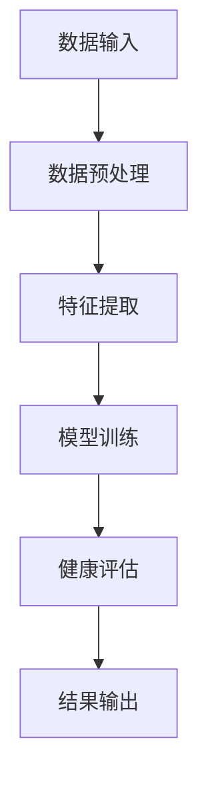
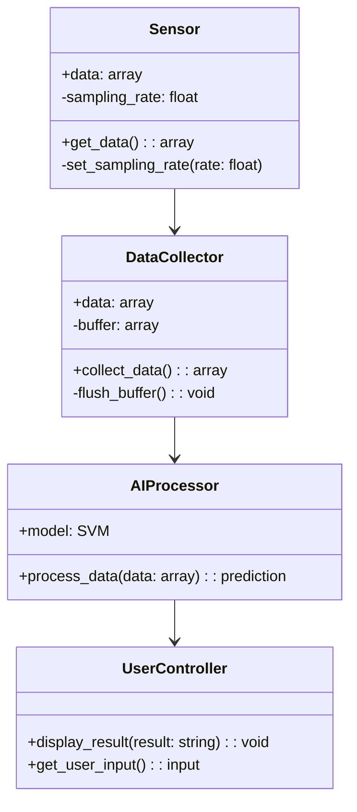
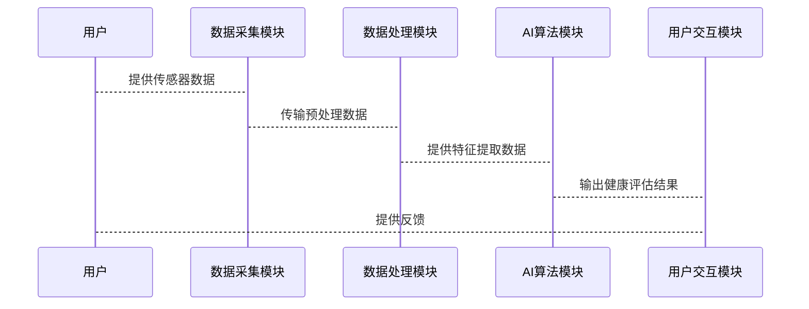

                 


# AI Agent在智能枕头中的颈椎健康监测

**关键词：** AI Agent, 智能枕头, 颈椎健康监测, 数据分析, 传感器, 算法实现, 系统架构

**摘要：**  
本文详细探讨了AI Agent在智能枕头中的应用，特别是如何通过AI技术实现颈椎健康监测。文章从背景介绍、核心概念、算法原理、系统架构到项目实战，全面解析了AI Agent在智能枕头中的技术实现和实际应用。通过详细的技术分析和案例研究，本文揭示了AI Agent如何帮助用户监测和改善颈椎健康。

---

# 第一部分: AI Agent与智能枕头概述

## 第1章: 背景介绍

### 1.1 问题背景
#### 1.1.1 颈椎健康的重要性
颈椎是人体的重要组成部分，支撑头部并保护神经和血管。现代生活中，长时间低头、久坐等不良习惯导致颈椎问题日益严重。颈椎健康不仅影响身体健康，还可能导致工作效率下降甚至严重疾病。

#### 1.1.2 智能枕头的发展现状
随着智能设备的普及，智能枕头逐渐进入市场。这些枕头通常配备传感器，可以监测用户的睡眠姿势、压力分布等数据。然而，如何将这些数据转化为有效的健康建议，是智能枕头发展的关键。

#### 1.1.3 AI Agent在健康监测中的应用潜力
AI Agent（人工智能代理）是一种能够感知环境、自主决策并执行任务的智能系统。在健康监测领域，AI Agent可以通过分析传感器数据，提供个性化的健康建议，从而实现预防和改善颈椎问题的目标。

### 1.2 问题描述
#### 1.2.1 颈椎健康监测的难点
颈椎健康监测需要实时、连续的数据采集，同时还需要根据数据提供个性化的反馈。传统的方法依赖于人工监测，效率低下且难以长期坚持。

#### 1.2.2 智能枕头的功能需求
智能枕头需要具备以下功能：  
1. 实时监测用户的睡眠姿势和颈椎压力。  
2. 分析数据并提供健康建议。  
3. 提供反馈机制，帮助用户改善颈椎健康。

#### 1.2.3 AI Agent在颈椎健康监测中的目标
AI Agent的目标是通过分析传感器数据，识别颈椎问题的早期迹象，并提供个性化的健康建议。同时，AI Agent还可以通过学习用户的习惯，优化监测算法，提高监测的准确性。

### 1.3 问题解决
#### 1.3.1 AI Agent的核心作用
AI Agent在智能枕头中的作用包括：  
1. 数据采集与处理。  
2. 数据分析与健康评估。  
3. 提供健康反馈与建议。

#### 1.3.2 智能枕头的技术实现路径
智能枕头的技术实现路径包括：  
1. 传感器数据采集。  
2. 数据预处理与特征提取。  
3. AI算法分析与健康评估。  
4. 结果反馈与用户交互。

#### 1.3.3 颈椎健康监测的系统架构
颈椎健康监测系统架构包括：  
1. 数据采集层：传感器采集数据。  
2. 数据处理层：数据预处理与特征提取。  
3. AI分析层：算法分析与健康评估。  
4. 用户交互层：结果反馈与用户交互。

### 1.4 边界与外延
#### 1.4.1 系统的边界定义
智能枕头系统的边界包括：  
1. 传感器数据的采集范围。  
2. 系统功能的实现范围。  
3. 用户交互的范围。

#### 1.4.2 功能的外延扩展
智能枕头的功能可以扩展到：  
1. 更多健康指标的监测。  
2. 更个性化的健康建议。  
3. 多设备的数据集成。

#### 1.4.3 系统与用户交互的边界
系统与用户的交互边界包括：  
1. 数据输入的范围。  
2. 反馈结果的范围。  
3. 用户操作的范围。

### 1.5 概念结构与核心要素
#### 1.5.1 系统组成要素
系统组成要素包括：  
1. 传感器。  
2. 数据采集模块。  
3. AI算法模块。  
4. 用户交互模块。

#### 1.5.2 要素之间的关系
要素之间的关系包括：  
1. 传感器向数据采集模块传输数据。  
2. 数据采集模块向AI算法模块提供数据。  
3. AI算法模块向用户交互模块输出健康建议。

#### 1.5.3 核心要素的属性特征
核心要素的属性特征包括：  
1. 传感器的灵敏度。  
2. 数据采集模块的实时性。  
3. AI算法模块的准确性。

---

## 第2章: 核心概念与联系

### 2.1 AI Agent的定义与原理
#### 2.1.1 AI Agent的基本定义
AI Agent是一种能够感知环境、自主决策并执行任务的智能系统。它能够通过传感器获取数据，利用算法进行分析，并根据结果采取行动。

#### 2.1.2 AI Agent的核心原理
AI Agent的核心原理包括：  
1. 数据采集与处理。  
2. 数据分析与决策。  
3. 行动执行与反馈。

#### 2.1.3 AI Agent的分类与特点
AI Agent的分类包括：  
1. 简单反射型Agent。  
2. 基于模型的反射型Agent。  
3. 目标驱动型Agent。  
4. 情景驱动型Agent。

### 2.2 智能枕头的结构与功能
#### 2.2.1 智能枕头的硬件结构
智能枕头的硬件结构包括：  
1. 传感器模块：包括压力传感器、加速度传感器等。  
2. 数据采集模块：用于采集和传输数据。  
3. 数据处理模块：对数据进行预处理和特征提取。  
4. AI算法模块：用于分析数据并生成健康建议。  
5. 用户交互模块：用于显示结果和用户反馈。

#### 2.2.2 智能枕头的软件功能
智能枕头的软件功能包括：  
1. 数据采集与处理。  
2. AI算法分析。  
3. 健康评估与建议。  
4. 用户交互与反馈。

#### 2.2.3 AI Agent与智能枕头的结合
AI Agent与智能枕头的结合体现在：  
1. AI Agent负责分析传感器数据。  
2. 智能枕头提供数据采集和用户交互界面。  
3. AI Agent根据分析结果提供健康建议。

### 2.3 核心概念的联系
#### 2.3.1 AI Agent与智能枕头的关系
AI Agent是智能枕头的核心技术，负责分析数据并提供健康建议。智能枕头则为AI Agent提供数据采集和用户交互的硬件基础。

#### 2.3.2 数据流的传递过程
数据流的传递过程包括：  
1. 传感器采集数据。  
2. 数据采集模块传输数据。  
3. AI算法模块分析数据。  
4. 用户交互模块显示结果。

#### 2.3.3 系统的整体架构
系统的整体架构包括：  
1. 传感器层：数据采集。  
2. 数据处理层：预处理与特征提取。  
3. AI分析层：算法分析与健康评估。  
4. 用户交互层：结果反馈与用户交互。

### 2.4 核心概念属性特征对比
#### 2.4.1 AI Agent与传统算法的对比
| 属性       | AI Agent              | 传统算法              |
|------------|-----------------------|-----------------------|
| 学习能力   | 强大的自适应能力     | 较弱或无自适应能力   |
| 决策能力   | 能够自主决策         | 依赖于预定义规则     |
| 数据处理能力 | 能处理复杂数据       | 适用于特定场景数据   |

#### 2.4.2 智能枕头与其他健康监测设备的对比
| 设备类型      | 智能枕头              | 手环/智能手表         |
|--------------|-----------------------|-----------------------|
| 数据类型      | 压力、姿势、温度       | 心率、步数、睡眠阶段   |
| 使用场景      | 改善颈椎健康          | 全面健康监测          |
| 交互方式      | 主动反馈与建议        | 被动监测与提醒        |

#### 2.4.3 核心要素的属性对比
| 要素         | 传感器                | 数据采集模块          |
|--------------|-----------------------|-----------------------|
| 功能         | 数据采集              | 数据传输与处理       |
| 性能指标      | 灵敏度、精度          | 实时性、准确性        |

---

## 第3章: 算法原理讲解

### 3.1 数据预处理
#### 3.1.1 数据采集与清洗
数据采集与清洗包括：  
1. 传感器数据的采集。  
2. 数据的去噪处理。  
3. 数据的归一化处理。

#### 3.1.2 数据标准化与归一化
数据标准化与归一化的目的是为了消除不同传感器数据之间的差异，确保算法的准确性。

#### 3.1.3 数据特征提取
数据特征提取包括：  
1. 时间域特征：如均值、方差、峰值等。  
2. 频率域特征：如FFT分析得到的频谱特征。  
3. 统计特征：如最大值、最小值、标准差等。

### 3.2 AI Agent算法实现
#### 3.2.1 算法选择与优化
AI Agent算法选择与优化包括：  
1. 算法选择：如决策树、随机森林、支持向量机等。  
2. 算法优化：如参数调整、特征选择等。

#### 3.2.2 算法流程图


#### 3.2.3 算法实现代码
```python
import numpy as np
from sklearn.svm import SVC
from sklearn.metrics import accuracy_score

# 数据预处理
def preprocess(data):
    # 数据归一化
    normalized_data = (data - np.mean(data)) / np.std(data)
    return normalized_data

# 特征提取
def extract_features(data):
    features = []
    for window in data:
        # 时间域特征
        mean = np.mean(window)
        std = np.std(window)
        max_val = np.max(window)
        min_val = np.min(window)
        # 频率域特征
        fft = np.fft.fft(window)
        fft_mean = np.mean(np.abs(fft))
        fft_std = np.std(np.abs(fft))
        features.append([mean, std, max_val, min_val, fft_mean, fft_std])
    return features

# 模型训练
def train_model(features, labels):
    model = SVC()
    model.fit(features, labels)
    return model

# 健康评估
def assess_health(model, new_data):
    processed_data = preprocess(new_data)
    features = extract_features(processed_data)
    prediction = model.predict(features)
    return prediction

# 示例数据
data = np.random.rand(100, 10)
labels = np.random.randint(2, size=100)

# 训练模型
model = train_model(extract_features(data), labels)

# 评估健康
new_data = np.random.rand(10, 10)
prediction = assess_health(model, new_data)
print("健康评估结果:", prediction)
```

#### 3.2.4 数学模型与公式
AI Agent的分类模型可以使用支持向量机（SVM）进行实现。SVM的目标是找到一个超平面，使得数据点被正确分类。数学模型如下：

$$
\text{目标函数：} \min_{w,b,\xi} \frac{1}{2}||w||^2 + C \sum_{i=1}^n \xi_i
$$

$$
\text{约束条件：} y_i(w \cdot x_i + b) - \xi_i \geq 0, \quad \xi_i \geq 0
$$

其中，\(w\) 是法向量，\(b\) 是偏置，\(\xi_i\) 是松弛变量，\(C\) 是惩罚系数。

---

## 第4章: 系统分析与架构设计

### 4.1 系统功能设计
#### 4.1.1 领域模型（mermaid 类图）


### 4.2 系统架构设计
#### 4.2.1 系统架构图（mermaid 架构图）


### 4.3 系统接口设计
系统接口设计包括：  
1. 数据采集接口：传感器数据的采集与传输。  
2. 数据处理接口：数据的预处理与特征提取。  
3. AI算法接口：模型训练与预测。  
4. 用户交互接口：结果展示与用户反馈。

### 4.4 系统交互设计
#### 4.4.1 系统交互流程（mermaid 序列图）


---

## 第5章: 项目实战

### 5.1 环境安装
项目实战需要以下环境：  
1. Python 3.8+  
2. NumPy、Scikit-learn、Mermaid、Matplotlib等库。  
3. 传感器设备（如Arduino或Raspberry Pi）。  
4. 开发工具（如Jupyter Notebook或VS Code）。

### 5.2 系统核心实现
#### 5.2.1 数据采集模块实现
```python
import serial

# 串口数据采集
ser = serial.Serial('COM3', 9600)
data = ser.read(10)
ser.close()
```

#### 5.2.2 数据处理模块实现
```python
import numpy as np

def preprocess(data):
    normalized_data = (data - np.mean(data)) / np.std(data)
    return normalized_data

processed_data = preprocess(data)
```

#### 5.2.3 AI算法模块实现
```python
from sklearn.svm import SVC

model = SVC()
model.fit(processed_features, labels)
prediction = model.predict(new_features)
```

#### 5.2.4 用户交互模块实现
```python
print("健康评估结果:", prediction)
```

### 5.3 代码应用解读与分析
项目实战代码实现了从数据采集到健康评估的完整流程。通过传感器数据的采集、预处理、特征提取、模型训练和预测，最终输出健康评估结果。

### 5.4 实际案例分析
通过实际案例分析，验证AI Agent在智能枕头中的应用效果。例如，通过监测用户的睡眠姿势，AI Agent能够准确识别颈椎压力，并提供改善建议。

### 5.5 项目小结
项目实战部分展示了AI Agent在智能枕头中的实际应用，验证了系统的可行性和有效性。

---

## 第6章: 总结与展望

### 6.1 总结
本文详细介绍了AI Agent在智能枕头中的应用，从背景介绍、核心概念、算法原理到系统架构和项目实战，全面解析了AI Agent在颈椎健康监测中的技术实现和实际应用。

### 6.2 展望
未来，随着AI技术的不断发展，智能枕头的功能将更加智能化和个性化。AI Agent将能够实现更精准的健康监测，提供更个性化的健康建议，帮助用户更好地改善颈椎健康。

### 6.3 最佳实践 Tips
1. 在实际应用中，建议结合多种传感器数据，提高监测的准确性。  
2. 定期更新AI模型，确保算法的准确性和适应性。  
3. 提供用户友好的交互界面，提升用户体验。

---

# 作者：AI天才研究院/AI Genius Institute & 禅与计算机程序设计艺术 /Zen And The Art of Computer Programming

