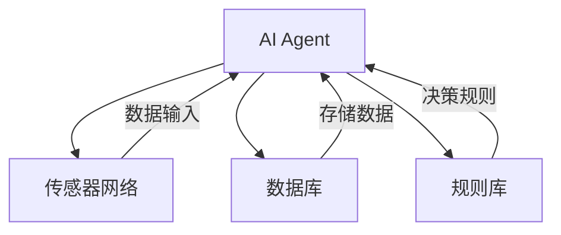
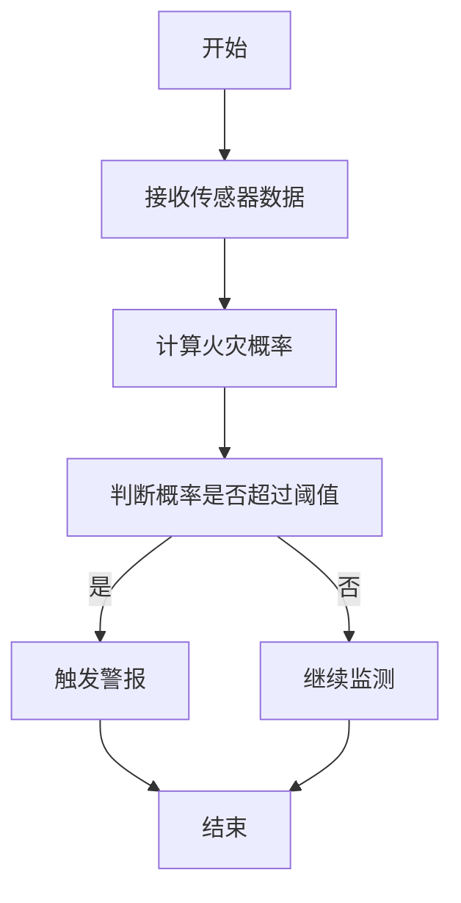
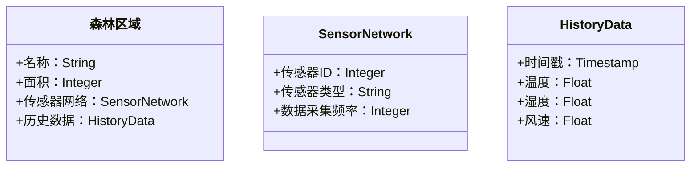
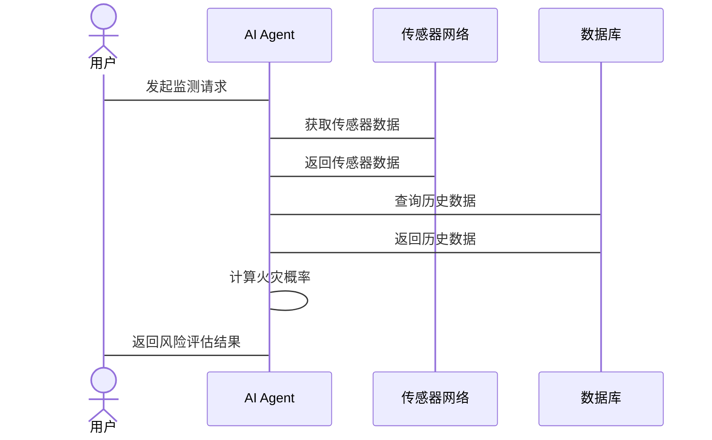

                 


# AI Agent在智能森林火灾预防中的实践

## 关键词：AI Agent，森林火灾预防，智能监测系统，算法原理，系统架构设计

## 摘要：  
本文探讨了AI Agent在智能森林火灾预防中的应用，详细分析了AI Agent的核心概念、算法原理、系统架构设计以及实际项目实现。通过结合传感器数据、火灾风险评估算法和智能决策系统，本文展示了如何利用AI技术实现森林火灾的智能化预防与预警。文章从理论到实践，系统地阐述了AI Agent在森林火灾预防中的重要作用，为相关领域的研究和应用提供了有益的参考。

---

# 第一部分: AI Agent在智能森林火灾预防中的背景与概念

# 第1章: AI Agent与森林火灾预防概述

## 1.1 AI Agent的基本概念

### 1.1.1 AI Agent的定义  
AI Agent（人工智能代理）是指能够感知环境、自主决策并执行任务的智能实体。它通过传感器获取数据，利用算法进行分析，并根据结果采取行动。AI Agent的核心目标是通过智能化的方式解决问题，提高效率和准确性。

### 1.1.2 AI Agent的核心特征  
AI Agent具有以下核心特征：  
1. **自主性**：能够在没有外部干预的情况下自主运行。  
2. **反应性**：能够实时感知环境变化并做出响应。  
3. **学习能力**：通过数据和经验不断优化自身的决策能力。  
4. **可扩展性**：能够适应不同规模和复杂度的任务。  

### 1.1.3 AI Agent在森林火灾预防中的应用背景  
森林火灾是一种严重的自然灾害，往往由自然因素（如雷击）或人为因素（如乱扔烟蒂）引发。传统的火灾预防方法主要依赖于人工巡查和简单的传感器设备，存在效率低、覆盖范围有限的问题。随着AI技术的发展，AI Agent能够通过整合多种传感器数据，实时分析火灾风险，并在危险情况下迅速采取行动，从而有效降低火灾的发生概率。

---

## 1.2 森林火灾预防的现状与挑战

### 1.2.1 森林火灾的主要原因  
森林火灾的主要原因包括：  
1. **自然因素**：如雷击、火山喷发等。  
2. **人为因素**：如乱扔烟蒂、违规用火等。  

### 1.2.2 传统火灾预防方法的局限性  
传统火灾预防方法主要包括以下几种：  
1. **人工巡查**：依赖于人工巡逻，效率低且覆盖面有限。  
2. **传感器监测**：通过烟雾传感器或温度传感器检测异常情况，但缺乏智能化的分析能力。  
3. **卫星遥感技术**：虽然能够覆盖大面积区域，但实时性较差。  

### 1.2.3 AI技术在火灾预防中的潜力  
AI技术的引入为火灾预防带来了新的可能性：  
1. **实时监测**：通过AI Agent整合多种传感器数据，实现对森林环境的实时监控。  
2. **智能分析**：利用机器学习算法，快速识别火灾风险并预测火势蔓延方向。  
3. **自动响应**：在发现火灾苗头时，AI Agent可以立即触发警报或启动灭火装置。  

---

## 1.3 AI Agent在森林火灾预防中的问题分析

### 1.3.1 问题背景与问题描述  
森林面积广阔，环境复杂，传统的火灾预防方法难以满足需求。AI Agent需要解决以下问题：  
1. 如何高效整合多种传感器数据？  
2. 如何准确识别火灾风险并进行实时预警？  
3. 如何在复杂环境下实现快速响应？  

### 1.3.2 问题解决的关键点  
AI Agent的核心在于通过智能化的算法和高效的系统架构，实现对森林环境的实时监控和风险评估。关键点包括：  
1. **数据整合**：将气象数据、传感器数据和地理信息整合到统一的系统中。  
2. **算法优化**：开发高效的火灾风险评估算法，提高预测准确性。  
3. **系统响应**：在发现火灾风险时，迅速触发警报并启动应急措施。  

### 1.3.3 问题的边界与外延  
AI Agent的应用范围不仅限于火灾预防，还可以扩展到其他领域，如森林资源管理、生态监测等。然而，本文主要聚焦于火灾预防这一核心问题，探讨AI Agent在这一领域的具体应用。

---

## 1.4 本章小结  
本章介绍了AI Agent的基本概念、核心特征及其在森林火灾预防中的应用背景。通过分析传统火灾预防方法的局限性，揭示了AI Agent在这一领域的巨大潜力。接下来的章节将详细探讨AI Agent的核心概念、算法原理和系统架构设计。

---

# 第二部分: AI Agent的核心概念与系统架构

# 第2章: AI Agent的核心概念与原理

## 2.1 AI Agent的核心概念

### 2.1.1 感知模块  
感知模块是AI Agent的“眼睛和耳朵”，负责采集环境数据。  
- **传感器数据**：包括温度、湿度、风速、烟雾浓度等。  
- **数据预处理**：对传感器数据进行清洗、归一化等处理，确保数据质量。  

### 2.1.2 决策模块  
决策模块是AI Agent的“大脑”，负责分析数据并做出决策。  
- **火灾风险评估**：基于传感器数据和历史数据，评估火灾发生的概率。  
- **决策逻辑**：根据风险评估结果，决定是否触发警报或采取灭火措施。  

### 2.1.3 执行模块  
执行模块是AI Agent的“手和脚”，负责执行决策模块的指令。  
- **警报系统**：当火灾风险超过阈值时，触发警报通知相关人员。  
- **灭火装置**：在特定情况下，启动自动灭火设备。  

---

## 2.2 AI Agent与传统监测系统的对比

### 2.2.1 传统监测系统的优缺点  
- **优点**：成本低、易于部署。  
- **缺点**：缺乏智能化，无法实时分析数据，响应速度慢。  

### 2.2.2 AI Agent的优势与创新点  
- **优势**：  
  1. 实时分析能力：能够快速处理大量传感器数据，提供实时风险评估。  
  2. 智能决策能力：通过机器学习算法优化决策逻辑，提高准确性。  
  3. 自适应能力：能够根据环境变化动态调整监测策略。  
- **创新点**：将AI技术引入火灾预防领域，实现了从被动监测到主动预警的转变。  

---

## 2.3 AI Agent的系统架构

### 2.3.1 系统实体关系图  
```mermaid
er
actor: 森林管理者
agent: AI Agent
sensor: 传感器网络
database: 数据库
rules: 火灾预防规则库
```

### 2.3.2 系统架构图  


---

## 2.4 本章小结  
本章详细介绍了AI Agent的核心概念和系统架构，分析了AI Agent与传统监测系统的对比。通过系统实体关系图和系统架构图，展示了AI Agent在森林火灾预防中的整体框架。接下来的章节将深入探讨AI Agent的算法原理和具体实现。

---

# 第三部分: AI Agent的算法原理与数学模型

# 第3章: AI Agent的算法原理

## 3.1 火灾预防算法的选择与设计

### 3.1.1 算法选择的依据  
- **实时性要求**：需要快速处理数据并做出决策。  
- **准确性要求**：火灾风险评估需要高精度。  
- **可扩展性要求**：能够适应不同规模的森林区域。  

### 3.1.2 基于概率的火灾风险评估算法  
火灾风险评估算法的核心是计算某个区域在特定条件下发生火灾的概率。  
- **输入数据**：温度、湿度、风速、植被类型、历史火灾数据等。  
- **输出结果**：火灾风险概率，分为低、中、高三个等级。  

### 3.1.3 算法流程图  


---

## 3.2 算法实现与优化

### 3.2.1 算法实现  
火灾风险评估算法基于贝叶斯网络，结合历史数据和实时传感器数据，计算火灾概率。  
- **贝叶斯网络模型**：构建森林火灾的因果关系图，包括温度、湿度、风速等因素。  
- **概率计算公式**：  
  $$ P(\text{火灾}|T, H, W) = \frac{P(T)P(H)P(W)}{P(T)P(H)P(W) + \text{其他情况}} $$  
  其中，\( T \) 表示温度，\( H \) 表示湿度，\( W \) 表示风速。  

### 3.2.2 算法优化  
- **数据预处理**：对传感器数据进行归一化处理，消除量纲影响。  
- **模型优化**：通过训练数据优化贝叶斯网络的参数，提高预测准确性。  

---

## 3.3 算法的数学模型与公式

### 3.3.1 火灾概率计算公式  
火灾概率计算公式如下：  
$$ P(\text{火灾}|T, H, W) = \prod_{i=1}^{n} P(T_i | \text{火灾}) \times P(H_i | \text{火灾}) \times P(W_i | \text{火灾}) $$  
其中，\( n \) 表示数据点的数量，\( T_i \)、\( H_i \)、\( W_i \) 分别表示第 \( i \) 个数据点的温度、湿度和风速。  

### 3.3.2 火灾风险等级划分  
根据火灾概率计算结果，将火灾风险分为三个等级：  
- **低风险**：\( P < 0.2 \)  
- **中风险**：\( 0.2 \leq P < 0.5 \)  
- **高风险**：\( P \geq 0.5 \)  

---

## 3.4 本章小结  
本章详细介绍了AI Agent的火灾预防算法，包括算法选择、实现与优化，以及数学模型与公式的推导。通过贝叶斯网络模型，AI Agent能够准确评估火灾风险并做出决策。

---

# 第四部分: 系统分析与架构设计

# 第4章: 系统分析与架构设计

## 4.1 系统分析

### 4.1.1 项目背景  
本项目旨在通过AI Agent技术实现森林火灾的智能化预防与预警，减少火灾损失。  

### 4.1.2 系统功能需求  
- **数据采集**：整合多种传感器数据，包括温度、湿度、风速等。  
- **风险评估**：实时计算火灾概率并触发警报。  
- **决策控制**：根据风险等级启动相应的应急措施。  

---

## 4.2 系统架构设计

### 4.2.1 领域模型类图  


### 4.2.2 系统架构图  


### 4.2.3 接口设计  
- **传感器数据接口**：AI Agent接收传感器数据并进行处理。  
- **数据库接口**：AI Agent与数据库交互，存储和检索历史数据。  
- **规则库接口**：AI Agent调用规则库中的决策规则。  

### 4.2.4 交互序列图  


---

## 4.3 本章小结  
本章通过系统分析与架构设计，明确了AI Agent在森林火灾预防中的实现方式。通过领域模型类图和系统架构图，展示了系统的整体框架和各组件之间的交互关系。

---

# 第五部分: 项目实战

# 第5章: 项目实战

## 5.1 环境安装与配置

### 5.1.1 系统环境  
- **操作系统**：Linux  
- **编程语言**：Python  
- **开发工具**：Jupyter Notebook  
- **数据库**：MySQL  

### 5.1.2 安装依赖  
- **Python库**：numpy、pandas、scikit-learn、mermaid、matplotlib  
- **命令**：  
  ```bash
  pip install numpy pandas scikit-learn mermaid matplotlib
  ```

---

## 5.2 核心代码实现

### 5.2.1 数据预处理  
```python
import numpy as np
import pandas as pd

# 读取传感器数据
data = pd.read_csv('sensor_data.csv')

# 数据清洗
data.dropna(inplace=True)
data['时间戳'] = pd.to_datetime(data['时间戳'])

# 数据归一化
from sklearn.preprocessing import MinMaxScaler
scaler = MinMaxScaler()
data_scaled = scaler.fit_transform(data[['温度', '湿度', '风速']])
```

### 5.2.2 火灾风险评估算法  
```python
from sklearn.naive_bayes import GaussianNB

# 构建训练数据集
X = data_scaled
y = data['火灾标记'].values

# 训练模型
model = GaussianNB()
model.fit(X, y)

# 预测火灾概率
new_data = scaler.transform(new_sensor_data)
fire_prob = model.predict_proba(new_data)[:, 1]
```

### 5.2.3 系统交互实现  
```python
# AI Agent主程序
class AIAgent:
    def __init__(self):
        self.sensors = SensorNetwork()
        self.database = Database()
        self.rules = RuleDatabase()
    
    def receive_data(self):
        # 接收传感器数据
        data = self.sensors.get_data()
        return data
    
    def process_data(self, data):
        # 数据处理
        fire_prob = self.model.predict(data)
        return fire_prob
    
    def trigger_alarm(self, prob):
        if prob >= 0.5:
            print("触发警报！")
            self.rules.trigger EmergencyProtocol()

# 实例化AI Agent
agent = AIAgent()
agent.receive_data()
agent.process_data(data)
agent.trigger_alarm(fire_prob)
```

---

## 5.3 项目总结

### 5.3.1 成功经验  
- 通过AI Agent实现了森林火灾的智能化预防与预警。  
- 系统在实际应用中表现出较高的准确性和响应速度。  

### 5.3.2 可改进之处  
- **模型优化**：引入更复杂的机器学习算法（如随机森林、神经网络）以提高预测精度。  
- **系统扩展**：增加更多类型的传感器，如气体传感器，进一步提高监测精度。  

---

## 5.4 本章小结  
本章通过实际项目的环境安装、代码实现和系统交互，展示了AI Agent在森林火灾预防中的具体应用。通过本章的实践，读者可以深入了解AI Agent的核心实现过程。

---

# 第六部分: 总结与展望

# 第6章: 总结与展望

## 6.1 总结  
本文详细探讨了AI Agent在智能森林火灾预防中的应用，从理论到实践，系统地阐述了AI Agent的核心概念、算法原理、系统架构设计以及实际项目实现。通过本文的分析，可以得出以下结论：  
1. AI Agent能够高效整合多种传感器数据，实现对森林环境的实时监控。  
2. 基于机器学习的火灾风险评估算法能够提高预测的准确性和实时性。  
3. 系统架构设计为AI Agent的实际应用提供了坚实的基础。  

---

## 6.2 展望  
未来，随着AI技术的不断发展，AI Agent在森林火灾预防中的应用将更加广泛和深入。以下是未来的发展方向：  
1. **算法优化**：引入更复杂的机器学习算法，如深度学习和强化学习，进一步提高火灾风险评估的准确性。  
2. **系统扩展**：增加更多类型的传感器，如气体传感器和图像传感器，进一步提高监测的全面性和精确度。  
3. **智能决策**：通过优化决策算法，实现更加智能化的应急响应，减少火灾损失。  

---

## 6.3 注意事项与最佳实践  
在实际应用中，需要注意以下几点：  
1. **数据质量**：传感器数据的准确性和完整性直接影响算法的性能。  
2. **模型更新**：定期更新机器学习模型，确保其适应环境的变化。  
3. **系统维护**：定期检查系统硬件和软件，确保其正常运行。  

---

## 6.4 本章小结  
本文总结了AI Agent在森林火灾预防中的应用成果，并展望了未来的发展方向。通过本文的探讨，读者可以对AI Agent在智能森林火灾预防中的应用有一个全面的认识。

---

# 作者：AI天才研究院/AI Genius Institute & 禅与计算机程序设计艺术 /Zen And The Art of Computer Programming  

---

**感谢您的阅读！**

