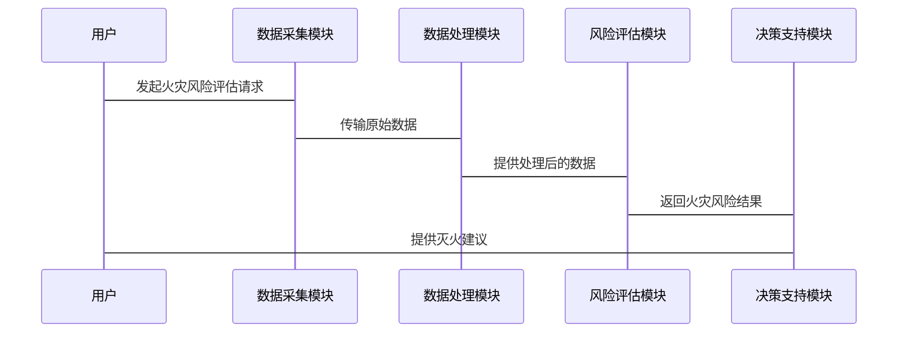

                 


# AI Agent在智能森林火灾风险评估中的实践

> **关键词**：AI Agent，森林火灾，风险评估，机器学习，深度学习，系统架构

> **摘要**：本文探讨了AI Agent在森林火灾风险评估中的实践应用，从背景、核心概念、算法原理到系统架构、项目实战和最佳实践，全面分析了如何利用AI技术提升森林火灾风险评估的效率与准确性。通过结合机器学习和深度学习算法，构建智能化的火灾风险评估系统，为森林资源保护提供有力支持。

---

## 第一部分：AI Agent在智能森林火灾风险评估中的背景与概念

### 第1章：森林火灾风险评估的背景与挑战

#### 1.1 森林火灾的严重性与影响
- **1.1.1 森林火灾的定义与分类**
  - 森林火灾是指在森林中发生的失控燃烧事件，通常由自然原因（如雷击、火山喷发）或人为活动（如吸烟、烧烤）引发。
  - 森林火灾可以分为地表火、树冠火和地下火三类，其中树冠火最具破坏性，可能引发大规模生态灾难。
- **1.1.2 森林火灾的主要原因与影响因素**
  - 自然原因：雷电、火山活动等。
  - 人为原因：开荒、狩猎、旅游等。
  - 气候因素：干旱、高温、大风等气象条件加剧火灾风险。
  - 地理因素：地形复杂、植被密度高等。
- **1.1.3 森林火灾对生态与经济的双重威胁**
  - 生态方面：破坏森林生态系统，导致生物多样性减少，土壤结构破坏，水土流失加剧。
  - 经济方面：造成直接经济损失（如树木烧毁、设施损毁）和间接经济损失（如生态修复成本、林业资源减少）。

#### 1.2 智能化火灾风险评估的需求
- **1.2.1 传统火灾风险评估的局限性**
  - 传统方法依赖人工经验，效率低且准确性不足。
  - 数据采集范围有限，难以覆盖大面积森林区域。
  - 评估周期长，无法实时响应火灾风险变化。
- **1.2.2 智能化评估的必要性与优势**
  - 必要性：应对复杂多变的火灾风险，提高评估效率和准确性。
  - 优势：基于大数据和AI技术，实现实时、动态、精准的风险评估。
- **1.2.3 AI Agent在火灾风险评估中的角色**
  - AI Agent作为智能体，能够实时感知环境数据，自主决策并采取行动，是实现智能化火灾风险评估的核心技术。

### 第2章：AI Agent的基本概念与技术原理

#### 2.1 AI Agent的定义与分类
- **2.1.1 AI Agent的定义**
  - AI Agent是一种智能实体，能够感知环境、自主决策、执行任务并适应动态变化。
- **2.1.2 AI Agent的分类与特点**
  - 分类：
    - 按智能水平：简单反射型、基于模型的反应型、基于目标的、基于效用的等。
    - 按应用场景：专家系统、推荐系统、自动驾驶、智能助手等。
  - 特点：
    - 智能性：能够理解和处理复杂信息。
    - 自主性：无需人工干预，自主完成任务。
    - 反应性：能够实时感知环境变化并做出反应。
    - 学习性：通过数据训练不断优化性能。
- **2.1.3 AI Agent在不同领域的应用案例**
  - 案例1：医疗领域中的诊断辅助AI Agent。
  - 案例2：金融领域的智能投资顾问。
  - 案例3：交通领域的自动驾驶系统。

#### 2.2 AI Agent的核心技术
- **2.2.1 机器学习与深度学习**
  - 机器学习：通过数据训练模型，实现对火灾风险的预测。
  - 深度学习：利用神经网络进行特征提取和风险评估。
- **2.2.2 自然语言处理**
  - 用于处理与火灾相关的文本数据，如新闻报道、政府公告等。
- **2.2.3 计算机视觉**
  - 用于分析卫星图像或无人机拍摄的图像，识别火灾隐患。

#### 2.3 AI Agent与森林火灾风险评估的结合
- **2.3.1 AI Agent在火灾风险评估中的应用场景**
  - 实时监测：通过卫星和无人机获取实时数据，评估火灾风险。
  - 预测预警：基于历史数据和当前环境，预测未来火灾风险。
  - 决策支持：为灭火行动提供智能化决策支持。
- **2.3.2 AI Agent的优势与局限性**
  - 优势：
    - 高效性：快速处理海量数据，提高评估效率。
    - 精准性：基于机器学习模型，提升预测准确性。
    - 实时性：能够实时感知环境变化，及时发出预警。
  - 局限性：
    - 数据依赖性：需要高质量的训练数据，数据不足可能导致模型性能下降。
    - 计算资源需求：深度学习模型需要大量计算资源，可能限制其在资源匮乏地区的应用。
    - 环境适应性：AI Agent需要适应复杂的森林环境，可能存在误判风险。

---

## 第二部分：AI Agent在森林火灾风险评估中的算法与模型

### 第3章：基于AI Agent的火灾风险评估算法

#### 3.1 火灾风险评估的数学模型
- **3.1.1 火灾风险评估的基本公式**
  - 火灾风险 = P(火灾发生) × 影响程度
  - P(火灾发生) = f(气候因素, 植被密度, 地形因素, 人类活动)
- **3.1.2 火灾风险的计算步骤**
  1. 收集相关数据：气候数据、植被数据、地形数据、人类活动数据。
  2. 数据预处理：标准化、归一化、缺失值处理。
  3. 建立风险评估模型：如逻辑回归、支持向量机（SVM）、随机森林等。
  4. 模型训练与优化：调整模型参数，进行交叉验证。
  5. 模型评估：计算准确率、召回率、F1分数等指标。
- **3.1.3 火灾风险评估的指标体系**
  - 指标体系包括：火灾可能性、火灾影响范围、火灾损失评估等。

#### 3.2 基于机器学习的火灾风险预测
- **3.2.1 数据特征提取与处理**
  - 特征包括：温度、湿度、风速、植被指数（如NDVI）、地形坡度等。
  - 数据处理：归一化、标准化、降维（如PCA）。
- **3.2.2 常见机器学习算法的选择与应用**
  - 选择算法：
    - 回归算法：如线性回归（Linear Regression）。
    - 分类算法：如逻辑回归（Logistic Regression）、支持向量机（SVM）。
    - 集成算法：如随机森林（Random Forest）、梯度提升树（GBDT）。
  - 应用案例：基于随机森林算法的火灾风险预测模型。
- **3.2.3 算法的训练与优化**
  - 超参数优化：使用网格搜索（Grid Search）或随机搜索（Random Search）。
  - 正则化：L1/L2正则化，防止过拟合。
  - 交叉验证：K折交叉验证，评估模型泛化能力。

#### 3.3 基于深度学习的火灾风险评估
- **3.3.1 CNN在火灾风险评估中的应用**
  - 使用卷积神经网络（CNN）处理卫星图像，识别火灾隐患区域。
  - 网络结构：输入层、卷积层、池化层、全连接层、输出层。
  - 损失函数：交叉熵损失函数。
  - 优化器：Adam优化器。
- **3.3.2 RNN在火灾风险预测中的应用**
  - 使用循环神经网络（RNN）预测未来火灾风险。
  - 网络结构：输入层、隐藏层、输出层。
  - 损失函数：均方误差（MSE）。
  - 优化器：Adam优化器。
- **3.3.3 深度学习模型的优缺点分析**
  - 优点：
    - 能够自动提取特征，减少人工特征工程。
    - 对于非线性关系具有较强的建模能力。
  - 缺点：
    - 计算资源需求高。
    - 需要大量标注数据，可能面临数据稀缺性问题。

#### 3.4 算法实现与优化
- **3.4.1 算法实现的步骤与流程**
  1. 数据收集与预处理。
  2. 模型选择与构建。
  3. 模型训练与优化。
  4. 模型评估与部署。
- **3.4.2 算法优化策略**
  - 参数优化：使用网格搜索或随机搜索。
  - 模型压缩：剪枝、知识蒸馏。
  - 并行计算：利用GPU加速训练。

---

### 第4章：AI Agent的算法实现与优化

#### 4.1 算法实现的步骤与流程
- **4.1.1 数据预处理**
  - 数据清洗：处理缺失值、异常值。
  - 特征工程：提取关键特征，如植被指数、地形因素。
  - 数据分割：训练集、验证集、测试集。
- **4.1.2 模型训练**
  - 确定模型结构：如随机森林、CNN。
  - 超参数设置：如学习率、迭代次数。
  - 训练过程：使用训练数据进行模型训练。
- **4.1.3 模型评估**
  - 评估指标：准确率、召回率、F1分数、AUC曲线。
  - 模型调优：基于评估结果优化模型。
- **4.1.4 模型部署**
  - 将模型部署到生产环境，实现实时火灾风险评估。

#### 4.2 算法优化策略
- **4.2.1 参数优化**
  - 使用网格搜索或随机搜索寻找最优参数组合。
- **4.2.2 模型压缩与轻量化**
  - 剪枝：减少模型复杂度，降低计算需求。
  - 知识蒸馏：将大模型的知识迁移到小模型。
- **4.2.3 并行计算**
  - 使用分布式计算框架（如Spark、TensorFlow分布式）加速模型训练。

---

## 第三部分：AI Agent在森林火灾风险评估中的系统架构设计

### 第5章：系统分析与架构设计方案

#### 5.1 火灾风险评估系统的功能设计
- **5.1.1 系统功能模块**
  - 数据采集模块：收集气候、植被、地形等数据。
  - 数据处理模块：清洗、转换、存储数据。
  - 风险评估模块：基于机器学习模型计算火灾风险。
  - 决策支持模块：提供灭火建议和资源分配方案。
- **5.1.2 系统功能流程**
  1. 数据采集：通过传感器、卫星、无人机获取数据。
  2. 数据处理：清洗、归一化、特征提取。
  3. 风险评估：模型训练与预测。
  4. 决策支持：生成灭火方案。

#### 5.2 系统架构设计
- **5.2.1 系统架构的分层设计**
  - 数据层：存储原始数据和处理后的数据。
  - 服务层：提供数据处理、模型训练等服务。
  - 应用层：实现用户交互和结果展示。
- **5.2.2 系统交互流程**
  1. 用户输入查询请求。
  2. 系统调用数据处理模块。
  3. 数据处理模块返回结果。
  4. 风险评估模块进行预测。
  5. 决策支持模块生成建议。
  6. 系统返回结果给用户。

#### 5.3 系统接口设计
- **5.3.1 数据接口**
  - 数据输入接口：接收传感器、卫星等数据源的数据。
  - 数据输出接口：将处理后的数据输出到数据库或存储系统。
- **5.3.2 模型接口**
  - 模型调用接口：其他系统模块调用风险评估模型进行预测。
  - 模型更新接口：定期更新模型参数和结构。

#### 5.4 系统交互的mermaid序列图


---

## 第四部分：AI Agent在森林火灾风险评估中的项目实战

### 第6章：项目实战

#### 6.1 环境安装与配置
- **6.1.1 系统环境**
  - 操作系统：Linux/Windows/MacOS
  - 开发工具：Python、Jupyter Notebook
  - 依赖库：numpy、pandas、scikit-learn、tensorflow、keras、matplotlib
  - 数据库：MySQL/PostgreSQL

#### 6.2 核心代码实现
- **6.2.1 数据预处理代码**
  ```python
  import pandas as pd
  import numpy as np

  # 读取数据
  data = pd.read_csv('fire_risk.csv')

  # 数据清洗
  data.dropna(inplace=True)
  data['temperature'] = data['temperature'].astype(float)
  data['humidity'] = data['humidity'].astype(float)
  data['vegetation_index'] = data['vegetation_index'].astype(float)

  # 特征提取
  features = data[['temperature', 'humidity', 'vegetation_index']]
  labels = data['fire_risk']
  ```

- **6.2.2 机器学习模型实现**
  ```python
  from sklearn.ensemble import RandomForestClassifier
  from sklearn.metrics import accuracy_score

  # 模型训练
  model = RandomForestClassifier(n_estimators=100, max_depth=10, random_state=42)
  model.fit(features, labels)

  # 模型预测
  predictions = model.predict(features)
  print('准确率:', accuracy_score(labels, predictions))
  ```

- **6.2.3 深度学习模型实现**
  ```python
  import tensorflow as tf
  from tensorflow.keras import layers

  # 构建CNN模型
  model = tf.keras.Sequential([
      layers.Conv2D(32, (3,3), activation='relu', input_shape=(height, width, channels)),
      layers.MaxPooling2D((2,2)),
      layers.Conv2D(64, (3,3), activation='relu'),
      layers.MaxPooling2D((2,2)),
      layers.Flatten(),
      layers.Dense(128, activation='relu'),
      layers.Dense(1, activation='sigmoid')
  ])

  model.compile(optimizer='adam', loss='binary_crossentropy', metrics=['accuracy'])
  model.fit(x_train, y_train, epochs=10, batch_size=32)
  ```

#### 6.3 代码解读与分析
- **6.3.1 数据预处理代码解读**
  - 使用Pandas读取CSV文件，清洗数据，处理缺失值和异常值。
  - 对特征进行数据转换，如归一化处理。
- **6.3.2 机器学习模型代码解读**
  - 使用随机森林算法进行火灾风险分类。
  - 评估模型准确率，分析模型性能。
- **6.3.3 深度学习模型代码解读**
  - 构建卷积神经网络模型，用于图像数据的火灾风险预测。
  - 使用Adam优化器和二元交叉熵损失函数。
  - 训练模型，评估准确率。

#### 6.4 实际案例分析
- **6.4.1 数据来源**
  - 数据来源：假设我们使用公开的森林火灾数据集，如某地区过去十年的火灾记录。
- **6.4.2 案例分析**
  - 数据分析：通过可视化工具（如Matplotlib）绘制火灾风险分布图。
  - 模型验证：在测试集上验证模型的准确率和召回率。
  - 结果解读：分析模型预测的火灾高风险区域，与实际火灾发生区域进行对比。

#### 6.5 项目小结
- **6.5.1 项目成果**
  - 成功构建了一个基于AI Agent的森林火灾风险评估系统。
  - 实现了机器学习和深度学习算法，提高了火灾风险评估的效率和准确性。
- **6.5.2 经验总结**
  - 数据质量对模型性能影响重大，需要重视数据预处理。
  - 模型选择和调优是关键，需要结合实际场景选择合适的算法。
  - 系统架构设计需要考虑可扩展性和可维护性。

---

## 第五部分：AI Agent在森林火灾风险评估中的最佳实践

### 第7章：最佳实践

#### 7.1 小结
- AI Agent在森林火灾风险评估中的应用前景广阔。
- 通过机器学习和深度学习算法，可以实现高效、精准的风险评估。
- 系统架构设计和项目实战是确保模型成功部署的关键。

#### 7.2 注意事项
- 数据隐私与安全：处理敏感数据时，需遵守相关法律法规。
- 模型解释性：复杂的模型可能难以解释，需确保模型的可解释性。
- 系统维护：定期更新模型和数据，确保系统的准确性和可靠性。

#### 7.3 拓展阅读
- 推荐阅读《机器学习实战》、《深度学习入门：基于Python》、《AI系统设计》等书籍。
- 参考公开火灾风险评估数据集，如Kaggle上的相关数据集。

---

## 作者：AI天才研究院/AI Genius Institute & 禅与计算机程序设计艺术/Zen And The Art of Computer Programming

---

**附录：相关工具与库**
- 数据处理：Pandas、NumPy
- 机器学习：Scikit-learn、XGBoost
- 深度学习：TensorFlow、Keras
- 可视化：Matplotlib、Seaborn
- 系统架构：Docker、Kubernetes

---

**结束语**
通过本文的详细分析，我们可以看到AI Agent在森林火灾风险评估中的巨大潜力。随着技术的不断进步，未来将会有更多基于AI的解决方案，帮助我们更好地保护森林资源，减少火灾带来的损失。

