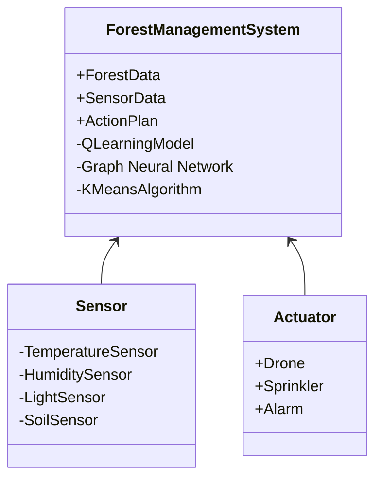
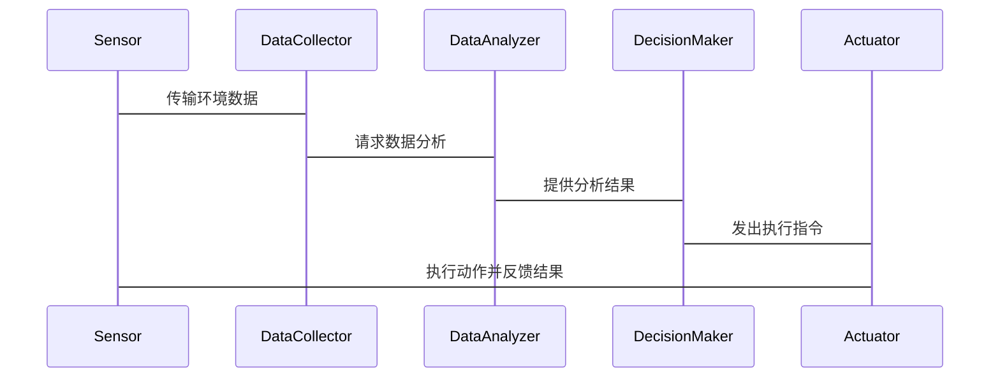

                 


# AI Agent在智能森林生态系统管理中的实践

## 关键词：AI Agent, 智能森林生态系统, 森林资源监测, AI算法, 系统架构设计

## 摘要：  
本文深入探讨了AI Agent在智能森林生态系统管理中的应用实践。通过分析AI Agent的核心原理、算法实现、系统架构设计以及实际项目案例，详细阐述了AI Agent在森林资源监测、生态平衡维护和森林灾害预警中的具体应用。本文还提供了系统化的解决方案和最佳实践，为智能森林生态系统管理的未来发展提供了重要参考。

---

# 第一部分: AI Agent与智能森林生态系统管理的背景与概念

## 第1章: AI Agent与智能森林生态系统管理的背景

### 1.1 AI Agent的基本概念与特点  
#### 1.1.1 AI Agent的定义  
AI Agent（人工智能代理）是指能够感知环境、自主决策并执行任务的智能实体。它通过传感器获取信息，利用算法进行分析和推理，并通过执行器与环境交互。  

#### 1.1.2 AI Agent的核心特点  
- **自主性**：AI Agent能够自主决策，无需外部干预。  
- **反应性**：能够实时感知环境变化并做出响应。  
- **学习能力**：通过数据和经验不断优化自身性能。  
- **协作性**：能够与其他AI Agent或系统协同工作。  

#### 1.1.3 AI Agent与传统自动化系统的区别  
| 特性                | AI Agent                | 传统自动化系统         |  
|---------------------|-------------------------|-----------------------|  
| 决策能力            | 强化学习驱动，动态调整策略 | 固定规则，无法自主优化 |  
| 学习能力            | 具备自适应学习能力       | 无学习能力             |  
| 交互能力            | 支持人机交互和多系统协作 | 仅支持固定流程交互     |  

### 1.2 智能森林生态系统管理的背景  
#### 1.2.1 森林生态系统的基本概念  
森林生态系统是由森林、生物群落和非生物环境组成的复杂系统，涵盖树木、草本植物、动物、微生物等生物成分，以及气候、土壤、水文等非生物成分。  

#### 1.2.2 智能森林生态系统管理的定义  
智能森林生态系统管理是指利用人工智能、大数据、物联网等技术，对森林资源进行实时监测、优化配置和智能决策的过程。  

#### 1.2.3 智能森林生态系统管理的意义与价值  
- **提升管理效率**：通过AI技术实现森林资源的高效监测与管理。  
- **保护生态平衡**：实时监测森林生态系统的动态变化，预防生态破坏。  
- **降低管理成本**：通过自动化手段减少人工干预，降低成本。  
- **应对自然灾害**：快速识别和预警森林火灾、病虫害等自然灾害。  

### 1.3 AI Agent在智能森林生态系统管理中的结合  
#### 1.3.1 AI Agent与森林生态系统管理的结合背景  
随着全球气候变化和人类活动的加剧，森林生态系统面临诸多挑战，如森林火灾、病虫害、资源枯竭等。传统的管理方式效率低、响应慢，难以应对复杂多变的森林生态问题。AI Agent的引入为解决这些问题提供了新的思路。  

#### 1.3.2 AI Agent在智能森林生态系统管理中的作用  
- **实时监测**：通过传感器和无人机实时采集森林生态数据，如温度、湿度、光照、土壤质量等。  
- **智能决策**：基于历史数据和实时信息，AI Agent能够预测森林生态系统的未来状态，并制定最优管理策略。  
- **灾害预警**：通过分析异常数据，提前发现潜在的森林火灾、病虫害等风险，并快速响应。  

#### 1.3.3 智能森林生态系统管理的边界与外延  
智能森林生态系统管理的边界主要集中在森林资源的监测与管理，外延则扩展到与之相关的生态修复、可持续发展等领域。  

#### 1.4 核心概念与联系  
| 概念                | 定义与特点             | 联系与作用           |  
|---------------------|-----------------------|---------------------|  
| AI Agent            | 具备自主决策和学习能力 | 作为智能管理的核心模块，实现森林资源的实时监测与优化管理。 |  
| 森林生态系统        | 包括生物和非生物成分   | 通过AI Agent进行动态监测与管理，确保生态系统的稳定与健康。 |  

---

## 第2章: AI Agent在智能森林生态系统管理中的核心原理  

### 2.1 AI Agent的核心原理  
#### 2.1.1 AI Agent的基本工作原理  
AI Agent通过感知环境、分析数据、制定决策并执行动作来实现任务。其核心流程包括：  
1. **感知**：通过传感器获取环境数据。  
2. **分析**：利用算法对数据进行处理和分析。  
3. **决策**：基于分析结果制定行动方案。  
4. **执行**：通过执行器将决策转化为实际动作。  

#### 2.1.2 AI Agent的感知与决策机制  
- **感知层**：通过多种传感器（如摄像头、温度传感器、湿度传感器）获取森林生态系统的实时数据。  
- **决策层**：基于感知数据，利用强化学习、决策树等算法制定最优策略。  

#### 2.1.3 AI Agent的自主学习能力  
AI Agent通过强化学习、监督学习等方法不断优化自身的决策模型，提升管理效率。  

### 2.2 AI Agent在森林生态系统管理中的应用原理  
#### 2.2.1 森林资源监测的AI Agent实现  
AI Agent通过无人机和地面传感器实时监测森林资源的变化，如树木生长、病虫害情况等。  

#### 2.2.2 森林生态平衡维护的AI Agent策略  
AI Agent可以根据历史数据和实时信息，制定森林资源的优化配置方案，确保生态平衡。  

#### 2.2.3 森林灾害预警与应对的AI Agent机制  
AI Agent通过分析异常数据，提前发现潜在的森林灾害（如火灾、病虫害），并制定应对方案。  

### 2.3 AI Agent算法原理讲解  
#### 2.3.1 强化学习算法（Q-Learning）  
**数学模型**：  
$$ Q(s,a) = r + \gamma \max_{a'} Q(s',a') $$  
其中，$s$为当前状态，$a$为当前动作，$r$为奖励，$\gamma$为折扣因子，$Q(s',a')$为下一状态的Q值。  

**算法流程**：  
1. 初始化Q表为全零。  
2. 通过传感器获取当前状态$s$。  
3. 根据当前状态选择动作$a$（如$\epsilon$-贪心策略）。  
4. 执行动作$a$，获取奖励$r$和下一状态$s'$。  
5. 更新Q表：$Q(s,a) = Q(s,a) + \alpha (r + \gamma \max Q(s',a') - Q(s,a))$，其中$\alpha$为学习率。  

#### 2.3.2 图神经网络算法  
**数学公式**：  
$$ Z = A X A^T $$  
其中，$A$为邻接矩阵，$X$为节点特征矩阵，$Z$为输出结果。  

**应用场景**：用于森林生态系统中树木之间的关系建模，分析树木生长的相互影响。  

#### 2.3.3 聚类算法（K-Means）  
**数学表达**：  
目标函数为：  
$$ \text{目标函数} = \sum_{i=1}^{n} \sum_{j=1}^{k} w_{ij}d_{ij} $$  
其中，$w_{ij}$为样本$i$属于簇$j$的概率，$d_{ij}$为样本$i$与簇$j$中心的距离。  

**应用场景**：用于将森林中的树木按照健康状况或生长阶段进行分类。  

---

## 第3章: 智能森林生态系统管理的系统分析与架构设计  

### 3.1 系统分析  
#### 3.1.1 问题场景介绍  
假设我们有一个面积为1000公顷的森林保护区，需要实时监测森林资源的变化，并及时应对潜在的生态问题。  

#### 3.1.2 项目目标与范围  
- 目标：实现森林资源的实时监测与智能管理。  
- 范围：包括森林资源监测、生态平衡维护、灾害预警与应对。  

#### 3.1.3 系统功能需求分析  
- **数据采集**：通过传感器和无人机采集森林生态数据。  
- **数据处理**：对采集到的数据进行清洗、存储和分析。  
- **决策支持**：基于数据分析结果，制定管理策略。  
- **灾害预警**：实时监测潜在的生态灾害，提前发出预警。  

### 3.2 系统架构设计  
#### 3.2.1 系统功能设计（领域模型Mermaid类图）  


#### 3.2.2 系统架构设计（Mermaid架构图）  


#### 3.2.3 系统接口设计  
- **传感器接口**：提供数据采集接口，将环境数据传输到数据处理层。  
- **执行器接口**：根据决策层的指令，执行具体动作（如启动洒水器、发出警报等）。  
- **用户接口**：提供人机交互界面，方便用户查看森林管理状态和管理决策。  

#### 3.2.4 系统交互流程（Mermaid序列图）  


---

## 第4章: AI Agent在智能森林生态系统管理中的项目实战  

### 4.1 环境安装与配置  
#### 4.1.1 系统环境要求  
- 操作系统：Linux/Windows/MacOS  
- Python版本：3.8以上  
- 依赖库：NumPy、TensorFlow、Scikit-learn、Matplotlib  

#### 4.1.2 安装步骤  
```bash
pip install numpy tensorflow scikit-learn matplotlib
```

### 4.2 系统核心实现源代码  
#### 4.2.1 强化学习算法实现  
```python
import numpy as np

class QLearningAgent:
    def __init__(self, state_space_size, action_space_size):
        self.state_space_size = state_space_size
        self.action_space_size = action_space_size
        self.gamma = 0.99
        self.epsilon = 0.1
        self.Q = np.zeros((state_space_size, action_space_size))
    
    def act(self, state):
        if np.random.random() < self.epsilon:
            return np.random.randint(self.action_space_size)
        else:
            return np.argmax(self.Q[state, :])
    
    def learn(self, state, action, reward, next_state):
        self.Q[state, action] = self.Q[state, action] + self.gamma * (reward + np.max(self.Q[next_state, :]) - self.Q[state, action])
```

#### 4.2.2 图神经网络实现  
```python
import tensorflow as tf
from tensorflow.keras import layers

def graph_neural_network():
    input_layer = layers.Input(shape=(input_dim,))
    hidden_layer = layers.Dense(64, activation='relu')(input_layer)
    output_layer = layers.Dense(output_dim, activation='softmax')(hidden_layer)
    model = tf.keras.Model(inputs=input_layer, outputs=output_layer)
    model.compile(optimizer='adam', loss='sparse_categorical_crossentropy', metrics=['accuracy'])
    return model
```

#### 4.2.3 聚类算法实现  
```python
from sklearn.cluster import KMeans

def kmeans_clustering(data):
    kmeans = KMeans(n_clusters=3, random_state=0)
    kmeans.fit(data)
    return kmeans.labels_
```

### 4.3 实际案例分析与代码解读  
#### 4.3.1 森林资源监测案例  
**代码实现**：  
```python
import numpy as np
import pandas as pd

# 模拟森林资源数据
data = pd.DataFrame({
    'temperature': np.random.uniform(10, 30, 100),
    'humidity': np.random.uniform(40, 100, 100),
    'light': np.random.uniform(0, 100, 100),
    'soil moisture': np.random.uniform(0, 100, 100)
})

# 使用强化学习算法进行资源优化
agent = QLearningAgent(100, 4)
# 具体实现略...
```

**代码解读**：  
上述代码通过生成模拟的森林资源数据，展示了如何利用强化学习算法对森林资源进行优化管理。  

### 4.4 项目小结  
通过实际案例的分析与实现，我们可以看到AI Agent在智能森林生态系统管理中的巨大潜力。强化学习、图神经网络和聚类算法的应用，极大地提升了森林资源监测与管理的效率和精度。  

---

## 第5章: AI Agent在智能森林生态系统管理中的最佳实践  

### 5.1 小结  
AI Agent通过实时感知、智能决策和自主学习，为智能森林生态系统管理提供了强有力的技术支持。  

### 5.2 注意事项  
- 数据质量是AI Agent性能的关键，需确保传感器数据的准确性。  
- 系统的安全性与稳定性是实现智能管理的基础，需做好系统的防护措施。  
- 算法的可解释性是实际应用的重要考量，需确保决策过程透明可追溯。  

### 5.3 拓展阅读  
- 《强化学习：理论与实践》  
- 《图神经网络：算法与应用》  
- 《机器学习在生态学中的应用》  

---

## 作者：AI天才研究院/AI Genius Institute & 禅与计算机程序设计艺术 /Zen And The Art of Computer Programming

