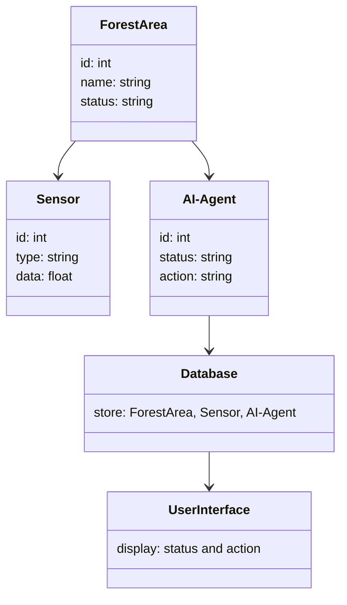
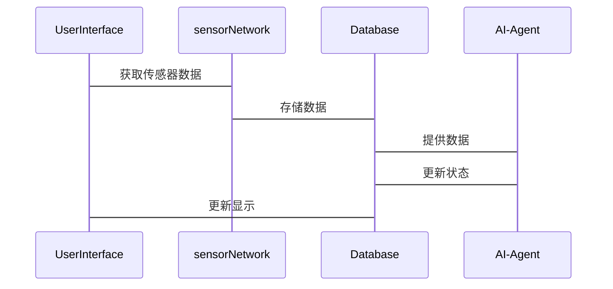

                 


---

# AI Agent在智能森林管理中的实践

> 关键词：AI Agent，智能森林管理，强化学习，物联网，大数据，生态修复

> 摘要：本文探讨了AI Agent在智能森林管理中的应用，分析了其在森林资源监测、防火、病虫害防治以及生态修复中的潜力。通过介绍AI Agent的核心概念、算法原理和系统架构，本文详细展示了如何利用AI技术提升森林管理的效率和可持续性。

---

# 第一部分: AI Agent在智能森林管理中的背景与概念

## 第1章: AI Agent与智能森林管理概述

### 1.1 AI Agent的基本概念

AI Agent，即人工智能代理，是一种能够感知环境、自主决策并采取行动的智能实体。它具备以下核心特征：
- **自主性**：能够在没有外部干预的情况下独立运作。
- **反应性**：能够实时感知环境变化并做出反应。
- **目标导向**：基于预设目标采取行动。

AI Agent与传统自动化系统的区别在于其具备更强的自主决策能力和学习能力。

### 1.2 智能森林管理的背景与挑战

#### 1.2.1 森林管理的传统模式

传统森林管理主要依赖人工巡护和定期检查，这种方式效率低下，覆盖面有限，难以及时发现和处理问题。

#### 1.2.2 智能化管理的需求

随着森林资源的日益减少和环境问题的加剧，传统的管理方式已无法满足现代森林管理的需求。智能化管理能够提高效率、降低成本，并实现对森林资源的实时监控。

#### 1.2.3 当前森林管理中的主要问题

- **火灾风险**：森林火灾往往造成巨大损失，早期预警和及时扑救至关重要。
- **病虫害防治**：病虫害的爆发往往具有隐蔽性和快速扩散性，难以及时发现。
- **资源监测**：森林资源的动态变化需要实时监测，传统方式难以实现。

### 1.3 AI Agent在森林管理中的应用前景

#### 1.3.1 AI Agent在森林资源监测中的作用

AI Agent可以通过无人机和传感器实时监测森林资源的变化，包括树木生长、病虫害情况等。

#### 1.3.2 AI Agent在森林防火与病虫害防治中的应用

AI Agent能够通过数据分析预测火灾风险和病虫害的发生，提前采取预防措施。

#### 1.3.3 AI Agent在森林生态修复中的潜力

AI Agent可以协助规划和执行生态修复计划，优化资源分配，提高修复效率。

### 1.4 本章小结

本章介绍了AI Agent的基本概念及其在智能森林管理中的应用前景，强调了AI技术在提高森林管理效率和可持续性方面的重要作用。

---

# 第二部分: AI Agent的核心概念与技术原理

## 第2章: AI Agent的核心概念与系统架构

### 2.1 AI Agent的核心概念

#### 2.1.1 AI Agent的定义与分类

AI Agent可以分为简单反射型、基于模型的反射型、目标驱动型和效用驱动型四种类型。

#### 2.1.2 AI Agent的感知与决策机制

AI Agent通过传感器和数据源感知环境，利用算法进行分析和决策，然后通过执行器采取行动。

#### 2.1.3 AI Agent的自主性与协作性

AI Agent具备自主决策的能力，并且可以通过协作实现更复杂的任务。

### 2.2 AI Agent的系统架构

#### 2.2.1 分层架构

分层架构将系统划分为感知层、决策层和执行层，每一层负责不同的功能。

#### 2.2.2 分布式架构

分布式架构适用于大规模森林管理，多个AI Agent协同工作，覆盖更大的区域。

#### 2.2.3 混合式架构

混合式架构结合了分层和分布式架构的优势，适用于复杂场景。

### 2.3 AI Agent与相关技术的关系

#### 2.3.1 AI Agent与大数据技术的结合

大数据技术为AI Agent提供了海量数据支持，使其能够进行更精准的分析和决策。

#### 2.3.2 AI Agent与物联网技术的融合

物联网技术为AI Agent提供了实时的环境感知能力，使其能够更有效地进行监控和管理。

#### 2.3.3 AI Agent与云计算的协同

云计算为AI Agent提供了强大的计算能力和存储空间，支持其进行复杂的数据处理和分析。

### 2.4 本章小结

本章详细介绍了AI Agent的核心概念和系统架构，并探讨了其与大数据、物联网和云计算等技术的关系。

---

# 第三部分: AI Agent的算法原理与数学模型

## 第3章: AI Agent的核心算法原理

### 3.1 基于强化学习的AI Agent算法

#### 3.1.1 强化学习的基本原理

强化学习是一种通过试错机制学习策略的方法，AI Agent通过与环境交互获得奖励或惩罚，逐步优化其行为策略。

#### 3.1.2 Q-Learning算法的实现

Q-Learning是一种经典的强化学习算法，通过更新Q值表来学习最优策略。

$$ Q(s, a) = Q(s, a) + \alpha \left( r + \gamma \max Q(s', a') - Q(s, a) \right) $$

其中，$\alpha$是学习率，$\gamma$是折扣因子。

#### 3.1.3 算法的数学模型与公式

Q-Learning算法的核心是通过不断地更新Q值表，找到最优策略。公式如下：

$$ Q(s, a) = Q(s, a) + \alpha (r + \gamma \max Q(s', a') - Q(s, a)) $$

---

## 第4章: AI Agent的数学模型与实现

### 4.1 AI Agent的数学模型

AI Agent的决策过程可以表示为一个马尔可夫决策过程（MDP），包括状态、动作、奖励和转移概率四个部分。

$$ P(s' | s, a) $$

表示在状态$s$下采取动作$a$后转移到状态$s'$的概率。

### 4.2 AI Agent的实现步骤

#### 4.2.1 状态空间的定义

状态空间包括森林中的各种环境变量，如温度、湿度、风速等。

#### 4.2.2 动作空间的定义

动作空间包括AI Agent可以执行的各种操作，如发出警报、启动洒水系统等。

#### 4.2.3 奖励函数的设计

奖励函数用于评估AI Agent的行为，如成功扑灭火灾可以得到较高的奖励。

---

# 第四部分: 系统分析与架构设计方案

## 第5章: 智能森林管理系统的架构设计

### 5.1 问题场景介绍

假设我们有一个大型森林保护区，需要实时监测森林资源，预防火灾和病虫害。

### 5.2 系统功能设计

#### 5.2.1 领域模型类图

以下是系统的领域模型类图：



#### 5.2.2 系统架构图

以下是系统的架构图：

```mermaid
client
    userInterface
    sensorNetwork
    database
    aiAgent
```

### 5.3 系统接口设计

#### 5.3.1 API接口

API接口包括：
- `/api/sensors`: 获取传感器数据
- `/api/agent/status`: 获取AI Agent状态
- `/api/agent/action`: 获取AI Agent的行动

### 5.4 系统交互序列图

以下是系统的交互序列图：



---

# 第五部分: 项目实战

## 第6章: 项目实战与实现

### 6.1 环境安装

#### 6.1.1 安装Python和必要的库

```bash
pip install numpy
pip install matplotlib
pip install scikit-learn
pip install keras
pip install tensorflow
```

### 6.2 系统核心实现源代码

#### 6.2.1 AI Agent的实现代码

```python
import numpy as np
from sklearn.metrics import accuracy_score
from tensorflow.keras.models import Sequential
from tensorflow.keras.layers import Dense

# 定义模型
model = Sequential()
model.add(Dense(64, activation='relu', input_dim=10))
model.add(Dense(1, activation='sigmoid'))
model.compile(optimizer='adam', loss='binary_crossentropy', metrics=['accuracy'])

# 训练模型
model.fit(X_train, y_train, epochs=100, batch_size=32)
```

### 6.3 案例分析与解读

#### 6.3.1 森林火灾预警案例

AI Agent通过分析传感器数据，预测火灾风险，并发出警报。

---

# 第六部分: 最佳实践与注意事项

## 第7章: 最佳实践与总结

### 7.1 最佳实践

- **数据质量**：确保传感器数据的准确性和实时性。
- **模型优化**：定期更新AI Agent的模型，提高预测准确性。
- **系统维护**：定期检查和维护系统，确保其正常运行。

### 7.2 注意事项

- **隐私与安全**：确保系统数据的安全性，防止数据泄露。
- **环境适应性**：根据不同的环境调整AI Agent的参数。

### 7.3 未来展望

随着AI技术的不断发展，AI Agent在智能森林管理中的应用将更加广泛和深入。

---

# 附录

## 附录A: 关键术语解释

- **AI Agent**：人工智能代理，能够自主决策并采取行动的智能体。
- **强化学习**：一种通过试错机制学习策略的方法。

## 附录B: 参考文献

1. Russell, S., & Norvig, P. (2010). Artificial Intelligence: A Modern Approach.
2. Sutton, R. S., & Barto, A. G. (2018). Reinforcement Learning: An Introduction.

---

作者：AI天才研究院/AI Genius Institute & 禅与计算机程序设计艺术 /Zen And The Art of Computer Programming

---

**文章总结**：本文详细探讨了AI Agent在智能森林管理中的应用，从理论到实践，全面分析了其在资源监测、防火、病虫害防治和生态修复中的潜力。通过系统的架构设计和实际案例分析，展示了如何利用AI技术提升森林管理的效率和可持续性。

