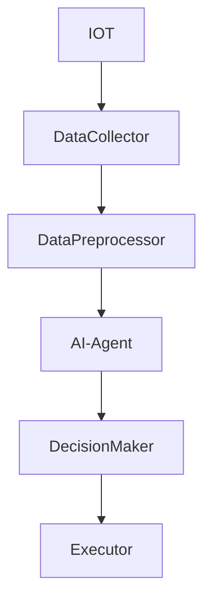

                 


# AI Agent在智能森林资源监测中的实践

## 关键词
AI Agent，智能森林资源监测，图像识别，强化学习，系统架构，项目实战

## 摘要
本文探讨AI Agent在智能森林资源监测中的应用，涵盖背景、核心概念、算法原理、系统架构、项目实战和最佳实践，分析AI Agent在监测中的优势和挑战，提供详细的技术实现和案例分析。

---

# 第1章：智能森林资源监测的背景与问题

## 1.1 智能森林资源监测的背景

### 1.1.1 森林资源的重要性
森林是地球上最重要的生态系统之一，覆盖面积广阔，提供木材、氧气和栖息地，同时调节气候和水循环。

### 1.1.2 传统森林资源监测的局限性
传统监测依赖人工巡检和卫星图像，存在效率低、成本高、实时性差的问题，难以及时发现早期问题。

### 1.1.3 AI技术在森林资源监测中的优势
AI技术，特别是AI Agent，能够实时处理多源数据，快速做出决策，提高监测效率和准确性。

## 1.2 智能森林资源监测的问题描述

### 1.2.1 森林资源监测的主要挑战
- **数据多样性**：包括图像、传感器数据和文本。
- **实时性要求高**：需要快速响应，如火灾预警。
- **环境复杂性**：地形多样，天气变化影响数据质量。

### 1.2.2 AI Agent在森林资源监测中的应用场景
- **火灾监测与预警**：实时分析图像数据，识别火源。
- **资源清查**：自动识别和分类植物，监测资源变化。
- **病虫害监测**：识别异常现象，辅助防治。

## 1.3 AI Agent在森林资源监测中的解决方案

### 1.3.1 AI Agent的基本概念
AI Agent是具备感知、决策和执行能力的智能体，能够独立完成任务。

### 1.3.2 AI Agent在森林资源监测中的核心任务
- **感知环境**：使用传感器和摄像头收集数据。
- **分析数据**：识别异常，如火灾或病虫害。
- **做出决策**：根据分析结果制定应对策略。
- **执行任务**：如发出警报或启动灭火设备。

### 1.3.3 AI Agent的优势与局限性
**优势**：
- 高效性：快速处理大量数据。
- 自主性：无需人工干预。
- 准确性：减少人为错误。

**局限性**：
- 复杂环境适应性差。
- 数据依赖性高。
- 技术成本高。

---

# 第2章：AI Agent的核心概念与联系

## 2.1 AI Agent的基本原理

### 2.1.1 AI Agent的定义与分类
AI Agent通过感知环境、处理信息并采取行动来实现目标。分类包括基于规则、基于模型和基于强化学习的AI Agent。

### 2.1.2 AI Agent的核心模块
- **感知模块**：获取环境数据。
- **决策模块**：分析数据，做出决策。
- **执行模块**：执行决策动作。

### 2.1.3 AI Agent与传统AI的区别
AI Agent具备自主性和目标导向性，能够与环境交互，而传统AI通常不涉及实时交互和自主决策。

## 2.2 AI Agent的核心概念对比

### 2.2.1 不同类型AI Agent的对比分析
| 类型          | 特性                       |
|---------------|----------------------------|
| 基于规则      | 依赖预定义规则，简单但缺乏灵活性。 |
| 基于模型      | 使用模型进行推理，适应性更强。     |
| 基于强化学习  | 通过奖励机制优化决策，适用于复杂环境。 |

### 2.2.2 AI Agent与机器学习模型的关系
AI Agent通常结合机器学习模型，如CNN用于图像识别，强化学习用于决策优化。

### 2.2.3 AI Agent与规则引擎的对比
规则引擎基于预定义规则，处理简单场景；AI Agent具备学习和适应能力，适合复杂场景。

## 2.3 AI Agent的ER实体关系图

```mermaid
er
    entity AI-Agent {
        id
        type
        function
        status
    }
    entity 森林资源 {
        id
        type
        location
        status
    }
    entity 监测数据 {
        id
        data-type
        timestamp
        source
    }
    entity 决策中心 {
        id
        decision-type
        decision-time
        status
    }
    AI-Agent --> 监测数据: 采集
    AI-Agent --> 森林资源: 监测
    AI-Agent --> 决策中心: 提交
    决策中心 --> AI-Agent: 下达指令
```

---

# 第3章：AI Agent的算法原理

## 3.1 AI Agent的感知算法

### 3.1.1 目标检测算法
使用YOLO或Faster R-CNN等模型识别森林中的异常点，如火灾烟雾。

### 3.1.2 图像分割算法
采用U-Net模型分割图像，识别病虫害区域。

## 3.2 AI Agent的决策算法

### 3.2.1 强化学习算法
使用Q-learning算法，通过奖励机制优化决策策略。

## 3.3 AI Agent的执行算法

### 3.3.1 路径规划算法
采用A*算法规划无人机巡检路径。

---

# 第4章：AI Agent的系统分析与架构设计

## 4.1 系统功能设计

### 4.1.1 数据采集模块
负责采集多源数据，如传感器和摄像头数据。

### 4.1.2 数据处理模块
对数据进行清洗和预处理，提取特征。

### 4.1.3 决策支持模块
基于处理后的数据，生成决策建议。

### 4.1.4 执行控制模块
根据决策结果，执行相应操作。

## 4.2 系统架构设计



---

# 第5章：AI Agent的项目实战

## 5.1 环境安装

### 5.1.1 安装Python
```bash
python --version
pip install --upgrade pip
```

### 5.1.2 安装深度学习库
```bash
pip install tensorflow numpyopencv-python
```

## 5.2 核心代码实现

### 5.2.1 图像处理代码
```python
import cv2
def detect_fire(image):
    # 图像预处理
    gray = cv2.cvtColor(image, cv2.COLOR_BGR2GRAY)
    # 热像检测
    heat_map = cv2.applyColorMap(gray, cv2.COLORMAP_JET)
    return heat_map
```

---

# 第6章：最佳实践

## 6.1 小结
AI Agent在森林资源监测中展现出巨大潜力，但仍需解决技术难题和成本问题。

## 6.2 注意事项
- 数据质量至关重要，需确保数据的准确性和完整性。
- 安全性需加强，防止数据泄露和系统攻击。

## 6.3 未来趋势
- 更多集成AI Agent的应用场景。
- 更高效的算法和更低的计算成本。

## 6.4 扩展阅读
推荐阅读相关书籍和论文，深入学习AI Agent技术。

---

# 结语

通过本文的详细分析，AI Agent在森林资源监测中的应用前景广阔，但仍需技术持续创新和实践积累。

---

# 作者

作者：AI天才研究院/AI Genius Institute & 禅与计算机程序设计艺术 /Zen And The Art of Computer Programming

