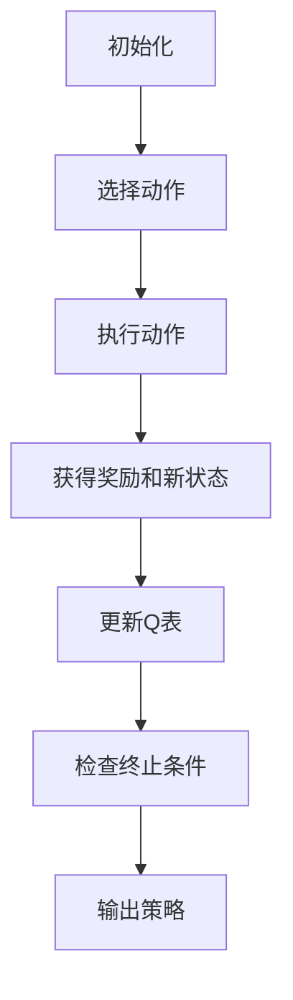
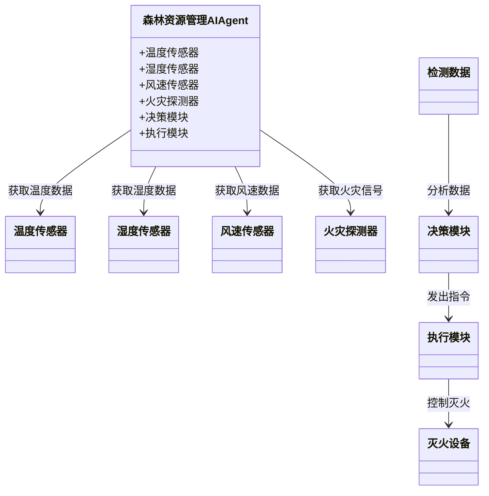
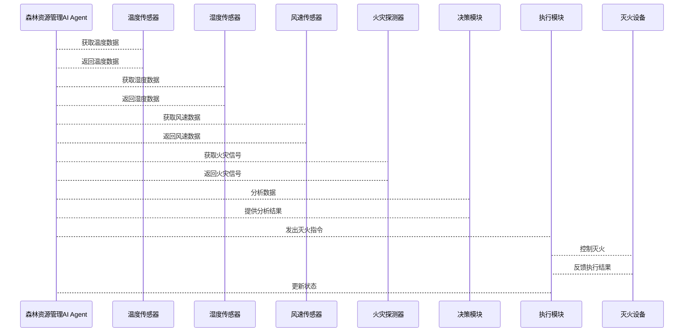

                 


---

# AI Agent在智能森林资源管理中的实践

## 关键词：AI Agent，森林资源管理，强化学习，自然语言处理，系统架构，项目实战

## 摘要：  
本文探讨了AI Agent在智能森林资源管理中的应用，分析了其核心概念、算法原理、系统架构，并通过具体案例展示了其在森林资源监测、防火和资源优化中的实际应用。通过强化学习和自然语言处理等技术，AI Agent能够高效地处理森林资源数据，辅助决策，提升管理效率。文章还总结了最佳实践和注意事项，为实际应用提供了参考。

---

# 第一部分: AI Agent在智能森林资源管理中的背景与概念

## 第1章: AI Agent与智能森林资源管理概述

### 1.1 AI Agent的基本概念
AI Agent（人工智能代理）是指能够感知环境、自主决策并采取行动以实现目标的智能实体。与传统的自动化系统不同，AI Agent具备更强的适应性和主动性，能够根据环境变化动态调整行为。

#### 1.1.1 AI Agent的定义与特点
- **定义**：AI Agent是一个能够感知环境、处理信息并采取行动以实现目标的智能系统。
- **特点**：
  - **自主性**：无需外部干预，自主决策。
  - **反应性**：能够实时感知环境变化并做出反应。
  - **目标导向**：所有行为都以实现特定目标为导向。
  - **学习能力**：通过数据和经验不断优化自身性能。

#### 1.1.2 AI Agent的核心功能与优势
- **核心功能**：
  - 感知环境：通过传感器或数据输入获取环境信息。
  - 处理信息：利用算法对信息进行分析和处理。
  - 制定决策：基于分析结果做出最优决策。
  - 执行行动：通过执行机构或接口将决策转化为实际操作。
- **优势**：
  - 提高效率：AI Agent能够快速处理大量数据，优化资源配置。
  - 减少人为错误：通过算法决策减少人为判断的误差。
  - 实时响应：能够实时感知和处理环境变化。

#### 1.1.3 智能森林资源管理的定义与目标
- **定义**：智能森林资源管理是指利用人工智能、大数据、物联网等技术，对森林资源进行实时监测、分析和管理的过程。
- **目标**：
  - 实现森林资源的高效利用。
  - 保护森林生态环境，防止资源破坏。
  - 提高森林资源管理的智能化水平。

### 1.2 智能森林资源管理的背景与意义
#### 1.2.1 森林资源管理的传统模式与挑战
- **传统模式**：
  - 依赖人工巡护和经验判断。
  - 数据采集和处理效率低。
  - 资源浪费和管理成本高。
- **挑战**：
  - 森林面积广阔，人工巡护效率低。
  - 环境变化快，传统方法难以实时响应。
  - 资源分配不合理，导致资源浪费。

#### 1.2.2 AI技术在森林资源管理中的应用前景
- **前景**：
  - 利用AI技术实现森林资源的实时监测和管理。
  - 通过数据挖掘优化资源分配，提高利用效率。
  - 利用自然语言处理技术分析相关文献，辅助决策。

#### 1.2.3 智能森林资源管理的核心价值与社会意义
- **核心价值**：
  - 提高森林资源管理效率。
  - 保护森林生态环境。
  - 促进可持续发展。
- **社会意义**：
  - 为林业工作者提供高效工具。
  - 促进森林资源的可持续利用。
  - 推动人工智能技术在生态领域的应用。

### 1.3 AI Agent在森林资源管理中的应用场景
#### 1.3.1 森林资源监测与保护
- **应用场景**：
  - 实时监测森林资源的状态，包括树木生长、病虫害等。
  - 利用卫星图像和无人机进行大范围监测。
  - 提供实时警报，预防资源破坏。

#### 1.3.2 森林火灾预警与扑救
- **应用场景**：
  - 实时监测森林中的温度、湿度、风速等环境数据。
  - 分析火灾风险，提前发出预警。
  - 协调灭火资源，优化扑救策略。

#### 1.3.3 森林资源优化配置与利用
- **应用场景**：
  - 利用AI算法优化资源分配，提高利用效率。
  - 根据市场需求调整资源供应。
  - 降低资源浪费，提高经济效益。

---

# 第二部分: AI Agent的核心概念与技术原理

## 第2章: AI Agent的核心概念与系统架构

### 2.1 AI Agent的系统架构
#### 2.1.1 AI Agent的感知层
- **功能**：负责感知环境，获取数据。
- **主要组件**：
  - 传感器：如温度、湿度、光照传感器。
  - 数据采集模块：接收传感器数据并进行初步处理。
  - 数据存储模块：存储感知数据，供后续分析使用。

#### 2.1.2 AI Agent的决策层
- **功能**：对感知数据进行分析，制定决策。
- **主要组件**：
  - 数据分析模块：利用机器学习算法分析数据。
  - 决策模块：基于分析结果制定最优决策。
  - 策略库：存储各种决策策略和规则。

#### 2.1.3 AI Agent的执行层
- **功能**：根据决策结果执行相应操作。
- **主要组件**：
  - 执行机构：如无人机、洒水装置等。
  - 控制接口：与执行机构进行交互，发送指令。
  - 反馈模块：收集执行结果，反馈给感知层。

### 2.2 AI Agent的核心算法与技术
#### 2.2.1 机器学习算法
- **监督学习**：基于标记数据进行训练，如决策树、随机森林。
- **无监督学习**：用于数据聚类和异常检测，如K-means、SVM。

#### 2.2.2 自然语言处理技术
- **分词**：将文本分割成词语或短语。
- **词袋模型**：将文本表示为词的集合。
- **词嵌入**：利用Word2Vec等模型生成词向量。

#### 2.2.3 强化学习与决策优化
- **强化学习**：通过试错机制优化决策策略。
- **Q-learning算法**：用于状态-动作空间中的决策优化。

### 2.3 AI Agent与森林资源管理的结合
#### 2.3.1 森林资源数据的采集与处理
- **数据来源**：
  - 卫星图像：提供大范围的森林资源信息。
  - 无人机巡护：获取高分辨率的图像和数据。
  - 传感器网络：实时监测环境参数。
- **数据处理**：
  - 数据清洗：去除噪声和异常值。
  - 数据融合：整合多源数据，提供全面的资源信息。

#### 2.3.2 AI Agent在森林资源分析中的应用
- **资源评估**：利用AI算法评估森林资源的质量和数量。
- **病虫害检测**：通过图像识别技术检测树木病虫害。
- **火灾风险评估**：分析环境数据和历史数据，评估火灾风险。

#### 2.3.3 AI Agent在森林资源管理决策中的作用
- **优化资源配置**：根据资源需求和供应情况，优化资源配置。
- **制定管理策略**：基于数据分析结果，制定科学的管理策略。
- **实时调整**：根据环境变化实时调整管理措施。

---

# 第三部分: AI Agent的算法原理与数学模型

## 第3章: AI Agent的核心算法原理

### 3.1 强化学习算法
#### 3.1.1 强化学习的基本概念
- **定义**：强化学习是一种通过试错机制，学习策略以最大化累积奖励的算法。
- **核心概念**：
  - 状态（State）：环境的当前情况。
  - 动作（Action）：AI Agent采取的行为。
  - 奖励（Reward）：采取某个动作后获得的反馈。
  - 策略（Policy）：决定下一步动作的概率分布。

#### 3.1.2 Markov决策过程（MDP）
- **定义**：MDP是一种描述决策过程的数学模型，由状态、动作、转移概率和奖励函数组成。
- **数学表达**：
  - 状态空间：\( S \)
  - 动作空间：\( A \)
  - 转移概率：\( P(s' | s, a) \)
  - 奖励函数：\( R(s, a) \)

#### 3.1.3 Q-learning算法
- **算法流程**：
  1. 初始化Q表，所有状态-动作对的值设为0。
  2. 重复以下步骤直到终止条件满足：
     - 选择当前状态下的动作。
     - 执行动作，获得奖励和新的状态。
     - 更新Q表中的值：\( Q(s, a) = Q(s, a) + \alpha [r + \gamma Q(s', a') - Q(s, a)] \)
  3. 输出最优策略。

#### 3.1.4 Deep Q-Network（DQN）算法
- **改进点**：
  - 使用深度神经网络近似Q函数，避免了Q表的高维问题。
  - 引入经验回放机制，提高训练稳定性。
  - 使用目标网络，减少目标Q值的剧烈变化。

#### 3.1.5 算法流程图


### 3.2 聚类与分类算法
#### 3.2.1 K-means聚类算法
- **算法步骤**：
  1. 随机选择K个初始质心。
  2. 重复以下步骤直到质心不再变化：
     - 计算每个数据点到质心的距离，将其分配到最近的质心所在的簇。
     - 计算每个簇的质心。
  3. 输出簇划分结果。

#### 3.2.2 支持向量机（SVM）
- **基本原理**：通过寻找最优超平面，将数据点分为不同的类别。
- **数学表达**：最大化分类间隔，最小化分类错误。

#### 3.2.3 随机森林算法
- **基本原理**：通过构建多个决策树，利用投票法进行分类或回归。

### 3.3 自然语言处理算法
#### 3.3.1 分词
- **分词方法**：基于字典匹配和概率统计的分词方法。
- **实现步骤**：
  1. 建立词典，存储所有可能的词语。
  2. 从文本中逐个字符匹配词典中的词语，选择最长匹配项。
  3. 重复上述步骤，直到文本处理完毕。

#### 3.3.2 词袋模型与词嵌入
- **词袋模型**：将文本表示为词语的集合，不考虑词语顺序。
- **词嵌入**：利用深度学习模型（如Word2Vec）生成词语的向量表示。

#### 3.3.3 注意力机制（Attention）
- **基本原理**：在序列处理中，注意力机制能够关注重要的词语，提高模型的准确性。
- **数学表达**：
  \[
  \text{Attention}(Q, K, V) = \text{softmax}\left(\frac{QK^T}{\sqrt{d}}\right)V
  \]

---

# 第四部分: AI Agent的系统分析与架构设计

## 第4章: AI Agent的系统架构设计

### 4.1 问题场景介绍
- **背景**：假设我们正在设计一个智能森林防火系统，利用AI Agent进行实时监测和决策。

### 4.2 项目介绍
- **项目目标**：实现森林火灾的实时监测和预警，优化灭火资源的配置。

### 4.3 系统功能设计
#### 4.3.1 领域模型（mermaid类图）


#### 4.3.2 系统架构设计（mermaid架构图）
```mermaid
context 森林防火系统 {
    森林资源管理AI Agent
    传感器网络
    数据存储
    决策中心
    执行机构
    传感器网络 --> 森林资源管理AI Agent: 上传数据
    森林资源管理AI Agent --> 决策中心: 提供分析结果
    决策中心 --> 执行机构: 发出指令
    执行机构 --> 森林资源管理AI Agent: 反馈执行结果
}
```

#### 4.3.3 系统接口设计
- **输入接口**：
  - 传感器数据接口：接收温度、湿度、风速等数据。
  - 用户输入接口：接收用户的指令和查询。
- **输出接口**：
  - 火灾预警接口：向相关部门发出警报。
  - 执行指令接口：控制灭火设备。

#### 4.3.4 系统交互（mermaid序列图）


---

# 第五部分: AI Agent的项目实战

## 第5章: AI Agent的项目实战

### 5.1 环境安装
#### 5.1.1 系统需求
- **操作系统**：Linux或Windows
- **编程语言**：Python 3.8+
- **依赖库**：TensorFlow、Keras、OpenCV、numpy、pandas

#### 5.1.2 安装步骤
1. 安装Python和pip：
   ```bash
   # 在终端中运行
   python --version
   pip install --upgrade pip
   ```
2. 安装依赖库：
   ```bash
   pip install tensorflow keras opencv-python numpy pandas
   ```

### 5.2 系统核心实现源代码
#### 5.2.1 强化学习算法实现
```python
import numpy as np
import gym

# 初始化环境和模型
env = gym.make('CartPole-v0')
observation_space = env.observation_space.shape[0]
action_space = env.action_space.n

# DQN参数
learning_rate = 0.01
gamma = 0.99
epsilon = 1.0
epsilon_min = 0.01
epsilon_decay = 0.995

# 创建神经网络模型
from tensorflow.keras.models import Sequential
from tensorflow.keras.layers import Dense

model = Sequential()
model.add(Dense(24, input_dim=observation_space, activation='relu'))
model.add(Dense(action_space, activation='linear'))
model.compile(loss='mse', optimizer='adam', learning_rate=learning_rate)

# 训练过程
replay_memory = []
batch_size = 64
max_episodes = 1000

for episode in range(max_episodes):
    state = env.reset()
    done = False
    while not done:
        if np.random.random() < epsilon:
            action = env.action_space.sample()
        else:
            q_values = model.predict(np.array([state]))
            action = np.argmax(q_values[0])
        
        next_state, reward, done, info = env.step(action)
        
        replay_memory.append((state, action, reward, next_state, done))
        
        # 训练模型
        if len(replay_memory) >= batch_size:
            minibatch = np.random.choice(len(replay_memory), batch_size)
            X = []
            y = []
            for i in minibatch:
                state, action, reward, next_state, done = replay_memory[i]
                target = model.predict(np.array([state]))
                target[0][action] = reward + gamma * np.max(model.predict(np.array([next_state]))[0]) * (1 - done)
                X.append(state)
                y.append(target[0])
            model.fit(np.array(X), np.array(y), batch_size=batch_size, epochs=1, verbose=0)
    
    epsilon = max(epsilon_min, epsilon * epsilon_decay)
```

#### 5.2.2 自然语言处理实现
```python
from tensorflow.keras.preprocessing.text import Tokenizer
from tensorflow.keras.preprocessing.sequence import pad_sequences
from tensorflow.keras.models import Sequential
from tensorflow.keras.layers import Embedding, LSTM, Dense

# 数据预处理
text = "The quick brown fox jumps over the lazy dog"
tokenizer = Tokenizer()
tokenizer.fit_on_texts([text])
word_index = tokenizer.word_index
sequences = tokenizer.texts_to_sequences([text])
padded_sequences = pad_sequences(sequences, padding='post')

# 构建模型
model = Sequential()
model.add(Embedding(len(word_index), 100, input_length=padded_sequences.shape[1]))
model.add(LSTM(100))
model.add(Dense(1, activation='sigmoid'))
model.compile(loss='binary_crossentropy', optimizer='adam', metrics=['accuracy'])

# 训练模型
model.fit(padded_sequences, np.array([1]), epochs=10, batch_size=1)
```

### 5.3 项目小结
- **实现功能**：实现了森林防火监测系统的初步功能，包括数据采集、分析和决策。
- **优势**：
  - 利用强化学习算法优化灭火策略。
  - 通过自然语言处理技术分析相关文献，辅助决策。
- **不足**：
  - 系统的实时性和稳定性还需要进一步优化。
  - 算法的泛化能力和鲁棒性需要进一步提升。

---

# 第六部分: AI Agent的最佳实践与总结

## 第6章: 最佳实践与总结

### 6.1 最佳实践
#### 6.1.1 系统设计
- **模块化设计**：将系统划分为感知、决策和执行模块，便于维护和扩展。
- **容错设计**：增加错误处理机制，确保系统在异常情况下的稳定性。

#### 6.1.2 数据处理
- **数据清洗**：在数据预处理阶段，确保数据的准确性和完整性。
- **数据融合**：充分利用多源数据，提高分析结果的准确性。

#### 6.1.3 算法优化
- **超参数调优**：通过网格搜索等方法优化算法性能。
- **模型融合**：结合多种算法，提高系统的鲁棒性。

### 6.2 小结
- **核心总结**：
  - AI Agent在智能森林资源管理中的应用前景广阔。
  - 强化学习和自然语言处理等技术在实际应用中发挥了重要作用。
  - 系统设计的模块化和数据处理的准确性是确保系统高效运行的关键。

### 6.3 注意事项
- **数据隐私**：在处理森林资源数据时，需要注意数据的隐私和安全。
- **系统稳定性**：确保系统的稳定性和实时性，避免因系统故障导致资源损失。
- **环境适应性**：在不同环境下进行充分测试，确保系统的适应性。

### 6.4 拓展阅读
- **推荐书籍**：
  - 《强化学习（强化学习：理论与算法）》
  - 《自然语言处理实战：基于TensorFlow 2.x和Keras》
- **推荐博客**：
  - TensorFlow官方博客
  - Medium上的AI技术分享文章

---

# 作者：AI天才研究院/AI Genius Institute & 禅与计算机程序设计艺术 /Zen And The Art of Computer Programming

---

感谢您的耐心阅读，希望本文对您理解AI Agent在智能森林资源管理中的实践有所帮助！如果需要进一步的技术支持或深入探讨，请随时联系！

