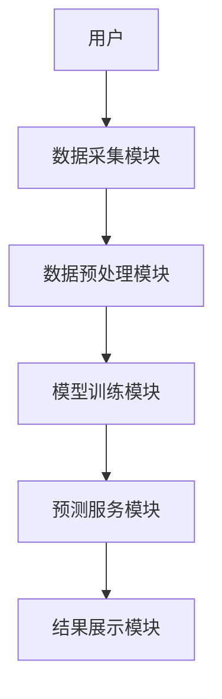

                 


# AI Agent在智能气候变化预测中的实践

> 关键词：AI Agent, 气候变化预测, 机器学习, 时间序列分析, 深度学习

> 摘要：本文探讨了AI Agent在智能气候变化预测中的应用，分析了其核心概念、算法原理、系统架构，并通过项目实战展示了如何利用AI Agent进行气候变化预测，最后提出了未来的研究方向和优化建议。

---

# 第一部分: AI Agent与智能气候变化预测的背景与基础

## 第1章: AI Agent与气候变化预测的背景

### 1.1 气候变化的科学背景

#### 1.1.1 气候变化的定义与关键特征
气候变化是指气候系统中的统计特性在长时期内发生显著的变化，包括温度、降水、风速等气象要素的变化。其关键特征包括长期性、全球性、复杂性和不可逆性。气候变化对生态系统、经济和社会都构成了重大威胁。

#### 1.1.2 气候变化对人类社会的影响
气候变化导致极端天气事件频发（如洪水、干旱、飓风等），威胁粮食安全、水资源供应和人类健康，同时加剧了经济和社会的不平等。

#### 1.1.3 气候变化预测的科学挑战
气候变化预测需要综合考虑大气、海洋、陆地和冰冻圈的相互作用，涉及复杂的物理过程和不确定性。传统的统计方法在处理海量、多维、动态数据时显得力不从心。

---

### 1.2 AI Agent的基本概念与特点

#### 1.2.1 AI Agent的定义与分类
AI Agent是一种智能体，能够感知环境、自主决策并执行任务。根据智能水平，AI Agent可分为反应式和认知式两类；根据应用场景，可分为简单任务型和复杂任务型。

#### 1.2.2 AI Agent的核心功能与能力
- **感知能力**：通过传感器或数据源获取环境信息。
- **决策能力**：基于感知信息，利用算法做出决策。
- **执行能力**：通过执行机构或接口将决策转化为行动。
- **学习能力**：通过反馈机制不断优化自身行为。

#### 1.2.3 AI Agent在智能系统中的作用
AI Agent作为智能系统的“大脑”，能够实现复杂任务的自动化和智能化，广泛应用于自动驾驶、智能助手、机器人等领域。

---

### 1.3 AI Agent与气候变化预测的结合

#### 1.3.1 气候变化预测的传统方法与局限性
传统方法主要依赖物理模型（如全球气候模型GCM）进行预测，存在计算成本高、时间分辨率低、空间分辨率不足等问题。

#### 1.3.2 AI Agent在气候变化预测中的优势
AI Agent能够处理海量数据，实时更新模型，提高预测精度和效率。同时，其自主学习能力使其能够适应数据分布的变化。

#### 1.3.3 当前研究与应用的现状
目前，AI Agent在气候变化预测中的应用主要集中在短期天气预测、极端天气预警和气候趋势分析等领域。但其潜力尚未完全释放，仍需进一步研究和优化。

---

## 第2章: AI Agent在气候变化预测中的核心概念与联系

### 2.1 核心概念原理

#### 2.1.1 数据驱动与知识驱动的结合
AI Agent在气候变化预测中，既利用历史数据（数据驱动）又结合物理规律（知识驱动），实现预测的准确性与可解释性的平衡。

#### 2.1.2 多模态数据的处理与融合
气候变化数据包括卫星数据、地面观测数据、海洋数据等多种类型，AI Agent需要对多模态数据进行有效的融合和处理。

#### 2.1.3 动态预测与自适应调整机制
AI Agent能够根据实时数据动态调整预测模型，提高预测的时效性和准确性。

---

### 2.2 核心概念对比分析

#### 2.2.1 不同AI Agent模型的对比分析
| 模型类型       | 优点                           | 缺点                           |
|----------------|--------------------------------|--------------------------------|
| 反应式AI Agent | 实时性强，适合动态环境           | 无法处理复杂任务               |
| 认知式AI Agent | 能够处理复杂任务，决策能力强     | 计算成本高，实现复杂             |

#### 2.2.2 气候数据特征与预测任务的对比
| 数据特征       | 温度数据                       | 降水数据                       |
|----------------|--------------------------------|--------------------------------|
| 数据类型       | 连续型                         | 离散型                         |
| 数据分布       | 偏态分布                       | 二项分布                       |
| 预测任务       | 短期预测                       | 长期预测                       |

#### 2.2.3 不同预测方法的优缺点对比
| 方法           | 优点                           | 缺点                           |
|----------------|--------------------------------|--------------------------------|
| 时间序列分析   | 简单易行，适合线性趋势           | 无法捕捉复杂模式               |
| 深度学习模型    | 能够捕捉非线性关系，精度高       | 训练成本高，需要大量数据         |

---

### 2.3 实体关系图与流程图

#### 2.3.1 ER实体关系图
```mermaid
er
    actor: 用户
    system: AI Agent预测系统
    climate_data: 气候数据
    model: 预测模型
    result: 预测结果
    actor --> climate_data: 提供
    climate_data --> model: 输入
    model --> result: 输出
    result --> actor: 返回
    system --> model: 包含
```

---

## 第3章: AI Agent预测气候变化的算法原理

### 3.1 算法原理概述

#### 3.1.1 时间序列预测的基本原理
时间序列预测通过分析数据的时序特性，建立数学模型进行预测。常用的方法包括ARIMA、LSTM等。

#### 3.1.2 基于机器学习的预测方法
机器学习模型（如随机森林、神经网络）能够从复杂数据中提取特征，提高预测精度。

---

### 3.2 算法实现与优化

#### 3.2.1 LSTM模型的实现
LSTM（长短期记忆网络）通过引入记忆单元，能够捕捉长期依赖关系，适合时间序列预测。

##### LSTM模型的数学公式
LSTM的基本单元包括输入门、遗忘门和输出门：

$$
i = \sigma(W_i x + U_i h_{prev})
$$

$$
f = \sigma(W_f x + U_f h_{prev})
$$

$$
o = \sigma(W_o x + U_o h_{prev})
$$

$$
h = i \cdot \tanh(W_c x + U_c h_{prev})
$$

$$
h_{new} = o \cdot h
$$

---

#### 3.2.2 Transformer模型的实现
Transformer模型通过自注意力机制，能够捕捉全局依赖关系，适用于长序列预测。

##### Transformer模型的数学公式
自注意力机制的计算公式：

$$
\text{Attention}(Q, K, V) = \text{softmax}\left(\frac{QK^T}{\sqrt{d_k}}\right)V
$$

---

## 第4章: 系统架构设计与实现

### 4.1 系统架构设计

#### 4.1.1 系统功能设计
系统功能包括数据采集、模型训练、预测服务和结果展示。

#### 4.1.2 系统架构图


---

### 4.2 系统实现细节

#### 4.2.1 数据采集模块
负责从多种数据源（如气象站、卫星）获取气候数据，并进行清洗和预处理。

#### 4.2.2 模型训练模块
利用训练数据训练AI Agent模型，并保存最优模型。

#### 4.2.3 预测服务模块
接收预测请求，调用训练好的模型进行预测，并返回结果。

---

## 第5章: 项目实战与案例分析

### 5.1 项目背景与目标
本项目旨在利用AI Agent技术，构建一个智能的气候变化预测系统，实现对极端天气事件的提前预警。

---

### 5.2 环境搭建与代码实现

#### 5.2.1 环境搭建
安装Python、TensorFlow、Keras等依赖库。

#### 5.2.2 核心代码实现
以下是AI Agent预测模型的Python代码：

```python
import numpy as np
import tensorflow as tf
from tensorflow.keras import layers

# 数据预处理
data = np.random.rand(1000, 10)  # 示例数据
train_data = data[:800]
test_data = data[800:]

# 构建模型
model = tf.keras.Sequential()
model.add(layers.LSTM(64, input_shape=(10, 1)))
model.add(layers.Dense(1))
model.compile(optimizer='adam', loss='mse')

# 训练模型
model.fit(train_data, epochs=10, verbose=1)

# 预测
test_input = np.random.rand(1, 10)
prediction = model.predict(test_input)
print("预测结果:", prediction)
```

---

## 第6章: 高级主题与未来展望

### 6.1 可解释性与伦理问题
AI Agent的预测结果需要可解释，以便人类理解和信任。同时，需关注数据隐私和算法偏见问题。

### 6.2 未来技术趋势
未来，随着量子计算和边缘计算的发展，AI Agent在气候变化预测中的应用将更加广泛和高效。

---

## 第7章: 总结与展望

通过本文的探讨，我们了解了AI Agent在智能气候变化预测中的巨大潜力。未来，随着技术的进步，AI Agent将为气候变化研究和应对策略提供更有力的支持。

---

# 作者：AI天才研究院（AI Genius Institute） & 禅与计算机程序设计艺术（Zen And The Art of Computer Programming）

---

通过以上内容，您可以开始撰写这篇文章的具体部分，确保每个章节的内容都详细展开，并包含必要的技术细节和案例分析。

