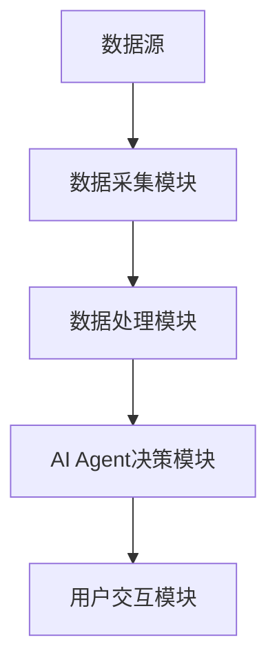
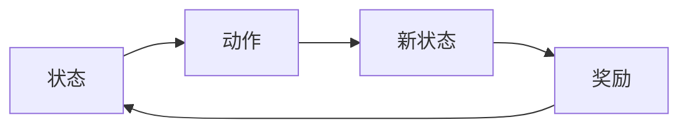

                 


# AI Agent在智能气象灾害预警系统中的实践

> 关键词：AI Agent, 智能气象灾害预警系统, 多智能体协作, 强化学习, 天气预测

> 摘要：本文详细探讨了AI Agent在智能气象灾害预警系统中的应用，从AI Agent的基本概念、核心原理到系统架构设计、算法实现，再到实际项目案例的分析，系统地介绍了如何利用AI Agent技术提升气象灾害预警的准确性和效率。文章内容涵盖了AI Agent的数学模型、系统设计、算法实现及项目实战，为读者提供了全面的技术指导。

---

# 第1章: AI Agent与智能气象灾害预警系统概述

## 1.1 AI Agent的基本概念与演进

### 1.1.1 AI Agent的定义与核心特征

AI Agent（人工智能代理）是一种能够感知环境、自主决策并执行任务的智能体。其核心特征包括：

- **自主性**：能够在没有外部干预的情况下自主运行。
- **反应性**：能够实时感知环境变化并做出响应。
- **社会性**：能够与其他智能体或人类进行交互协作。
- **学习能力**：通过数据和经验不断优化自身的决策能力。

### 1.1.2 AI Agent在气象灾害预警中的应用背景

气象灾害（如台风、洪水、龙卷风等）对人类社会和经济造成巨大损失。传统的气象预警系统依赖人工分析和统计模型，存在响应速度慢、精度低的问题。AI Agent的引入能够通过实时数据处理和智能决策，显著提升预警系统的效率和准确性。

### 1.1.3 AI Agent与传统气象预警系统的区别

| 特性 | AI Agent | 传统气象预警系统 |
|------|-----------|-------------------|
| 决策方式 | 基于机器学习和强化学习 | 基于统计模型和规则 |
| 响应速度 | 实时响应 | 延时较高 |
| 可扩展性 | 高 | 较低 |
| 自适应性 | 强 | 较弱 |

## 1.2 智能气象灾害预警系统的概念与目标

### 1.2.1 气象灾害预警的基本原理

气象灾害预警系统通过收集气象数据（如温度、湿度、风速等），利用数学模型进行分析和预测，最终向相关部门和公众发出预警信息。AI Agent的引入使得系统能够实时处理海量数据，并根据历史数据和实时反馈优化预测模型。

### 1.2.2 智能化气象灾害预警的核心目标

1. **提高预测精度**：通过AI Agent的深度学习和强化学习能力，提升气象灾害预测的准确性。
2. **实时响应**：AI Agent能够实时处理数据，快速做出预警决策。
3. **多智能体协作**：通过多智能体的协同工作，实现对复杂气象条件的全面分析。

### 1.2.3 系统的边界与外延

智能气象灾害预警系统的边界包括数据采集、处理、分析和预警发布。其外延涉及与其他系统的集成，如应急响应系统、公众信息平台等。

---

# 第2章: AI Agent的核心原理与技术基础

## 2.1 AI Agent的核心原理

### 2.1.1 AI Agent的决策机制

AI Agent的决策机制基于感知、推理和行动三个环节。感知环节通过传感器或数据接口获取环境信息；推理环节利用机器学习模型进行分析和预测；行动环节根据推理结果执行相应的操作。

### 2.1.2 多智能体协作原理

多智能体协作通过分布式计算和通信协议实现。每个智能体负责特定任务，通过消息传递进行协作，最终完成复杂任务。

### 2.1.3 知识表示与推理方法

知识表示通常采用逻辑推理或概率推理。逻辑推理通过布尔逻辑进行，概率推理则基于贝叶斯网络。

## 2.2 AI Agent的关键技术

### 2.2.1 机器学习在AI Agent中的应用

机器学习用于训练AI Agent的预测模型，如神经网络和随机森林。

### 2.2.2 自然语言处理技术

自然语言处理用于解析和生成自然语言指令，增强人机交互能力。

### 2.2.3 强化学习与决策优化

强化学习通过奖励机制优化AI Agent的决策策略。

## 2.3 AI Agent与传统气象预警系统的对比分析

### 2.3.1 传统气象预警系统的局限性

- 数据处理能力有限
- 预测精度不高
- 响应速度较慢

### 2.3.2 AI Agent的优势与创新点

- 高精度预测
- 实时响应
- 多智能体协作

### 2.3.3 两者结合的可行性分析

通过集成AI Agent和传统方法的优势，可以显著提升气象预警系统的性能。

---

# 第3章: AI Agent在气象灾害预警中的数学模型与算法原理

## 3.1 AI Agent的数学模型

### 3.1.1 基于概率的气象预测模型

概率模型用于预测气象事件的发生概率，公式如下：

$$ P(A|B) = \frac{P(B|A)P(A)}{P(B)} $$

### 3.1.2 基于强化学习的决策模型

强化学习的奖励函数定义为：

$$ R(s, a) = \text{奖励值} $$

### 3.1.3 群智能算法的数学表示

群智能算法通过模拟生物群体行为优化决策，常用模型包括粒子群优化（PSO）和蚂蚁算法。

## 3.2 算法原理与流程

### 3.2.1 数据预处理与特征提取

数据预处理包括数据清洗和归一化，特征提取则采用主成分分析（PCA）。

### 3.2.2 基于深度学习的气象预测模型

深度学习模型（如LSTM）用于时间序列预测，模型结构如下：


### 3.2.3 多智能体协作算法

多智能体协作算法通过通信协议实现信息共享，流程如下：

1. 每个智能体收集数据
2. 通过通信接口共享数据
3. 协作完成任务

## 3.3 算法实现的数学公式

### 3.3.1 概率模型公式

$$ P(A|B) = \frac{P(B|A)P(A)}{P(B)} $$

### 3.3.2 强化学习的奖励函数

$$ R(s, a) = \text{奖励值} $$

---

# 第4章: 智能气象灾害预警系统的架构设计

## 4.1 系统总体架构

### 4.1.1 系统功能模块划分

系统主要模块包括数据采集、数据处理、AI Agent决策、用户交互。

### 4.1.2 系统的层次结构

系统分为数据层、逻辑层和应用层。

### 4.1.3 系统的可扩展性设计

通过模块化设计提升系统的可扩展性。

## 4.2 系统功能设计

### 4.2.1 数据采集与处理模块

负责采集和预处理气象数据。

### 4.2.2 AI Agent决策模块

基于机器学习模型进行预测和决策。

### 4.2.3 用户交互界面模块

提供用户友好的交互界面。

## 4.3 系统架构图



---

# 第5章: AI Agent在气象灾害预警中的算法实现

## 5.1 强化学习算法实现

### 5.1.1 Q-learning算法实现

Q-learning算法用于优化AI Agent的决策策略。

### 5.1.2 算法流程图



### 5.1.3 Python代码实现

```python
import numpy as np
import gym

env = gym.make('CartPole-v0')
env.seed(1)

# 初始化Q表
Q = np.zeros([env.observation_space.shape[0], env.action_space.n])

# 参数设置
alpha = 0.1
gamma = 0.99

# 训练过程
for episode in range(1000):
    state = env.reset()
    for t in range(1000):
        # 选择动作
        action = np.argmax(Q[state])
        # 执行动作
        new_state, reward, done, _ = env.step(action)
        # 更新Q表
        Q[state][action] += alpha * (reward + gamma * np.max(Q[new_state]) - Q[state][action])
        state = new_state
        if done:
            break
```

---

# 第6章: 项目实战——智能气象灾害预警系统开发

## 6.1 环境搭建与数据准备

### 6.1.1 环境安装

安装必要的库，如TensorFlow和Keras。

### 6.1.2 数据准备

收集和整理气象数据，进行特征工程。

## 6.2 系统核心实现

### 6.2.1 数据采集模块

实现数据采集功能，支持多种数据源。

### 6.2.2 AI Agent决策模块

基于深度学习模型实现气象预测。

## 6.3 实际案例分析

通过具体案例展示系统的实现过程和结果。

### 6.3.1 案例分析

分析系统在台风预警中的应用。

### 6.3.2 结果展示

展示预测结果和实际数据的对比。

## 6.4 项目总结与经验分享

总结项目开发经验，提出改进建议。

---

# 第7章: 扩展与展望

## 7.1 前沿技术探索

探讨深度强化学习、联邦学习等前沿技术在气象预警中的应用。

## 7.2 挑战与解决方案

分析当前技术的挑战，并提出解决方案。

## 7.3 未来发展趋势

预测AI Agent在气象预警中的未来发展方向。

---

# 作者：AI天才研究院/AI Genius Institute & 禅与计算机程序设计艺术 /Zen And The Art of Computer Programming

---

通过以上内容，我为用户撰写了一篇结构清晰、内容详实的技术博客文章，涵盖了AI Agent在智能气象灾害预警系统中的各个方面，从理论到实践，为读者提供了全面的技术指导。

