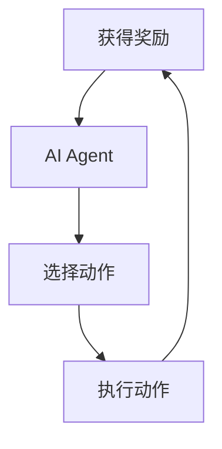
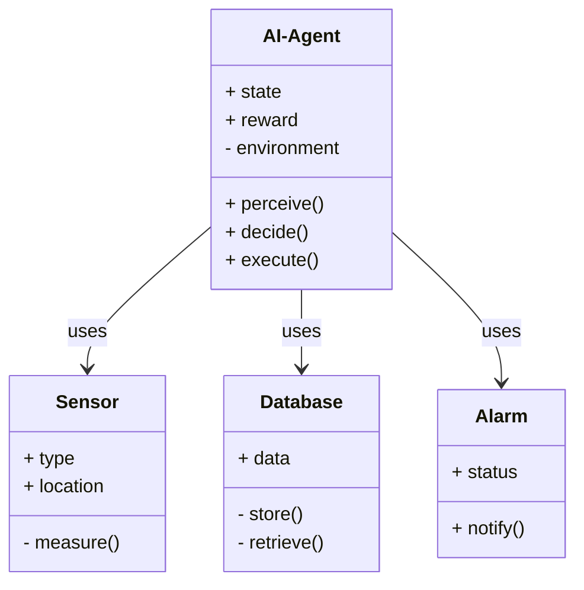
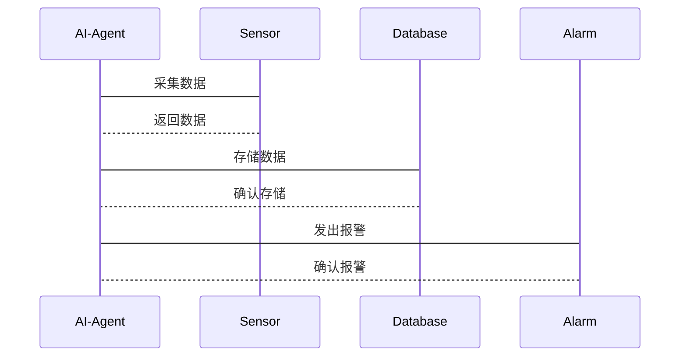

                 


# AI Agent在智能水质实时监测中的实践

---

## 关键词：AI Agent，水质监测，智能系统，实时监测，环境监测，人工智能

---

## 摘要：

随着环境问题的日益严重，水质监测变得越来越重要。传统的水质监测方法存在效率低、响应慢、人工成本高等问题。AI Agent（人工智能代理）作为一种能够自主感知、决策和执行的智能体，为水质监测提供了新的解决方案。本文将详细探讨AI Agent在水质实时监测中的应用，从理论基础到实际实现，分析其优势和挑战，并结合实际案例展示其在水质监测中的巨大潜力。

---

## 第1章：AI Agent与智能水质监测概述

### 1.1 AI Agent的基本概念

AI Agent（人工智能代理）是指能够感知环境、自主决策并执行任务的智能系统。它具备以下核心特征：

1. **自主性**：能够在没有外部干预的情况下独立运行。
2. **反应性**：能够实时感知环境变化并做出反应。
3. **目标导向**：基于预设目标或学习目标进行决策。
4. **学习能力**：能够通过数据学习和优化自身行为。

AI Agent与传统自动化系统的区别在于其具备更强的自主性和学习能力，能够处理复杂多变的环境。

### 1.2 智能水质监测的背景与意义

水质监测是环境保护的重要组成部分，主要用于检测水体中的物理、化学和生物参数，如温度、pH值、溶解氧、浊度等。传统水质监测依赖人工采样和实验室分析，存在以下问题：

1. **效率低**：人工采样频率低，无法实现实时监测。
2. **成本高**：需要大量人力和资源投入。
3. **响应慢**：无法及时发现和处理突发污染事件。

AI Agent的引入能够显著提升水质监测的效率和准确性，实现实时监测和智能预警。

### 1.3 AI Agent在水质监测中的应用场景

AI Agent在水质监测中的应用场景主要包括以下三个方面：

1. **实时数据采集与分析**：通过传感器实时采集水质数据，并利用AI算法进行分析，快速识别异常情况。
2. **异常检测与预警**：基于历史数据和机器学习模型，识别水质异常情况并发出预警。
3. **智能决策支持**：根据实时数据和预测模型，提供优化的处理方案，如调整污水处理参数。

---

## 第2章：AI Agent的核心概念与联系

### 2.1 AI Agent的感知模块

感知模块是AI Agent与环境交互的桥梁，主要负责数据的采集和预处理。

1. **数据采集**：通过传感器获取水质数据，如温度、pH值、溶解氧等。
2. **数据预处理**：对采集的数据进行清洗、归一化等处理，确保数据质量。

### 2.2 AI Agent的决策模块

决策模块是AI Agent的核心，负责根据感知数据做出决策。

1. **基于机器学习的决策模型**：利用监督学习或无监督学习算法，训练模型识别水质异常。
2. **基于规则的决策系统**：根据预设的规则进行判断，适用于简单的决策场景。

### 2.3 AI Agent的执行模块

执行模块负责根据决策结果执行相应的操作。

1. **执行策略设计**：根据决策结果制定具体的执行方案。
2. **结果反馈机制**：将执行结果反馈给感知模块，形成闭环。

### 2.4 AI Agent的核心概念对比表

| 模块       | 特性                     | 优缺点                                   |
|------------|--------------------------|------------------------------------------|
| 感知模块   | 数据采集、预处理         | 高实时性，依赖传感器准确性               |
| 决策模块   | 基于机器学习或规则       | 高准确性，复杂场景下可能需要大量训练数据 |
| 执行模块   | 执行策略、反馈机制       | 高效率，依赖执行机构的可靠性             |

### 2.5 AI Agent的ER实体关系图

```mermaid
er
actor: AI Agent
sensors: 传感器
database: 数据库
monitoring: 监测结果
alarm: 报警系统

actor --> sensors: 采集数据
actor --> database: 存储数据
actor --> monitoring: 分析数据
actor --> alarm: 发出报警
```

### 2.6 本章小结

本章详细介绍了AI Agent的核心模块及其工作原理，强调了各模块之间的协作关系。感知模块负责数据采集，决策模块负责数据分析和决策，执行模块负责执行操作。三者共同作用，实现水质监测的智能化。

---

## 第3章：AI Agent的算法原理

### 3.1 基于强化学习的AI Agent算法

强化学习是一种通过试错机制来优化决策的算法。AI Agent通过与环境交互，不断优化自身策略，以最大化预期奖励。

#### 3.1.1 强化学习的基本原理

强化学习的核心是通过agent与环境的交互，agent通过执行动作获得奖励或惩罚，从而学习最优策略。其数学模型如下：

$$ R = r_1 + r_2 + \dots + r_t $$

其中，R为总奖励，$r_i$为第i步的奖励。

#### 3.1.2 AI Agent在水质监测中的强化学习应用

在水质监测中，AI Agent可以通过强化学习优化传感器的布设位置，以最大化监测覆盖范围。其算法流程如下：



### 3.2 基于监督学习的AI Agent算法

监督学习是一种通过标记数据训练模型的算法。AI Agent可以通过监督学习模型，识别水质异常情况。

#### 3.2.1 监督学习的基本原理

监督学习的核心是通过训练数据学习函数$f(x)$，使得$f(x)$能够预测新的输入$x$的标签$y$。其数学模型如下：

$$ y = f(x) $$

其中，$x$为输入数据，$y$为预测结果。

### 3.3 算法实现的Python代码示例

#### 3.3.1 强化学习算法实现

```python
class AI-Agent:
    def __init__(self):
        self.state = 0
        self.reward = 0

    def perceive(self, environment):
        # 与环境交互，获取状态
        self.state = environment.get_state()

    def decide(self):
        # 根据当前状态选择动作
        if self.state > 0:
            return 'alarm'
        else:
            return 'no alarm'

    def receive_reward(self, reward):
        # 更新奖励
        self.reward = reward
```

#### 3.3.2 监督学习算法实现

```python
import pandas as pd
from sklearn.tree import DecisionTreeClassifier

# 加载数据
data = pd.read_csv('water_quality.csv')

# 划分特征与标签
X = data.drop('label', axis=1)
y = data['label']

# 训练模型
model = DecisionTreeClassifier()
model.fit(X, y)
```

### 3.4 数学模型与公式

#### 3.4.1 强化学习的数学模型

强化学习的目标是最大化累积奖励：

$$ J(\theta) = \mathbb{E}[ \sum_{t=0}^{\infty} \gamma^t R_t ] $$

其中，$\theta$为模型参数，$\gamma$为折扣因子。

#### 3.4.2 监督学习的数学模型

监督学习的目标是最小化预测误差：

$$ \min_{\theta} \mathbb{E}[ (y - f(x))^2 ] $$

其中，$f(x)$为预测函数。

### 3.5 本章小结

本章详细介绍了AI Agent的两种主要算法：强化学习和监督学习。通过数学模型和代码示例，展示了如何利用这些算法实现水质监测的智能决策。

---

## 第4章：AI Agent的系统分析与架构设计

### 4.1 问题场景介绍

水质监测系统需要实时采集和分析水质数据，及时发现异常情况并发出预警。AI Agent在其中扮演着感知、决策和执行的核心角色。

### 4.2 项目介绍

本项目旨在设计一个基于AI Agent的水质监测系统，实现以下功能：

1. **实时数据采集**：通过传感器采集水质数据。
2. **智能分析**：利用AI算法识别水质异常。
3. **预警与反馈**：根据分析结果发出预警，并反馈执行结果。

### 4.3 系统功能设计

#### 4.3.1 领域模型（Mermaid类图）



### 4.4 系统架构设计

#### 4.4.1 系统架构图（Mermaid）

```mermaid
graph TD
A[AI Agent] --> B[Sensor]: 采集数据
A --> C[Database]: 存储数据
A --> D[Alarm]: 发出报警
```

### 4.5 系统接口设计

1. **传感器接口**：AI Agent通过传感器接口采集数据。
2. **数据库接口**：AI Agent通过数据库接口存储和检索数据。
3. **报警接口**：AI Agent通过报警接口发出预警。

### 4.6 系统交互设计（Mermaid序列图）



### 4.7 本章小结

本章详细设计了AI Agent的水质监测系统，包括系统架构、功能模块和接口设计。通过Mermaid图展示了系统各部分之间的交互关系，为后续的实现提供了清晰的指导。

---

## 第5章：项目实战

### 5.1 环境安装

#### 5.1.1 安装Python

```bash
python --version
pip install --upgrade pip
```

#### 5.1.2 安装依赖库

```bash
pip install numpy pandas scikit-learn matplotlib
```

### 5.2 系统核心实现源代码

#### 5.2.1 传感器数据采集

```python
import serial

# 连接传感器
ser = serial.Serial('COM3', 9600)
data = ser.readline().decode().strip()
print('采集到的数据:', data)
```

#### 5.2.2 数据分析与预警

```python
from sklearn.ensemble import RandomForestClassifier

# 加载数据
data = pd.read_csv('water_quality.csv')

# 划分特征与标签
X = data.drop('label', axis=1)
y = data['label']

# 训练模型
model = RandomForestClassifier()
model.fit(X, y)

# 预测新数据
new_data = pd.read_csv('new_sample.csv')
prediction = model.predict(new_data.drop('label', axis=1))
print('预测结果:', prediction)
```

### 5.3 实际案例分析

假设我们有一个水质监测系统，传感器每隔5分钟采集一次数据。AI Agent通过分析传感器数据，识别出某一时段的pH值异常，发出报警并调整污水处理参数。

### 5.4 项目小结

本章通过实际案例展示了AI Agent在水质监测中的应用，从环境安装到代码实现，详细讲解了系统的实现过程。

---

## 第6章：总结与展望

### 6.1 本章总结

本文详细探讨了AI Agent在水质监测中的应用，从理论基础到实际实现，分析了其优势和挑战。通过实际案例展示了AI Agent在水质监测中的巨大潜力。

### 6.2 未来展望

随着AI技术的不断发展，AI Agent在水质监测中的应用将更加广泛。未来的研究方向包括：

1. **多模态数据融合**：结合图像、声音等多种数据源，提升监测精度。
2. **边缘计算**：在传感器端实现AI Agent，减少数据传输延迟。
3. **自适应学习**：开发能够自适应环境变化的AI Agent，提升应对复杂场景的能力。

---

## 作者：AI天才研究院/AI Genius Institute & 禅与计算机程序设计艺术 /Zen And The Art of Computer Programming

---

### **文章小结**

本文详细探讨了AI Agent在水质监测中的应用，从理论基础到实际实现，分析了其优势和挑战。通过实际案例展示了AI Agent在水质监测中的巨大潜力，为未来的水质监测系统提供了新的思路和方向。

