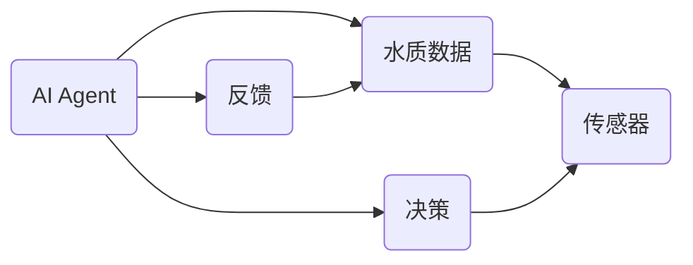
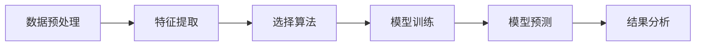
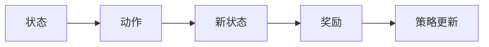
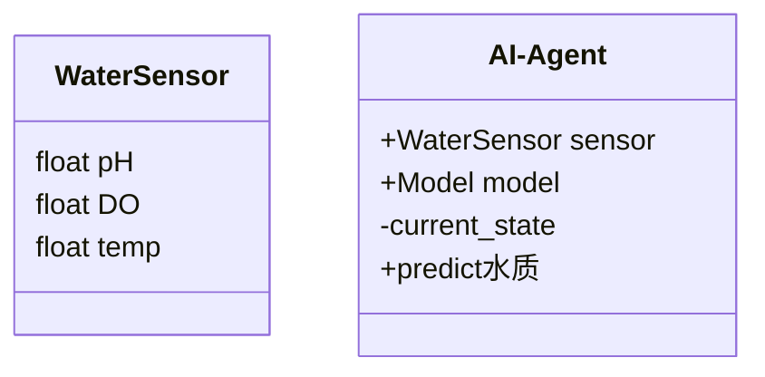
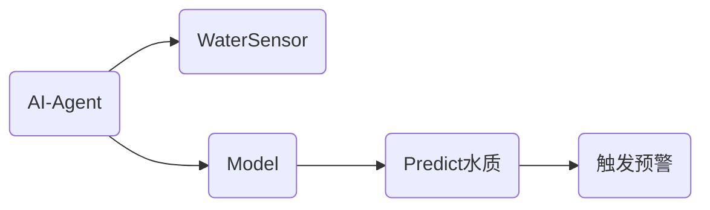
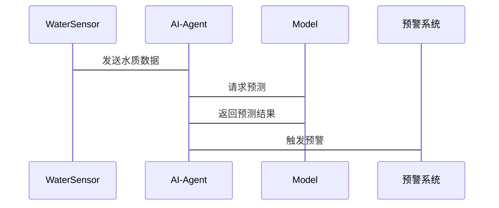

                 


# AI Agent在智能水质监测与预警中的角色

## 关键词：
- AI Agent
- 智能水质监测
- 预警系统
- 机器学习
- 数据分析

## 摘要：
本文探讨AI Agent在智能水质监测与预警系统中的核心作用。通过分析AI Agent的技术原理、算法模型和系统架构，结合实际应用场景，详细阐述其在水质数据采集、分析、预测和预警中的应用价值。文章旨在为水质监测领域的技术专家和研究人员提供深入的技术洞察和实践指导。

---

# 第一部分：AI Agent在智能水质监测与预警中的背景介绍

## 第1章：AI Agent的基本概念与水质监测的重要性

### 1.1 AI Agent的定义与特点
- **1.1.1 AI Agent的基本定义**
  - AI Agent（人工智能代理）是一种能够感知环境、自主决策并执行任务的智能体。
  - 具备自主性、反应性、目标导向性和社会性等核心特征。

- **1.1.2 AI Agent的核心特点**
  - 自主性：无需外部干预，自动完成任务。
  - 反应性：能够实时感知环境变化并做出响应。
  - 目标导向性：基于目标驱动行为，优化决策。
  - 社会性：能够与其他系统或人类交互协作。

- **1.1.3 AI Agent与传统自动化的区别**
  - 传统自动化基于固定的规则和程序，AI Agent具备学习和自适应能力。
  - AI Agent能够处理复杂和不确定性问题，而传统自动化适用于规则明确的场景。

### 1.2 智能水质监测的背景与挑战
- **1.2.1 水质监测的重要性**
  - 水是生命之源，水质直接关系到人类健康和生态环境。
  - 水质监测是环境保护、水资源管理和公共健康的重要手段。

- **1.2.2 智能水质监测的必要性**
  - 传统水质监测依赖人工操作，效率低且成本高。
  - 智能水质监测能够实现实时监控、自动化分析和预警，提升监测效率和准确性。

- **1.2.3 当前水质监测的主要挑战**
  - 数据量大且复杂，人工分析效率低下。
  - 数据来源多样，如何整合和分析是个难题。
  - 如何实现实时预警和快速响应是关键。

### 1.3 AI Agent在水质监测中的角色
- **1.3.1 AI Agent在水质监测中的功能定位**
  - 数据采集与处理：AI Agent能够协调多种传感器，实时采集水质数据。
  - 数据分析与预测：基于机器学习模型，预测水质变化趋势。
  - 预警与决策支持：根据分析结果，触发预警并提供决策建议。

- **1.3.2 AI Agent如何提升水质监测的效率**
  - 自动化数据采集和处理，减少人工干预。
  - 实时分析和预警，提高响应速度。
  - 基于历史数据的学习，优化监测策略。

- **1.3.3 AI Agent在水质预警中的作用**
  - 实时监控水质参数，识别异常情况。
  - 基于预测模型，提前发出预警。
  - 协调多部门资源，快速应对突发情况。

## 第2章：AI Agent与水质监测的结合

### 2.1 AI Agent的核心技术
- **2.1.1 机器学习算法**
  - 监督学习：用于分类和回归任务，如水质指标预测。
  - 无监督学习：用于异常检测和聚类分析。
  - 强化学习：用于优化决策过程。

- **2.1.2 自然语言处理**
  - 文本分析：处理水质报告和相关文献。
  - 信息提取：从非结构化数据中提取有用信息。

- **2.1.3 强化学习**
  - 在复杂环境中，通过试错优化决策策略。
  - 适用于动态变化的水质监测场景。

### 2.2 水质监测的主要技术
- **2.2.1 传感器技术**
  - 多参数传感器：如pH、溶解氧、温度、浊度等。
  - 无线传感器网络：实现广域覆盖和实时监测。

- **2.2.2 数据采集与传输技术**
  - IoT（物联网）技术：实现设备间的互联互通。
  - 数据压缩与加密：确保数据安全传输。

- **2.2.3 数据分析技术**
  - 时间序列分析：分析水质变化趋势。
  - 多变量分析：处理多个水质指标的综合影响。

### 2.3 AI Agent在水质监测中的应用模式
- **2.3.1 数据驱动的模式**
  - 基于大量历史数据，训练机器学习模型。
  - 实时数据输入，模型输出预测结果。

- **2.3.2 模型驱动的模式**
  - 使用物理模型或经验模型进行预测。
  - 结合数据驱动的方法，提升预测精度。

- **2.3.3 人机协作的模式**
  - 人类专家与AI Agent协同工作。
  - 人类负责决策，AI负责数据处理和分析。

---

# 第二部分：AI Agent在智能水质监测与预警中的核心概念与联系

## 第3章：AI Agent的核心原理与水质监测的关系

### 3.1 AI Agent的核心原理
- **3.1.1 状态感知**
  - 通过传感器获取环境数据。
  - 数据预处理和特征提取。

- **3.1.2 行动决策**
  - 基于感知状态，选择最优行动。
  - 决策模型的设计与优化。

- **3.1.3 执行与反馈**
  - 执行决策并观察结果。
  - 根据反馈调整策略。

### 3.2 水质监测的核心要素
- **3.2.1 水质指标**
  - pH值、溶解氧、浊度、温度、重金属含量等。
  - 每个指标的监测方法和意义。

- **3.2.2 数据采集设备**
  - 多参数传感器：集成多种监测功能。
  - 数据采集卡：将模拟信号转换为数字信号。

- **3.2.3 数据分析模型**
  - 机器学习模型：如随机森林、神经网络。
  - 统计模型：如回归分析、时间序列模型。

### 3.3 AI Agent与水质监测的实体关系图



---

## 第4章：AI Agent在水质监测中的算法原理

### 4.1 基于机器学习的水质预测模型

#### 4.1.1 算法流程


#### 4.1.2 算法实现
```python
# 数据预处理
import pandas as pd
data = pd.read_csv('water_quality.csv')
data = data.dropna()

# 特征提取
from sklearn.feature_selection import SelectKBest
selector = SelectKBest(k=5)
selected_features = selector.fit_transform(data, target)

# 模型训练
from sklearn.ensemble import RandomForestRegressor
model = RandomForestRegressor(n_estimators=100)
model.fit(selected_features, target)

# 模型预测
import numpy as np
new_data = ...  # 新的水质数据
prediction = model.predict(new_data)
```

#### 4.1.3 数学模型
$$
y = \beta_0 + \beta_1x_1 + \beta_2x_2 + \ldots + \beta_nx_n + \epsilon
$$

### 4.2 基于强化学习的优化策略

#### 4.2.1 算法流程


#### 4.2.2 算法实现
```python
import gym
env = gym.make('WaterQualityEnv')
policy = ...
while not done:
    action = policy.act(state)
    next_state, reward, done, _ = env.step(action)
    policy.update(action, reward)
```

---

## 第5章：AI Agent在水质监测中的系统分析与架构设计

### 5.1 系统功能设计

#### 5.1.1 领域模型


#### 5.1.2 系统架构


### 5.2 系统接口与交互

#### 5.2.1 接口设计
- 传感器接口：提供水质数据的读取接口。
- AI Agent接口：提供API，接收数据并返回预测结果。
- 预警系统接口：接收预警信号并触发相应动作。

#### 5.2.2 交互流程


---

## 第6章：AI Agent在水质监测中的项目实战

### 6.1 环境安装与配置
```bash
pip install numpy pandas scikit-learn gym
```

### 6.2 系统核心实现
```python
class AI-Agent:
    def __init__(self, sensors):
        self.sensors = sensors
        self.model = load_model()
    
    def感知(self):
        # 获取传感器数据
        data = self.sensors.get_data()
        return data
    
    def 决策(self, data):
        # 调用模型预测
        prediction = self.model.predict(data)
        return prediction
    
    def 执行(self, action):
        # 执行相应动作
        pass
```

### 6.3 代码应用解读
- 数据预处理：处理传感器数据，确保模型输入格式正确。
- 模型训练：基于历史数据训练预测模型。
- 预警触发：根据预测结果，判断是否需要发出预警。

### 6.4 实际案例分析
- 某地水质监测系统部署案例。
- 系统运行效果分析，包括准确率、响应时间等指标。

### 6.5 项目小结
- 项目实现的关键点。
- 项目中遇到的挑战及解决方案。
- 项目的未来优化方向。

---

## 第三部分：最佳实践与小结

## 第7章：最佳实践与小结

### 7.1 小结
- AI Agent在水质监测中的核心作用。
- 相关技术的实现要点。

### 7.2 注意事项
- 数据质量对模型性能的影响。
- 系统的实时性和稳定性要求。
- 安全性和隐私保护问题。

### 7.3 拓展阅读
- 推荐相关书籍和论文。
- 提供进一步学习和研究的方向。

---

# 作者：AI天才研究院/AI Genius Institute & 禅与计算机程序设计艺术 /Zen And The Art of Computer Programming

