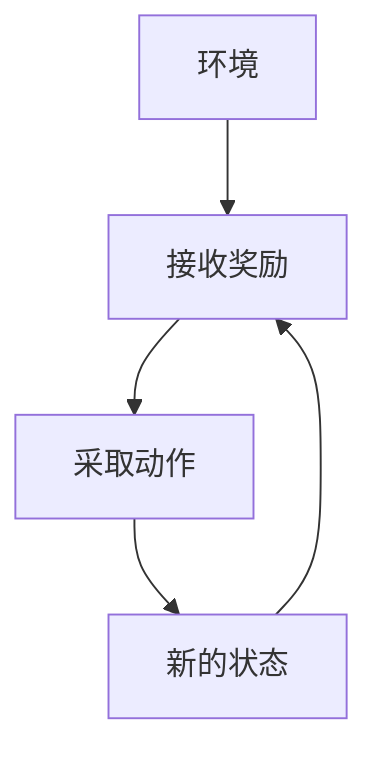
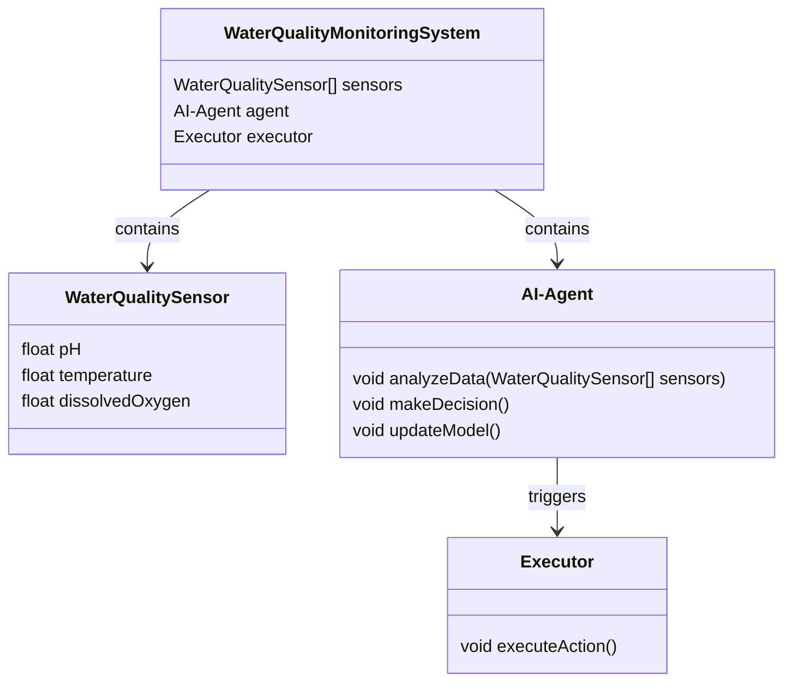
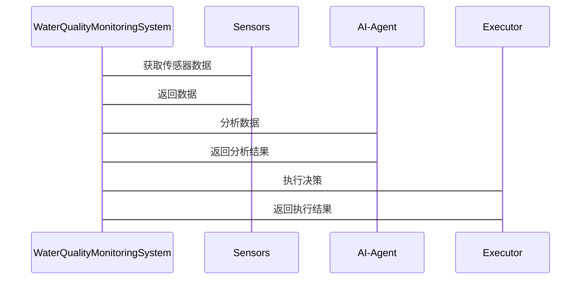

                 


# AI Agent在智能水质监测中的实践

## 关键词：AI Agent, 智能水质监测, 强化学习, 深度学习, 系统架构设计, 项目实战

## 摘要：  
随着人工智能技术的快速发展，AI Agent（智能体）在各个领域的应用越来越广泛。在水质监测领域，AI Agent可以通过感知环境、分析数据、做出决策并执行动作，实现智能化的水质监控与管理。本文将从AI Agent的基本概念出发，结合水质监测的实际需求，详细探讨AI Agent在水质监测中的应用场景、算法原理、系统架构设计以及实际项目实现。通过本文的阐述，读者可以全面了解AI Agent在智能水质监测中的技术细节和实践价值。

---

# 第一部分: AI Agent与智能水质监测的背景与基础

## 第1章: AI Agent与水质监测的背景介绍

### 1.1 AI Agent的基本概念
#### 1.1.1 AI Agent的定义与特点
- AI Agent（智能体）是指能够感知环境、自主决策并执行任务的智能系统。
- 具有自主性、反应性、目标导向性和社会性四大特点。
- 与传统自动化系统相比，AI Agent能够主动适应环境变化并优化决策。

#### 1.1.2 AI Agent的核心要素与功能
- **感知**：通过传感器、数据接口等方式获取环境信息。
- **决策**：基于感知数据，利用算法做出最优决策。
- **执行**：通过执行机构或软件接口完成决策动作。
- **学习**：通过机器学习算法不断优化自身的决策能力。

#### 1.1.3 AI Agent与传统自动化的区别
- **传统自动化**：基于固定的规则和程序，无法应对环境变化。
- **AI Agent**：能够动态感知环境、自主决策并优化行为。

### 1.2 智能水质监测的现状与挑战
#### 1.2.1 水质监测的基本概念与应用场景
- 水质监测是通过对水体中的物理、化学和生物参数的测量，评估水体的健康状况。
- 应用场景包括饮用水安全、工业废水处理、农业灌溉等领域。

#### 1.2.2 当前水质监测的主要技术与方法
- **传统方法**：实验室分析，周期长、成本高。
- **传感器技术**：基于传感器的实时监测系统，但缺乏智能性。
- **数据采集与分析**：通过采集水体数据进行初步分析，但无法实现智能决策。

#### 1.2.3 智能水质监测的痛点与需求
- **痛点**：
  - 数据量大、类型复杂，难以高效处理。
  - 环境变化快，需要实时响应。
  - 系统集成度低，缺乏智能化决策能力。
- **需求**：
  - 实时监测与智能分析。
  - 自动化决策与执行。
  - 系统的可扩展性与可维护性。

### 1.3 AI Agent在水质监测中的应用价值
#### 1.3.1 提高监测效率与精度
- AI Agent能够快速处理大量数据，提高监测效率。
- 通过机器学习算法，实现更精准的水质预测与异常检测。

#### 1.3.2 实现数据智能分析与决策
- 基于历史数据和实时数据，AI Agent能够预测水质变化趋势。
- 在异常情况发生时，AI Agent能够快速做出决策并执行响应。

#### 1.3.3 支持实时监控与异常处理
- AI Agent可以实时监控水体参数，及时发现异常情况。
- 在异常情况下，AI Agent能够自动启动应急响应机制。

### 1.4 本章小结
本章从AI Agent的基本概念出发，介绍了水质监测的现状与挑战，重点阐述了AI Agent在水质监测中的应用价值。通过本章的分析，读者可以理解AI Agent在水质监测中的重要性。

---

## 第2章: AI Agent与水质监测的核心概念与联系

### 2.1 AI Agent的核心原理
#### 2.1.1 AI Agent的感知与决策机制
- **感知**：通过多种传感器或数据接口获取环境信息。
- **决策**：基于感知数据和预设目标，利用算法做出决策。
- **执行**：通过执行机构或软件接口完成决策动作。

#### 2.1.2 基于知识图谱的环境理解
- 知识图谱是AI Agent理解环境的重要工具。
- 通过知识图谱，AI Agent可以关联不同参数之间的关系。

#### 2.1.3 多智能体协同工作原理
- 多个AI Agent可以协同工作，共同完成复杂的任务。
- 协作机制包括任务分配、信息共享和协同决策。

### 2.2 水质监测系统的实体关系分析
#### 2.2.1 实体关系图（ER图）
```mermaid
erd
  title 实体关系图
  WaterQualityMeasurement
  sensor
  location
  timestamp
  measurementValue
  WaterQualityMonitoringSystem
  WaterQualityMeasurement -> sensor: 使用
  WaterQualityMeasurement -> location: 位于
  WaterQualityMeasurement -> timestamp: 记录于
  WaterQualityMeasurement -> measurementValue: 包含
  WaterQualityMonitoringSystem -> WaterQualityMeasurement: 包含
```

#### 2.2.2 实体属性与关系对比表格
| 实体 | 属性 | 关系 |
|------|------|------|
| 水质测量 | 传感器ID、测量时间、测量值 | 使用传感器、位于位置 |

#### 2.2.3 智能水质监测系统的ER图架构
```mermaid
erd
  title 智能水质监测系统实体关系图
  WaterQualityMonitoringSystem
  Sensor
  Location
  Measurement
  WaterQualityMonitoringSystem -> Sensor: 配置
  WaterQualityMonitoringSystem -> Location: 监测
  Sensor -> Measurement: 产生
  Location -> Measurement: 记录
```

### 2.3 AI Agent与水质监测系统的交互流程
#### 2.3.1 数据采集与处理流程
1. 传感器采集水体参数（如pH值、温度、溶解氧等）。
2. 数据传输至AI Agent进行预处理。
3. AI Agent对数据进行清洗和特征提取。

#### 2.3.2 智能分析与决策流程
1. AI Agent利用机器学习算法对数据进行分析。
2. 根据分析结果，AI Agent做出决策。
3. 决策结果传递给执行机构。

#### 2.3.3 系统反馈与优化流程
1. 执行机构执行决策并反馈结果。
2. AI Agent根据反馈结果优化模型。
3. 优化后的模型用于后续决策。

### 2.4 本章小结
本章通过实体关系分析和交互流程图，详细阐述了AI Agent与水质监测系统的联系。通过本章的分析，读者可以理解AI Agent在水质监测中的具体应用场景。

---

## 第3章: AI Agent在水质监测中的算法原理

### 3.1 基于强化学习的水质异常检测
#### 3.1.1 强化学习的基本原理
- 强化学习是一种通过试错机制来优化决策的算法。
- 通过与环境的交互，智能体学习如何采取最优动作以获得最大奖励。

#### 3.1.2 强化学习在水质监测中的应用
- 状态空间：水体参数（如pH值、温度、溶解氧等）。
- 动作空间：启动或关闭传感器、调整处理设备参数。
- 奖励函数：根据水质改善情况给予奖励。

#### 3.1.3 算法流程图（mermaid）


#### 3.1.4 Python代码示例
```python
import gym
import numpy as np

# 定义强化学习环境
class WaterQualityEnv(gym.Env):
    def __init__(self):
        # 定义状态空间
        self.observation_space = gym.spaces.Box(low=0, high=10, shape=(3,))
        # 定义动作空间
        self.action_space = gym.spaces.Discrete(2)
        # 初始化环境
        self.reset()

    def reset(self):
        # 初始化状态
        self.state = np.random.rand(3) * 10
        return self.state

    def step(self, action):
        # 根据动作更新状态
        if action == 0:
            self.state += 1
        else:
            self.state -= 1
        # 计算奖励
        reward = np.sum(self.state) / 3
        # 判断是否终止
        done = np.all(self.state > 8)
        return self.state, reward, done, {}
```

### 3.2 基于深度学习的水质预测模型
#### 3.2.1 深度学习模型的选择与优化
- 使用LSTM（长短期记忆网络）进行时间序列预测。
- 通过交叉验证选择最优模型参数。

#### 3.2.2 模型训练与验证流程
1. 数据预处理：归一化、分割训练集与验证集。
2. 模型训练：使用训练数据训练LSTM模型。
3. 模型验证：使用验证数据评估模型性能。

#### 3.2.3 模型预测与误差分析
- 模型预测结果与真实值进行对比。
- 计算误差指标（如MAE、RMSE）。

#### 3.2.4 Python代码示例
```python
import numpy as np
from tensorflow.keras.models import Sequential
from tensorflow.keras.layers import LSTM, Dense

# 定义LSTM模型
model = Sequential()
model.add(LSTM(64, input_shape=(None, 3)))
model.add(Dense(1))
model.compile(optimizer='adam', loss='mse')

# 训练模型
model.fit(X_train, y_train, epochs=100, batch_size=32, validation_data=(X_val, y_val))
```

### 3.3 基于规则引擎的决策逻辑
#### 3.3.1 规则引擎的基本原理
- 规则引擎是一种基于预定义规则的决策系统。
- 规则由条件和动作两部分组成。

#### 3.3.2 规则引擎在水质监测中的应用
- 当pH值超过一定范围时，启动酸中和装置。
- 当溶解氧低于一定值时，启动增氧设备。

#### 3.3.3 规则配置与动态调整
- 根据历史数据动态优化规则。
- 支持规则的在线添加、修改与删除。

### 3.4 本章小结
本章详细介绍了AI Agent在水质监测中的算法原理，包括强化学习、深度学习和规则引擎的应用。通过本章的学习，读者可以理解AI Agent在水质监测中的技术实现细节。

---

## 第4章: 智能水质监测系统的数学模型与算法实现

### 4.1 水质监测数据的预处理模型
#### 4.1.1 数据清洗与标准化方法
- 数据清洗：去除噪声数据、填补缺失值。
- 数据标准化：将数据归一化到相同范围。

#### 4.1.2 时间序列数据的特征提取
- 常见特征：均值、方差、最大值、最小值、趋势等。

#### 4.1.3 数据预处理的数学公式
- 数据标准化公式：  
  $$ x' = \frac{x - \mu}{\sigma} $$  
  其中，$\mu$ 是均值，$\sigma$ 是标准差。

### 4.2 基于神经网络的水质预测模型
#### 4.2.1 神经网络的结构设计
- 输入层：3个输入节点（pH值、温度、溶解氧）。
- 隐藏层：使用LSTM层进行时间序列建模。
- 输出层：1个输出节点（预测的水质指标）。

#### 4.2.2 模型训练的数学公式
- 损失函数：均方误差（MSE）  
  $$ L = \frac{1}{n}\sum_{i=1}^{n}(y_i - \hat{y}_i)^2 $$
- 优化算法：Adam优化器。

#### 4.2.3 模型预测的数学推导
- LSTM细胞的更新公式：  
  $$ f_t = \sigma(W_f \cdot [h_{t-1}, x_t] + b_f) $$  
  $$ i_t = \sigma(W_i \cdot [h_{t-1}, x_t] + b_i) $$  
  $$ o_t = \sigma(W_o \cdot [h_{t-1}, x_t] + b_o) $$  
  $$ c_t = f_t \cdot c_{t-1} + i_t \cdot tanh(W_c \cdot [h_{t-1}, x_t] + b_c) $$  
  $$ h_t = o_t \cdot tanh(c_t) $$

### 4.3 基于强化学习的决策优化算法
#### 4.3.1 强化学习的数学模型
- 状态空间：$S$，表示水体参数。
- 动作空间：$A$，表示可能的动作。
- 奖励函数：$R: S \times A \rightarrow \mathbb{R}$。

#### 4.3.2 状态空间与动作空间的定义
- 状态：水体参数（如pH值、温度、溶解氧）。
- 动作：启动或关闭设备。

#### 4.3.3 奖励函数的设计与实现
- 奖励函数：  
  $$ R(s, a) = -|\text{new\_pH}(s, a) - \text{target\_pH}| $$  
  其中，$\text{target\_pH}$是目标pH值。

### 4.4 本章小结
本章通过数学公式和算法实现，详细阐述了AI Agent在水质监测中的技术细节。通过本章的学习，读者可以理解AI Agent在水质监测中的数学模型与算法实现。

---

## 第5章: 智能水质监测系统的系统分析与架构设计

### 5.1 系统功能需求分析
#### 5.1.1 问题场景介绍
- 水质监测系统需要实时监控水体参数，及时发现异常情况并采取措施。

#### 5.1.2 系统功能需求
1. 实时数据采集与传输。
2. 智能分析与决策。
3. 异常情况报警与处理。
4. 系统状态监控与优化。

#### 5.1.3 边界与外延
- 系统边界：传感器、数据采集终端、AI Agent、执行机构。
- 系统外延：与上级系统（如环保部门）的数据接口。

### 5.2 智能水质监测系统的系统架构设计
#### 5.2.1 领域模型设计（mermaid类图）


#### 5.2.2 系统架构设计（mermaid架构图）


#### 5.2.3 系统接口设计
- 数据采集接口：传感器数据采集接口。
- 数据分析接口：AI Agent接口。
- 执行机构接口：设备控制接口。

#### 5.2.4 系统交互流程（mermaid序列图）


### 5.3 本章小结
本章通过系统架构设计，详细阐述了智能水质监测系统的实现方案。通过本章的学习，读者可以理解AI Agent在水质监测中的系统设计细节。

---

## 第6章: 智能水质监测系统的项目实战

### 6.1 项目环境安装与配置
#### 6.1.1 系统环境要求
- 操作系统：Linux/Windows/MacOS
- Python版本：3.6以上
- 依赖库：TensorFlow、Keras、Mermaid、Matplotlib

#### 6.1.2 安装步骤
1. 安装Python环境。
2. 安装依赖库：  
   ```bash
   pip install tensorflow keras mermaid matplotlib
   ```

### 6.2 系统核心实现源代码
#### 6.2.1 数据采集模块
```python
import serial

# 串口配置
ser = serial.Serial('COM3', 9600)

def get_sensor_data():
    if ser.is_open:
        data = ser.readline().decode('utf-8').strip()
        return list(map(float, data.split(',')))
    return None
```

#### 6.2.2 AI Agent核心算法
```python
import numpy as np
from tensorflow.keras.models import load_model

class AI-Agent:
    def __init__(self, model_path):
        self.model = load_model(model_path)
    
    def analyze_data(self, data):
        prediction = self.model.predict(np.array([data]))
        return prediction[0][0]
    
    def make_decision(self, prediction):
        if prediction > 8:
            return '关闭传感器'
        elif prediction < 6:
            return '启动增氧设备'
        else:
            return '无动作'
```

#### 6.2.3 执行机构控制模块
```python
import serial

class Executor:
    def __init__(self, port):
        self.ser = serial.Serial(port, 9600)
    
    def execute_action(self, action):
        if action == '关闭传感器':
            self.ser.write(b'close\n')
        elif action == '启动增氧设备':
            self.ser.write(b'open\n')
```

### 6.3 代码应用解读与分析
- 数据采集模块：通过串口与传感器通信，获取水体参数。
- AI Agent核心算法：利用预训练的LSTM模型进行水质预测，并根据预测结果做出决策。
- 执行机构控制模块：根据AI Agent的决策，控制执行机构执行相应动作。

### 6.4 实际案例分析与详细讲解
#### 6.4.1 案例背景
- 某水处理厂需要实时监控水质参数，确保出水达标。

#### 6.4.2 案例分析
1. 数据采集模块获取传感器数据：pH=7.5，温度=25℃，溶解氧=8.2。
2. AI Agent分析数据，预测水质指标为7.8。
3. AI Agent做出决策：无动作。
4. 执行机构未启动。

#### 6.4.3 案例结果
- 水质指标符合要求，系统正常运行。

### 6.5 本章小结
本章通过项目实战，详细阐述了智能水质监测系统的实现过程。通过本章的学习，读者可以掌握AI Agent在水质监测中的实际应用。

---

## 第7章: 总结与最佳实践

### 7.1 总结
- AI Agent在水质监测中的应用具有重要意义。
- 通过AI Agent，水质监测系统可以实现智能化、自动化。
- AI Agent的应用提高了水质监测的效率与精度。

### 7.2 最佳实践 Tips
1. 数据预处理是关键，确保数据质量。
2. 选择合适的算法模型，根据实际需求进行优化。
3. 系统设计要模块化，便于维护与扩展。
4. 定期更新模型，确保系统的适应性。

### 7.3 小结
通过本文的阐述，读者可以全面了解AI Agent在智能水质监测中的技术细节与实践价值。

### 7.4 注意事项
- 数据安全：确保传感器数据的安全传输与存储。
- 系统容错：设计完善的异常处理机制。
- 系统监控：实时监控系统运行状态，及时发现并解决问题。

### 7.5 拓展阅读
- 《深度学习与强化学习在环境监测中的应用》
- 《智能体技术在工业自动化中的实践》
- 《水质监测系统的优化与创新》

---

## 作者：AI天才研究院/AI Genius Institute & 禅与计算机程序设计艺术 /Zen And The Art of Computer Programming

