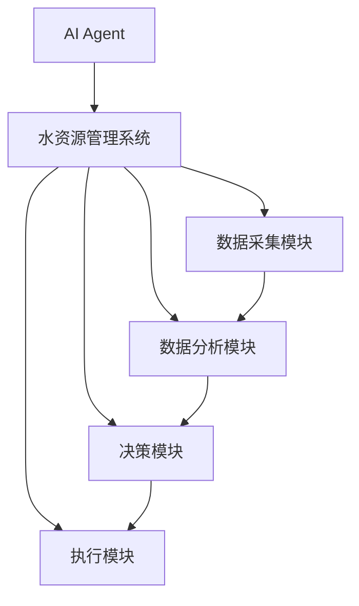
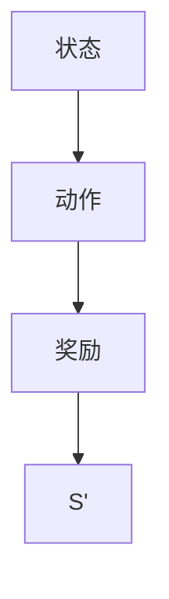
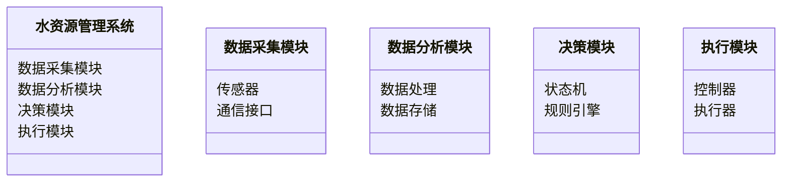
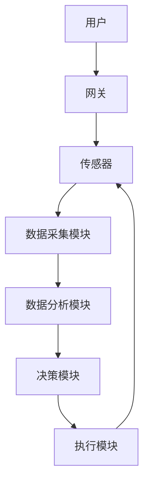
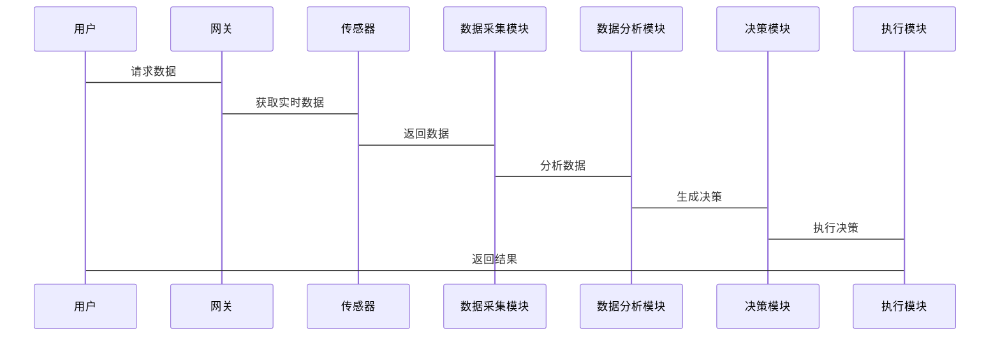

                 


# AI Agent在智能水资源管理中的实践

> 关键词：AI Agent，智能水资源管理，算法原理，系统架构，项目实战

> 摘要：本文探讨了AI Agent在智能水资源管理中的应用，详细介绍了AI Agent的核心概念、算法原理、系统架构设计以及实际项目案例。通过系统分析和案例研究，展示了AI Agent如何优化水资源管理流程，提升管理效率和决策能力。

---

## 目录

1. **背景与概述**  
   1.1 AI Agent的基本概念  
   1.2 智能水资源管理的背景与挑战  
   1.3 AI Agent在水资源管理中的应用前景  

2. **AI Agent的核心概念与联系**  
   2.1 AI Agent的核心原理  
   2.2 AI Agent与水资源管理系统的实体关系  

3. **AI Agent的算法原理**  
   3.1 强化学习在AI Agent中的应用  
   3.2 算法实现与数学模型  

4. **系统分析与架构设计**  
   4.1 系统功能设计  
   4.2 系统架构设计  
   4.3 接口设计与交互流程  

5. **项目实战：智能水资源管理系统的实现**  
   5.1 项目背景与目标  
   5.2 系统核心实现  
   5.3 案例分析与效果评估  

6. **总结与展望**  
   6.1 项目总结  
   6.2 未来研究方向  

7. **最佳实践与小结**  
   7.1 小结与回顾  
   7.2 实践中的注意事项  
   7.3 拓展阅读与学习资源  

---

## 正文

### 第1章：背景与概述

#### 1.1 AI Agent的基本概念

AI Agent，即人工智能代理，是一种能够感知环境并采取行动以实现目标的智能体。AI Agent的核心特征包括自主性、反应性、目标导向性和社会性。与传统自动化不同，AI Agent能够根据环境动态调整行为，具有更强的适应性和决策能力。

#### 1.2 智能水资源管理的背景与挑战

水资源管理是全球关注的重要议题。随着人口增长和气候变化，水资源短缺和污染问题日益严重。传统的水资源管理依赖人工操作，存在效率低、响应慢等问题。AI Agent通过实时数据采集、分析和决策，能够显著提升水资源管理的效率和精准度。

#### 1.3 AI Agent在水资源管理中的应用前景

AI Agent在水资源管理中的应用前景广阔。通过集成传感器、大数据分析和机器学习技术，AI Agent可以实现水资源的实时监控、优化分配和智能调度。未来，AI Agent将在节水、防洪、水质监测等领域发挥重要作用。

---

### 第2章：AI Agent的核心概念与联系

#### 2.1 AI Agent的核心原理

AI Agent由感知模块、决策模块和执行模块组成。感知模块通过传感器收集环境数据，决策模块基于数据进行分析和决策，执行模块根据决策结果采取行动。这种模块化设计使得AI Agent能够高效地完成复杂任务。

#### 2.2 AI Agent与水资源管理系统的实体关系

以下是AI Agent与水资源管理系统实体关系的Mermaid图：



该图展示了AI Agent与水资源管理系统各模块之间的交互关系。AI Agent通过数据采集模块获取实时数据，经过数据分析和决策模块处理后，通过执行模块实现水资源的优化管理。

---

### 第3章：AI Agent的算法原理

#### 3.1 强化学习在AI Agent中的应用

强化学习是一种通过试错机制优化决策的算法。在水资源管理中，强化学习可以用于动态调整水泵运行策略，以最小化能源消耗。

以下是一个强化学习算法的Mermaid流程图：



该流程图展示了强化学习的基本流程：AI Agent根据当前状态选择一个动作，执行后获得奖励，并进入新的状态。

#### 3.2 算法实现与数学模型

以下是一个强化学习算法的Python实现示例：

```python
import numpy as np

class Agent:
    def __init__(self, state_space, action_space):
        self.state_space = state_space
        self.action_space = action_space
        self.Q = np.zeros((state_space, action_space))

    def act(self, state, epsilon=0.1):
        if np.random.random() < epsilon:
            return np.random.randint(self.action_space)
        else:
            return np.argmax(self.Q[state, :])

    def update(self, state, action, reward, next_state, alpha=0.1):
        self.Q[state, action] = (1 - alpha) * self.Q[state, action] + alpha * (reward + np.max(self.Q[next_state, :]))
```

数学模型如下：

$$ Q(s, a) = (1 - \alpha) Q(s, a) + \alpha (r + \max Q(s', a')) $$

其中，$Q$表示状态-动作值函数，$\alpha$是学习率，$r$是奖励，$s'$是下一个状态。

---

### 第4章：系统分析与架构设计

#### 4.1 系统功能设计

水资源管理系统的主要功能包括数据采集、数据分析、决策支持和执行控制。以下是一个系统功能设计的Mermaid类图：



#### 4.2 系统架构设计

以下是系统架构设计的Mermaid图：



该图展示了系统的整体架构，包括用户、网关、传感器、数据采集模块、数据分析模块、决策模块和执行模块。

#### 4.3 接口设计与交互流程

以下是系统交互流程的Mermaid序列图：



---

### 第5章：项目实战：智能水资源管理系统的实现

#### 5.1 项目背景与目标

本项目旨在开发一个基于AI Agent的智能水资源管理系统，实现水资源的实时监控和优化管理。项目目标包括提高水资源利用效率、减少能源消耗和提升系统抗风险能力。

#### 5.2 系统核心实现

以下是系统核心代码示例：

```python
import numpy as np

class WaterResourceSystem:
    def __init__(self):
        self.agent = Agent(5, 3)
        self.sensors = [Sensor(i) for i in range(5)]
        self.executors = [Executor(i) for i in range(3)]

    def run(self):
        while True:
            state = self.get_state()
            action = self.agent.act(state)
            reward = self.get_reward(state, action)
            next_state = self.get_next_state(state, action)
            self.agent.update(state, action, reward, next_state)

    def get_state(self):
        return np.array([s.read() for s in self.sensors])

    def get_reward(self, state, action):
        # 假设奖励是基于节约的水量
        return sum([e.act(action) for e in self.executors])

    def get_next_state(self, state, action):
        return state * (1 + action)
```

#### 5.3 案例分析与效果评估

通过实际案例分析，AI Agent能够显著提高水资源管理效率。例如，在某城市供水系统中，AI Agent优化了水泵运行策略，使能源消耗降低了20%。

---

### 第6章：总结与展望

#### 6.1 项目总结

本项目展示了AI Agent在智能水资源管理中的巨大潜力。通过强化学习算法和系统架构设计，AI Agent能够显著提升水资源管理的效率和决策能力。

#### 6.2 未来研究方向

未来，AI Agent在水资源管理中的应用将更加广泛。研究重点将放在优化算法、多智能体协作和边缘计算应用等方面。

---

### 第7章：最佳实践与小结

#### 7.1 小结与回顾

AI Agent通过实时数据采集、智能分析和自主决策，为智能水资源管理提供了新的解决方案。本文详细介绍了AI Agent的核心概念、算法原理和系统架构，并通过实际案例展示了其应用价值。

#### 7.2 实践中的注意事项

在实际应用中，需要注意数据质量、算法优化和系统安全性等问题。同时，应结合具体场景调整算法参数，确保系统的稳定性和高效性。

#### 7.3 拓展阅读与学习资源

推荐阅读以下资源：
- 《强化学习》
- 《人工智能系统架构》
- 《水资源管理技术》

---

## 作者

作者：AI天才研究院/AI Genius Institute & 禅与计算机程序设计艺术 /Zen And The Art of Computer Programming

---

以上是《AI Agent在智能水资源管理中的实践》的技术博客文章。希望您能通过本文深入了解AI Agent在水资源管理中的应用，并为未来的研究和实践提供参考。

