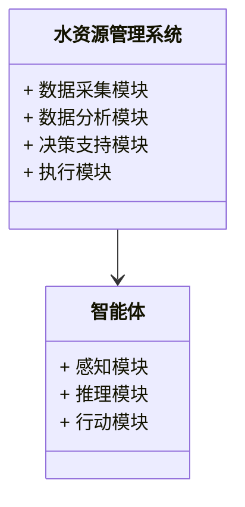
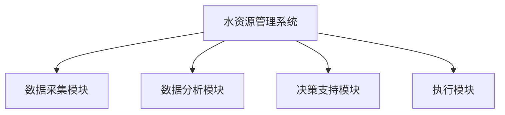

                 

<think>
好的，我将按照您的要求撰写一篇关于《AI Agent在智能水资源管理决策中的角色》的技术博客文章。让我们一步一步地进行分析和撰写。

### 文章标题
# AI Agent在智能水资源管理决策中的角色

### 文章关键词
AI Agent, 智能水资源管理, 决策支持系统, 多智能体协作, 强化学习, 水资源优化配置

### 摘要
AI Agent作为人工智能技术的重要组成部分，在智能水资源管理中发挥着越来越重要的作用。本文系统地介绍了AI Agent的核心概念、算法原理以及在水资源管理中的具体应用场景。通过分析AI Agent在水资源优化配置、调度决策和多智能体协作中的应用，探讨了AI Agent如何提升水资源管理的效率和智能化水平。同时，本文还结合实际案例，详细讲解了基于强化学习和多智能体协作的水资源管理系统的架构设计和实现方法，为相关领域的研究和实践提供了参考。

---

### 正文

#### 第一部分: AI Agent与水资源管理的背景介绍

#### 第1章: AI Agent与水资源管理的概述

##### 1.1 AI Agent的基本概念

###### 1.1.1 AI Agent的定义与特点
AI Agent（人工智能代理）是指能够感知环境、自主决策并执行任务的智能实体。它具备以下几个特点：
- **自主性**：能够在没有外部干预的情况下自主运行。
- **反应性**：能够实时感知环境并做出响应。
- **目标导向**：基于明确的目标进行决策和行动。
- **学习能力**：能够通过经验改进自身的行为。

###### 1.1.2 AI Agent的核心要素与功能
AI Agent的核心要素包括感知模块、推理模块和行动模块：
- **感知模块**：负责收集环境中的数据和信息。
- **推理模块**：对收集到的信息进行分析和推理，生成决策。
- **行动模块**：根据决策执行具体的操作。

###### 1.1.3 AI Agent与传统决策系统的区别
传统决策系统通常依赖于预设的规则和逻辑，而AI Agent能够通过学习和适应环境，实现动态优化和自适应决策。AI Agent的优势在于其灵活性和智能化，能够应对复杂的动态环境。

##### 1.2 水资源管理的复杂性与挑战

###### 1.2.1 水资源管理的基本概念
水资源管理是指对水的分配、使用和保护进行规划和协调的过程。它涉及多个领域，包括供水、灌溉、工业用水和环境保护等。

###### 1.2.2 水资源管理的主要问题与挑战
- **资源分配不均**：水资源分布不均，导致部分地区水资源短缺。
- **污染与浪费**：水污染和水资源浪费问题严重。
- **气候变化的影响**：气候变化导致水资源分布和水量变化，增加了管理的难度。
- **多利益相关者**：水资源管理涉及政府、企业、农民等多个利益相关者，协调复杂。

###### 1.2.3 AI技术在水资源管理中的潜在价值
AI技术可以通过数据驱动的方法，帮助水资源管理者更好地预测需求、优化配置、降低浪费，并应对气候变化带来的挑战。

##### 1.3 AI Agent在水资源管理中的角色定位

###### 1.3.1 AI Agent在水资源管理中的功能定位
AI Agent可以在水资源管理中扮演以下几个角色：
- **数据采集与分析**：实时收集和分析水质、水量等数据。
- **决策支持**：基于数据分析和预测，提供优化配置建议。
- **动态调整**：根据环境变化动态调整水资源的使用和分配。

###### 1.3.2 AI Agent与其他技术的协同作用
AI Agent可以与物联网（IoT）、大数据分析和云计算等技术协同工作，形成一个完整的智能水资源管理系统。

###### 1.3.3 AI Agent在水资源管理中的应用前景
随着AI技术的不断发展，AI Agent在水资源管理中的应用前景广阔，尤其是在复杂环境下的动态决策和多智能体协作方面。

#### 1.4 本章小结
本章介绍了AI Agent的基本概念、核心要素以及在水资源管理中的角色定位。AI Agent通过自主感知、推理和行动，为水资源管理提供了智能化的解决方案。

---

#### 第二部分: AI Agent的核心概念与原理

#### 第2章: AI Agent的核心原理

##### 2.1 任务规划与决策算法

###### 2.1.1 任务规划的基本原理
任务规划是指根据目标和环境条件，制定行动步骤的过程。AI Agent的任务规划通常基于状态空间搜索和启发式算法。

###### 2.1.2 基于强化学习的决策算法
强化学习是一种通过试错机制优化决策策略的方法。在水资源管理中，强化学习可以用于优化水资源的调度和配置。

###### 2.1.3 多目标优化的决策模型
多目标优化是指在多个目标之间寻找平衡点，例如在水资源管理中，既要满足供水需求，又要保护环境。

##### 2.2 知识表示与推理机制

###### 2.2.1 知识图谱的构建与表示
知识图谱是一种结构化的知识表示方法，可以用于表示水资源管理中的各种实体和关系。

###### 2.2.2 基于逻辑推理的决策过程
逻辑推理是通过一系列逻辑规则，从已知事实中推导出新的结论。

###### 2.2.3 模糊推理与不确定决策
模糊推理适用于处理不确定性较高的决策问题，例如水质评估和需求预测。

##### 2.3 多智能体协作机制

###### 2.3.1 多智能体系统的定义与特点
多智能体系统是由多个智能体组成的协作系统，每个智能体负责特定的任务。

###### 2.3.2 基于通信协议的协作机制
智能体之间通过通信协议交换信息，实现协作。

###### 2.3.3 去中心化决策与协调
去中心化决策是指每个智能体根据自己的信息进行决策，而不需要中央控制。

##### 2.4 本章小结
本章介绍了AI Agent的核心原理，包括任务规划、知识表示和多智能体协作等方面的内容。

---

#### 第三部分: AI Agent在水资源管理中的应用

#### 第3章: AI Agent在水资源优化配置中的应用

##### 3.1 水资源优化配置的基本问题

###### 3.1.1 水资源分配的数学模型
水资源优化配置可以通过数学模型来模拟和优化资源配置。

###### 3.1.2 多目标优化的配置策略
多目标优化是一种在多个目标之间寻求平衡的优化方法。

###### 3.1.3 基于AI Agent的动态配置方法
动态配置方法能够根据环境变化实时调整资源配置。

##### 3.2 基于强化学习的水资源调度

###### 3.2.1 强化学习在水资源调度中的应用
强化学习可以用于优化水资源的调度策略。

###### 3.2.2 Q-learning算法在水资源调度中的实现
Q-learning是一种经典的强化学习算法，可以通过状态和动作的组合来优化决策。

###### 3.2.3 调度策略的优化与评估
通过强化学习优化的调度策略能够提高水资源利用效率。

##### 3.3 多智能体协作的水资源管理

###### 3.3.1 多智能体协作的水资源管理场景
多智能体协作可以应用于水库调度、灌溉管理等多个场景。

###### 3.3.2 基于通信协议的协作机制
智能体之间通过通信协议实现信息共享和协作。

###### 3.3.3 去中心化决策的实现与挑战
去中心化决策能够提高系统的鲁棒性和适应性，但也面临通信延迟和协调复杂性等挑战。

##### 3.4 本章小结
本章介绍了AI Agent在水资源优化配置和调度中的应用，强调了强化学习和多智能体协作的重要性。

---

#### 第四部分: 水资源管理中的系统架构与设计

#### 第4章: 水资源管理系统的架构设计

##### 4.1 系统功能需求分析

###### 4.1.1 水资源监测与数据采集
通过传感器和物联网技术实时采集水质、水量等数据。

###### 4.1.2 数据处理与分析
对采集到的数据进行清洗、转换和分析，提取有用信息。

###### 4.1.3 决策支持与优化配置
基于数据分析结果，提供决策支持和优化配置建议。

##### 4.2 系统架构设计

###### 4.2.1 基于AI Agent的分层架构
系统的架构通常包括感知层、决策层和执行层。

###### 4.2.2 数据流与信息交互的流程
数据从感知层采集，经过处理后传送到决策层，决策结果再传送到执行层执行。

##### 4.3 系统架构设计的实现

###### 4.3.1 领域模型类图（Mermaid）

###### 4.3.2 系统架构图（Mermaid）

##### 4.4 本章小结
本章介绍了水资源管理系统的架构设计，包括功能需求分析和系统架构设计。

---

### 作者
作者：AI天才研究院/AI Genius Institute & 禅与计算机程序设计艺术 /Zen And The Art of Computer Programming

---

以上是文章的完整目录和内容概要。根据您的要求，我会逐步展开每一部分的内容，提供详细的解释和具体的实现方法。希望这篇文章能够为您提供有价值的信息和启示。

