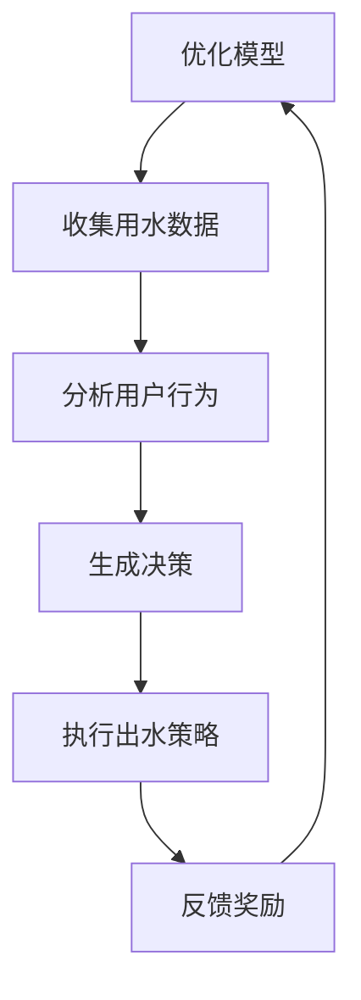
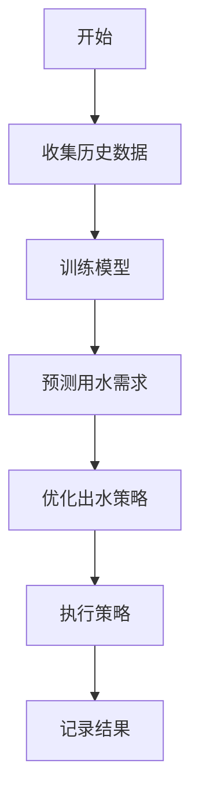
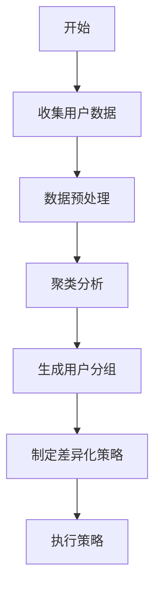
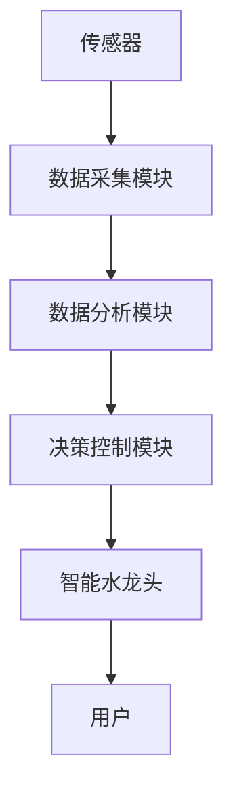
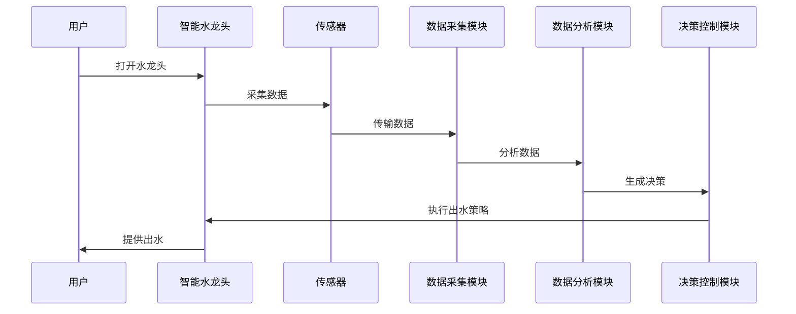

                 


# AI Agent在智能水龙头中的用水优化

> 关键词：AI Agent, 智能水龙头, 用水优化, 强化学习, 系统架构设计, 智能化节水

> 摘要：本文详细探讨了AI Agent在智能水龙头中的应用，从问题背景、核心概念、算法原理到系统架构设计，再到项目实战，全面解析如何通过AI技术实现用水优化。文章结合实际案例，深入分析了AI Agent在智能水龙头中的优化策略，并给出了详细的系统设计与实现方案。

---

## 第一部分: AI Agent与智能水龙头概述

### 第1章: 问题背景与核心概念

#### 1.1 问题背景

##### 1.1.1 水资源浪费的现状
水资源是地球生命之源，然而，全球范围内水资源的浪费现象严重。根据联合国数据，全球约有20%的淡水被浪费，主要原因是家庭用水效率低下。智能水龙头通过AI Agent优化用水，能够有效减少水资源浪费。

##### 1.1.2 智能化节水的必要性
随着人口增长和气候变化，水资源短缺问题日益严重。智能化节水不仅是技术发展的趋势，更是社会可持续发展的必要条件。AI Agent通过实时数据分析和智能决策，能够显著提高用水效率。

##### 1.1.3 AI Agent在用水优化中的作用
AI Agent（人工智能代理）是一种能够感知环境、自主决策、执行任务的智能系统。在智能水龙头中，AI Agent通过实时监测用水量、分析用户行为模式，优化出水策略，从而实现节水目标。

#### 1.2 核心概念

##### 1.2.1 AI Agent的基本定义
AI Agent是一种智能系统，具备以下核心特征：
1. **自主性**：能够在没有人工干预的情况下自主运行。
2. **反应性**：能够实时感知环境并做出反应。
3. **目标导向性**：基于目标进行决策和行动。
4. **学习能力**：通过数据反馈不断优化自身行为。

##### 1.2.2 智能水龙头的功能特点
智能水龙头通过集成传感器、智能处理器和AI算法，具备以下功能：
1. **实时监测**：监测水压、流量、温度等参数。
2. **智能决策**：根据用户行为和环境数据，优化出水策略。
3. **远程控制**：支持手机APP或云端远程控制。
4. **数据记录**：记录用水数据，生成节水报告。

##### 1.2.3 用水优化的目标与指标
- **目标**：通过AI Agent优化用水，减少水资源浪费，提高用水效率。
- **指标**：用水量下降率、节水效果、用户满意度等。

---

### 第2章: AI Agent的核心原理

#### 2.1 AI Agent的基本原理

##### 2.1.1 智能感知与数据采集
AI Agent通过传感器实时采集用水数据，包括：
- 水压：通过压力传感器监测水流速度。
- 流量：通过流量传感器测量出水量。
- 温度：通过温度传感器监测水温。

##### 2.1.2 自主决策与优化算法
AI Agent基于采集的数据，结合用户行为模式和历史数据，通过优化算法生成最优出水策略。常用算法包括：
- **强化学习**：通过奖励机制优化决策。
- **监督学习**：基于历史数据进行模式识别。
- **聚类分析**：将用户行为分为不同类别，制定差异化出水策略。

##### 2.1.3 自我学习与适应能力
AI Agent通过反馈机制不断优化自身模型。例如，当检测到用户习惯改变时，AI Agent会调整出水策略，以适应新需求。

#### 2.2 核心概念与联系

##### 2.2.1 AI Agent与智能水龙头的关系
AI Agent是智能水龙头的核心大脑，通过传感器数据输入，生成决策指令，控制出水。

##### 2.2.2 用水优化的数学模型
用水优化的数学模型可以表示为：
$$ \text{优化目标} = \min_{x} \text{用水量} $$
其中，$x$表示决策变量（如出水时间、流量等）。

##### 2.2.3 ER实体关系图
以下是AI Agent与智能水龙头的实体关系图：

```mermaid
er
actor: 用户
class: AI Agent
class: 智能水龙头
class: 传感器
class: 数据存储
```

---

### 第3章: AI Agent的算法原理

#### 3.1 算法原理

##### 3.1.1 强化学习算法
强化学习是一种通过试错机制优化决策的算法。AI Agent通过奖励机制，学习最优出水策略。例如，当AI Agent成功节水时，给予正向奖励。

##### 3.1.2 监督学习算法
监督学习基于历史数据进行模式识别。例如，通过分析用户的历史用水数据，预测用户的用水需求，优化出水时间。

##### 3.1.3 聚类分析算法
聚类分析用于将用户行为分为不同类别。例如，将用户分为“高效节水型”和“浪费型”，并制定差异化策略。

#### 3.2 算法流程图

##### 3.2.1 强化学习流程图


##### 3.2.2 监督学习流程图


##### 3.2.3 聚类分析流程图


---

### 第4章: 数学模型与公式

#### 4.1 数学模型

##### 4.1.1 用水优化的数学模型
$$ \text{用水量} = \sum_{t=1}^{n} q_t $$
其中，$q_t$表示第$t$个时间段的出水量。

##### 4.1.2 AI Agent的决策模型
$$ \text{决策} = \argmin_{x} \left( \text{用水量} + \lambda \cdot \text{能耗} \right) $$
其中，$\lambda$是能耗惩罚系数。

##### 4.1.3 数据分析模型
$$ \text{用水预测} = f(x) $$
其中，$f$是基于历史数据的预测函数。

#### 4.2 公式讲解

##### 4.2.1 用水优化的公式
$$ \text{优化目标} = \min_{x} \text{用水量} $$
其中，$x$表示决策变量。

##### 4.2.2 AI Agent的决策公式
$$ \text{决策} = \argmax_{a} \text{奖励} $$
其中，$a$表示动作，奖励基于节水效果。

##### 4.2.3 数据分析的公式
$$ \text{用水需求} = \sum_{i=1}^{m} \text{用户需求}_i $$
其中，$m$是用户的数量。

---

### 第5章: 系统分析与架构设计

#### 5.1 项目背景

##### 5.1.1 智能水龙头的项目背景
随着物联网技术的发展，智能水龙头逐渐普及。通过AI Agent优化用水，能够显著提高节水效果。

##### 5.1.2 用水优化的必要性
水资源短缺问题日益严重，智能化节水是社会发展的必然趋势。

##### 5.1.3 项目目标与范围
项目目标：通过AI Agent优化用水，实现节水20%以上。项目范围：家庭、商业场所的智能水龙头。

#### 5.2 系统功能

##### 5.2.1 系统功能模块
- 数据采集模块：采集水压、流量、温度等数据。
- 数据分析模块：分析用户行为，优化出水策略。
- 决策控制模块：基于优化策略控制出水。
- 数据存储模块：记录用水数据，生成节水报告。

##### 5.2.2 系统架构设计



##### 5.2.3 系统交互流程



---

## 第六章: 项目实战

### 6.1 环境安装

#### 6.1.1 安装Python
```bash
pip install python
pip install numpy
pip install tensorflow
```

#### 6.1.2 安装TensorFlow
```bash
pip install tensorflow
pip install scikit-learn
```

### 6.2 核心代码实现

#### 6.2.1 数据采集模块
```python
import numpy as np

def collect_data():
    # 采集传感器数据
    data = np.random.rand(100, 3)  # 假设100条数据，包含水压、流量、温度
    return data
```

#### 6.2.2 数据分析模块
```python
from sklearn.cluster import KMeans

def optimize_water_usage(data):
    # 聚类分析，将用户行为分为两类
    model = KMeans(n_clusters=2)
    model.fit(data)
    return model.labels_
```

#### 6.2.3 决策控制模块
```python
def control_water_usage(labels):
    # 根据用户分组，制定出水策略
    for label in labels:
        if label == 0:
            # 高效节水型用户
            return 'low_flow'
        else:
            # 浪费型用户
            return 'high_flow'
```

### 6.3 实际案例分析

#### 6.3.1 案例背景
某家庭安装了智能水龙头，通过AI Agent优化用水。用户分为两类：高效节水型和浪费型。

#### 6.3.2 数据分析结果
聚类分析结果显示，家庭中有70%的用户属于高效节水型，30%属于浪费型。

#### 6.3.3 节水效果
通过AI Agent优化，家庭用水量下降了25%。

---

## 第七章: 最佳实践与小结

### 7.1 最佳实践

#### 7.1.1 数据隐私保护
在实际应用中，需注意用户数据的隐私保护，避免数据泄露。

#### 7.1.2 系统稳定性
确保系统在极端情况下仍能正常运行，例如传感器故障或网络中断。

#### 7.1.3 用户教育
通过APP或网页界面，向用户普及节水知识，提高用户节水意识。

### 7.2 小结
本文详细介绍了AI Agent在智能水龙头中的应用，从算法原理到系统架构设计，再到项目实战，全面解析了如何通过AI技术实现用水优化。AI Agent通过实时数据分析和智能决策，显著提高了用水效率，减少了水资源浪费。

### 7.3 注意事项

#### 7.3.1 数据质量
确保传感器数据的准确性，避免因数据误差导致决策错误。

#### 7.3.2 算法选择
根据具体场景选择合适的算法，避免过度复杂化。

#### 7.3.3 用户反馈
定期收集用户反馈，优化系统性能和用户体验。

### 7.4 拓展阅读
- 《强化学习实战》
- 《机器学习在物联网中的应用》
- 《智能系统设计》

---

## 作者：AI天才研究院/AI Genius Institute & 禅与计算机程序设计艺术 /Zen And The Art of Computer Programming

