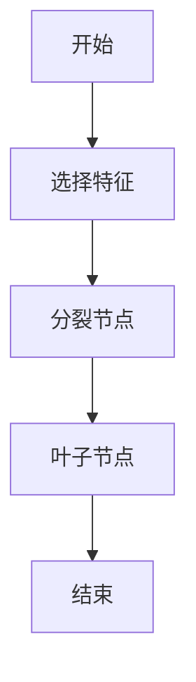
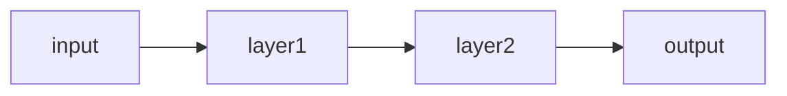
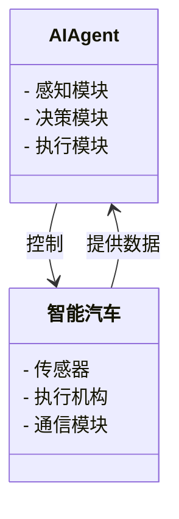
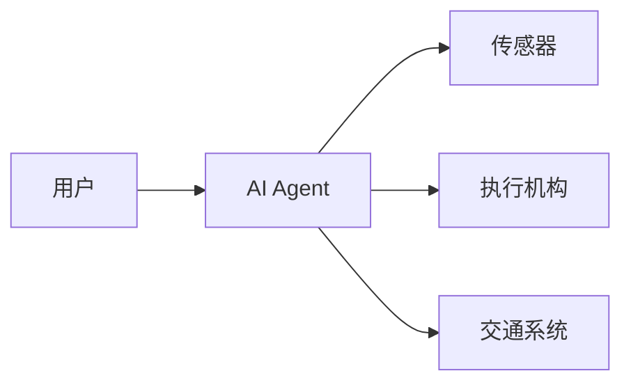

                 


# AI Agent在智能汽车中的应用：自动驾驶与车载助手

> 关键词：AI Agent, 智能汽车, 自动驾驶, 车载助手, 算法原理, 系统架构

> 摘要：本文详细探讨了AI Agent在智能汽车中的应用，特别是自动驾驶和车载助手领域。通过分析AI Agent的核心概念、算法原理、系统架构以及实际项目案例，展示了AI Agent如何赋能智能汽车的发展。

---

## 第一部分: AI Agent在智能汽车中的应用概述

### 第1章: AI Agent与智能汽车的背景介绍

#### 1.1 AI Agent的核心概念

##### 1.1.1 什么是AI Agent
AI Agent（人工智能代理）是一种能够感知环境、自主决策并执行任务的智能实体。它可以理解用户需求、预测行为，并通过学习和适应不断优化自身性能。AI Agent在智能汽车中的应用主要体现在自动驾驶和车载助手两大领域。

##### 1.1.2 AI Agent的基本属性与特征
- **自主性**：AI Agent能够自主决策，无需外部干预。
- **反应性**：能够实时感知环境变化并做出反应。
- **学习能力**：通过机器学习算法不断优化自身性能。
- **交互能力**：能够与用户和其他系统进行有效通信。

##### 1.1.3 AI Agent与传统AI的区别
| **特性** | **AI Agent** | **传统AI** |
|----------|--------------|------------|
| **自主性** | 高           | 中         |
| **实时性** | 高           | 低         |
| **目标导向** | 强           | 弱         |

#### 1.2 智能汽车的定义与发展

##### 1.2.1 智能汽车的定义
智能汽车是指通过先进的传感器、计算平台、执行机构和通信设备，实现车与车、车与人、车与环境之间智能交互的汽车。它能够自动完成部分或全部驾驶任务。

##### 1.2.2 智能汽车的发展历程
1. **第一阶段**：20世纪80年代，初步探索智能驾驶技术。
2. **第二阶段**：21世纪初，AI技术开始应用于汽车。
3. **第三阶段**：当前，AI Agent技术推动智能汽车快速发展。

##### 1.2.3 智能汽车的关键技术
- **传感器技术**：激光雷达、摄像头、雷达等。
- **计算平台**：高性能GPU和AI芯片。
- **通信技术**：V2X（车联万物）技术。

#### 1.3 AI Agent在智能汽车中的应用背景

##### 1.3.1 自动驾驶的兴起
自动驾驶的核心是AI Agent，它负责处理复杂的交通环境和驾驶任务。

##### 1.3.2 车载助手的需求
车载助手通过AI Agent实现智能交互，为用户提供导航、娱乐、信息服务等功能。

##### 1.3.3 智能交通系统的趋势
AI Agent技术推动智能交通系统的发展，实现交通优化和资源共享。

---

### 第2章: AI Agent的核心概念与原理

#### 2.1 AI Agent的感知与决策机制

##### 2.1.1 感知模块的实现
AI Agent通过传感器获取环境数据，如车辆速度、行人位置、交通信号等。

##### 2.1.2 决策模块的原理
基于感知数据，AI Agent利用算法做出驾驶决策，如变道、加速、减速等。

##### 2.1.3 执行模块的作用
将决策结果转化为具体动作，如转向、加速、刹车等。

#### 2.2 AI Agent与智能汽车的实体关系

##### 2.2.1 实体关系图（ER图）
```mermaid
erDiagram
    actor 用户
    actor 环境
    actor 交通系统
    class AI Agent
    class 智能汽车
    class 传感器
    class 执行机构
    用户 --> AI Agent : 发出指令
    环境 --> AI Agent : 提供数据
    交通系统 --> AI Agent : 交互信息
    AI Agent --> 传感器 : 获取数据
    AI Agent --> 执行机构 : 发出指令
```

---

### 第3章: AI Agent的算法原理与数学模型

#### 3.1 基于决策树的AI Agent算法

##### 3.1.1 决策树算法的流程图


##### 3.1.2 信息增益的数学公式
$$ \text{信息增益} = \frac{H(parent) - H(child)}{H(parent)} $$

#### 3.2 基于神经网络的AI Agent算法

##### 3.2.1 神经网络的结构图


##### 3.2.2 深度学习的数学模型
$$ \text{损失函数} = \sum_{i=1}^{n} (y_i - \hat{y_i})^2 $$

---

### 第4章: AI Agent的系统分析与架构设计

#### 4.1 系统功能设计

##### 4.1.1 领域模型类图


#### 4.2 系统架构设计

##### 4.2.1 系统架构图


---

### 第5章: AI Agent在智能汽车中的项目实战

#### 5.1 项目环境安装与配置

##### 5.1.1 安装依赖
```bash
pip install numpy matplotlib scikit-learn
```

##### 5.1.2 环境配置
```bash
conda create -n car_ai python=3.8
conda activate car_ai
```

#### 5.2 系统核心实现源代码

##### 5.2.1 感知模块实现
```python
import numpy as np

def perceive(environment):
    # 简单的环境感知算法
    obstacles = np.where(environment > 0)
    return obstacles
```

##### 5.2.2 决策模块实现
```python
def decide(obstacles):
    if len(obstacles) > 0:
        return 'avoid'
    else:
        return 'proceed'
```

##### 5.2.3 执行模块实现
```python
def execute(action):
    if action == 'avoid':
        return 'turn right'
    else:
        return 'go straight'
```

#### 5.3 案例分析与实现解读

##### 5.3.1 案例分析
以自动驾驶中的路径规划为例，AI Agent需要根据实时交通状况调整路径。

##### 5.3.2 代码实现
```python
import numpy as np
from sklearn.tree import DecisionTreeClassifier

def main():
    environment = np.array([[1, 0, 0], [0, 1, 0], [0, 0, 1]])
    agent = DecisionTreeClassifier()
    agent.fit(environment.reshape(-1, 3), [1, 0, 1])
    decision = agent.predict([[0, 0, 1]])
    print(decision)

if __name__ == "__main__":
    main()
```

---

### 第6章: 总结与展望

#### 6.1 小结
AI Agent技术在智能汽车中的应用前景广阔，特别是在自动驾驶和车载助手领域。

#### 6.2 注意事项
- 数据安全问题需要重视。
- 算法的实时性和准确性需进一步优化。

#### 6.3 拓展阅读
- 《自动驾驶技术详解》
- 《AI Agent算法原理与实现》

---

## 作者信息

作者：AI天才研究院/AI Genius Institute & 禅与计算机程序设计艺术 /Zen And The Art of Computer Programming

---

版权声明：本文为原创文章，版权归作者所有，未经授权不得转载。

