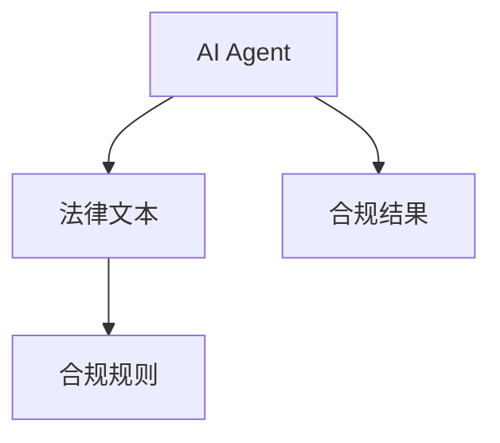
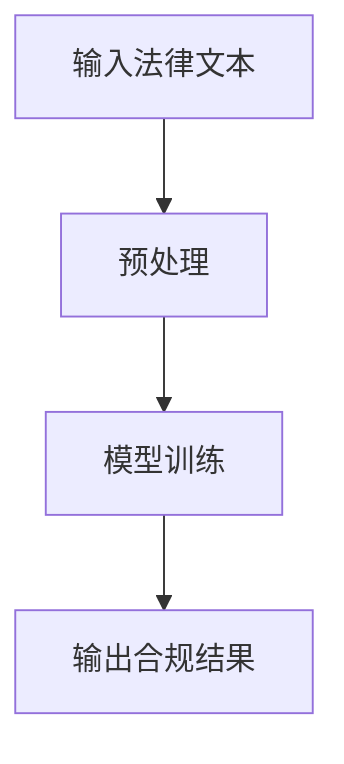
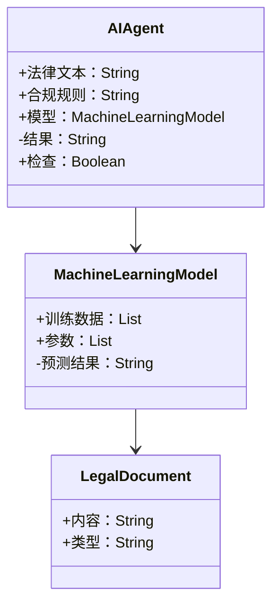
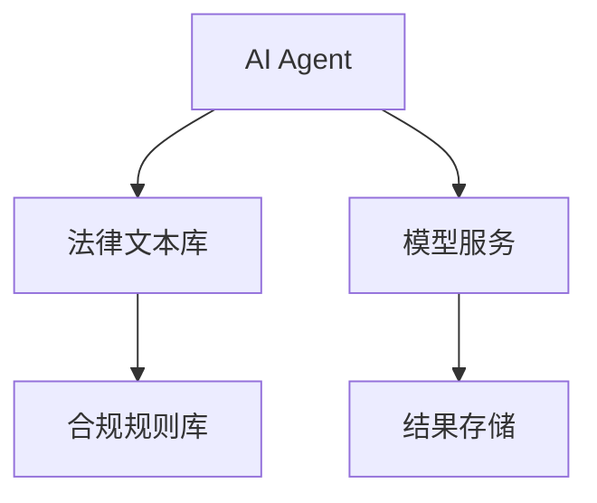

                 


```markdown
# AI Agent在智能法律合规检查中的角色

> 关键词：AI Agent、法律合规、智能检查、机器学习、自然语言处理

> 摘要：本文深入探讨AI Agent在智能法律合规检查中的角色与应用。从AI Agent的基本概念到其在法律合规检查中的具体应用场景，结合算法原理、系统设计和实际案例，全面分析AI Agent如何提升法律合规检查的效率与准确性。

---

## 第1章: AI Agent的基本概念与法律合规检查的背景

### 1.1 AI Agent的定义与核心特征

#### 1.1.1 AI Agent的基本定义
AI Agent（人工智能代理）是一种能够感知环境、执行任务并做出决策的智能实体。它通过接收输入信息、分析数据、执行操作和输出结果来完成特定任务。AI Agent的核心在于其智能化决策能力，能够根据输入信息动态调整行为。

#### 1.1.2 AI Agent的核心特征
1. **自主性**：AI Agent能够自主决策，无需外部干预。
2. **反应性**：能够实时感知环境变化并做出反应。
3. **学习能力**：通过数据和经验不断优化自身性能。
4. **协作性**：能够与其他系统或人类协同工作。

#### 1.1.3 AI Agent与传统自动化工具的区别
- **智能化**：AI Agent具备学习和推理能力，而传统自动化工具仅能执行预定义任务。
- **适应性**：AI Agent能够动态调整行为，适应环境变化，而传统工具无法做到。
- **决策能力**：AI Agent能够做出复杂决策，而传统工具仅能执行简单操作。

### 1.2 法律合规检查的背景与挑战

#### 1.2.1 法律合规检查的基本概念
法律合规检查是指对法律文本、合同、规章制度等进行审查，确保其符合相关法律法规和行业标准的过程。随着法律法规的日益复杂化，合规检查的难度和成本也在不断增加。

#### 1.2.2 当前法律合规检查的主要挑战
1. **法律文本的复杂性**：法律文本通常包含大量专业术语和复杂的逻辑关系。
2. **合规规则的多样性**：不同行业和地区的合规规则差异较大。
3. **人工检查的低效性**：传统合规检查主要依赖人工，效率低且容易出错。
4. **合规风险的动态性**：法律法规和市场环境不断变化，合规风险也随之变化。

#### 1.2.3 AI技术在法律合规中的潜在价值
AI技术的引入可以显著提高合规检查的效率和准确性。通过自然语言处理（NLP）、机器学习等技术，AI Agent能够快速分析法律文本、识别合规风险并提出改进建议。

---

## 第2章: AI Agent在法律合规检查中的角色与应用

### 2.1 AI Agent在法律合规中的角色定位

#### 2.1.1 辅助角色
AI Agent作为辅助工具，帮助法律专业人士快速分析法律文本、识别潜在风险点。例如，在合同审查中，AI Agent可以标记出可能存在合规风险的条款。

#### 2.1.2 主导角色
在某些情况下，AI Agent可以独立完成合规检查任务。例如，通过预训练的模型，AI Agent可以自动分析合同文本并生成合规报告。

#### 2.1.3 监督与反馈角色
AI Agent还可以作为监督工具，实时监控企业的合规行为，并提供反馈和建议。例如，在企业运营中，AI Agent可以监控交易记录，发现潜在的合规问题并及时提醒相关部门。

### 2.2 AI Agent在法律合规中的具体应用

#### 2.2.1 合同审查与合规性分析
AI Agent可以通过自然语言处理技术，快速分析合同文本，识别出可能违反合规规则的条款。例如，AI Agent可以检测合同中是否存在不公平条款或违反反垄断法的内容。

#### 2.2.2 法律文本的自动分类
通过机器学习技术，AI Agent可以对法律文本进行分类，例如将合同分为“商业合同”、“劳动合同”等类别。这种分类有助于快速定位相关法律文本并进行进一步分析。

#### 2.2.3 合规风险的预测与预警
AI Agent可以通过分析历史数据和当前环境，预测潜在的合规风险并发出预警。例如，AI Agent可以预测某项交易可能违反反洗钱法规，并建议采取相应措施。

---

## 第3章: AI Agent与法律合规检查的核心概念联系

### 3.1 AI Agent的核心概念原理

#### 3.1.1 机器学习模型
AI Agent的核心技术之一是机器学习模型。通过训练数据，模型可以学习到法律文本中的模式和规律。例如，使用支持向量机（SVM）或深度学习模型（如LSTM）进行文本分类。

#### 3.1.2 自然语言处理技术
自然语言处理（NLP）技术是AI Agent分析法律文本的关键。通过分词、句法分析和语义理解，AI Agent能够理解法律文本的含义并进行合规性判断。

#### 3.1.3 知识图谱构建
知识图谱是将法律领域的知识结构化表示的技术。AI Agent可以通过构建法律知识图谱，快速查找相关法规和案例，提高合规检查的准确性。

### 3.2 法律合规检查的核心概念与属性

#### 3.2.1 合规规则的表达
合规规则通常以法律法规、行业标准等形式存在。AI Agent需要将这些规则转化为可计算的数学表达式，以便进行自动化检查。

#### 3.2.2 法律文本的特征
法律文本具有高度的专业性和复杂性。AI Agent需要处理文本中的实体识别、关系抽取和语义分析等任务。

#### 3.2.3 合规检查的流程
合规检查的流程通常包括文本预处理、规则匹配、结果分析和报告生成等步骤。AI Agent可以通过自动化这些步骤，显著提高检查效率。

### 3.3 AI Agent与法律合规检查的实体关系图



---

## 第4章: AI Agent的算法原理与流程

### 4.1 AI Agent的基本算法

#### 4.1.1 基于规则的AI Agent
基于规则的AI Agent通过预定义的规则进行决策。例如，AI Agent可以基于特定的关键词或句式匹配来判断合同是否合规。

#### 4.1.2 基于机器学习的AI Agent
基于机器学习的AI Agent通过训练数据学习到法律文本的模式。例如，使用深度学习模型（如BERT）进行文本分类和实体识别。

#### 4.1.3 基于强化学习的AI Agent
基于强化学习的AI Agent通过与环境的交互来优化决策。例如，AI Agent可以在模拟环境中进行合同审查，通过奖励机制学习最优的决策策略。

### 4.2 法律文本分析的算法流程



---

## 第5章: 数学模型与公式解析

### 5.1 机器学习模型的基础公式

#### 5.1.1 损失函数
$$L = \frac{1}{n}\sum_{i=1}^{n}(y_i - \hat{y}_i)^2$$

#### 5.1.2 梯度下降
$$\theta = \theta - \eta \frac{\partial L}{\partial \theta}$$

### 5.2 自然语言处理中的概率模型

#### 5.2.1 条件概率公式
$$P(y|x) = \frac{P(x|y)P(y)}{P(x)}$$

#### 5.2.2 文本相似度计算
$$\text{余弦相似度} = \frac{\vec{a} \cdot \vec{b}}{|\vec{a}| \cdot |\vec{b}|}$$

---

## 第6章: 系统分析与架构设计方案

### 6.1 问题场景介绍

#### 6.1.1 问题背景
企业需要快速、准确地完成法律合规检查，以应对日益复杂的法规环境。

#### 6.1.2 项目目标
开发一个基于AI Agent的法律合规检查系统，提高检查效率和准确性。

### 6.2 系统功能设计

#### 6.2.1 功能模块
1. **文本预处理模块**：对法律文本进行分词、句法分析和语义理解。
2. **模型训练模块**：训练机器学习模型，用于分类和实体识别。
3. **合规检查模块**：根据模型结果生成合规报告。

#### 6.2.2 领域模型类图



### 6.3 系统架构设计



### 6.4 系统接口设计

#### 6.4.1 输入接口
- **法律文本输入接口**：接收待检查的法律文本。
- **合规规则输入接口**：接收相关的合规规则和标准。

#### 6.4.2 输出接口
- **合规结果输出接口**：输出检查结果和建议。
- **报告生成接口**：生成详细的合规报告。

### 6.5 系统交互流程

```mermaid
sequenceDiagram
    participant 用户
    participant AI Agent
    participant 模型服务
    participant 结果存储
    用户->AI Agent: 提交法律文本
    AI Agent->模型服务: 请求模型分析
    模型服务->AI Agent: 返回分析结果
    AI Agent->结果存储: 存储检查结果
    用户<-AI Agent: 获取合规报告
```

---

## 第7章: 项目实战

### 7.1 环境安装

#### 7.1.1 安装Python
```bash
python --version
pip install --upgrade pip
```

#### 7.1.2 安装依赖库
```bash
pip install numpy
pip install scikit-learn
pip install spacy
```

### 7.2 系统核心实现源代码

#### 7.2.1 文本预处理代码
```python
import spacy

nlp = spacy.load("en_core_web_sm")
doc = nlp("This is a sample legal text.")

for token in doc:
    print(token.text, token.pos_)
```

#### 7.2.2 模型训练代码
```python
from sklearn.feature_extraction.text import TfidfVectorizer
from sklearn.svm import SVC
from sklearn.pipeline import Pipeline

pipeline = Pipeline([
    ('tfidf', TfidfVectorizer()),
    ('clf', SVC())
])

pipeline.fit(X_train, y_train)
```

#### 7.2.3 合规检查代码
```python
def check_compliance(document):
    prediction = pipeline.predict([document])
    return prediction[0]

document = "The contract contains unfair terms."
result = check_compliance(document)
print(result)
```

### 7.3 案例分析

#### 7.3.1 案例背景
某企业需要审查一份商业合同，确保其符合相关法律法规。

#### 7.3.2 实施步骤
1. **文本预处理**：对合同文本进行分词和语义分析。
2. **模型训练**：使用历史合同数据训练分类模型。
3. **合规检查**：使用训练好的模型检查合同的合规性。
4. **结果分析**：生成合规报告并提出改进建议。

#### 7.3.3 实施结果
AI Agent成功识别出合同中的潜在合规风险，并提供了具体的修改建议。

---

## 第8章: 总结与展望

### 8.1 总结
AI Agent在智能法律合规检查中的应用显著提高了检查效率和准确性。通过结合机器学习和自然语言处理技术，AI Agent能够快速分析法律文本、识别合规风险并提供改进建议。

### 8.2 展望
未来，随着AI技术的不断进步，AI Agent在法律合规检查中的应用将更加广泛。例如，AI Agent可以通过实时监控企业行为，主动发现合规风险并采取预防措施。

---

## 第9章: 最佳实践 tips、小结、注意事项、拓展阅读

### 9.1 最佳实践 tips
1. **数据质量**：确保训练数据的多样性和代表性。
2. **模型优化**：定期更新模型，以适应法律法规的变化。
3. **人机协作**：AI Agent应与法律专业人士协同工作，避免完全依赖机器。

### 9.2 小结
本文详细介绍了AI Agent在智能法律合规检查中的角色与应用，从理论到实践，全面分析了其在法律领域的潜力。

### 9.3 注意事项
1. **数据隐私**：在处理法律文本时，需注意数据隐私和合规性。
2. **模型解释性**：确保模型的决策过程透明，便于理解和验证。

### 9.4 拓展阅读
1. 《机器学习实战》
2. 《自然语言处理入门》
3. 《法律文本分析与智能合规》

---

## 作者：AI天才研究院/AI Genius Institute & 禅与计算机程序设计艺术 /Zen And The Art of Computer Programming
```

