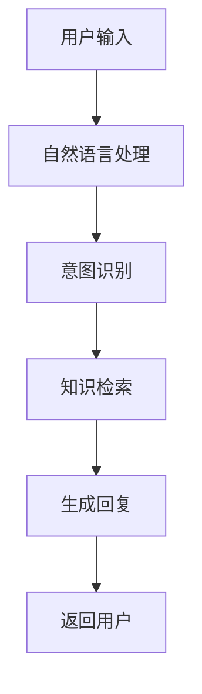
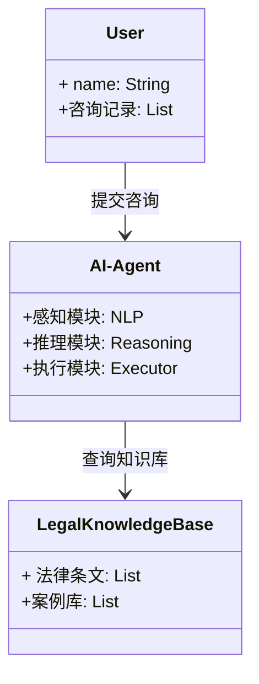
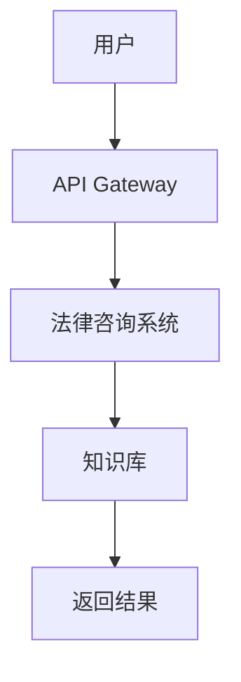
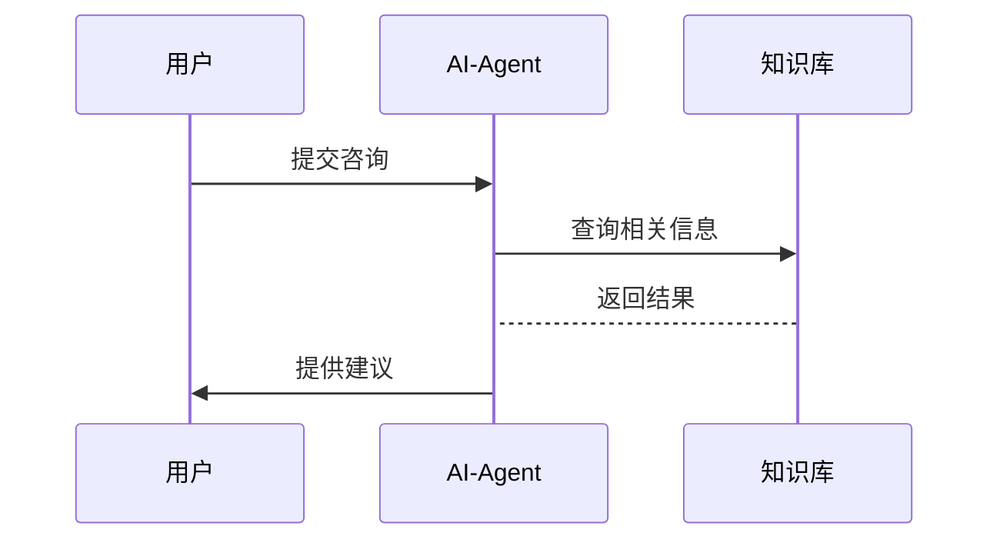

                 


---

# AI Agent在智能法律咨询中的角色

## 关键词：AI Agent、智能法律咨询、自然语言处理、法律知识库、系统架构设计

## 摘要：  
AI Agent作为人工智能技术的重要应用，正在逐步渗透到法律咨询领域。本文详细探讨AI Agent在智能法律咨询中的角色，分析其核心概念、算法原理、系统架构设计以及实际应用场景。通过结合自然语言处理技术和法律知识库，AI Agent能够高效地辅助法律咨询流程，为用户提供智能化、个性化的法律服务。本文还提供了具体的项目实现和案例分析，帮助读者更好地理解AI Agent在法律咨询中的潜力和应用前景。

---

# 第一部分: AI Agent在智能法律咨询中的背景与概念

## 第1章: AI Agent与智能法律咨询的背景介绍

### 1.1 AI Agent的基本概念  
AI Agent（人工智能代理）是指能够感知环境、自主决策并执行任务的智能实体。它结合了自然语言处理、机器学习和知识表示等多种技术，能够模拟人类的思维和行为，为用户提供智能化的服务。  

#### 1.1.1 AI Agent的定义与特征  
- **定义**: AI Agent是一种能够理解用户需求、提供个性化服务的智能系统。  
- **特征**: 智能性、自主性、适应性、交互性。  

#### 1.1.2 AI Agent的核心要素与组成  
- **感知模块**: 通过自然语言处理技术，理解用户的输入。  
- **推理模块**: 基于知识库和逻辑推理，生成解决方案。  
- **执行模块**: 执行任务并返回结果。  

#### 1.1.3 AI Agent在法律咨询中的应用潜力  
AI Agent能够帮助用户快速获取法律信息、分析法律案例，并提供个性化的法律建议。  

### 1.2 智能法律咨询的发展现状  
#### 1.2.1 传统法律咨询的局限性  
- 人工咨询效率低，成本高。  
- 资源分配不均，难以覆盖广泛用户需求。  

#### 1.2.2 智能法律咨询的兴起与技术支撑  
- 技术进步：自然语言处理、机器学习等技术的发展为智能法律咨询提供了技术支持。  
- 用户需求：用户对高效、便捷的法律服务需求日益增长。  

#### 1.2.3 法律咨询智能化的必要性与可行性  
- 必要性：提高法律服务效率，降低用户成本。  
- 可行性：基于AI技术的法律知识库和推理系统已较为成熟。  

---

# 第二部分: AI Agent的核心概念与原理

## 第2章: AI Agent的核心概念与法律咨询的结合

### 2.1 AI Agent在法律咨询中的角色定位  
#### 2.1.1 作为辅助工具的AI Agent  
AI Agent可以作为律师的辅助工具，帮助快速检索法律条文和案例。  

#### 2.1.2 作为交互主体的AI Agent  
AI Agent可以直接与用户交互，提供个性化的法律建议。  

#### 2.1.3 AI Agent与法律咨询流程的整合  
AI Agent可以嵌入到法律咨询的各个环节，优化流程效率。  

### 2.2 AI Agent与法律知识库的关联  
#### 2.2.1 法律知识库的构建与管理  
- **构建**: 通过爬取法律文献、案例数据库等，构建结构化的法律知识库。  
- **管理**: 定期更新知识库，确保信息的准确性和时效性。  

#### 2.2.2 AI Agent对法律知识的处理与应用  
- **语义理解**: 利用NLP技术，理解用户的问题意图。  
- **知识推理**: 基于知识库，生成个性化的法律建议。  

#### 2.2.3 知识库的动态更新与维护  
通过反馈机制，动态更新知识库，提高AI Agent的准确性。  

### 2.3 AI Agent在法律咨询中的优势与局限  
#### 2.3.1 AI Agent的优势  
- 高效性：快速响应用户需求。  
- 便捷性：用户可以随时随地获得法律服务。  

#### 2.3.2 AI Agent的局限性  
- 知识局限：AI Agent无法覆盖所有法律领域。  
- 伦理问题：AI Agent的决策可能引发法律和伦理争议。  

#### 2.3.3 人机协作的必要性  
AI Agent与人类律师的协作是实现高效法律咨询的关键。  

---

# 第三部分: AI Agent的算法原理与实现

## 第3章: AI Agent的算法原理  

### 3.1 自然语言处理技术在AI Agent中的应用  
#### 3.1.1 NLP技术的基本原理  
自然语言处理技术用于理解和生成人类语言，是AI Agent的核心技术之一。  

#### 3.1.2 常见的NLP算法与模型  
- **词袋模型**: 将文本表示为词的集合。  
- **TF-IDF**: 计算词语的重要性。  
- **BERT**: 前沿的预训练语言模型。  

#### 3.1.3 NLP在法律咨询中的应用示例  
- **案例分析**: 通过NLP分析法律案例，提取关键信息。  
- **合同审查**: 识别合同中的法律条款和潜在风险。  

### 3.2 AI Agent的算法实现  
#### 3.2.1 算法流程图  


#### 3.2.2 Python代码实现  
```python
import numpy as np
from sklearn.feature_extraction.text import TfidfVectorizer

# 示例代码：计算文本的TF-IDF特征
def compute_tfidf(documents):
    vectorizer = TfidfVectorizer()
    tfidf = vectorizer.fit_transform(documents)
    return tfidf

# 示例输入
documents = ["法律咨询", "合同条款分析"]
tfidf_matrix = compute_tfidf(documents)
print(tfidf_matrix)
```

#### 3.2.3 数学模型与公式  
- **TF-IDF公式**:  
  $$ TF_{word} = \frac{\text{词在文档中的出现次数}}{\text{文档中词的总出现次数}} $$  
  $$ IDF_{word} = \log\left(\frac{\text{总文档数}}{\text{包含该词的文档数}}\right) $$  
  $$ TF-IDF_{word} = TF_{word} \times IDF_{word} $$  

---

# 第四部分: 系统分析与架构设计方案

## 第4章: 系统分析与架构设计  

### 4.1 问题场景介绍  
智能法律咨询系统需要支持多种法律领域的咨询，提供个性化的建议。  

### 4.2 系统功能设计  
#### 4.2.1 领域模型  


#### 4.2.2 系统架构设计  


#### 4.2.3 系统接口设计  
- **输入接口**: 用户输入法律问题。  
- **输出接口**: 返回法律建议和相关条文。  

#### 4.2.4 系统交互设计  


---

# 第五部分: 项目实战

## 第5章: 项目实战  

### 5.1 环境安装  
- 安装Python和相关库（如numpy、scikit-learn）。  

### 5.2 核心功能实现  
#### 5.2.1 代码实现  
```python
from sklearn.externals import joblib
from sklearn.feature_extraction.text import TfidfVectorizer
from sklearn.naive_bayes import MultinomialNB

# 示例代码：法律咨询分类器
def train_classifier(documents, labels):
    vectorizer = TfidfVectorizer()
    X = vectorizer.fit_transform(documents)
    clf = MultinomialNB()
    clf.fit(X, labels)
    return clf, vectorizer

# 示例输入
documents = ["合同纠纷", "侵权责任"]
labels = [0, 1]
clf, vectorizer = train_classifier(documents, labels)
joblib.dump(clf, 'legal_classifier.pkl')
joblib.dump(vectorizer, 'vectorizer.pkl')
```

#### 5.2.2 代码解读  
- **训练模型**: 使用TF-IDF特征和朴素贝叶斯分类器进行训练。  
- **保存模型**: 使用joblib保存训练好的模型和向量器。  

### 5.3 案例分析  
#### 5.3.1 案例背景  
用户咨询“合同违约责任”的相关法律问题。  

#### 5.3.2 实现步骤  
1. 用户输入问题。  
2. AI Agent通过NLP技术理解问题。  
3. 知识库检索相关信息。  
4. AI Agent生成法律建议。  

#### 5.3.3 分析结果  
AI Agent返回相关法律条文和案例，帮助用户理解问题。  

### 5.4 项目小结  
通过实际案例，展示了AI Agent在法律咨询中的高效性和便捷性。

---

# 第六部分: 总结与展望

## 第6章: 总结与展望  

### 6.1 最佳实践  
- 定期更新知识库，确保信息的准确性。  
- 提供多种交互方式，提升用户体验。  

### 6.2 小结  
AI Agent正在改变法律咨询的方式，为用户提供了高效、便捷的服务。  

### 6.3 注意事项  
- 数据隐私保护：确保用户数据的安全性。  
- 伦理问题：避免AI Agent的误用和滥用。  

### 6.4 拓展阅读  
- 推荐书籍：《人工智能: 一种现代的方法》  
- 推荐博客：AI Genius Institute技术博客  

---

# 作者：AI天才研究院/AI Genius Institute & 禅与计算机程序设计艺术/Zen And The Art of Computer Programming  

---

