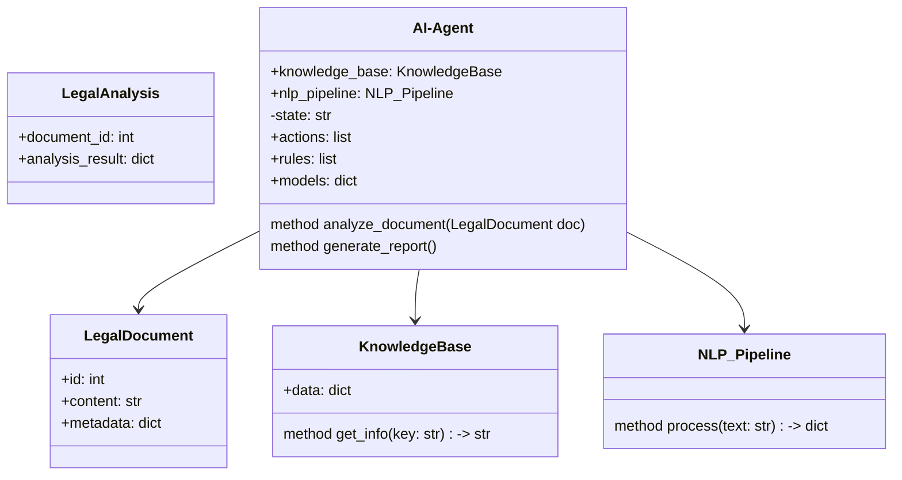
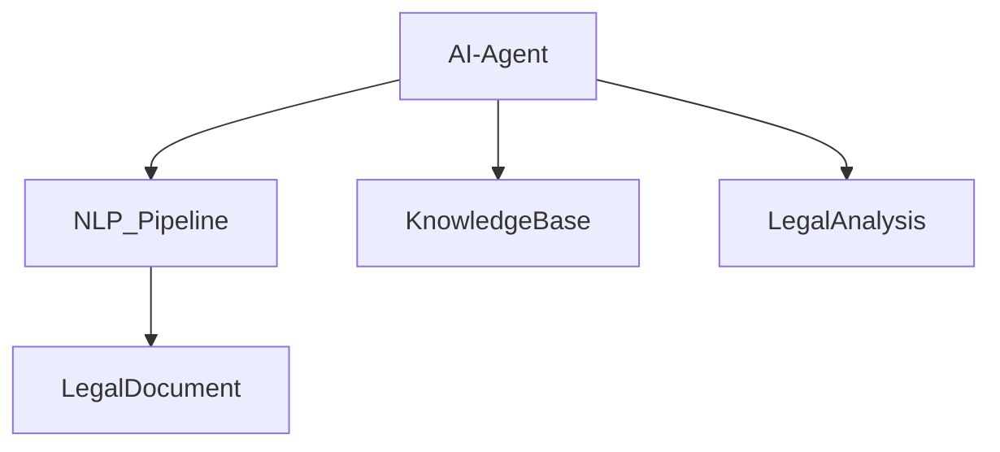
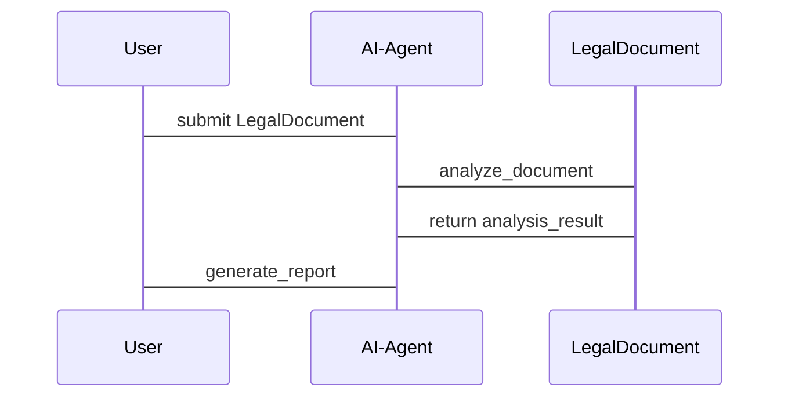

                 


# AI Agent在智能法律文本分析中的角色

## 关键词：AI Agent、法律文本分析、自然语言处理、强化学习、知识库构建、系统架构设计

## 摘要：AI Agent在智能法律文本分析中扮演着越来越重要的角色，通过自然语言处理、机器学习和知识图谱等技术，AI Agent能够高效地处理法律文本，提供准确的分析结果和决策支持。本文详细探讨了AI Agent在法律文本分析中的核心原理、应用场景、系统架构设计以及实际案例，旨在为读者提供全面的了解。

---

# 第1章: AI Agent的基本概念与背景

## 1.1 AI Agent的定义与特点

### 1.1.1 AI Agent的定义
AI Agent（人工智能代理）是一种智能系统，能够感知环境、理解任务目标，并通过自主决策和行动来实现特定目标。与传统的被动响应系统不同，AI Agent具有主动性和适应性，能够根据输入的信息动态调整行为。

### 1.1.2 AI Agent的核心特点
- **自主性**：AI Agent能够在没有外部干预的情况下自主运行。
- **反应性**：能够实时感知环境变化并做出反应。
- **学习能力**：通过数据和经验不断优化自身的决策能力。
- **协作性**：能够与其他系统或人类进行协作，共同完成任务。

### 1.1.3 AI Agent与传统AI的区别
AI Agent不仅仅是一个被动执行指令的工具，而是一个具有主动性和智能性的系统。它能够根据环境反馈动态调整策略，具备更强的适应性和灵活性。

## 1.2 法律文本分析的背景与挑战

### 1.2.1 法律文本分析的基本概念
法律文本分析是指通过对法律文档（如合同、法规、判决书等）进行处理，提取关键信息、理解语义并生成有用的分析结果的过程。法律文本分析在法律咨询、合同审查、合规性检查等领域具有广泛的应用。

### 1.2.2 法律文本分析的难点与挑战
- **法律文本的复杂性**：法律文本通常包含大量专业术语和复杂的句式结构。
- **信息的模糊性**：法律文本中可能存在多种解释，需要结合上下文进行判断。
- **知识库的构建**：法律文本分析需要依赖丰富的法律知识库，包括法律条款、案例等。

### 1.2.3 法律文本分析的典型应用场景
- **合同审查**：自动识别合同中的关键条款，评估潜在风险。
- **法律咨询**：根据用户提供的法律问题，快速检索相关法律条文并提供解答。
- **合规性检查**：帮助企业识别合规风险，确保业务操作符合法律法规。

---

# 第2章: AI Agent在法律文本分析中的角色

## 2.1 AI Agent在法律文本分析中的功能定位

### 2.1.1 数据采集与处理
AI Agent能够从多种来源（如法律数据库、互联网）获取法律文本数据，并对其进行清洗、预处理和结构化。例如，将非结构化的法律文本转换为结构化的数据格式，以便后续分析。

### 2.1.2 文本理解与分析
AI Agent通过自然语言处理技术（如分词、句法分析、实体识别等）对法律文本进行深度理解和分析。例如，识别文本中的法律实体（如公司名称、日期）和法律关系（如合同条款之间的关联）。

### 2.1.3 结论生成与决策支持
AI Agent能够基于分析结果生成初步结论，并为用户提供决策支持。例如，评估合同中的风险条款，提出修改建议。

## 2.2 AI Agent在法律文本分析中的优势

### 2.2.1 提高效率
AI Agent能够快速处理大量法律文本，显著提高工作效率。例如，在合同审查中，AI Agent可以在几分钟内完成数百页的合同分析。

### 2.2.2 增强准确性
通过机器学习和自然语言处理技术，AI Agent能够减少人为错误，提高分析结果的准确性。例如，准确识别法律文本中的关键条款和潜在风险。

### 2.2.3 降低人工成本
AI Agent的自动化能力能够显著降低法律文本分析的人工成本。例如，自动化处理合同审查任务，减少对大量法律专家的依赖。

## 2.3 AI Agent在法律文本分析中的边界与外延

### 2.3.1 AI Agent的局限性
尽管AI Agent在法律文本分析中表现出色，但它仍然存在一些局限性。例如，无法完全理解复杂的法律语境，无法替代人类专家的深度判断。

### 2.3.2 人类专家的必要性
在某些复杂的情况下，AI Agent需要与人类专家协同工作。例如，处理涉及复杂法律关系的案件时，AI Agent可以作为辅助工具，提供初步分析结果，供专家进一步判断。

### 2.3.3 AI Agent与其他技术的协同作用
AI Agent可以与其他技术（如区块链、大数据分析）协同工作，形成更强大的法律文本分析系统。例如，结合区块链技术，确保法律文本的可追溯性和安全性。

---

# 第3章: AI Agent的核心原理

## 3.1 AI Agent的原理概述

### 3.1.1 信息处理流程
AI Agent的信息处理流程通常包括数据输入、信息处理、决策生成和结果输出四个阶段。例如，在法律文本分析中，AI Agent首先接收法律文本数据，然后通过自然语言处理技术进行分析，最后生成分析结果并输出。

### 3.1.2 决策机制
AI Agent的决策机制通常基于机器学习模型和规则引擎。例如，通过训练好的模型预测法律文本中的风险点，并结合预设的规则生成最终的决策建议。

### 3.1.3 学习与优化
AI Agent通过监督学习、无监督学习和强化学习等方法不断优化自身的性能。例如，通过监督学习训练模型识别法律文本中的关键实体。

---

# 第4章: AI Agent与法律文本分析的关联

## 4.1 AI Agent在法律文本分析中的应用流程

### 4.1.1 数据输入
AI Agent接收法律文本数据，通常包括文档格式（如PDF、Word）和文本内容。

### 4.1.2 信息处理
AI Agent对输入的法律文本进行清洗、分词、句法分析等预处理，并提取关键实体和关系。

### 4.1.3 结果输出
AI Agent根据处理后的信息生成分析结果，例如标记潜在风险条款并提出修改建议。

## 4.2 AI Agent与法律知识库的结合

### 4.2.1 知识库的构建
AI Agent需要依赖法律知识库，包括法律术语、案例库、法规条文等。例如，通过爬取公开的法律数据库构建一个大规模的法律知识库。

### 4.2.2 知识库的更新与维护
AI Agent需要定期更新知识库，以确保其准确性和时效性。例如，及时更新最新的法律法规和司法案例。

### 4.2.3 知识库在法律文本分析中的应用
AI Agent利用法律知识库进行语义理解、实体识别和关系抽取。例如，在合同审查中，AI Agent可以快速匹配类似条款并提供参考意见。

## 4.3 AI Agent与法律专家的协同工作

### 4.3.1 AI Agent辅助专家的模式
AI Agent可以作为辅助工具，帮助法律专家提高工作效率。例如，在合同审查中，AI Agent可以标记潜在风险，供专家进一步审核。

### 4.3.2 专家反馈对AI Agent的优化
通过专家的反馈，AI Agent可以不断优化自身的模型和算法，提高分析的准确性和可靠性。

### 4.3.3 人机协同的优势
通过人机协同，AI Agent可以充分发挥其效率和准确性优势，同时结合专家的深度判断能力，形成更强大的法律文本分析能力。

---

# 第5章: AI Agent在法律文本分析中的算法原理

## 5.1 自然语言处理模型

### 5.1.1 分词算法
分词是自然语言处理的基础任务，常用算法包括基于统计的分词算法（如CRF）和基于深度学习的分词算法（如LSTM）。例如，使用CRF模型对中文法律文本进行分词。

### 5.1.2 句法分析
句法分析通过构建句法树来理解句子的结构。常用算法包括基于规则的句法分析和基于统计的句法分析。例如，使用依存句法分析理解法律文本中的主谓关系。

### 5.1.3 实体识别
实体识别是识别文本中的命名实体（如人名、地名、组织名）的过程。常用算法包括基于规则的实体识别和基于深度学习的实体识别。例如，使用LSTM模型识别法律文本中的公司名称和日期。

## 5.2 强化学习策略

### 5.2.1 Q-Learning算法
Q-Learning是一种经典的强化学习算法，适用于离散动作空间的问题。例如，在法律文本分析中，Q-Learning可以用于选择最优的决策策略。

### 5.2.2 Deep Q-Networks (DQN)
DQN是一种基于深度学习的强化学习算法，适用于连续动作空间的问题。例如，在法律文本分析中，DQN可以用于优化AI Agent的决策过程。

### 5.2.3 算法实现
以下是Q-Learning算法的Python代码示例：

```python
class QAgent:
    def __init__(self, state_size, action_size, gamma=0.99, epsilon=1.0, epsilon_min=0.01, epsilon_decay=0.999):
        self.state_size = state_size
        self.action_size = action_size
        self.gamma = gamma
        self.epsilon = epsilon
        self.epsilon_min = epsilon_min
        self.epsilon_decay = epsilon_decay
        self.q_table = np.zeros((state_size, action_size))
        
    def remember(self, state, action, reward, next_state):
        self.q_table[state][action] = reward + self.gamma * np.max(self.q_table[next_state])
        
    def act(self, state):
        if np.random.random() < self.epsilon:
            return np.random.randint(self.action_size)
        else:
            return np.argmax(self.q_table[state])
        
    def epsilon_decay(self):
        self.epsilon = max(self.epsilon * self.epsilon_decay, self.epsilon_min)
```

---

# 第6章: 系统分析与架构设计方案

## 6.1 问题场景介绍
假设我们正在开发一个智能法律文本分析系统，目标是通过AI Agent对法律合同进行自动审查，并识别潜在风险。

## 6.2 系统功能设计

### 6.2.1 领域模型类图
以下是领域模型类图：



### 6.2.2 系统架构图
以下是系统架构图：



## 6.3 系统接口设计
系统主要接口包括：
- `analyze_document(LegalDocument doc)`：接收法律文档并进行分析。
- `generate_report()`：生成分析报告。
- `update_knowledge_base()`：更新法律知识库。

## 6.4 系统交互设计



---

# 第7章: 项目实战

## 7.1 环境安装
需要安装以下Python库：
- `numpy`
- `scikit-learn`
- `spacy`
- `networkx`

## 7.2 系统核心实现源代码

### 7.2.1 法律文本预处理

```python
import spacy

nlp = spacy.load("en_core_web_sm")

def preprocess(text):
    doc = nlp(text)
    tokens = [token.text for token in doc]
    return " ".join(tokens)
```

### 7.2.2 实体识别

```python
def entity_recognition(text):
    doc = nlp(text)
    entities = []
    for ent in doc.ents:
        entities.append((ent.start, ent.end, ent.label_))
    return entities
```

### 7.2.3 知识库构建

```python
class KnowledgeBase:
    def __init__(self):
        self.data = {}
        
    def add_entity(self, entity, description):
        self.data[entity] = description
        
    def get_entity(self, entity):
        return self.data.get(entity, "")
```

## 7.3 实际案例分析
假设我们有一个合同文本需要分析：

```python
contract_text = "This contract is between Company A and Company B for the supply of goods."
preprocessed_text = preprocess(contract_text)
entities = entity_recognition(preprocessed_text)
```

## 7.4 项目小结
通过实际案例，我们可以看到AI Agent在法律文本分析中的强大能力。它能够快速处理法律文本，提取关键信息，并生成有用的分析结果。

---

# 第8章: 最佳实践

## 8.1 小结
AI Agent在法律文本分析中的应用前景广阔，能够显著提高法律事务的效率和准确性。通过与法律专家的协同工作，AI Agent可以充分发挥其优势，推动法律行业的智能化转型。

## 8.2 注意事项
- **数据隐私**：在处理法律文本时，需要特别注意数据隐私和安全性。
- **模型优化**：定期优化AI Agent的模型和算法，确保其性能不断提升。
- **人机协同**：在复杂情况下，始终需要结合人类专家的判断。

## 8.3 拓展阅读
- 《自然语言处理入门》
- 《强化学习实战》
- 《法律知识图谱构建与应用》

---

# 作者：AI天才研究院 & 禅与计算机程序设计艺术

---

通过以上章节的内容，我们全面探讨了AI Agent在智能法律文本分析中的角色和应用。希望本文能够为读者提供有价值的见解和启发，推动AI技术在法律领域的进一步发展。

