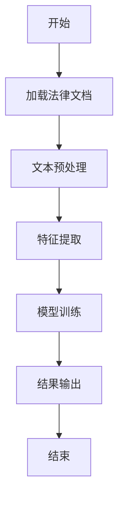
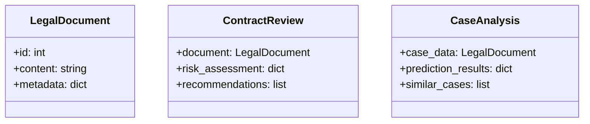
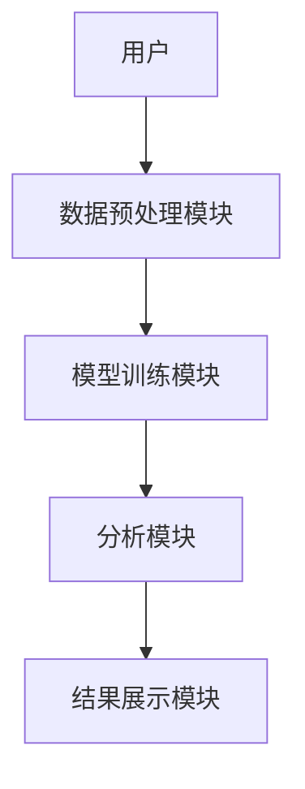
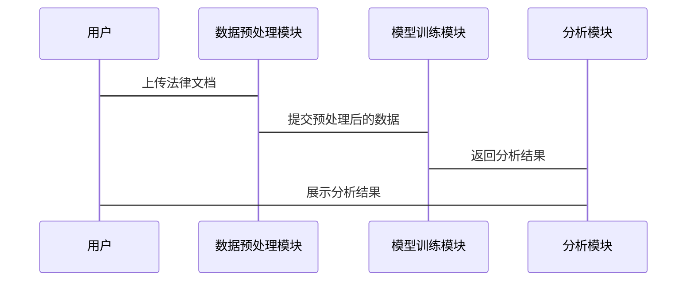

                 


# AI Agent在智能法律文档分析中的角色

> 关键词：AI Agent, 法律文档分析, 智能合同审查, 法律知识图谱, 自然语言处理

> 摘要：本文探讨了AI Agent在智能法律文档分析中的角色，详细分析了AI Agent在法律文档分析中的背景、应用场景、技术基础、算法原理、系统架构设计、项目实战以及最佳实践。文章从理论到实践，逐步揭示了AI Agent在法律文档分析中的潜力与挑战，为读者提供了一套完整的解决方案与实施路径。

---

## 第1章: AI Agent的基本概念与法律文档分析的背景

### 1.1 AI Agent的定义与核心特征

#### 1.1.1 AI Agent的定义
AI Agent（人工智能代理）是一种能够感知环境、自主决策并执行任务的智能实体。它能够通过与环境的交互，利用传感器获取信息，并通过执行器采取行动，以实现特定的目标。

#### 1.1.2 AI Agent的核心特征
- **自主性**：AI Agent能够在没有外部干预的情况下独立运行。
- **反应性**：能够实时感知环境变化并做出响应。
- **目标导向**：基于预设目标或学习目标进行决策和行动。
- **学习能力**：通过机器学习技术不断优化自身的性能。

#### 1.1.3 AI Agent与传统规则引擎的区别
| 特性                | AI Agent                          | 传统规则引擎                  |
|---------------------|-----------------------------------|------------------------------|
| 决策方式            | 基于机器学习和数据驱动          | 基于预设规则和逻辑            |
| 灵活性              | 高，能够适应复杂和变化的场景    | 低，依赖于规则的明确性        |
| 学习能力            | 强，能够从数据中学习新的模式    | 无，仅依赖于预设规则          |
| 应用场景            | 复杂、动态的环境                 | 简单、静态的环境              |

### 1.2 法律文档分析的背景与挑战

#### 1.2.1 法律文档分析的基本概念
法律文档分析是指对法律文本（如合同、法规、判决书等）进行理解、提取和分析的过程。其目的是从文档中提取关键信息，识别潜在风险，并提供决策支持。

#### 1.2.2 法律文档分析的主要挑战
- **复杂性**：法律文本通常包含复杂的术语、结构和法律关系。
- **多样性**：法律文档的格式和内容差异大，难以统一处理。
- **准确性**：对法律文档的分析必须高度准确，否则可能导致法律风险。
- **效率**：手动分析法律文档耗时长，效率低。

#### 1.2.3 AI Agent在法律文档分析中的潜力
AI Agent能够通过自然语言处理（NLP）和机器学习技术，快速理解法律文本，提取关键信息，并提供智能化的分析结果。其自主性和目标导向性使其成为法律文档分析的理想工具。

### 1.3 AI Agent在法律文档分析中的角色

#### 1.3.1 AI Agent在法律文档分析中的定位
AI Agent在法律文档分析中扮演着“智能助手”的角色，能够帮助法律专业人士快速理解文档内容，识别关键条款，并提供风险预警和优化建议。

#### 1.3.2 AI Agent的核心功能与作用
- **文档理解**：通过NLP技术对法律文档进行语义分析，理解文档内容。
- **信息提取**：从文档中提取关键信息，如合同条款、法规条文等。
- **风险评估**：基于提取的信息，评估潜在的法律风险。
- **决策支持**：为法律专业人士提供决策支持，如合同审查建议、法律案例预测等。

#### 1.3.3 AI Agent与其他法律技术工具的对比
| 特性                | AI Agent                          | 传统法律软件                  |
|---------------------|-----------------------------------|------------------------------|
| 技术基础            | 机器学习和NLP                    | 规则引擎和关键词匹配          |
| 功能                | 多功能，支持复杂场景分析        | 功能单一，主要用于简单任务    |
| 可扩展性            | 高，能够处理多种类型的法律文档  | 低，仅适用于特定场景          |

---

## 第2章: AI Agent在法律文档分析中的应用场景

### 2.1 法律文档分析的主要场景

#### 2.1.1 合同审查与分析
合同审查是法律文档分析的重要场景之一。AI Agent可以通过对合同条款的理解，识别潜在的风险点，并提供优化建议。

#### 2.1.2 法律法规检索与匹配
AI Agent可以帮助法律专业人士快速检索相关法律法规，并进行匹配，以支持法律文书的撰写和审查。

#### 2.1.3 法律案例分析与预测
通过分析大量的法律案例，AI Agent可以预测案件的可能结果，并为法律专业人士提供参考。

### 2.2 AI Agent在合同审查中的具体应用

#### 2.2.1 合同条款识别与分类
AI Agent可以通过NLP技术对合同中的条款进行识别和分类，如违约条款、保密条款等。

#### 2.2.2 合同风险评估与预警
基于识别的条款，AI Agent可以评估合同的风险，并提供预警，如高风险条款的提示。

#### 2.2.3 合同模板生成与优化
AI Agent可以根据用户的需求生成合同模板，并根据最佳实践优化合同内容。

### 2.3 AI Agent在法律案例分析中的应用

#### 2.3.1 法律案例检索与相似度分析
通过自然语言处理技术，AI Agent可以检索相关的法律案例，并进行相似度分析。

#### 2.3.2 案例关键点提取与总结
AI Agent可以从大量的案例中提取关键点，并进行总结，帮助法律专业人士快速了解案件的核心内容。

#### 2.3.3 案例预测与结果分析
基于历史案例数据，AI Agent可以预测案件的可能结果，并提供分析报告。

---

## 第3章: AI Agent在法律文档分析中的技术基础

### 3.1 自然语言处理技术

#### 3.1.1 NLP技术的基本概念
自然语言处理（NLP）是指计算机对人类自然语言的理解和生成。它是AI Agent实现法律文档分析的核心技术之一。

#### 3.1.2 常见的NLP技术与工具
- **分词**：将文本分割成词语或短语。
- **实体识别**：识别文本中的实体，如人名、地名、组织名等。
- **句法分析**：分析句子的语法结构。
- **语义理解**：理解文本的语义含义。
- **工具**：如spaCy、NLTK、BERT等。

#### 3.1.3 NLP在法律文档分析中的应用
- **合同条款识别**：通过分词和实体识别技术，识别合同中的关键条款。
- **语义理解**：通过语义理解技术，理解合同条款的含义。
- **案例分析**：通过NLP技术分析法律案例的文本内容，提取关键信息。

### 3.2 机器学习与深度学习

#### 3.2.1 机器学习的基本概念
机器学习是一种通过数据训练模型，使其能够从数据中学习规律并进行预测的技术。

#### 3.2.2 深度学习的核心原理
深度学习是一种基于人工神经网络的机器学习技术，通过多层神经网络模型，能够学习复杂的特征和模式。

#### 3.2.3 机器学习在法律文档分析中的应用
- **分类**：将法律文档分类为不同类别，如合同类型、法律条文类型等。
- **聚类**：将相似的法律文档进行聚类，便于管理和分析。
- **预测**：基于历史数据，预测法律案例的结果。

### 3.3 法律知识图谱与规则引擎

#### 3.3.1 法律知识图谱的构建与应用
法律知识图谱是一种将法律知识结构化表示的知识图谱，能够帮助AI Agent更好地理解和应用法律知识。

#### 3.3.2 规则引擎的基本原理
规则引擎是一种基于预设规则进行推理和决策的技术，常用于简单的法律文档分析任务。

#### 3.3.3 法律知识图谱与规则引擎的结合
通过结合法律知识图谱和规则引擎，AI Agent可以实现更加智能化的法律文档分析，既能基于规则进行快速判断，又能基于知识图谱进行深度推理。

---

## 第4章: AI Agent在法律文档分析中的算法原理

### 4.1 基于规则的法律文档分析

#### 4.1.1 规则引擎的基本原理
规则引擎通过预设的规则对文本进行匹配和判断，通常用于简单的法律文档分析任务。

#### 4.1.2 规则在法律文档分析中的应用
- **关键词匹配**：通过匹配关键词，识别合同中的特定条款。
- **模式匹配**：通过预设的模式匹配，识别特定的文本结构。

### 4.2 基于深度学习的法律文档分析

#### 4.2.1 深度学习模型的基本原理
深度学习模型通过多层神经网络对文本进行特征提取和语义理解，能够处理复杂的法律文档分析任务。

#### 4.2.2 深度学习在法律文档分析中的应用
- **文本分类**：将法律文档分类为不同类别。
- **文本摘要**：对法律文档进行摘要，提取关键信息。
- **实体识别**：识别文本中的实体，如人名、地名等。

### 4.3 法律文档分析的算法流程



---

## 第5章: AI Agent在法律文档分析中的系统架构设计

### 5.1 系统功能设计

#### 5.1.1 领域模型


#### 5.1.2 系统架构


### 5.2 系统接口设计

#### 5.2.1 API接口
- `/api/upload_document`: 上传法律文档
- `/api/analyze_contract`: 分析合同
- `/api/predict_case`: 预测法律案例结果

### 5.3 系统交互设计



---

## 第6章: AI Agent在法律文档分析中的项目实战

### 6.1 环境配置

```bash
pip install numpy
pip install tensorflow
pip install transformers
pip install spacy
```

### 6.2 核心实现源代码

```python
from transformers import BertTokenizer, BertModel
import spacy

def analyze_legal_document(document):
    tokenizer = BertTokenizer.from_pretrained('bert-base-uncased')
    model = BertModel.from_pretrained('bert-base-uncased')
    nlp = spacy.load('en_core_web_sm')
    
    # 分词
    tokens = tokenizer.tokenize(document)
    # 特征提取
    inputs = tokenizer.encode_plus(document, return_tensors='pt')
    outputs = model(**inputs)
    # 模型预测
    prediction = model(inputs)[0]
    return prediction
```

### 6.3 案例分析与详细解读

#### 案例分析
假设我们有一个合同文档，AI Agent可以识别出其中的关键条款，并进行风险评估。

#### 详细解读
1. **文档预处理**：对合同文档进行分词和实体识别。
2. **模型训练**：使用BERT模型对合同内容进行语义理解。
3. **结果分析**：识别出高风险条款，并提供优化建议。

### 6.4 项目小结
通过实际案例的分析，我们可以看到AI Agent在法律文档分析中的强大能力。它能够快速理解文档内容，识别关键信息，并提供智能化的分析结果。

---

## 第7章: AI Agent在法律文档分析中的最佳实践与小结

### 7.1 最佳实践

- **数据隐私**：在处理法律文档时，必须注意数据隐私问题，确保数据的安全性。
- **模型可解释性**：在法律领域，模型的可解释性非常重要，需要能够解释AI Agent的决策过程。
- **持续学习**：法律知识更新迅速，AI Agent需要通过持续学习来保持其性能。

### 7.2 小结

AI Agent在智能法律文档分析中的角色日益重要。它通过结合自然语言处理、机器学习和法律知识图谱，能够帮助法律专业人士快速理解文档内容，识别潜在风险，并提供决策支持。随着技术的不断进步，AI Agent在法律文档分析中的应用前景将更加广阔。

---

## 作者

作者：AI天才研究院/AI Genius Institute & 禅与计算机程序设计艺术/Zen And The Art of Computer Programming

