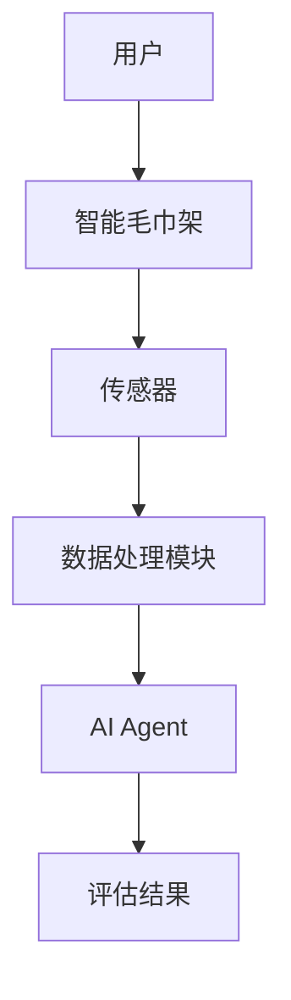

                 

# AI Agent在智能浴室毛巾架中的卫生状况评估

> 关键词：AI Agent, 智能毛巾架, 卫生评估, 数据分析, 传感器技术

> 摘要：本文探讨了AI Agent在智能浴室毛巾架卫生状况评估中的应用。通过分析数据采集、算法实现和系统架构，展示了如何利用AI技术实现智能卫生管理。

---

## 第1章: AI Agent与智能浴室毛巾架的卫生评估背景

### 1.1 智能浴室 towel rack的发展趋势
#### 1.1.1 智能卫浴产品的兴起
智能卫浴产品，如智能马桶和智能镜子，正逐渐普及。浴室 towel rack作为卫浴设备的重要组成部分，也在向着智能化方向发展。

#### 1.1.2 AI技术在卫浴产品中的应用
AI技术的应用让卫浴产品更加智能。例如，通过AI算法，产品能够自动调整温度、湿度，甚至识别用户的使用习惯。

#### 1.1.3 智能毛巾架卫生管理的需求
随着人们对卫生要求的提高，智能毛巾架需要能够自动评估其卫生状况，确保用户的使用安全。

---

### 1.2 卫生状况评估的必要性
#### 1.2.1 卫生状况评估的定义
卫生状况评估是对毛巾架表面清洁程度的判断，通常基于传感器数据和AI算法。

#### 1.2.2 智能毛巾架卫生管理的痛点
传统毛巾架的卫生管理依赖人工清洁，效率低且难以实时监控。智能毛巾架需要自动化解决方案。

#### 1.2.3 AI Agent在卫生评估中的作用
AI Agent通过实时数据分析，能够快速判断卫生状况，提供清洁建议，从而提升用户体验。

---

## 第2章: AI Agent的核心原理与实现

### 2.1 AI Agent的基本概念
#### 2.1.1 AI Agent的定义与特点
AI Agent是一种智能代理，能够感知环境并自主决策。它具有自主性、反应性和社会性等特点。

#### 2.1.2 AI Agent的分类与应用场景
AI Agent分为简单反射型、基于模型的反应型等。在智能 towel rack中，AI Agent用于数据处理和决策。

#### 2.1.3 AI Agent与传统自动化的区别
AI Agent具有学习和适应能力，能够处理复杂场景，而传统自动化只能按固定程序运行。

---

### 2.2 智能毛巾架的卫生评估模型
#### 2.2.1 卫生评估的核心要素
包括颜色变化、表面光泽度、细菌指标等，这些因素影响卫生状况的评估。

#### 2.2.2 卫生评估的数学模型
采用机器学习模型，如支持向量机（SVM）和随机森林（Random Forest），对数据进行分类。

#### 2.2.3 卫生评估的指标体系
建立包括清洁度、细菌含量、异味程度等多维度的评估指标。

---

## 第3章: AI Agent的算法原理

### 3.1 数据采集与预处理
#### 3.1.1 卫生传感器数据的采集
使用光学传感器检测颜色变化，使用温度传感器监控表面温度。

#### 3.1.2 数据清洗与特征提取
对采集的数据进行去噪和归一化处理，提取关键特征。

#### 3.1.3 数据标注与归一化处理
将数据分为训练集和测试集，进行标注和归一化。

---

### 3.2 算法实现
#### 3.2.1 基于机器学习的分类算法
使用SVM和随机森林进行分类，训练模型并评估准确率。

#### 3.2.2 基于深度学习的特征提取
采用卷积神经网络（CNN）提取图像特征，提升分类精度。

#### 3.2.3 算法的训练与优化
通过交叉验证优化模型参数，选择最优算法。

---

## 第4章: 系统分析与架构设计

### 4.1 系统需求分析
#### 4.1.1 功能需求
包括实时监测、自动评估、清洁建议等功能。

#### 4.1.2 性能需求
要求系统具备实时处理能力，确保快速响应。

#### 4.1.3 用户需求
用户希望获得便捷、准确的卫生状况反馈，提升使用体验。

---

### 4.2 系统架构设计

---

## 第5章: 项目实战

### 5.1 环境搭建
安装Python和相关库，配置传感器接口。

### 5.2 核心代码实现
编写数据采集、处理和分类算法的代码，进行测试。

### 5.3 案例分析
通过实际数据测试模型，验证算法的准确性。

### 5.4 小结
总结项目成果，指出改进方向。

---

## 第6章: 总结与展望

### 6.1 本章小结
总结AI Agent在智能毛巾架卫生评估中的应用，强调其优势和价值。

### 6.2 未来展望
展望AI技术在卫浴产品中的更多应用，如自动化清洁和健康监测。

---

## 作者：AI天才研究院/AI Genius Institute & 禅与计算机程序设计艺术 /Zen And The Art of Computer Programming

---

通过以上结构，文章详细介绍了AI Agent在智能浴室 towel rack中的应用，从背景到实现，层层深入，确保读者能够全面理解其技术细节和实际应用。

