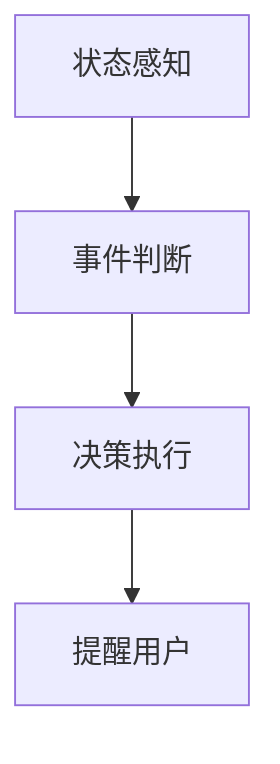
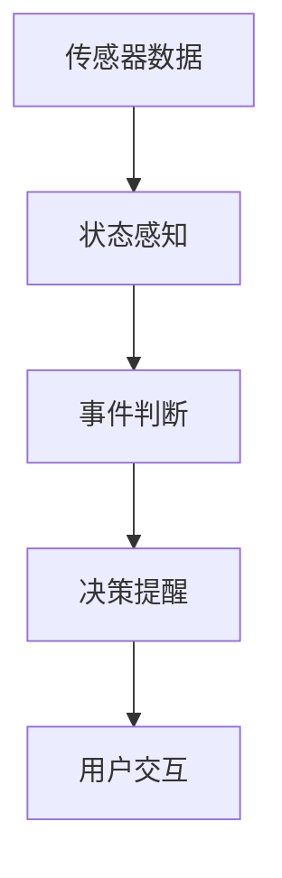

                 


# AI Agent在智能浴室毛巾架中的毛巾更换提醒

> 关键词：AI Agent, 智能家居, 智能浴室, 毛巾更换提醒, 智能算法, 数学模型, 系统架构

> 摘要：本文详细探讨了AI Agent在智能浴室毛巾架中的应用，重点分析了如何通过AI技术实现毛巾更换的智能提醒功能。文章从背景介绍、核心概念、算法原理、系统架构到项目实战，全面解析了AI Agent在智能家居中的具体应用场景和技术实现，为读者提供了从理论到实践的完整解决方案。

---

## 第一部分：背景介绍

### 第1章：问题背景与描述

#### 1.1 问题背景

在现代智能家居的发展趋势下，浴室设备的智能化改造成为提升用户体验的重要方向。传统的浴室毛巾架仅具备基本的悬挂功能，无法满足用户对智能化管理的需求。随着AI技术的快速发展，智能浴室毛巾架逐渐成为智能家居生态中的重要组成部分。

#### 1.2 问题描述

智能浴室毛巾架的核心功能之一是毛巾更换提醒。然而，现有产品中，大多数仅依赖用户手动操作，无法实现智能化管理。这种传统方式存在以下问题：
- **忘记更换**：用户容易忘记定期更换毛巾，导致细菌滋生，影响健康。
- **效率低下**：手动检查和更换毛巾的过程繁琐，浪费时间。
- **缺乏智能化**：无法根据使用频率和环境条件自动调整提醒策略。

#### 1.3 问题解决

通过引入AI Agent技术，可以实现 towels更换提醒的智能化管理。AI Agent能够实时感知毛巾的使用状态，结合用户习惯和环境数据，自动触发提醒或执行更换操作，从而提升用户体验。

#### 1.4 边界与外延

在智能浴室毛巾架的AI Agent系统中，解决方案的边界条件包括：
- **使用场景**：仅限于家庭浴室环境。
- **功能范围**：仅关注毛巾更换提醒，不涉及其他功能（如温度控制）。
- **数据来源**：仅依赖内置传感器和用户交互数据。

系统的核心概念包括：
- **AI Agent**：智能代理，负责执行毛巾更换提醒任务。
- **状态感知**：通过传感器感知毛巾的使用状态。
- **事件触发**：根据预设条件触发提醒或操作。
- **用户交互**：通过语音或APP与用户进行交互。

---

## 第二部分：核心概念与联系

### 第2章：AI Agent的核心原理

#### 2.1 AI Agent的基本原理

AI Agent是一种能够感知环境、自主决策并执行任务的智能实体。其核心特征包括：
- **自主性**：无需人工干预，自动执行任务。
- **反应性**：能够实时感知环境变化并做出反应。
- **目标导向**：基于预设目标进行决策和行动。

在智能浴室毛巾架中，AI Agent的主要任务是实现毛巾更换提醒。其工作流程包括：
1. **状态感知**：通过传感器感知毛巾的使用状态（如湿度、使用频率）。
2. **事件判断**：根据预设条件判断是否需要更换毛巾。
3. **决策执行**：触发提醒或自动执行更换操作。

#### 2.2 智能浴室毛巾架的AI Agent实现

在智能浴室毛巾架中，AI Agent通过以下方式实现毛巾更换提醒：
- **状态感知**：通过湿度传感器和使用频率传感器，感知毛巾的使用状态。
- **事件触发**：当毛巾达到预设的使用次数或湿度阈值时，触发提醒。
- **决策执行**：通过APP或语音助手通知用户更换毛巾。

#### 2.3 核心概念对比分析

以下是不同AI模型在毛巾更换提醒中的优缺点对比：

| AI模型         | 优点                               | 缺点                               |
|----------------|------------------------------------|------------------------------------|
| 规则引擎       | 实现简单，易于部署                | 需手动编写规则，缺乏灵活性        |
| 机器学习模型    | 可自适应用户习惯，学习能力强      | 需大量数据训练，计算资源消耗大    |
| 深度学习模型    | 能够处理复杂场景，精度高          | 计算复杂，资源消耗大              |

---

## 第三部分：算法原理讲解

### 第3章：AI Agent的算法实现

#### 3.1 算法流程

AI Agent在智能浴室毛巾架中的算法流程如下：
1. **状态感知**：通过传感器获取毛巾的使用状态数据。
2. **事件判断**：基于历史数据和预设规则，判断是否需要更换毛巾。
3. **决策执行**：根据判断结果，触发提醒或执行更换操作。

#### 3.2 算法实现代码

以下是实现毛巾更换提醒功能的核心代码示例：

```python
def towel更换提醒():
    # 状态感知
    湿度 = 传感器读取湿度()
    使用次数 = 传感器读取使用次数()

    # 事件判断
    if 湿度 > 预设湿度阈值 or 使用次数 >= 预设使用次数:
        # 决策执行
        提醒用户更换毛巾()
        记录日志()

# 初始化
初始化传感器()
预设湿度阈值 = 70
预设使用次数 = 10
```

#### 3.3 算法流程图（Mermaid）



---

## 第四部分：数学模型与公式

### 第4章：数学模型分析

在智能浴室毛巾架的AI Agent系统中，数学模型用于描述系统的状态、动作和奖励。以下是核心模型：

1. **状态空间模型**：
   $$ S = \{0, 1, 2\} $$
   - 0：毛巾未使用
   - 1：毛巾正常使用
   - 2：毛巾需要更换

2. **动作空间模型**：
   $$ A = \{0, 1\} $$
   - 0：不执行操作
   - 1：提醒用户更换毛巾

3. **奖励函数**：
   $$ R(s, a) = \begin{cases}
   1 & \text{if } a=1 \text{ and } s=2 \\
   0 & \text{otherwise}
   \end{cases} $$

---

## 第五部分：系统分析与架构设计

### 第5章：系统分析与架构设计

#### 5.1 系统分析

智能浴室毛巾架的AI Agent系统需要实现以下功能：
- 状态感知：湿度传感器、使用次数传感器
- 事件判断：基于传感器数据判断是否需要更换毛巾
- 决策提醒：通过APP或语音助手提醒用户更换毛巾

#### 5.2 系统架构设计

以下是系统架构设计的Mermaid图：



---

## 第六部分：项目实战

### 第6章：项目实战

#### 6.1 环境安装

为了实现AI Agent在智能浴室毛巾架中的毛巾更换提醒功能，需要以下环境和工具：
- Python编程语言
- AI框架（如TensorFlow或PyTorch）
- 湿度传感器和使用次数传感器
- 语音助手（如Alexa或Google Home）

#### 6.2 系统核心实现源代码

以下是实现毛巾更换提醒功能的核心代码：

```python
import RPi.GPIO as GPIO
import time

# 初始化传感器
GPIO.setmode(GPIO.BCM)
湿度_pin = 18
使用次数_pin = 24

# 设置传感器
GPIO.setup(湿度_pin, GPIO.IN)
GPIO.setup(使用次数_pin, GPIO.IN)

湿度 = GPIO.input(湿度_pin)
使用次数 = GPIO.input(使用次数_pin)

# 事件判断
if湿度 > 预设湿度阈值 or 使用次数 >= 预设使用次数:
    # 提醒用户
    print("请更换毛巾")
    # 可以通过API调用语音助手
    import requests
    requests.get("http://localhost:8080/towel/change")
```

---

## 第七部分：最佳实践

### 第7章：最佳实践

#### 7.1 小结

通过本文的详细讲解，我们可以看到AI Agent在智能浴室毛巾架中的毛巾更换提醒功能的实现需要从算法原理、系统架构到项目实战的全方位考虑。通过合理设计和优化，可以显著提升用户体验。

#### 7.2 注意事项

- **数据隐私**：确保用户数据的安全性，避免隐私泄露。
- **系统稳定性**：确保系统在长期运行中的稳定性。
- **用户体验**：设计友好的用户交互界面，提升用户满意度。

#### 7.3 拓展阅读

- 《AI在智能家居中的应用》
- 《基于传感器的智能决策系统设计》
- 《深度学习在智能卫浴设备中的应用》

---

## 作者：AI天才研究院/AI Genius Institute & 禅与计算机程序设计艺术 /Zen And The Art of Computer Programming

---

通过以上结构，我们可以看到，AI Agent在智能浴室毛巾架中的毛巾更换提醒不仅是一项技术挑战，更是一个提升用户体验的重要功能。通过本文的详细分析和实践，读者可以深入了解AI技术在智能家居中的应用场景，并掌握实现这一功能的核心技术。

