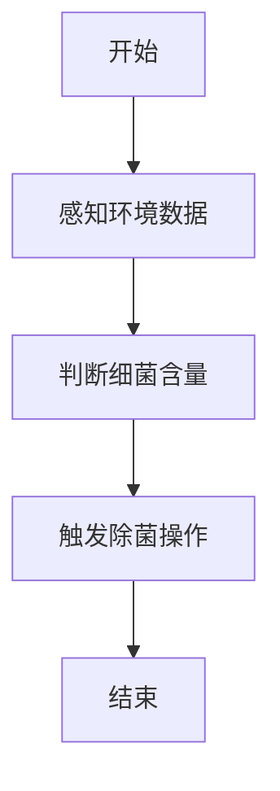
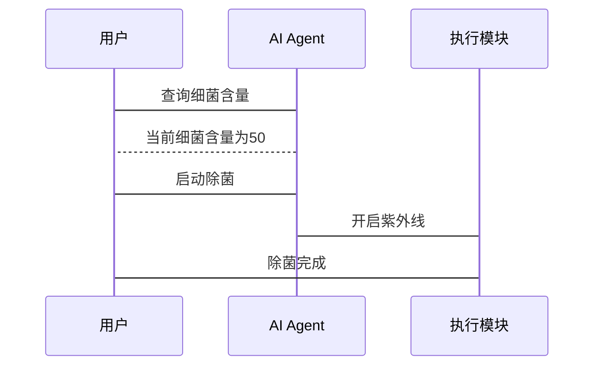

                 


# AI Agent在智能浴室毛巾架中的除菌功能

> 关键词：AI Agent, 除菌功能, 智能浴室, 物联网, 紫外线杀菌, 人工智能算法

> 摘要：本文探讨了AI Agent在智能浴室毛巾架除菌功能中的应用，从背景、原理到系统设计，再到项目实现，全面分析了该技术的实现细节和创新点。文章结合实际案例，详细讲解了AI Agent如何优化除菌功能，提供了系统的架构设计、算法实现和实际应用中的最佳实践。

---

# 第一部分: 背景介绍

## 第1章: 问题背景

### 1.1 智能浴室毛巾架的现状
- **智能浴室设备的普及**：现代浴室中，智能设备的应用越来越广泛，毛巾架作为常见的卫浴设备之一，也在逐步智能化。
- **除菌功能的需求**：随着人们对健康和卫生的关注度提高，除菌功能成为浴室设备的重要需求。
- **AI Agent的技术优势**：AI Agent能够通过感知环境、学习用户习惯，优化除菌功能的执行效率。

### 1.2 问题描述
- **除菌功能的核心挑战**：
  - 环境感知：如何准确感知毛巾的湿度、细菌含量等。
  - 智能决策：如何根据环境数据动态调整除菌策略。
  - 用户交互：如何与用户进行高效的信息传递。
- **AI Agent的作用**：通过智能化的感知和决策，提升除菌功能的效率和用户体验。

### 1.3 问题解决
- **AI Agent的核心价值**：通过实时感知和学习，优化除菌功能的执行过程。
- **技术实现路径**：结合物联网技术，构建智能毛巾架的除菌系统。

### 1.4 边界与外延
- **功能边界**：仅关注除菌功能，不涉及其他智能功能（如温度调节、湿度控制）。
- **技术外延**：除菌功能可能涉及紫外线杀菌、热风干燥等技术。

## 第2章: 核心概念与联系

### 2.1 AI Agent的核心要素
| 核心要素 | 描述 |
|----------|------|
| 知识表示 | 通过知识图谱表示除菌功能的相关知识。 |
| 行为推理 | 基于环境数据进行决策，触发除菌操作。 |
| 交互机制 | 与用户或系统进行信息交互。 |

### 2.2 除菌功能的核心要素
| 核心要素 | 描述 |
|----------|------|
| 感知模块 | 检测环境中的细菌含量、湿度等。 |
| 控制模块 | 调整紫外线强度、热风温度等参数。 |
| 执行模块 | 实现除菌操作。 |

### 2.3 AI Agent与除菌功能的关系
- **数据流**：AI Agent接收环境数据，通过算法决策后触发除菌操作。
- **控制流**：AI Agent通过接口与除菌设备进行交互。
- **信息流**：AI Agent与用户进行信息交互，提供实时反馈。

---

# 第二部分: 核心概念与联系

## 第3章: AI Agent的核心原理

### 3.1 知识表示
- **知识图谱的构建**：将除菌功能的相关知识表示为图结构，如细菌类型、除菌方法等。
- **实例**：通过图结构表示“紫外线杀菌对大肠杆菌有效”。

### 3.2 行为推理
- **逻辑推理**：基于知识图谱，推理出最优除菌策略。
- **实例**：当检测到细菌含量超标时，推理出需要开启紫外线杀菌。

### 3.3 交互机制
- **用户交互**：通过APP或语音助手与用户交互。
- **系统交互**：与智能家居系统（如智能音箱）进行联动。

## 第4章: 除菌功能的核心原理

### 4.1 紫外线杀菌原理
- **机制**：紫外线破坏细菌的DNA结构，使其无法繁殖。
- **优点**：高效、无残留。

### 4.2 热风干燥原理
- **机制**：通过高温杀死细菌，同时去除毛巾中的湿气。
- **优点**：快速、彻底。

### 4.3 智能控制算法
- **PID控制**：用于调节紫外线强度或热风温度。
- **实例**：根据细菌含量动态调整紫外线功率。

---

# 第三部分: 算法原理讲解

## 第5章: AI Agent的算法实现

### 5.1 算法流程图（Mermaid）


### 5.2 Python实现代码
```python
class AIAgent:
    def __init__(self):
        self.bacteria_threshold = 100  # 细菌含量阈值
    
    def感知环境数据(self):
        # 模拟环境数据获取
        return random.randint(0, 200)
    
    def 判断细菌含量(self, data):
        if data > self.bacteria_threshold:
            return True
        else:
            return False
    
    def 触发除菌操作(self):
        print("开启紫外线杀菌")
        # 调用除菌设备API
    
    def 运行(self):
        while True:
            data = self.感知环境数据()
            if self.判断细菌含量(data):
                self.触发除菌操作()
            time.sleep(60)  # 每分钟检测一次
```

### 5.3 数学模型
- **状态表示**：$s = (bacteria\_level, device\_status)$
- **动作选择**：$a = \argmax_{a} Q(s, a)$
- **奖励函数**：$r = 1 - bacteria\_level$

---

# 第四部分: 系统分析与架构设计

## 第6章: 系统架构设计

### 6.1 系统功能模块
- **环境感知模块**：采集细菌含量、湿度等数据。
- **AI Agent模块**：进行数据处理和决策。
- **执行模块**：控制除菌设备的运行。

### 6.2 系统架构图（Mermaid）


### 6.3 交互流程图（Mermaid）


---

# 第五部分: 项目实战

## 第7章: 实战指南

### 7.1 环境安装
- **工具安装**：
  - Python 3.8+
  - pip install mermaid
  - pip install pyyaml

### 7.2 核心代码实现
```python
import random
import time

class AIAgent:
    def __init__(self):
        self.bacteria_threshold = 100  # 细菌含量阈值
    
    def感知环境数据(self):
        # 模拟环境数据获取
        return random.randint(0, 200)
    
    def 判断细菌含量(self, data):
        if data > self.bacteria_threshold:
            return True
        else:
            return False
    
    def 触发除菌操作(self):
        print("开启紫外线杀菌")
        # 调用除菌设备API
    
    def 运行(self):
        while True:
            data = self.感知环境数据()
            if self.判断细菌含量(data):
                self.触发除菌操作()
            time.sleep(60)  # 每分钟检测一次
```

### 7.3 实际案例分析
- **案例1**：细菌含量为150，AI Agent触发紫外线杀菌。
- **案例2**：细菌含量为80，AI Agent不触发除菌。

---

# 第六部分: 最佳实践

## 第8章: 小结与展望

### 8.1 最佳实践
- **硬件选择**：优先选择支持物联网的除菌设备。
- **算法优化**：根据实际场景调整PID参数。
- **用户体验**：提供友好的交互界面和实时反馈。

### 8.2 注意事项
- **数据安全**：避免用户数据泄露。
- **设备兼容性**：确保系统支持多种除菌设备。

## 第9章: 拓展阅读

### 9.1 相关书籍
- 《AI Agent与智能系统》
- 《Python算法实战》

### 9.2 技术博客
- [AI Agent在智能家居中的应用](#)
- [物联网技术入门](#)

---

# 作者：AI天才研究院 & 禅与计算机程序设计艺术

通过本文的详细讲解，我们了解了AI Agent在智能浴室毛巾架除菌功能中的应用，从理论到实践，全面剖析了其实现过程和技术细节。希望本文能为相关领域的研究者和开发者提供有价值的参考。

