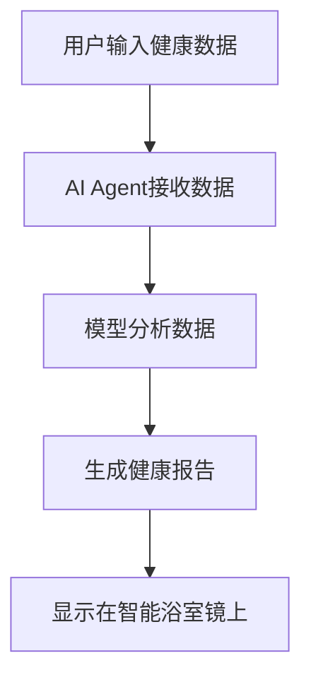
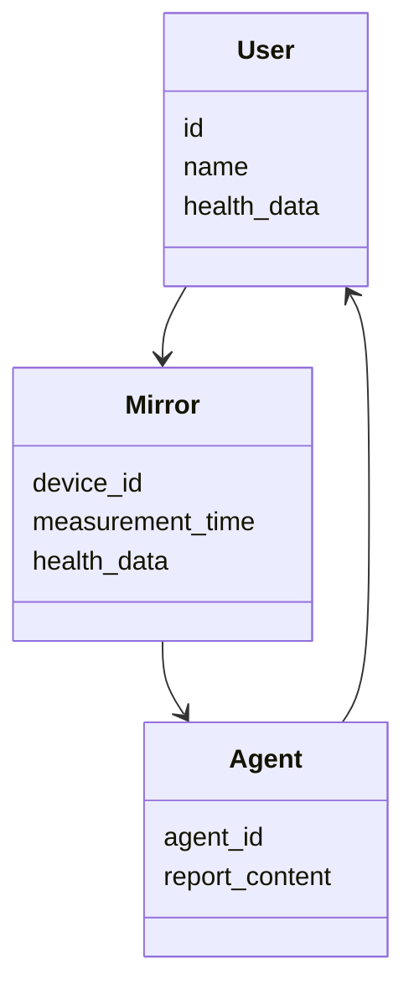
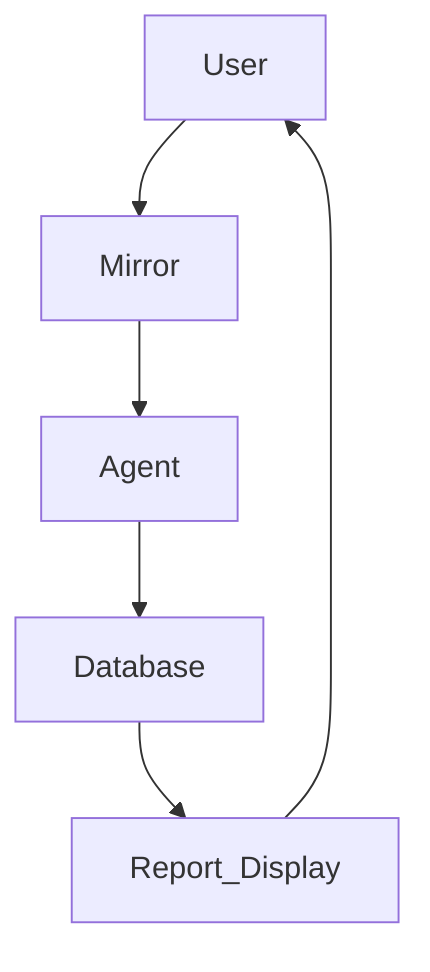
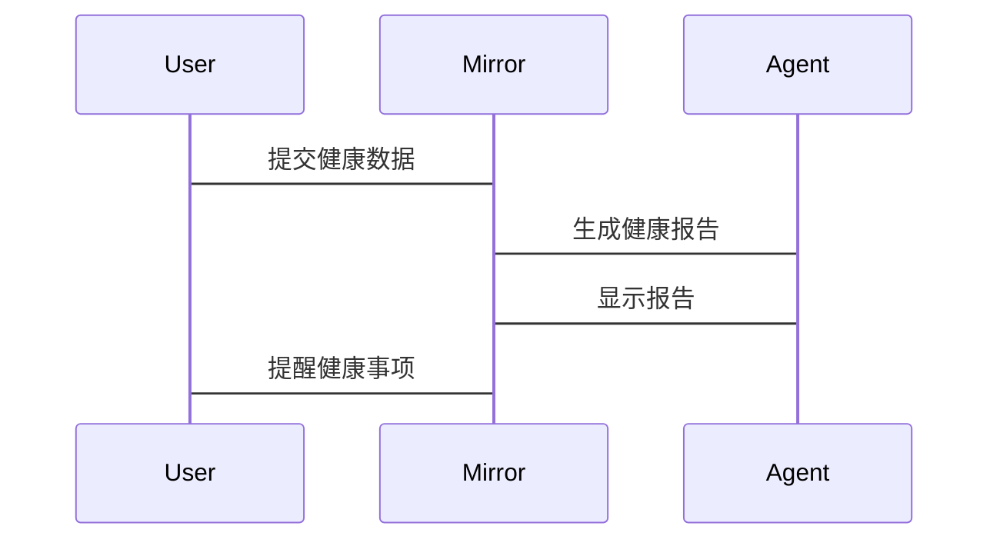

                 


# 《AI Agent在智能浴室镜中的每日健康报告》

---

## 关键词：
AI Agent, 智能浴室镜, 每日健康报告, 物联网, 人工智能, 健康管理

---

## 摘要：
本文深入探讨了AI Agent在智能浴室镜中的应用，详细讲解了其在每日健康报告中的工作原理和实际应用。通过分析系统架构、算法原理、项目实现等多方面内容，展示了如何利用AI技术提升健康管理的效率和精准度。文章从背景介绍到系统设计，再到项目实战，为读者提供了全面的技术解读和实践指导。

---

## 目录大纲

### 第1章：背景介绍
#### 1.1 问题背景
- 1.1.1 当前健康管理的趋势
- 1.1.2 智能浴室镜的发展现状
- 1.1.3 AI Agent在健康监测中的应用潜力

#### 1.2 问题描述
- 1.2.1 现有健康管理工具的局限性
- 1.2.2 智能浴室镜的使用场景分析
- 1.2.3 用户需求与痛点分析

#### 1.3 问题解决
- 1.3.1 AI Agent如何优化健康监测
- 1.3.2 智能浴室镜的功能扩展
- 1.3.3 提供个性化健康报告的价值

#### 1.4 边界与外延
- 1.4.1 系统的功能边界
- 1.4.2 与其他智能设备的协同
- 1.4.3 未来的扩展方向

#### 1.5 核心概念与核心要素
- 1.5.1 AI Agent的核心概念
- 1.5.2 智能浴室镜的功能构成
- 1.5.3 系统整体架构

---

### 第2章：核心概念与联系
#### 2.1 AI Agent与智能浴室镜的关系
- 2.1.1 AI Agent在系统中的角色
- 2.1.2 智能浴室镜的功能实现
- 2.1.3 两者协同工作的机制

#### 2.2 ER实体关系图
```mermaid
erDiagram
    user {
        id
        name
        age
        health_data
    }
    mirror {
        device_id
        user_id
        measurement_time
        health_data
    }
    agent {
        agent_id
        device_id
        user_id
        report_time
        report_content
    }
    user

    mirror -- user
    agent -- mirror
    agent -- user
```

---

### 第3章：算法原理讲解
#### 3.1 算法核心原理
- 3.1.1 自然语言处理在健康报告生成中的应用
- 3.1.2 机器学习模型的健康数据分析
- 3.1.3 算法流程图


#### 3.2 数学模型与公式
- 3.2.1 健康指数计算公式：
  $$健康指数 = \alpha \times 体重 + \beta \times 血压 + \gamma \times 心率$$
  其中，$\alpha = 0.4$，$\beta = 0.3$，$\gamma = 0.3$

- 3.2.2 数据分析模型：
  $$预测健康风险 = \theta_1 \times 历史数据 + \theta_2 \times 实时数据$$

#### 3.3 代码实现示例
- 3.3.1 环境安装
  ```bash
  pip install numpy scikit-learn
  ```
- 3.3.2 核心代码
  ```python
  import numpy as np
  from sklearn.linear_model import LinearRegression

  # 示例数据
  X = np.array([[70, 120, 70],
                [65, 130, 80],
                [75, 110, 75]])
  y = np.array([85, 88, 92])

  # 训练模型
  model = LinearRegression()
  model.fit(X, y)

  # 预测健康指数
  new_data = np.array([[70, 120, 70]])
  prediction = model.predict(new_data)
  print("预测健康指数：", prediction[0])
  ```

---

### 第4章：系统分析与架构设计
#### 4.1 项目场景介绍
- 智能浴室镜的用户使用场景
- 系统在家庭、健身房等场景的应用

#### 4.2 系统功能设计
- 4.2.1 领域模型


- 4.2.2 系统架构


#### 4.3 接口与交互设计
- 4.3.1 API接口定义
  ```json
  {
    "interface": "post_health_data",
    "description": "向智能浴室镜发送健康数据"
  }
  ```
- 4.3.2 序列图


---

### 第5章：项目实战
#### 5.1 环境安装与配置
- 5.1.1 安装Python和相关库
  ```bash
  pip install numpy pandas scikit-learn
  ```

#### 5.2 核心功能实现
- 5.2.1 数据采集模块
  ```python
  import numpy as np

  def collect_data():
      # 示例数据采集
      data = np.array([[70, 120, 70]])
      return data
  ```

- 5.2.2 AI Agent处理模块
  ```python
  from sklearn.linear_model import LinearRegression

  def process_data(data):
      model = LinearRegression()
      model.fit(data, np.array([85]))
      return model.predict(data)
  ```

#### 5.3 实际案例分析
- 案例一：用户健康数据的实时分析与报告生成
- 案例二：长期健康数据分析与趋势预测

#### 5.4 项目总结
- 实际应用中的注意事项
- 系统优化的方向
- 项目经验分享

---

### 第6章：最佳实践与拓展
#### 6.1 最佳实践 tips
- 数据隐私保护
- 系统稳定性优化
- 用户体验提升

#### 6.2 小结
- 本项目的核心成果与意义

#### 6.3 注意事项
- 开发中的常见问题与解决方案

#### 6.4 拓展阅读
- 推荐的相关技术书籍和资源

---

## 作者：
作者：AI天才研究院/AI Genius Institute  
联合作者：禅与计算机程序设计艺术 /Zen And The Art of Computer Programming

