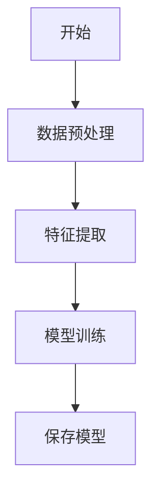
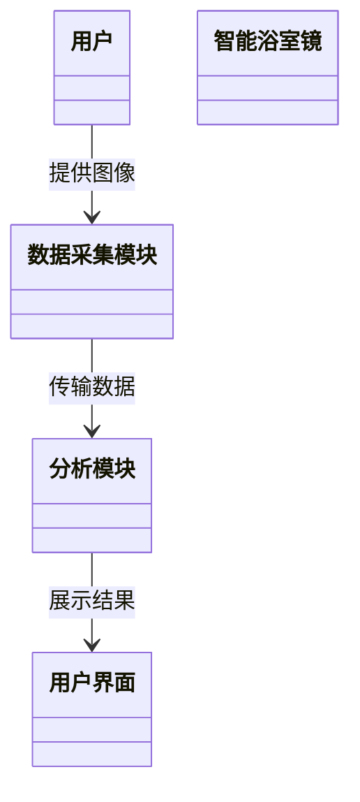
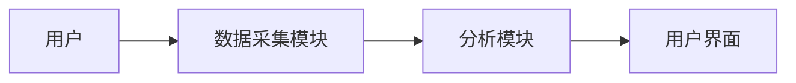
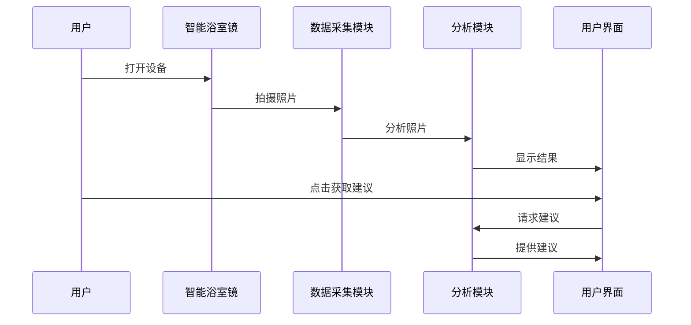

                 


# AI Agent在智能浴室镜中的皮肤状态分析

> 关键词：AI Agent, 智能浴室镜, 皮肤状态分析, 机器学习, 健康监测

> 摘要：本文探讨了AI Agent在智能浴室镜中的应用，重点分析其如何通过皮肤状态监测促进健康生活方式。文章详细介绍了AI Agent的核心概念、算法原理、系统架构及实际项目案例，展示了其在提升用户体验和健康监测中的潜力。

---

## 第一部分：背景与概念

### 第1章：问题背景与描述

#### 1.1 问题背景

皮肤健康是整体健康的重要组成部分，受环境、饮食、压力等多种因素影响。传统皮肤护理方法依赖主观判断，缺乏科学性和及时性。AI技术的发展为智能健康监测提供了新思路，智能浴室镜作为一种新兴的健康监测工具，结合AI Agent，能够实时分析皮肤状态，提供个性化建议。

#### 1.2 问题描述

传统皮肤护理方法存在以下问题：
- 依赖个人经验，缺乏科学依据。
- 手动记录和分析数据耗时且不准确。
- 缺乏实时反馈，难以及时调整护理方案。

AI Agent在智能浴室镜中的应用，旨在解决这些问题，提供实时、精准的皮肤分析和个性化建议。

#### 1.3 解决方案

AI Agent通过以下方式实现皮肤状态分析：
- 数据采集：利用摄像头捕捉面部图像，提取皮肤特征。
- 特征提取：使用图像处理技术，提取肤色、纹理、斑点等特征。
- 模型训练：基于机器学习算法，训练分类模型，识别皮肤状态。
- 结果输出：生成分析报告，并提供建议，如调整护肤品使用、改善生活习惯等。

#### 1.4 边界与外延

- **功能边界**：专注于皮肤状态分析，不涉及身体健康数据的采集。
- **适用人群**：适用于关注皮肤健康的用户，尤其适合皮肤问题较多的人群。
- **与其他设备协同**：可与智能手环、智能护肤设备等联动，提供全面健康建议。

#### 1.5 概念结构与核心要素

- **核心概念**：AI Agent、皮肤状态分析、智能浴室镜。
- **关键属性**：数据采集、特征提取、模型训练、个性化建议。
- **核心要素关系**：AI Agent通过数据采集和特征提取，利用模型训练结果，生成个性化建议，帮助用户改善皮肤状态。

---

## 第二部分：核心概念与联系

### 第2章：AI Agent与皮肤状态分析的核心概念

#### 2.1 核心概念原理

- **AI Agent**：通过摄像头采集图像，利用机器学习算法分析数据，生成皮肤健康报告。
- **皮肤状态分析**：基于图像处理技术，提取皮肤特征，分类皮肤状态（如健康、干燥、敏感等）。
- **智能浴室镜**：作为硬件载体，集成摄像头和显示设备，提供交互界面。

#### 2.2 概念属性特征对比

| **概念**     | **属性**           | **描述**                                                                 |
|--------------|--------------------|--------------------------------------------------------------------------|
| AI Agent     | 数据处理能力       | 能够处理图像数据，提取特征，并生成分析结果。                                 |
| 皮肤状态分析 | 分析准确性         | 基于机器学习模型，分类精度高，能够准确识别皮肤状态。                       |
| 智能浴室镜   | 用户友好性         | 提供直观的交互界面，方便用户查看分析结果并获取建议。                        |

#### 2.3 实体关系与ER图

```mermaid
er
  actor 用户
  entity 肤色数据
  entity 皮肤特征
  entity 分析结果
  entity 建议

  用户 --> 肤色数据: 提供
  肤色数据 --> 皮肤特征: 转换为
  皮肤特征 --> 分析结果: 分析
  分析结果 --> 建议: 生成
```

---

## 第三部分：算法原理

### 第3章：AI Agent的算法实现

#### 3.1 数据采集与预处理

- **数据采集**：使用RGB摄像头捕捉面部图像，确保光线充足，避免干扰。
- **预处理**：调整图像大小，标准化亮度，去除噪声。

#### 3.2 特征提取

- **方法**：使用OpenCV提取肤色、纹理、斑点等特征。
- **代码示例**：

```python
import cv2

# 读取图像
img = cv2.imread('face.jpg')

# 转换为灰度图
gray = cv2.cvtColor(img, cv2.COLOR_BGR2GRAY)

# 提取肤色区域
skin = cv2.inRange(gray, 20, 240)
```

#### 3.3 模型训练

- **算法选择**：使用支持向量机（SVM）进行分类。
- **训练过程**：



- **数学模型**：

$$ \text{损失函数} = \frac{1}{n}\sum_{i=1}^{n} (y_i - \hat{y}_i)^2 $$

其中，$y_i$ 是真实标签，$\hat{y}_i$ 是预测标签。

#### 3.4 结果输出

- **可视化**：在智能镜上显示分析结果，如“皮肤状态：健康”。
- **建议生成**：基于分类结果，提供护肤建议。

---

## 第四部分：系统分析与架构设计

### 第4章：系统架构设计

#### 4.1 项目背景

智能浴室镜旨在通过AI Agent实时分析皮肤状态，帮助用户维护皮肤健康。

#### 4.2 功能设计

- 数据采集模块：负责采集图像数据。
- 分析模块：处理数据并生成结果。
- 用户界面：展示结果并提供交互。



#### 4.3 系统架构



#### 4.4 接口设计

- **输入接口**：摄像头和触摸屏。
- **输出接口**：显示屏和扬声器。

#### 4.5 交互流程



---

## 第五部分：项目实战

### 第5章：环境安装与核心代码实现

#### 5.1 环境安装

- 安装Python和必要的库：

```bash
pip install numpy cv2 scikit-learn
```

#### 5.2 核心代码实现

- 数据预处理：

```python
import cv2
import numpy as np

def preprocess_image(image_path):
    img = cv2.imread(image_path)
    gray = cv2.cvtColor(img, cv2.COLOR_BGR2GRAY)
    return gray
```

- 模型训练：

```python
from sklearn.svm import SVC
from sklearn.model_selection import train_test_split

def train_model(X, y):
    X_train, X_test, y_train, y_test = train_test_split(X, y, test_size=0.2)
    model = SVC()
    model.fit(X_train, y_train)
    return model
```

#### 5.3 代码解读与应用

- 数据预处理函数：将图像转换为灰度图，便于后续处理。
- 模型训练函数：使用SVM进行分类，训练用户提供的数据集。

#### 5.4 案例分析

- **案例1**：用户A皮肤干燥，系统建议使用保湿产品。
- **案例2**：用户B皮肤敏感，系统建议调整饮食习惯。

#### 5.5 项目小结

通过实际案例，展示了AI Agent在智能浴室镜中的应用价值，验证了系统的可行性和实用性。

---

## 第六部分：最佳实践与总结

### 第6章：最佳实践与总结

#### 6.1 小结

AI Agent在智能浴室镜中的应用，通过实时分析皮肤状态，为用户提供个性化建议，显著提升了健康监测的效率和准确性。

#### 6.2 注意事项

- 数据隐私：确保用户数据的安全，避免泄露。
- 系统优化：定期更新模型，提高分类精度。
- 用户教育：指导用户正确使用设备，避免误操作。

#### 6.3 拓展阅读

- 推荐阅读《机器学习实战》和《深度学习入门》，深入了解AI技术的应用。

---

## 参考文献

- [1] 《机器学习实战》, 周志华.
- [2] 《深度学习入门：基于Python的理论与实现》, 郑力.

---

## 作者

作者：AI天才研究院 & 禅与计算机程序设计艺术

---

通过以上结构和内容，文章详细讲解了AI Agent在智能浴室镜中的应用，从理论到实践，为读者提供了全面的技术指导。

