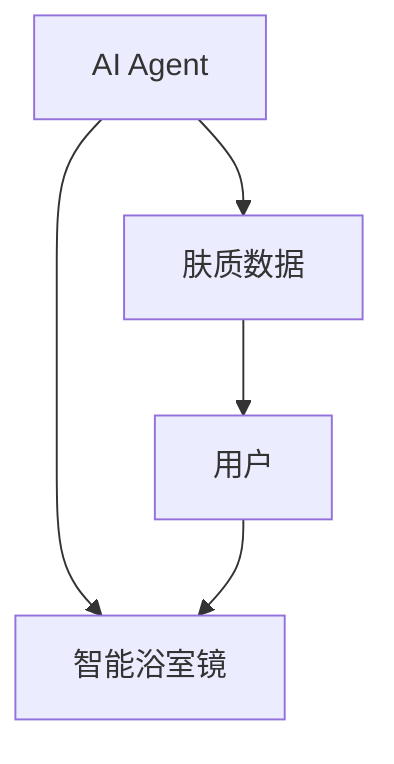
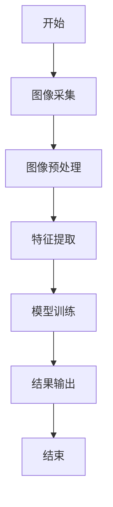
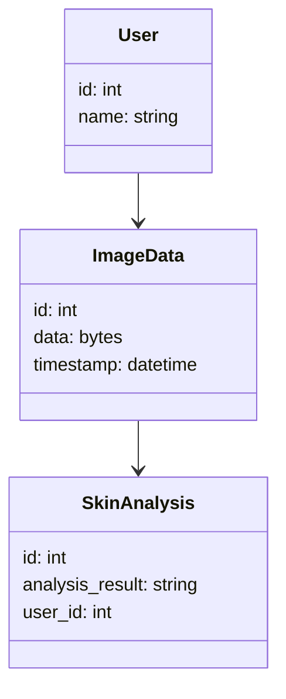
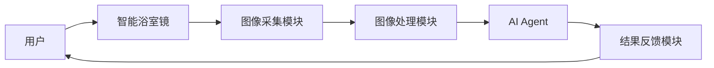
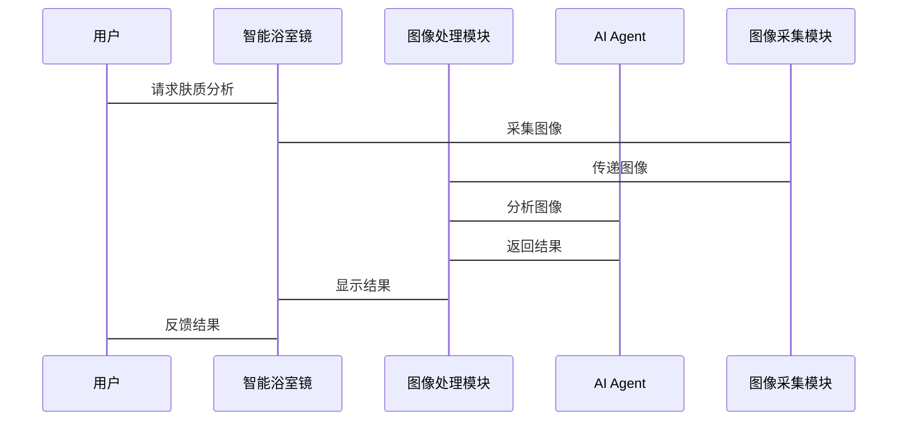

                 


# AI Agent在智能浴室镜中的肤质分析

> 关键词：AI Agent, 智能浴室镜, 肤质分析, 图像处理, 深度学习, 机器学习

> 摘要：本文探讨了AI Agent在智能浴室镜中的应用，重点分析其在肤质分析中的技术实现。文章从背景介绍、核心概念、算法原理、系统架构到项目实战，全面阐述了AI Agent如何通过图像处理和深度学习技术实现对用户肤质的智能分析。文章最后总结了AI Agent在智能浴室镜中的应用价值，并展望了未来的发展方向。

---

# 第一部分: AI Agent与智能浴室镜的背景与概念

## 第1章: AI Agent与智能浴室镜的背景介绍

### 1.1 AI Agent的基本概念

#### 1.1.1 AI Agent的定义与特点

AI Agent（人工智能代理）是指能够感知环境、自主决策并执行任务的智能实体。其核心特点包括：

- **自主性**：能够独立执行任务，无需人工干预。
- **反应性**：能够实时感知环境变化并做出响应。
- **学习能力**：通过数据和经验不断优化自身性能。
- **交互性**：能够与用户或其他系统进行有效交互。

#### 1.1.2 AI Agent的核心要素与功能

AI Agent的核心要素包括感知模块、决策模块、执行模块和学习模块。其主要功能包括数据采集、信息处理、决策制定和任务执行。

#### 1.1.3 AI Agent在智能设备中的应用

AI Agent广泛应用于智能家居、自动驾驶、医疗设备等领域。在智能浴室镜中，AI Agent主要用于数据采集、用户识别和个性化服务提供。

### 1.2 智能浴室镜的功能与应用场景

#### 1.2.1 智能浴室镜的功能模块

智能浴室镜的功能模块包括：

- **显示功能**：实时显示天气、时间、日历等信息。
- **智能照明**：根据环境光线自动调节亮度。
- **语音控制**：支持语音交互，如播放音乐、设置提醒等。
- **健康监测**：通过AI Agent分析用户肤质、监测心率等。

#### 1.2.2 智能浴室镜的用户场景分析

用户场景包括早晨使用浴室镜查看天气和肤质、晚上使用浴室镜设置闹钟等。不同场景下，浴室镜的功能需求有所差异。

#### 1.2.3 智能浴室镜的技术背景与发展趋势

智能浴室镜的技术背景包括物联网、人工智能和大数据分析。发展趋势是智能化、个性化和多功能化。

### 1.3 肤质分析的定义与技术背景

#### 1.3.1 肤质分析的基本概念

肤质分析是指通过技术手段对皮肤状态进行评估的过程，包括皮肤颜色、纹理、水分含量等指标。

#### 1.3.2 肤质分析的技术方法与挑战

常用技术方法包括图像处理、机器学习和深度学习。主要挑战是数据获取难、算法精度低和用户隐私保护。

#### 1.3.3 肤质分析在智能浴室镜中的应用价值

在智能浴室镜中，肤质分析能够提供个性化的护肤建议，帮助用户更好地管理皮肤健康。

### 1.4 问题背景与解决方案

#### 1.4.1 肤质分析的常见问题与挑战

- 数据获取难：需要高精度的图像采集设备。
- 算法精度低：需要大量标注数据进行训练。
- 用户隐私保护：需要确保数据的安全性。

#### 1.4.2 AI Agent在肤质分析中的作用

AI Agent能够实时采集数据、分析肤质并提供个性化建议，提升用户体验。

#### 1.4.3 智能浴室镜中AI Agent的实现方案

通过AI Agent实现图像采集、数据处理和结果反馈的闭环流程。

---

## 第2章: AI Agent与肤质分析的核心概念与联系

### 2.1 核心概念原理

#### 2.1.1 AI Agent的核心原理

AI Agent通过感知环境、分析数据、制定决策和执行任务来实现智能化功能。

#### 2.1.2 肤质分析的关键技术

- **图像处理**：包括图像增强、特征提取等技术。
- **机器学习**：利用算法模型对数据进行分类和回归分析。
- **深度学习**：通过神经网络模型实现图像识别和分类。

#### 2.1.3 AI Agent与肤质分析的结合机制

AI Agent通过调用肤质分析算法，对用户皮肤数据进行实时处理，并提供个性化建议。

### 2.2 核心概念对比分析

#### 2.2.1 AI Agent与传统计算机视觉的对比

- **AI Agent**：具有自主性和学习能力，能够实时响应。
- **传统计算机视觉**：依赖于预处理和固定算法，不具备自主性。

#### 2.2.2 肤质分析与其他图像处理技术的对比

- **图像分割**：专注于分割图像区域，不涉及特征分析。
- **图像识别**：侧重于物体识别，不涉及深度分析。

#### 2.2.3 AI Agent在肤质分析中的优势

- 实时性：能够快速响应用户需求。
- 个性化：根据用户数据提供定制化服务。
- 智能性：能够不断优化分析结果。

### 2.3 ER实体关系图



---

## 第3章: AI Agent在肤质分析中的算法原理

### 3.1 算法原理概述

#### 3.1.1 基于机器学习的肤质分析

- **分类算法**：如支持向量机（SVM）、随机森林（Random Forest）。
- **回归算法**：如线性回归、岭回归（Ridge Regression）。

#### 3.1.2 基于深度学习的肤质分析

- **卷积神经网络（CNN）**：用于图像特征提取和分类。
- **迁移学习**：利用预训练模型加速训练过程。

#### 3.1.3 算法选择与优化

选择适合数据量和任务需求的算法，并通过超参数调优和模型优化提升性能。

### 3.2 算法流程图



### 3.3 算法实现代码

```python
import keras
from keras.models import Sequential
from keras.layers import Conv2D, MaxPooling2D, Flatten, Dense

model = Sequential()
model.add(Conv2D(32, (3,3), activation='relu', input_shape=(64, 64, 3)))
model.add(MaxPooling2D(pool_size=(2,2)))
model.add(Flatten())
model.add(Dense(128, activation='relu'))
model.add(Dense(10, activation='softmax'))
model.compile(optimizer='adam', loss='categorical_crossentropy', metrics=['accuracy'])
```

### 3.4 数学模型与公式

#### 3.4.1 线性回归模型

$$ y = \beta_0 + \beta_1x + \epsilon $$

其中，$y$ 是预测值，$\beta_0$ 是截距，$\beta_1$ 是回归系数，$x$ 是自变量，$\epsilon$ 是误差项。

#### 3.4.2 卷积神经网络模型

$$ f(x) = \sigma(Wx + b) $$

其中，$W$ 是权重矩阵，$b$ 是偏置项，$\sigma$ 是激活函数。

---

## 第4章: 系统分析与架构设计

### 4.1 系统功能设计

智能浴室镜的系统功能包括：

- **用户识别**：通过人脸识别技术识别用户。
- **数据采集**：采集用户的面部图像。
- **肤质分析**：对图像进行处理和分析。
- **结果反馈**：将分析结果反馈给用户。

### 4.2 系统架构设计

#### 4.2.1 领域模型类图



#### 4.2.2 系统架构图



#### 4.2.3 系统交互序列图



---

## 第5章: 项目实战

### 5.1 环境安装

#### 5.1.1 安装Python和相关库

```bash
pip install numpy
pip install matplotlib
pip install scikit-learn
pip install keras
pip install tensorflow
```

### 5.2 核心代码实现

#### 5.2.1 图像预处理代码

```python
import cv2
import numpy as np

def preprocess_image(image_path):
    image = cv2.imread(image_path)
    image = cv2.resize(image, (64, 64))
    image = image.astype(np.float32) / 255.0
    return image
```

#### 5.2.2 模型训练代码

```python
model = Sequential()
model.add(Conv2D(32, (3,3), activation='relu', input_shape=(64, 64, 3)))
model.add(MaxPooling2D(pool_size=(2,2)))
model.add(Flatten())
model.add(Dense(128, activation='relu'))
model.add(Dense(10, activation='softmax'))
model.compile(optimizer='adam', loss='categorical_crossentropy', metrics=['accuracy'])
model.fit(X_train, y_train, epochs=10, batch_size=32)
```

#### 5.2.3 模型预测代码

```python
def predict_skin_type(model, image):
    prediction = model.predict(image)
    predicted_class = np.argmax(prediction)
    return predicted_class
```

### 5.3 实际案例分析

#### 5.3.1 案例一：油性皮肤分析

用户A的皮肤被分类为油性皮肤，AI Agent建议使用控油产品。

#### 5.3.2 案例二：干性皮肤分析

用户B的皮肤被分类为干性皮肤，AI Agent建议使用保湿产品。

### 5.4 项目小结

通过实际案例分析，验证了AI Agent在智能浴室镜中的肤质分析功能的有效性。

---

## 第6章: 最佳实践与总结

### 6.1 小结

本文详细介绍了AI Agent在智能浴室镜中的肤质分析技术，从背景介绍、核心概念、算法原理到系统架构和项目实战，全面探讨了其实现过程。

### 6.2 注意事项

- 数据隐私保护：确保用户数据的安全性。
- 算法优化：不断提升模型的准确性和效率。
- 用户体验：设计直观易用的界面和反馈机制。

### 6.3 拓展阅读

- 《深度学习实战》
- 《AI Agent开发指南》
- 《图像处理技术与应用》

---

## 作者信息

作者：AI天才研究院/AI Genius Institute & 禅与计算机程序设计艺术/Zen And The Art of Computer Programming

