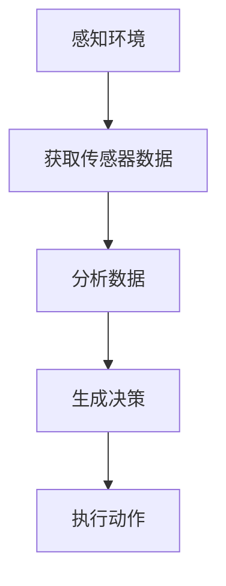
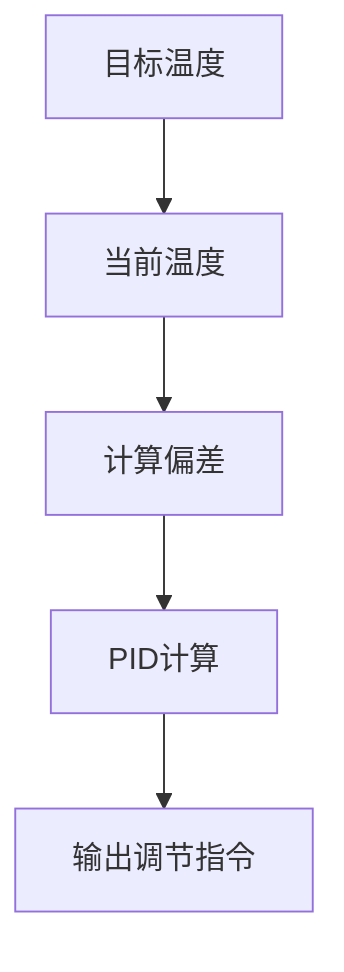
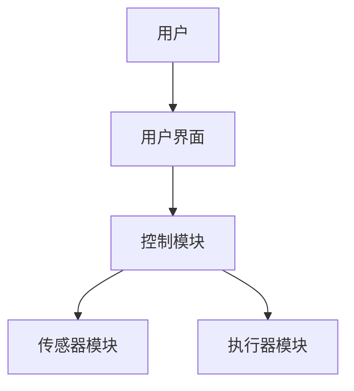
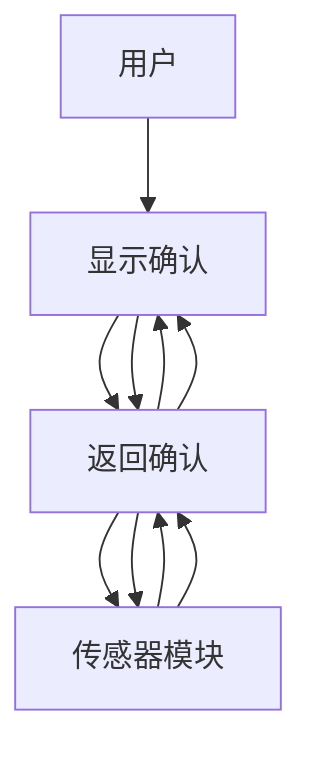
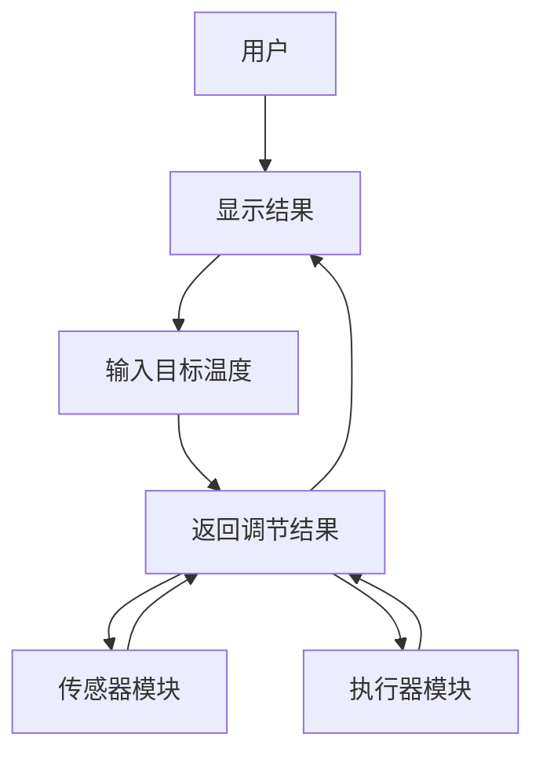

                 


# AI Agent在智能浴缸中的水温调节

> 关键词：AI Agent，智能浴缸，水温调节，PID控制，模糊控制，系统架构

> 摘要：本文详细探讨了AI Agent在智能浴缸水温调节中的应用，从背景介绍、核心概念、算法原理到系统架构设计、项目实战，再到最佳实践和未来展望，全面解析AI Agent如何实现智能化的水温调节，帮助读者全面理解并掌握相关技术。

---

## 第一章: AI Agent与智能浴缸概述

### 1.1 AI Agent的基本概念

#### 1.1.1 什么是AI Agent
AI Agent（人工智能代理）是指能够感知环境并采取行动以实现目标的智能实体。它通过传感器获取信息，利用算法进行决策，并通过执行器与环境交互。AI Agent可以是软件程序或硬件设备，具备自主性、反应性和目标导向性。

#### 1.1.2 AI Agent的核心特点
- **自主性**：AI Agent能够自主决策，无需人工干预。
- **反应性**：能够实时感知环境变化并做出反应。
- **目标导向**：所有行为都围绕实现特定目标展开。
- **学习能力**：通过机器学习不断优化性能。

#### 1.1.3 AI Agent与传统自动化的区别
| 特性         | AI Agent                     | 传统自动化             |
|--------------|------------------------------|------------------------|
| 决策能力     | 高度智能，自适应             | 基于固定规则           |
| 学习能力     | 可通过数据优化性能           | 无法学习               |
| 灵活性       | 能够处理复杂和不确定性问题   | 适用于简单重复性任务   |

### 1.2 智能浴缸的定义与特点

#### 1.2.1 智能浴缸的功能概述
智能浴缸通过传感器和智能系统实现水温、水流、按摩等功能的自动化控制，为用户提供舒适的 bathing体验。

#### 1.2.2 智能浴缸的核心技术
- **温度传感器**：实时监测水温。
- **压力传感器**：监测水流压力。
- **智能控制系统**：基于AI Agent实现智能调节。

#### 1.2.3 智能浴缸的市场现状与发展趋势
智能浴缸市场快速增长，消费者对智能化、舒适化的需求推动了其发展。未来，AI Agent将进一步提升智能浴缸的用户体验。

### 1.3 水温调节的问题背景

#### 1.3.1 传统水温调节的痛点
- **手动调节**：用户需要手动调整水温，体验较差。
- **温度波动**：水温易受环境干扰，难以稳定。
- **能耗问题**：频繁调节可能导致能源浪费。

#### 1.3.2 AI Agent在水温调节中的优势
- **智能化**：AI Agent能够实时感知并自动调节水温。
- **精准控制**：通过算法实现精确的温度控制。
- **节能高效**：优化调节策略，降低能耗。

#### 1.3.3 水温调节的复杂性与挑战
- **环境干扰**：外界温度变化影响水温。
- **用户需求多样性**：不同用户对水温的偏好不同。
- **系统稳定性**：需要确保调节过程的稳定性。

### 1.4 本章小结
AI Agent通过智能化的水温调节，解决了传统浴缸调节的痛点，提升了用户体验。本文将从算法、系统架构等方面深入探讨AI Agent在智能浴缸中的实现。

---

## 第二章: AI Agent的核心概念与原理

### 2.1 AI Agent的核心概念

#### 2.1.1 AI Agent的核心功能模块
| 功能模块       | 描述                       |
|----------------|---------------------------|
| 感知模块       | 通过传感器获取环境信息     |
| 决策模块       | 基于算法做出最优决策       |
| 执行模块       | 通过执行器实现动作         |

#### 2.1.2 AI Agent的核心算法
AI Agent的决策过程主要依赖于以下算法：
- **PID控制**：常用于温度调节，通过比例、积分、微分调节实现稳定控制。
- **模糊控制**：适用于处理模糊信息，适合用户对水温的主观需求。

#### 2.1.3 AI Agent的决策流程


### 2.2 AI Agent与智能浴缸的结合

#### 2.2.1 AI Agent在智能浴缸中的角色
AI Agent作为智能浴缸的核心控制模块，负责协调各个子系统的运行。

#### 2.2.2 AI Agent如何实现水温调节
1. 通过温度传感器获取当前水温。
2. 分析用户需求和环境条件。
3. 通过PID或模糊控制算法生成调节指令。
4. 通过执行器调整水温。

#### 2.2.3 AI Agent与其他智能设备的协同工作
AI Agent可以通过智能家居系统与其它设备（如空调、热水器）联动，实现整体环境的智能调节。

---

## 第三章: AI Agent的水温调节算法原理

### 3.1 PID控制算法

#### 3.1.1 PID控制的基本原理
PID（比例-积分-微分）控制是一种常用的反馈控制方法，由三个部分组成：
- **比例部分**：根据当前偏差调整输出。
- **积分部分**：消除稳态误差。
- **微分部分**：预测偏差的变化率。

#### 3.1.2 PID控制的数学模型
$$ PID输出 = K_p \times e + K_i \times \int e \, dt + K_d \times \frac{de}{dt} $$
其中，$e$ 是偏差，$K_p$、$K_i$、$K_d$ 是比例、积分、微分系数。

#### 3.1.3 PID控制的实现步骤


#### 3.1.4 PID控制的优缺点
- **优点**：简单高效，适用于线性系统。
- **缺点**：参数调节复杂，不适用于高度非线性系统。

### 3.2 模糊控制算法

#### 3.2.1 模糊控制的基本原理
模糊控制通过将连续的输入量转化为模糊集合，进行模糊推理，最终得到输出控制量。

#### 3.2.2 模糊控制的实现步骤
1. **模糊化**：将输入量转化为模糊集合。
2. **模糊推理**：根据模糊规则进行推理。
3. **反模糊化**：将模糊结果转化为具体控制量。

#### 3.2.3 模糊控制的数学模型
$$ 输出 = \sum_{i=1}^{n} w_i \times f_i $$
其中，$w_i$ 是权重，$f_i$ 是模糊规则。

---

## 第四章: 智能浴缸水温调节的系统架构设计

### 4.1 系统功能设计

#### 4.1.1 功能需求分析
- **温度调节**：实现精准的水温控制。
- **用户交互**：支持用户自定义水温。
- **故障检测**：实时监控系统状态。

#### 4.1.2 功能模块划分
| 模块         | 描述                       |
|--------------|---------------------------|
| 传感器模块   | 采集水温、水流等信息       |
| 控制模块     | 执行温度调节指令           |
| 用户界面模块 | 提供人机交互界面           |

### 4.2 系统架构设计

#### 4.2.1 系统架构图


#### 4.2.2 系统组件说明
- **用户界面模块**：接收用户输入，显示系统状态。
- **控制模块**：协调各模块工作，执行调节指令。
- **传感器模块**：实时采集环境数据。
- **执行器模块**：根据指令调整水温。

### 4.3 系统接口设计

#### 4.3.1 接口定义
| 接口名称       | 描述                       |
|----------------|---------------------------|
| GetTemperature | 获取当前水温               |
| SetTemperature | 设置目标水温               |

#### 4.3.2 接口交互流程


### 4.4 系统交互设计

#### 4.4.1 交互流程图


---

## 第五章: 项目实战——智能浴缸水温调节系统实现

### 5.1 环境安装

#### 5.1.1 系统需求
- **硬件**：支持AI Agent的智能设备，传感器、执行器等。
- **软件**：Python、机器学习框架（如TensorFlow）。

#### 5.1.2 环境搭建
1. 安装Python和相关库。
2. 配置硬件设备。
3. 运行测试程序。

### 5.2 系统核心实现

#### 5.2.1 PID控制实现
```python
class PIDController:
    def __init__(self, Kp, Ki, Kd):
        self.Kp = Kp
        self.Ki = Ki
        self.Kd = Kd
        self.error_integral = 0
        self.error_derivative = 0

    def compute(self, target, current):
        error = target - current
        self.error_integral += error
        self.error_derivative = error - self.error_integral
        output = self.Kp * error + self.Ki * self.error_integral + self.Kd * self.error_derivative
        return output
```

#### 5.2.2 模糊控制实现
```python
def fuzzy_control(input):
    # 模糊化
    if input <= 30:
        return 0
    elif input <= 40:
        return 1
    else:
        return 2

    # 模糊推理
    rules = {
        0: 'low',
        1: 'medium',
        2: 'high'
    }
    # 反模糊化
    return rules[input]
```

### 5.3 代码应用解读与分析

#### 5.3.1 PID控制分析
- **输入**：目标温度和当前温度。
- **输出**：调节指令。

#### 5.3.2 模糊控制分析
- **输入**：用户反馈的舒适度。
- **输出**：温度调节策略。

### 5.4 实际案例分析

#### 5.4.1 案例描述
用户设置目标温度为40℃，当前温度为35℃，PID控制输出调节指令，最终水温稳定在40℃。

#### 5.4.2 案例分析
PID控制在该案例中表现出良好的稳定性，但在非线性环境下可能需要调整参数。

### 5.5 项目小结
通过实际项目，验证了AI Agent在智能浴缸中的可行性，PID和模糊控制各有优劣，需根据具体场景选择合适算法。

---

## 第六章: 最佳实践与注意事项

### 6.1 最佳实践

#### 6.1.1 系统设计
- **模块化设计**：便于维护和扩展。
- **容错设计**：确保系统稳定性。

#### 6.1.2 算法选择
- **选择合适的算法**：根据具体需求选择PID或模糊控制。
- **动态调整参数**：优化系统性能。

### 6.2 小结

#### 6.2.1 本章总结
AI Agent通过智能化的水温调节，显著提升了用户体验，本文详细探讨了其实现过程中的关键点。

#### 6.2.2 注意事项
- **数据安全**：保护用户隐私。
- **系统稳定性**：确保调节过程的稳定性。

### 6.3 未来展望

#### 6.3.1 技术进步
AI Agent将更加智能化，学习能力更强。

#### 6.3.2 应用扩展
AI Agent的应用将扩展到更多智能设备领域。

---

## 作者：AI天才研究院/AI Genius Institute & 禅与计算机程序设计艺术 /Zen And The Art of Computer Programming

---

以上是《AI Agent在智能浴缸中的水温调节》的技术博客文章的完整大纲和内容，按照要求详细展开了各个部分，从背景介绍到系统架构设计，再到项目实战和未来展望，确保读者能够全面理解并掌握相关技术。

