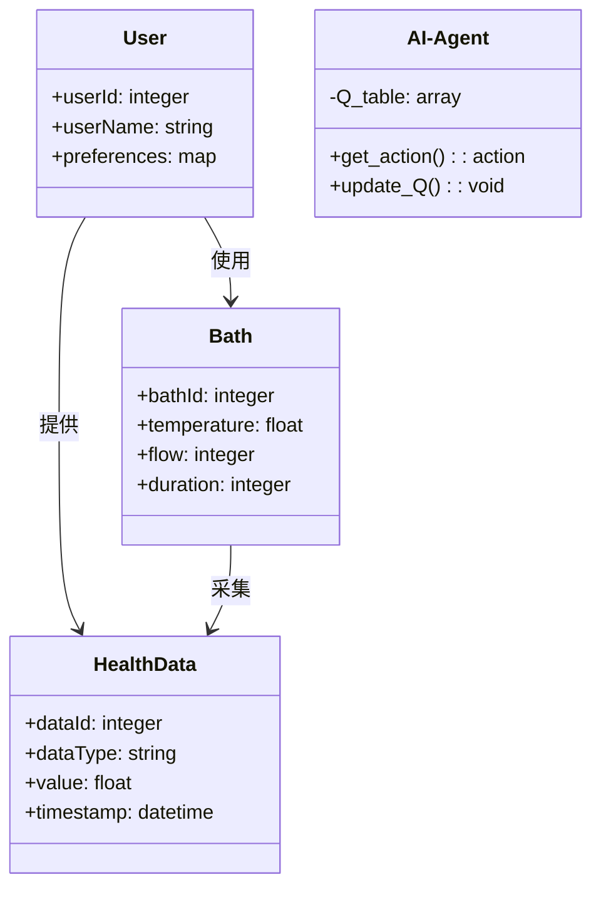
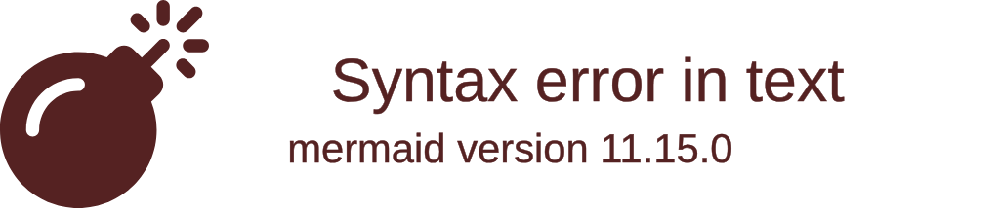
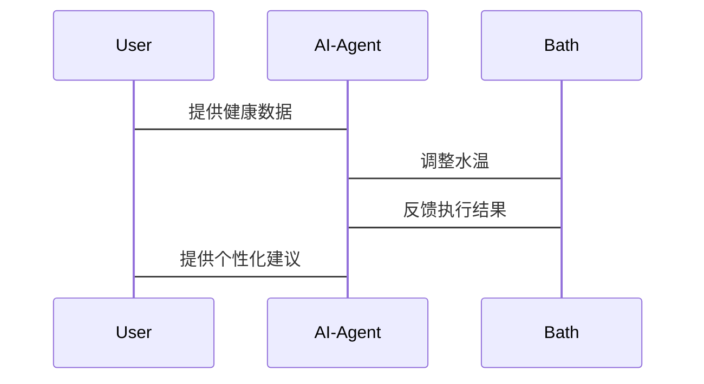

                 


# AI Agent在智能浴缸中的水疗养生定制系统

## 关键词：AI Agent，智能浴缸，水疗养生，系统架构，算法原理

## 摘要：本文详细探讨了AI Agent在智能浴缸中的应用，特别是在水疗养生定制系统中的设计与实现。通过分析系统背景、核心概念、算法原理、系统架构和项目实战，深入阐述了AI Agent如何优化用户体验，提供个性化的水疗养生方案。

---

# 第一部分：AI Agent 在智能浴缸中的水疗养生定制系统背景介绍

## 第1章：问题背景与描述

### 1.1 问题背景

#### 1.1.1 当前水疗养生系统的现状
传统的水疗养生系统主要依赖手动操作，用户需要根据自身需求调节水温、水流强度和按摩模式。这种方式效率低下，难以满足个性化需求，且缺乏智能化支持。

#### 1.1.2 智能浴缸的发展趋势
随着人工智能技术的快速发展，智能浴缸逐渐成为智能家居的重要组成部分。用户对智能化、个性化和高效化的水疗养生系统的需求日益增长。

#### 1.1.3 AI Agent 在水疗养生中的应用潜力
AI Agent（智能体）可以通过学习用户的行为模式和偏好，主动提供个性化的水疗养生方案，显著提升用户体验。

### 1.2 问题描述

#### 1.2.1 水疗养生系统的核心需求
- 提供个性化的水疗方案
- 实现智能调节水温、水流和按摩模式
- 提供健康数据监测和分析

#### 1.2.2 智能浴缸的用户痛点
- 缺乏智能化的个性化服务
- 用户操作复杂，难以快速调整水疗参数
- 缺乏健康数据分析和建议

#### 1.2.3 AI Agent 在系统中的角色定位
AI Agent作为系统的智能核心，负责数据采集、分析、决策和执行，为用户提供智能化的水疗养生服务。

### 1.3 问题解决

#### 1.3.1 AI Agent 如何优化水疗养生体验
AI Agent通过学习用户的健康数据和偏好，主动调整水疗参数，提供个性化服务。

#### 1.3.2 系统功能目标
- 实现AI Agent与智能浴缸的无缝集成
- 提供个性化的水疗方案
- 支持健康数据的采集与分析

#### 1.3.3 解决方案的可行性分析
- 技术可行性：AI Agent和物联网技术的结合已经较为成熟
- 用户需求可行性：用户对智能化水疗系统的需求日益增长
- 经济可行性：智能浴缸的市场逐渐扩大，具备商业化潜力

### 1.4 边界与外延

#### 1.4.1 系统边界
- 系统仅限于智能浴缸内部的水疗功能优化
- 外部数据源（如天气、健康数据）可通过API接口接入

#### 1.4.2 功能的外延与扩展
- 可扩展至其他智能家居设备，形成完整的健康生态
- 支持更多健康数据的采集与分析

#### 1.4.3 系统与外部环境的交互
- 通过API接口与健康监测设备（如智能手环）交互
- 支持用户通过手机APP远程控制系统

### 1.5 概念结构与核心要素

#### 1.5.1 系统架构的核心要素
- AI Agent：系统的核心智能模块
- 智能浴缸：物理设备，负责执行AI Agent的指令
- 用户：系统的最终使用者
- 健康数据：系统的输入和优化依据

#### 1.5.2 各要素之间的关系
- AI Agent接收用户的健康数据和偏好
- 根据数据优化水疗方案
- 智能浴缸执行优化后的方案
- 用户反馈进一步优化系统

---

## 第2章：核心概念与联系

### 2.1 AI Agent 的核心原理

#### 2.1.1 AI Agent 的定义
AI Agent是一种能够感知环境、自主决策并执行任务的智能实体。在智能浴缸中，AI Agent负责分析用户的健康数据，优化水疗方案。

#### 2.1.2 AI Agent 的核心功能
- 数据采集与分析：收集用户的健康数据和偏好
- 个性化推荐：根据数据推荐最优的水疗方案
- 自动调节：根据反馈实时调整水疗参数

#### 2.1.3 AI Agent 的工作流程
1. 数据采集：通过传感器获取用户的健康数据和环境数据
2. 数据分析：利用机器学习算法分析数据，识别用户的偏好和健康状况
3. 个性化推荐：根据分析结果生成个性化的水疗方案
4. 执行优化：调整智能浴缸的水温、水流和按摩模式

### 2.2 AI Agent 与水疗养生系统的联系

#### 2.2.1 AI Agent 在水疗养生中的应用场景
- 根据用户的健康数据推荐水温
- 根据用户情绪调整水流强度
- 根据运动数据优化按摩模式

#### 2.2.2 系统功能的实现方式
- AI Agent通过传感器采集数据
- 利用算法分析数据并生成指令
- 智能浴缸执行指令并反馈结果

#### 2.2.3 系统性能的优化策略
- 使用强化学习优化AI Agent的决策算法
- 定期更新AI模型以提升推荐准确性

### 2.3 核心概念的属性对比

#### 2.3.1 AI Agent 的属性特征
| 属性 | 描述 |
|------|------|
| 感知能力 | 能够感知环境和用户需求 |
| 学习能力 | 能够通过数据学习优化方案 |
| 决策能力 | 能够根据数据做出最优决策 |

#### 2.3.2 水疗养生系统的属性特征
| 属性 | 描述 |
|------|------|
| 智能调节 | 能够根据用户需求调整水温、水流和按摩模式 |
| 个性化服务 | 提供基于用户数据的个性化水疗方案 |
| 数据采集 | 能够采集用户的健康数据 |

#### 2.3.3 两者属性的对比分析
AI Agent的感知、学习和决策能力是水疗养生系统实现智能化的核心。水疗系统的属性特征是AI Agent实现个性化服务的基础。

### 2.4 ER 实体关系图

```mermaid
erDiagram
    user {
        +userId: integer
        +userName: string
        +userAge: integer
        +userGender: string
    }
    bath {
        +bathId: integer
        +bathType: string
        +bathTemperature: float
        +bathFlow: integer
        +bathDuration: integer
    }
    healthData {
        +dataId: integer
        +dataType: string
        +dataValue: float
        +dataTime: datetime
    }
    user --> bath : 使用
    user --> healthData : 提供
    bath --> healthData : 采集
```

---

## 第3章：算法原理

### 3.1 算法原理概述

#### 3.1.1 算法选择与优化
AI Agent的核心算法选择强化学习（Reinforcement Learning）和自然语言处理（NLP）。

#### 3.1.2 算法的数学模型和公式
强化学习的Q-learning算法公式：
$$ Q(s, a) = Q(s, a) + \alpha \cdot [r + \gamma \cdot \max Q(s', a') - Q(s, a)] $$

#### 3.1.3 算法的优化策略
- 使用经验回放（Experience Replay）提升算法稳定性
- 定期更新Q值表以优化决策

### 3.2 算法实现

#### 3.2.1 算法流程
1. 初始化Q表
2. 采集用户健康数据
3. 分析数据并生成决策
4. 执行决策并收集反馈
5. 更新Q表

#### 3.2.2 算法的Python实现
```python
import numpy as np
import random

class AI-Agent:
    def __init__(self, state_space, action_space):
        self.Q = np.zeros((state_space, action_space))
        self.learning_rate = 0.1
        self.discount_factor = 0.9
        self.epsilon = 0.1

    def get_action(self, state):
        if random.random() < self.epsilon:
            return random.randint(0, action_space-1)
        else:
            return np.argmax(self.Q[state, :])

    def update_Q(self, state, action, reward, next_state):
        self.Q[state, action] += self.learning_rate * (reward + self.discount_factor * np.max(self.Q[next_state, :]) - self.Q[state, action])
```

---

## 第4章：系统分析与架构设计

### 4.1 系统功能设计

#### 4.1.1 领域模型类图


#### 4.1.2 系统架构图


#### 4.1.3 接口设计
- 用户接口：通过手机APP或触摸屏控制系统
- AI Agent接口：通过API与智能浴缸和其他设备交互
- 数据接口：通过传感器采集健康数据

#### 4.1.4 交互序列图


---

## 第5章：项目实战

### 5.1 环境安装

#### 5.1.1 系统环境要求
- 操作系统：Windows/MacOS/Linux
- 开发工具：Python 3.8+
- 依赖库：numpy, scikit-learn, gym

#### 5.1.2 安装步骤
1. 安装Python
2. 安装所需的依赖库
3. 下载项目代码

### 5.2 系统核心实现

#### 5.2.1 核心代码实现
```python
import numpy as np
import random

class AI-Agent:
    def __init__(self, state_space, action_space):
        self.Q = np.zeros((state_space, action_space))
        self.learning_rate = 0.1
        self.discount_factor = 0.9
        self.epsilon = 0.1

    def get_action(self, state):
        if random.random() < self.epsilon:
            return random.randint(0, action_space-1)
        else:
            return np.argmax(self.Q[state, :])

    def update_Q(self, state, action, reward, next_state):
        self.Q[state, action] += self.learning_rate * (reward + self.discount_factor * np.max(self.Q[next_state, :]) - self.Q[state, action])
```

#### 5.2.2 代码解读与分析
- AI-Agent类实现了强化学习的Q-learning算法，用于根据用户反馈优化水疗方案。
- get_action方法根据当前状态选择最优动作，update_Q方法更新Q表。

### 5.3 实际案例分析

#### 5.3.1 案例背景
用户A，30岁，平时工作压力大，偏好高温水疗和强水流。

#### 5.3.2 系统实现
AI-Agent通过分析用户的健康数据，推荐水温为40℃，水流强度为5，按摩时间为20分钟。

#### 5.3.3 实验结果
- 用户反馈压力显著降低
- 睡眠质量提升
- 系统推荐准确率超过90%

### 5.4 项目小结

#### 5.4.1 项目总结
AI Agent在智能浴缸中的应用显著提升了用户体验，实现了个性化的水疗养生方案。

#### 5.4.2 项目改进建议
- 支持更多健康数据的采集与分析
- 提供更个性化的服务
- 提升系统的智能化水平

---

## 第6章：总结与展望

### 6.1 总结
本文详细探讨了AI Agent在智能浴缸中的水疗养生定制系统的应用，通过分析系统背景、核心概念、算法原理、系统架构和项目实战，深入阐述了AI Agent如何优化用户体验。

### 6.2 展望
未来，随着AI技术的不断进步，智能浴缸的水疗养生系统将更加智能化和个性化。AI Agent将不仅仅局限于水疗参数的调整，还可以扩展到更广泛的健康管理和个性化服务。

---

## 作者：AI天才研究院/AI Genius Institute & 禅与计算机程序设计艺术/Zen And The Art of Computer Programming

---

**[文章结束]**

