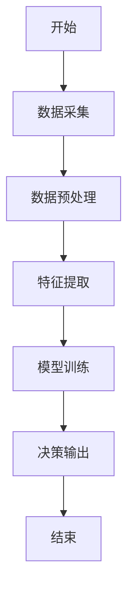

                 


# 《AI Agent在智能海洋生态保护中的实践》

## 第一部分：引言

### 第1章：AI Agent的基本概念与海洋生态保护的重要性

#### 1.1 AI Agent的定义与核心特征
- AI Agent的定义
- 核心特征：自主性、反应性、目标导向、学习能力
- AI Agent与传统AI的区别

#### 1.2 海洋生态保护的重要性
- 海洋生态系统的组成与功能
- 海洋生态保护的挑战：污染、过度捕捞、气候变化等
- AI技术在海洋生态保护中的潜力

#### 1.3 AI Agent在海洋生态保护中的作用
- AI Agent在海洋监测中的应用
- AI Agent在生态保护决策中的作用
- AI Agent在生态修复中的潜在应用

## 第二部分：AI Agent的核心技术与原理

### 第2章：AI Agent的核心技术

#### 2.1 AI Agent的感知技术
- 多源数据融合：图像识别、声音识别、传感器数据
- 深度学习在感知中的应用
- 实时数据处理的挑战

#### 2.2 AI Agent的决策与推理
- 基于规则的推理
- 基于概率的推理
- 强化学习在决策中的应用

#### 2.3 AI Agent的通信与协作
- 其他AI Agent的通信协议
- 分布式协作机制
- 数据隐私与安全

## 第三部分：系统设计与架构

### 第3章：系统架构与功能设计

#### 3.1 系统架构设计
- 分层架构：感知层、决策层、执行层
- 模块化设计：数据采集模块、数据处理模块、决策模块
- 可扩展性与可维护性

#### 3.2 功能设计
- 实时监测：海洋生物识别、环境参数监测
- 智能决策：生态保护策略生成、异常情况处理
- 人机交互：用户界面设计、反馈机制

### 第4章：系统实现与算法原理

#### 4.1 算法流程图


#### 4.2 数学模型与公式
- 简单线性回归模型：$$ y = \beta_0 + \beta_1x + \epsilon $$
- 神经网络模型：$$ f(x) = \sigma(w_2 \cdot \sigma(w_1 x + b_1) + b_2) $$

## 第四部分：项目实战

### 第5章：项目实战

#### 5.1 环境安装
- 安装必要的Python库：numpy、pandas、tensorflow等
- 数据集准备：海洋生物数据集

#### 5.2 系统核心实现
```python
import numpy as np
import tensorflow as tf

# 数据预处理
def preprocess_data(data):
    # 处理数据，归一化等
    return processed_data

# 模型定义
model = tf.keras.Sequential([
    tf.keras.layers.Dense(64, activation='relu'),
    tf.keras.layers.Dense(1, activation='sigmoid')
])

# 模型训练
model.compile(optimizer='adam', loss='binary_crossentropy', metrics=['accuracy'])
model.fit(preprocessed_train_data, train_labels, epochs=10, batch_size=32)
```

#### 5.3 案例分析
- 珊瑚礁保护项目：AI Agent实时监测珊瑚礁的健康状况
- 海洋哺乳动物监测：识别和跟踪鲸鱼、海豚等动物

## 第五部分：挑战与未来方向

### 第6章：挑战与未来方向

#### 6.1 当前技术的局限性
- 数据不足与数据质量问题
- 动态环境中的适应性问题
- 多模态数据融合的难度

#### 6.2 未来发展方向
- 多模态感知技术的提升
- 边缘计算在AI Agent中的应用
- 人机协作与生态修复的结合

## 附录

### 附录A：术语表

- AI Agent：人工智能代理
- 多源数据融合：多种数据源的整合
- 强化学习：通过奖励机制优化决策

### 附录B：参考文献

- Smith, J. (2020). Artificial Intelligence in Environmental Protection. Journal of AI Applications.
- Brown, T. (2019). Deep Learning for Marine Ecology. Nature Conservation Journal.

## 小结

AI Agent在智能海洋生态保护中的应用前景广阔，通过不断的技术创新和实践积累，AI Agent将为海洋生态保护提供更高效、更智能的解决方案。

## 作者

作者：AI天才研究院/AI Genius Institute & 禅与计算机程序设计艺术 /Zen And The Art of Computer Programming

---

这个目录大纲涵盖了AI Agent在海洋生态保护中的各个方面，从基本概念到系统设计，再到实际应用，结构清晰，内容详实。

