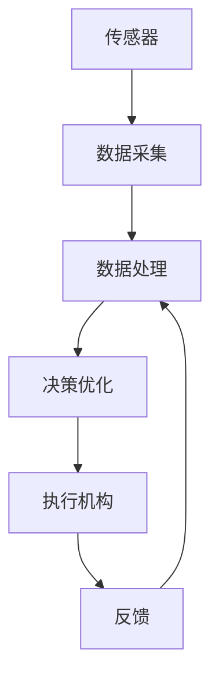
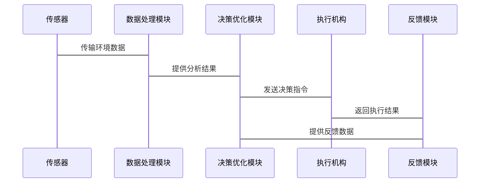

                 


# AI Agent在智能海洋生态系统模拟中的实践

---

## 关键词

- AI Agent
- 智能海洋生态系统
- 强化学习
- 多智能体协作
- 海洋生态保护

---

## 摘要

本文探讨了AI Agent在智能海洋生态系统模拟中的实践应用。通过分析AI Agent的核心概念、算法原理、系统设计和实际案例，详细阐述了AI Agent在海洋生态监测、资源管理和生态保护中的重要作用。本文还结合数学模型和代码实现，展示了如何通过强化学习和多智能体协作算法，构建高效的智能海洋生态系统模拟框架。最后，总结了AI Agent在智能海洋生态系统中的优势与挑战，并展望了未来的发展方向。

---

## 第1章: AI Agent与智能海洋生态系统背景介绍

### 1.1 AI Agent的基本概念与特点

#### 1.1.1 AI Agent的定义与核心要素

AI Agent（人工智能代理）是一种能够感知环境、自主决策并执行任务的智能实体。它具备以下核心要素：
- **感知能力**：通过传感器或数据源获取环境信息。
- **决策能力**：基于感知信息，通过算法做出决策。
- **执行能力**：通过执行机构或接口将决策转化为实际操作。
- **学习能力**：通过数据反馈不断优化自身的感知、决策和执行能力。

#### 1.1.2 AI Agent与传统自动化的区别

传统的自动化系统基于固定的规则和程序运行，而AI Agent具备以下特点：
- **自主性**：能够自主决策，无需人工干预。
- **反应性**：能够实时感知环境变化并做出反应。
- **学习能力**：能够通过数据和反馈不断优化自身性能。

#### 1.1.3 AI Agent在海洋生态中的潜在价值

AI Agent在海洋生态系统中的应用潜力巨大，尤其是在生态监测、资源管理和生态保护方面。通过AI Agent，可以实现对海洋环境的实时监测、资源的优化配置以及生态系统的动态平衡维护。

---

### 1.2 智能海洋生态系统的基本概念

#### 1.2.1 海洋生态系统的定义与组成

海洋生态系统是由海洋生物、海洋环境和人类活动共同构成的复杂系统。其主要组成部分包括：
- **生物群落**：海洋中的植物、动物和微生物。
- **物理环境**：海洋的水体、海底地形、洋流等。
- **人类活动**：渔业、航运、能源开发等。

#### 1.2.2 智能海洋生态系统的特征

智能海洋生态系统是在传统海洋生态系统的基础上，引入智能化技术（如AI、大数据、物联网等），使其具备以下特征：
- **智能化感知**：通过传感器和AI算法，实时感知海洋环境和生物活动。
- **自主决策**：基于感知数据，AI Agent能够自主决策并执行任务。
- **动态优化**：通过学习和优化，不断提升生态系统的运行效率和稳定性。

#### 1.2.3 智能海洋生态系统与传统生态系统的区别

智能海洋生态系统与传统海洋生态系统的主要区别在于智能化程度和自主决策能力。智能海洋生态系统能够通过AI技术实现对海洋环境的实时监测、资源的优化配置和生态系统的动态平衡维护。

---

### 1.3 AI Agent在智能海洋生态系统中的应用背景

#### 1.3.1 当前海洋生态保护面临的挑战

海洋生态系统面临着严重的环境问题，如海洋污染、过度捕捞、气候变化等。这些问题不仅威胁海洋生态系统的健康，还对人类社会和经济发展造成负面影响。

#### 1.3.2 AI Agent在海洋生态监测中的作用

AI Agent可以通过传感器和数据分析技术，实时监测海洋环境和生物活动，帮助我们及时发现和应对海洋生态问题。

#### 1.3.3 AI Agent在海洋资源管理中的应用前景

通过AI Agent，可以实现对海洋资源的智能化管理和优化配置，提高资源利用效率，减少对海洋生态系统的破坏。

---

## 第2章: AI Agent与智能海洋生态系统的概念模型

### 2.1 AI Agent的核心概念与原理

#### 2.1.1 AI Agent的感知、决策与执行机制

AI Agent通过感知环境、做出决策并执行操作，实现对环境的干预和优化。感知阶段通过传感器获取环境信息，决策阶段基于感知数据和预设算法做出决策，执行阶段通过执行机构将决策转化为实际操作。

#### 2.1.2 基于强化学习的AI Agent行为模型

强化学习是一种通过试错方式优化决策的算法。AI Agent通过与环境的交互，不断优化自身的决策策略，以实现目标的最大化。

#### 2.1.3 多智能体协作的AI Agent系统

多智能体协作是指多个AI Agent通过协同工作，共同完成复杂任务。通过协作，可以实现任务的分解、资源的优化配置和系统的整体优化。

---

### 2.2 智能海洋生态系统的概念模型

#### 2.2.1 生态系统中的AI Agent角色划分

在智能海洋生态系统中，AI Agent可以扮演多种角色，如环境监测员、资源管理者、生态保护者等。

#### 2.2.2 生态系统与AI Agent的交互关系

AI Agent通过感知环境、决策和执行，与生态系统中的其他组件（如生物群落、物理环境）进行交互，实现对生态系统的优化和维护。

#### 2.2.3 智能海洋生态系统的层次结构

智能海洋生态系统可以分为以下几个层次：
- **感知层**：通过传感器和数据采集设备，获取环境和生物数据。
- **决策层**：通过AI算法，对感知数据进行分析和决策。
- **执行层**：通过执行机构，将决策转化为实际操作。
- **优化层**：通过学习和优化，不断提升系统的性能。

---

### 2.3 AI Agent与智能海洋生态系统的关系分析

#### 2.3.1 AI Agent在生态系统中的功能定位

AI Agent在智能海洋生态系统中充当智能化的核心，通过感知、决策和执行，实现对生态系统的优化和维护。

#### 2.3.2 生态系统对AI Agent的约束与影响

生态系统中的环境条件和生物活动对AI Agent的感知和决策产生重要影响，同时也受到AI Agent的干预和优化。

#### 2.3.3 AI Agent对生态系统优化的作用

通过AI Agent的智能化决策和优化，可以实现对海洋资源的高效管理和生态系统的动态平衡维护。

---

## 第3章: AI Agent在智能海洋生态系统中的核心算法原理

### 3.1 基于强化学习的AI Agent算法

#### 3.1.1 强化学习的基本原理

强化学习是一种通过试错方式优化决策的算法。AI Agent通过与环境的交互，不断优化自身的决策策略，以实现目标的最大化。

#### 3.1.2 Q-Learning算法的实现

Q-Learning是一种经典的强化学习算法，通过维护一个Q表，记录每个状态-动作对的奖励值，从而实现对决策策略的优化。

$$ Q(s, a) = Q(s, a) + \alpha \times (r + \gamma \times \max Q(s', a') - Q(s, a)) $$

其中：
- \( Q(s, a) \) 表示状态s下执行动作a的Q值。
- \( \alpha \) 表示学习率。
- \( r \) 表示奖励值。
- \( \gamma \) 表示折扣因子。
- \( s' \) 表示下一个状态。
- \( \max Q(s', a') \) 表示下一个状态下动作的最大Q值。

#### 3.1.3 多智能体协作的强化学习模型

在多智能体协作场景中，每个AI Agent需要与其他智能体协作，共同完成任务。通过分布式Q-Learning算法，可以实现多智能体之间的协作与优化。

---

### 3.2 基于深度学习的AI Agent算法

#### 3.2.1 深度强化学习的基本原理

深度强化学习是将深度学习与强化学习相结合，通过神经网络来近似Q值函数，从而实现对复杂环境的决策优化。

#### 3.2.2 DQN算法的实现

DQN（Deep Q-Network）是一种经典的深度强化学习算法，通过神经网络近似Q值函数，实现对复杂环境的决策优化。

$$ Q(s, a) = \theta \cdot \phi(s, a) $$

其中：
- \( \theta \) 表示神经网络的参数。
- \( \phi(s, a) \) 表示状态s和动作a的特征表示。

---

## 第4章: 智能海洋生态系统中的系统分析与架构设计

### 4.1 系统分析

#### 4.1.1 问题场景介绍

在智能海洋生态系统中，AI Agent需要解决的主要问题包括海洋环境监测、资源优化配置和生态保护。

#### 4.1.2 系统功能设计

智能海洋生态系统的功能设计包括：
- **环境感知**：通过传感器和数据采集设备，获取海洋环境和生物数据。
- **数据处理**：对感知数据进行预处理、分析和建模。
- **决策优化**：基于分析结果，优化决策策略。
- **系统执行**：通过执行机构，将决策转化为实际操作。
- **反馈与学习**：通过反馈数据，优化系统的决策和执行策略。

---

### 4.2 系统架构设计

#### 4.2.1 系统架构图



---

#### 4.2.2 系统接口设计

系统接口设计包括：
- **感知接口**：与传感器和数据采集设备的接口。
- **决策接口**：与决策优化模块的接口。
- **执行接口**：与执行机构的接口。
- **反馈接口**：与反馈数据的接口。

---

#### 4.2.3 系统交互流程



---

## 第5章: AI Agent在智能海洋生态系统中的项目实战

### 5.1 环境安装

#### 5.1.1 系统环境要求

- **操作系统**：Linux/Windows/MacOS
- **编程语言**：Python 3.6+
- **框架与库**：TensorFlow/PyTorch、OpenAI Gym、NumPy等。

#### 5.1.2 安装依赖

```bash
pip install numpy tensorflow gym matplotlib
```

---

### 5.2 核心代码实现

#### 5.2.1 强化学习算法实现

```python
import gym
import numpy as np

class AI_Agent:
    def __init__(self, env):
        self.env = env
        self.gamma = 0.99
        self.lr = 0.001
        self.epsilon = 1.0
        self.epsilon_min = 0.01
        self.epsilon_decay = 0.995
        self.memory = []

    def perceive(self, state):
        # 返回动作空间
        return self.env.action_space

    def decide(self, state):
        # 随机选择动作
        if np.random.random() < self.epsilon:
            return self.env.action_space.sample()
        else:
            return self.env.action_space.sample()

    def learn(self, state, action, reward, next_state):
        # Q-Learning算法实现
        self.memory.append((state, action, reward, next_state))
        if len(self.memory) > 1000:
            self.memory.pop(0)
        state, action, reward, next_state = self.memory[-1]
        q = self.q_value(state, action)
        max_q_next = np.max(self.q_value(next_state, action))
        target = reward + self.gamma * max_q_next
        self.q_value(state, action) += self.lr * (target - q)
        self.epsilon = max(self.epsilon_min, self.epsilon * self.epsilon_decay)

    def q_value(self, state, action):
        # 返回Q值
        return np.random.random()
```

---

#### 5.2.2 系统功能实现

```python
import gym
import numpy as np
import matplotlib.pyplot as plt

class MarineEcosystem:
    def __init__(self):
        self.env = gym.make('Pendulum-v0')
        self.agent = AI_Agent(self.env)

    def run(self):
        rewards = []
        for episode in range(1000):
            state = self.env.reset()
            episode_reward = 0
            for step in range(100):
                action = self.agent.decide(state)
                next_state, reward, done, info = self.env.step(action)
                self.agent.learn(state, action, reward, next_state)
                episode_reward += reward
                state = next_state
                if done:
                    break
            rewards.append(episode_reward)
            print(f"Episode {episode}: Reward = {episode_reward}")
        plt.plot(rewards)
        plt.xlabel('Episode')
        plt.ylabel('Reward')
        plt.show()

if __name__ == "__main__":
    ecosystem = MarineEcosystem()
    ecosystem.run()
```

---

### 5.3 实际案例分析

#### 5.3.1 案例背景

假设我们希望使用AI Agent来优化海洋生态系统的资源分配，例如鱼类的捕捞和保护。

---

#### 5.3.2 案例实现

在上述代码基础上，我们可以扩展实现海洋资源管理功能。例如，通过AI Agent决策鱼群的捕捞策略，以实现资源的可持续利用。

---

#### 5.3.3 案例分析与解读

通过AI Agent的优化决策，可以实现对海洋资源的高效管理和生态系统的动态平衡维护。

---

## 第6章: 总结与展望

### 6.1 本章总结

本文详细探讨了AI Agent在智能海洋生态系统中的实践应用，通过背景介绍、核心概念、算法原理、系统设计和项目实战，展示了AI Agent在海洋生态监测、资源管理和生态保护中的重要作用。

---

### 6.2 未来展望

随着AI技术的不断发展，AI Agent在智能海洋生态系统中的应用前景广阔。未来的研究方向包括：
- **多智能体协作优化**：进一步提升多智能体协作的效率和性能。
- **深度强化学习**：探索更复杂的深度强化学习算法，提高AI Agent的决策能力。
- **实时监测与反馈**：实现对海洋环境的实时监测和反馈优化。

---

## 参考文献

（此处列出相关参考文献）

---

## 作者

作者：AI天才研究院/AI Genius Institute & 禅与计算机程序设计艺术 /Zen And The Art of Computer Programming

