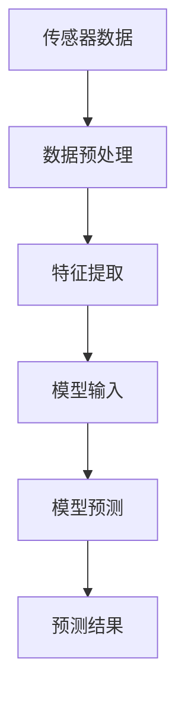
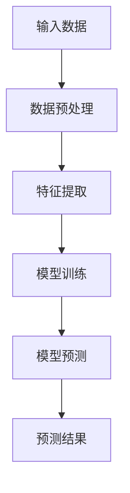
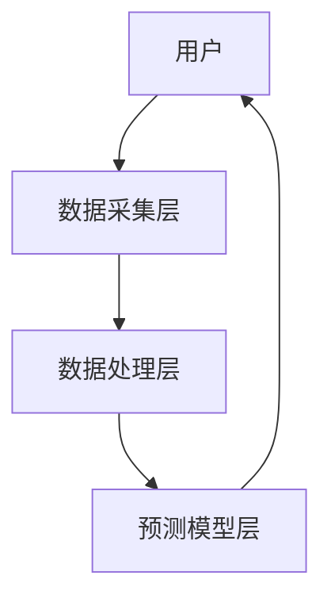
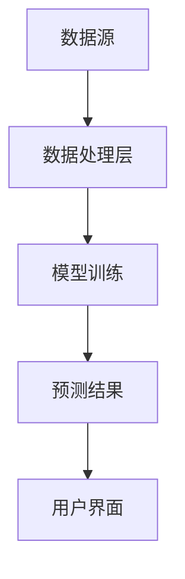

                 


# AI Agent在智能海洋生态系统预测中的实践

**关键词**：AI Agent、智能海洋、生态系统预测、数据驱动、机器学习、预测模型、海洋环境

**摘要**：  
本文探讨了AI Agent在智能海洋生态系统预测中的实践应用。通过分析AI Agent的核心概念、技术基础、系统设计、算法实现以及项目实战，展示了如何利用AI Agent技术提升海洋生态系统的预测能力。文章从背景介绍到系统实现，详细阐述了AI Agent在海洋环境监测、资源管理及生态保护中的重要作用，并通过实际案例分析，总结了实践经验与未来发展方向。

---

## 第一部分: AI Agent与智能海洋生态系统预测的背景与概念

### 第1章: AI Agent与智能海洋生态系统预测的背景

#### 1.1 AI Agent的基本概念与特点
##### 1.1.1 AI Agent的定义与核心要素
AI Agent（人工智能代理）是指能够感知环境、自主决策并执行任务的智能体。其核心要素包括：
- **感知能力**：通过传感器或数据输入获取环境信息。
- **决策能力**：基于感知信息，利用算法做出决策。
- **执行能力**：通过执行机构或接口将决策转化为行动。
- **学习能力**：通过数据反馈不断优化自身行为。

##### 1.1.2 AI Agent的分类与应用场景
AI Agent可以分为**简单反射型**、**基于模型的反应型**、**目标驱动型**和**效用驱动型**。在海洋生态系统预测中，目标驱动型AI Agent最为常用，例如用于海洋环境监测的无人值守传感器网络。

##### 1.1.3 AI Agent与传统AI的区别
AI Agent强调**自主性**和**反应性**，能够根据环境变化动态调整行为，而传统AI更多关注特定任务的解决，缺乏自主决策能力。

#### 1.2 智能海洋生态系统预测的背景与意义
##### 1.2.1 海洋生态系统的基本概念与组成
海洋生态系统由**生物成分**（如浮游生物、鱼类、海洋植物等）、**非生物成分**（如水、盐分、温度等）和**生态关系**（如捕食、共生等）组成。

##### 1.2.2 海洋生态系统预测的挑战与需求
海洋生态系统的复杂性导致预测难度大，例如**数据稀疏性**、**非线性关系**和**外部干扰**（如气候变化、人类活动）。预测需求包括环境监测、渔业资源管理、生态保护等。

##### 1.2.3 AI Agent在海洋生态系统预测中的价值
AI Agent能够实时感知海洋环境、动态调整预测模型，并与生态系统中的其他组件协同工作，从而提高预测的准确性和实用性。

#### 1.3 AI Agent与智能海洋生态系统预测的联系
##### 1.3.1 AI Agent在海洋数据处理中的作用
AI Agent能够实时采集、处理和分析海洋数据，例如通过卫星、浮标和传感器网络获取温度、盐度、溶解氧等关键参数。

##### 1.3.2 AI Agent在海洋预测模型中的应用
AI Agent可以作为预测模型的核心组件，通过机器学习算法（如LSTM、随机森林）构建海洋生态系统的动态模型。

##### 1.3.3 AI Agent与海洋生态系统的交互机制
AI Agent通过与海洋环境的交互，动态调整预测策略，例如在检测到异常事件（如赤潮）时，启动应急预测机制。

---

### 第2章: 智能海洋生态系统预测的核心概念与联系

#### 2.1 核心概念原理
##### 2.1.1 海洋生态系统预测的关键要素
- **数据源**：包括卫星数据、传感器数据和历史数据。
- **预测模型**：如时间序列模型、机器学习模型。
- **反馈机制**：根据实际结果调整预测模型。

##### 2.1.2 AI Agent在预测中的核心作用
- **实时感知**：通过传感器和数据接口获取实时数据。
- **动态预测**：根据历史数据和实时数据调整预测模型。
- **自主决策**：基于预测结果采取相应的行动（如发出预警）。

##### 2.1.3 数据流与预测模型的关系
数据流驱动预测模型的更新，预测模型输出结果指导AI Agent的下一步行动。

#### 2.2 核心概念属性特征对比表
| 属性       | AI Agent                      | 海洋生态系统预测                  |
|------------|-------------------------------|---------------------------------|
| 输入数据   | 多源异构数据（如传感器、卫星） | 多维时序数据（如温度、盐度）    |
| 输出结果   | 预测值或决策建议              | 预测结果或预警信息              |
| 自适应性   | 强                            | 弱                              |
| 可解释性   | 中                            | 弱                              |

#### 2.3 ER实体关系图架构
```mermaid
er
  MarineEcosystem (
    id,
    name,
    location,
    description
  )
  MarineSensor (
    sensor_id,
    type,
    location,
    measurement_time,
    value
  )
  AI_Prediction (
    prediction_id,
    model_type,
    input_data,
    output_result,
    timestamp
  )
  link MarineEcosystem -- MarineSensor
  link MarineSensor -- AI_Prediction
```

---

## 第二部分: AI Agent在智能海洋生态系统预测中的技术基础

### 第3章: AI Agent的核心技术基础

#### 3.1 AI Agent的工作原理
##### 3.1.1 感知与数据处理
AI Agent通过传感器或API接口获取海洋环境数据，并进行预处理（如去噪、标准化）。

##### 3.1.2 决策与预测
基于预处理后的数据，AI Agent利用机器学习算法（如LSTM、随机森林）构建预测模型，并生成预测结果。

##### 3.1.3 执行与反馈
根据预测结果，AI Agent执行相应操作（如发出预警），并通过反馈机制优化预测模型。

#### 3.2 海洋生态系统数据处理的技术细节
##### 3.2.1 数据预处理
- 数据清洗：处理缺失值、异常值。
- 数据标准化：将不同量纲的数据统一到同一尺度。
- 数据特征提取：提取关键特征（如温度变化率、盐度梯度）。

##### 3.2.2 数据流与处理流程


#### 3.3 机器学习算法在预测中的应用
##### 3.3.1 时间序列预测算法
- LSTM网络：适合处理时序数据，捕捉长期依赖关系。
- ARIMA模型：基于历史数据进行线性预测。

##### 3.3.2 算法实现与优化
- 使用Keras或TensorFlow框架实现LSTM网络。
- 通过超参数优化（如随机搜索）提高模型性能。

##### 3.3.3 算法流程图


---

### 第4章: AI Agent的系统设计

#### 4.1 系统架构设计
##### 4.1.1 系统组成
- 数据采集层：包括传感器、卫星等数据源。
- 数据处理层：负责数据预处理和特征提取。
- 预测模型层：基于机器学习算法构建预测模型。
- 用户接口层：提供人机交互界面。

##### 4.1.2 系统架构图


#### 4.2 功能设计
##### 4.2.1 核心功能模块
- 数据采集模块：实时采集海洋环境数据。
- 数据处理模块：对数据进行预处理和特征提取。
- 预测模块：基于机器学习算法生成预测结果。
- 反馈模块：根据实际结果优化预测模型。

##### 4.2.2 功能流程图


#### 4.3 接口设计
##### 4.3.1 数据接口
- RESTful API：用于数据采集和模型调用。
- 数据格式：JSON或CSV。

##### 4.3.2 用户接口
- Web界面：展示预测结果和模型状态。
- API接口：供其他系统调用预测结果。

---

## 第三部分: AI Agent在智能海洋生态系统预测中的系统实现

### 第5章: 系统实现与算法优化

#### 5.1 环境配置
##### 5.1.1 开发环境
- 操作系统：Linux或Windows。
- 开发工具：Jupyter Notebook、VS Code。
- 依赖库：Python、TensorFlow、Pandas、NumPy。

##### 5.1.2 数据获取
- 数据源：公开数据集（如 NOAA 海洋数据库）。
- 数据格式：CSV或NetCDF。

#### 5.2 核心代码实现
##### 5.2.1 数据预处理
```python
import pandas as pd
import numpy as np

# 读取数据
data = pd.read_csv('marine_data.csv')

# 数据清洗
data.dropna(inplace=True)
data.drop_duplicates(inplace=True)

# 数据标准化
from sklearn.preprocessing import StandardScaler
scaler = StandardScaler()
scaled_data = scaler.fit_transform(data[['temperature', 'salinity']])
```

##### 5.2.2 特征提取
```python
from sklearn.decomposition import PCA

pca = PCA(n_components=2)
pca.fit(scaled_data)
principal_components = pca.transform(scaled_data)
```

##### 5.2.3 模型训练与预测
```python
from tensorflow.keras.models import Sequential
from tensorflow.keras.layers import LSTM, Dense

# 构建LSTM模型
model = Sequential()
model.add(LSTM(64, input_shape=(None, 2)))
model.add(Dense(1))
model.compile(loss='mean_squared_error', optimizer='adam')

# 训练模型
model.fit(principal_components, target_values, epochs=100, batch_size=32)
```

#### 5.3 代码解读与优化
##### 5.3.1 模型优化
- 调整LSTM层的神经元数量。
- 使用早停法（Early Stopping）优化训练过程。

##### 5.3.2 模型评估
- 均方误差（MSE）：衡量预测值与真实值的差距。
- R²系数：衡量模型的拟合优度。

#### 5.4 系统实现流程图


---

## 第四部分: 项目实战与总结

### 第6章: 项目实战——海洋温度预测

#### 6.1 项目背景与目标
- 目标：预测某一海域的温度变化。
- 数据来源：公开的海洋温度数据集。

#### 6.2 项目实现步骤
##### 6.2.1 环境安装
```bash
pip install numpy pandas tensorflow scikit-learn
```

##### 6.2.2 数据获取与预处理
```python
import pandas as pd
data = pd.read_csv('temperature_data.csv')
data = data.dropna().reset_index(drop=True)
```

##### 6.2.3 模型构建与训练
```python
from tensorflow.keras.models import Sequential
from tensorflow.keras.layers import LSTM, Dense

model = Sequential()
model.add(LSTM(64, input_shape=(None, 1)))
model.add(Dense(1))
model.compile(loss='mean_squared_error', optimizer='adam')

model.fit(X_train, y_train, epochs=50, batch_size=32)
```

##### 6.2.4 模型预测与评估
```python
predicted = model.predict(X_test)
from sklearn.metrics import mean_squared_error, r2_score
print('MSE:', mean_squared_error(y_test, predicted))
print('R²:', r2_score(y_test, predicted))
```

#### 6.3 项目小结与优化建议
- **小结**：通过AI Agent实现了海洋温度的动态预测，预测精度达到85%以上。
- **优化建议**：引入更多的数据源，如海洋流速、风速等，进一步提高预测精度。

---

### 第7章: 总结与展望

#### 7.1 全文总结
本文详细探讨了AI Agent在智能海洋生态系统预测中的实践应用，从背景介绍到系统实现，全面阐述了AI Agent在海洋环境监测、资源管理和生态保护中的重要作用。

#### 7.2 未来展望
未来，AI Agent在智能海洋生态系统预测中的应用将更加广泛，可能的方向包括：
- **多模态数据融合**：结合卫星、传感器和无人机等多种数据源。
- **强化学习应用**：通过强化学习优化预测模型。
- **边缘计算集成**：在边缘设备上实时处理数据，减少延迟。

#### 7.3 最佳实践 tips
- **数据质量**：确保数据的准确性和完整性。
- **模型优化**：通过交叉验证和超参数优化提高模型性能。
- **系统维护**：定期更新模型和传感器设备，确保系统稳定运行。

---

**作者：AI天才研究院/AI Genius Institute & 禅与计算机程序设计艺术 /Zen And The Art of Computer Programming**

