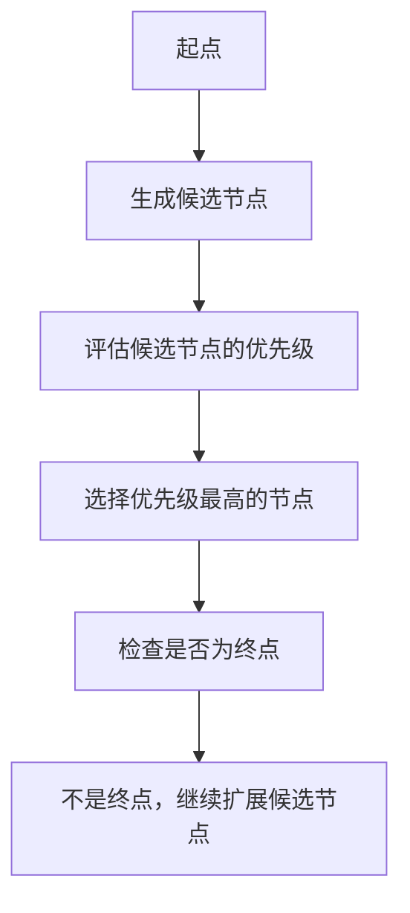

                 


# AI Agent在智能海洋监测中的实践

> 关键词：AI Agent, 智能海洋监测, 海洋环境监测, 人工智能算法, 系统架构设计, 传感器网络

> 摘要：  
本文探讨了AI Agent在智能海洋监测中的实践应用，从背景与概述、核心概念与联系、算法与系统设计、项目实战到实际应用案例，全面分析了AI Agent在海洋监测中的角色与价值。文章通过详细的技术分析和实际案例，展示了AI Agent如何通过智能化手段提升海洋监测的效率与准确性，为智能海洋监测的发展提供了新的思路和解决方案。

---

# 第一部分: AI Agent与智能海洋监测的背景与概述

## 第1章: AI Agent与智能海洋监测的概述

### 1.1 AI Agent的基本概念

#### 1.1.1 AI Agent的定义与特点
AI Agent（人工智能代理）是一种能够感知环境、自主决策并执行任务的智能实体。其特点包括：
- **自主性**：能够在没有外部干预的情况下自主运行。
- **反应性**：能够实时感知环境并做出反应。
- **目标导向**：以特定目标为导向，优化决策过程。
- **学习能力**：通过数据和经验不断优化自身的性能。

#### 1.1.2 AI Agent的核心要素与功能
AI Agent的核心要素包括：
- **知识库**：存储任务相关的知识和数据。
- **感知模块**：通过传感器或数据接口获取环境信息。
- **推理引擎**：基于知识库和感知信息进行推理和决策。
- **执行模块**：根据决策结果执行具体任务。

#### 1.1.3 AI Agent与传统自动化的区别
AI Agent与传统自动化的区别主要体现在智能化水平和自主决策能力上。AI Agent能够根据环境变化动态调整策略，而传统自动化系统通常基于固定的规则运行。

### 1.2 智能海洋监测的背景与需求

#### 1.2.1 海洋监测的定义与重要性
海洋监测是指通过技术手段对海洋环境、资源和生态进行实时或定期观测的过程。其重要性体现在保护海洋生态、监测海洋污染、支持海洋经济等领域。

#### 1.2.2 智能海洋监测的发展现状
随着人工智能技术的快速发展，智能海洋监测正在从传统的数据采集向智能化分析和决策转变。现代海洋监测系统通常结合传感器网络、大数据分析和云计算技术。

#### 1.2.3 智能海洋监测的核心问题与挑战
智能海洋监测的核心问题包括：
- **数据处理与分析**：如何高效处理海量传感器数据。
- **实时性与可靠性**：如何确保监测系统的实时性和可靠性。
- **多目标优化**：如何在多个目标之间进行权衡和优化。

### 1.3 AI Agent在智能海洋监测中的应用前景

#### 1.3.1 AI Agent与智能海洋监测的结合点
AI Agent在智能海洋监测中的结合点包括：
- **环境感知**：通过传感器数据感知海洋环境。
- **数据融合**：将多源数据融合以提高监测精度。
- **决策优化**：根据监测结果优化监测策略。

#### 1.3.2 AI Agent在海洋监测中的优势
AI Agent的优势体现在：
- **智能化决策**：能够根据环境变化动态调整监测策略。
- **高效数据处理**：通过算法优化提高数据处理效率。
- **自主性与适应性**：能够在复杂环境中自主适应和调整。

#### 1.3.3 未来发展趋势与研究方向
未来的发展趋势包括：
- **多Agent协作**：研究多Agent协作机制以提高监测效率。
- **边缘计算**：将AI Agent部署在边缘设备上以实现实时监测。
- **自适应学习**：研究Agent的自适应学习能力以应对复杂环境。

---

## 第2章: AI Agent与智能海洋监测的核心概念与联系

### 2.1 AI Agent的核心原理

#### 2.1.1 知识表示与推理
知识表示是AI Agent的核心技术之一，常用的方法包括：
- **谓词逻辑**：通过谓词和逻辑规则表示知识。
- **语义网络**：通过节点和边表示概念及其关系。
- **案例推理**：通过类似案例进行推理和决策。

#### 2.1.2 行为规划与决策
行为规划是AI Agent实现目标的关键步骤，常用算法包括：
- **A*算法**：用于路径规划和任务调度。
- **Dijkstra算法**：用于最短路径计算。
- **基于Q-learning的强化学习**：用于动态环境下的决策优化。

#### 2.1.3 通信与协作机制
AI Agent在海洋监测中的通信与协作机制包括：
- **分布式协作**：多个Agent协作完成复杂任务。
- **集中式协作**：通过中央控制节点协调各Agent的行动。
- **自适应协作**：根据环境变化动态调整协作策略。

### 2.2 智能海洋监测的系统架构

#### 2.2.1 海洋监测系统的组成与功能
海洋监测系统通常包括以下组成部分：
- **传感器网络**：负责数据的采集和传输。
- **数据处理模块**：对传感器数据进行预处理和分析。
- **AI Agent模块**：负责决策和任务执行。
- **用户界面**：提供人机交互界面供用户查看和控制。

#### 2.2.2 AI Agent在系统中的角色与任务分配
AI Agent在系统中的角色包括：
- **数据采集Agent**：负责传感器数据的采集和传输。
- **数据处理Agent**：负责数据的预处理和分析。
- **决策优化Agent**：负责制定监测策略并优化决策。

#### 2.2.3 系统的层次结构与模块划分
系统的层次结构通常包括：
- **感知层**：负责数据的采集和初步处理。
- **决策层**：负责数据的分析和决策制定。
- **执行层**：负责根据决策结果执行具体任务。

### 2.3 AI Agent与智能海洋监测的实体关系图

```mermaid
er
actor: 海洋监测系统
agent: AI Agent
sensors: 传感器网络
database: 数据库
monitoring: 监测任务
```

---

## 第3章: AI Agent在智能海洋监测中的算法与系统设计

### 3.1 AI Agent的核心算法

#### 3.1.1 知识表示与推理算法
知识表示与推理算法包括：
- **谓词逻辑推理**：通过逻辑规则进行推理。
- **语义网络推理**：通过节点和边的关系进行推理。
- **案例推理**：通过类似案例进行推理和决策。

#### 3.1.2 行为规划算法
行为规划算法包括：
- **A*算法**：用于路径规划和任务调度。
- **Dijkstra算法**：用于最短路径计算。
- **基于Q-learning的强化学习**：用于动态环境下的决策优化。

#### 3.1.3 通信与协作算法
通信与协作算法包括：
- **分布式协作算法**：用于多Agent协作。
- **集中式协作算法**：用于通过中央控制节点协调各Agent的行动。
- **自适应协作算法**：用于根据环境变化动态调整协作策略。

### 3.2 算法原理与流程图

#### 3.2.1 A*算法的原理与流程图


#### 3.2.2 数据融合算法
数据融合算法通常包括：
- **加权平均法**：对多个传感器的数据进行加权平均。
- **卡尔曼滤波**：用于估计系统的状态并减少噪声影响。

### 3.3 系统架构设计

#### 3.3.1 系统功能设计
系统功能设计包括：
- **数据采集**：通过传感器网络采集海洋环境数据。
- **数据处理**：对采集的数据进行预处理和分析。
- **决策优化**：制定监测策略并优化决策。
- **结果输出**：将监测结果输出给用户或控制其他设备。

#### 3.3.2 系统架构图


---

## 第4章: 项目实战与应用案例

### 4.1 项目实战

#### 4.1.1 环境配置
项目实战需要以下环境配置：
- **硬件设备**：传感器网络、数据采集卡、通信设备。
- **软件工具**：Python编程语言、NumPy库、Pandas库、Scikit-learn库。

#### 4.1.2 核心代码实现
以下是核心代码实现的示例：

```python
import numpy as np
from sklearn.cluster import KMeans

# 示例数据：传感器数据
data = np.array([[1, 2], [3, 4], [5, 6], [7, 8]])

# 使用K-means算法进行聚类分析
kmeans = KMeans(n_clusters=2, random_state=0)
kmeans.fit(data)
print("聚类中心:", kmeans.cluster_centers_)
```

#### 4.1.3 项目实现步骤
项目实现步骤包括：
1. **环境搭建**：安装所需的硬件和软件。
2. **数据采集**：通过传感器网络采集海洋环境数据。
3. **数据处理**：对采集的数据进行预处理和分析。
4. **模型训练**：训练AI Agent的模型以实现智能化决策。
5. **系统测试**：测试系统的功能和性能。

### 4.2 应用案例

#### 4.2.1 智能水质监测
智能水质监测的应用案例包括：
- **传感器部署**：在海洋中部署水质传感器，实时监测水温、盐度、溶解氧等参数。
- **数据融合**：通过AI Agent融合多源传感器数据，提高监测精度。
- **异常检测**：通过机器学习算法检测水质异常，及时发出警报。

#### 4.2.2 渔业资源监测
渔业资源监测的应用案例包括：
- **鱼群追踪**：通过声呐传感器追踪鱼群的位置和数量。
- **环境监测**：监测海洋环境参数，评估渔业资源的分布情况。
- **决策支持**：基于监测数据提供渔业资源管理的决策支持。

---

## 第5章: 总结与展望

### 5.1 总结
本文全面探讨了AI Agent在智能海洋监测中的实践应用，从背景与概述、核心概念与联系、算法与系统设计、项目实战到实际应用案例，展示了AI Agent在海洋监测中的巨大潜力和重要作用。通过AI Agent的智能化决策和自主性，能够显著提高海洋监测的效率和精度。

### 5.2 展望
未来，随着人工智能技术的不断发展，AI Agent在智能海洋监测中的应用将更加广泛和深入。研究方向包括：
- **多Agent协作**：研究多Agent协作机制以提高监测效率。
- **边缘计算**：将AI Agent部署在边缘设备上以实现实时监测。
- **自适应学习**：研究Agent的自适应学习能力以应对复杂环境。

---

作者：AI天才研究院 & 禅与计算机程序设计艺术

