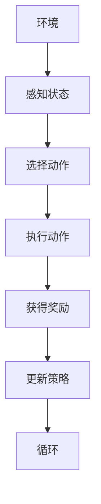
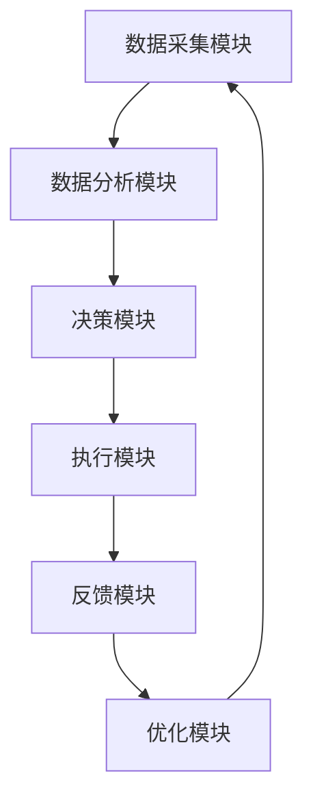
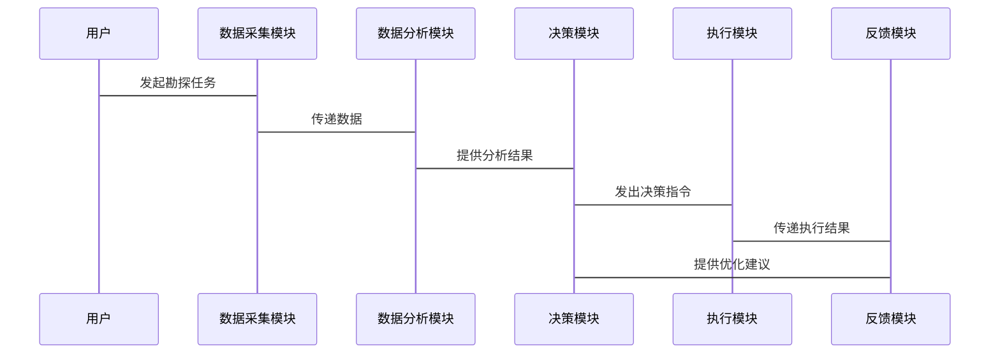

                 


# AI Agent在智能海洋资源勘探中的实践

> 关键词：AI Agent, 智能海洋资源勘探, 强化学习, 海洋数据处理, 自动化决策

> 摘要：本文探讨AI Agent在智能海洋资源勘探中的实践应用，从背景、算法、系统架构到项目实战，全面分析AI Agent如何提升海洋资源勘探的效率和精准度。通过强化学习算法、系统设计和实际案例，展示AI Agent在海洋勘探中的潜力和未来发展方向。

---

## 第一部分: AI Agent与智能海洋资源勘探的背景与概念

### 第1章: AI Agent的定义与特征

#### 1.1 AI Agent的基本概念
AI Agent（人工智能代理）是一种能够感知环境、自主决策并采取行动的智能实体。它通过传感器获取信息，利用算法处理数据，并通过执行器与环境交互。AI Agent可以是软件程序、机器人或其他智能系统。

#### 1.2 AI Agent的分类与应用场景
AI Agent可以分为四种类型：
- **简单反射型**：基于直接的条件反射进行反应，适用于简单的决策任务。
- **基于模型型**：利用内部模型对环境进行建模，并基于模型做出决策。
- **实用推理型**：基于效用函数进行推理和决策，优化目标函数。
- **目标驱动型**：基于特定目标进行规划和决策，适用于复杂的任务。

AI Agent在多个领域的应用：
- **智能助手**：如Siri、Alexa等，提供信息检索和任务执行服务。
- **推荐系统**：如Netflix、Amazon，基于用户行为推荐内容。
- **自动驾驶**：如特斯拉、Waymo，实现车辆的自主导航和决策。
- **机器人控制**：如工业机器人、服务机器人，实现自动化操作。

在海洋资源勘探中的AI Agent特点：
- **高精度数据处理**：AI Agent能够快速处理海洋环境中的复杂数据，如水温、盐度、海底地形等。
- **自主决策能力**：在恶劣的海洋环境中，AI Agent能够自主做出决策，无需人工干预。
- **多任务协同**：能够协调多个设备和任务，实现高效的资源勘探和优化。

### 第2章: 智能海洋资源勘探的背景与挑战

#### 2.1 海洋资源勘探的现状与需求
海洋资源勘探是人类探索和利用海洋资源的重要活动，包括石油、天然气、矿产、渔业资源等。传统海洋资源勘探依赖于人工操作，存在效率低、成本高、危险性大等问题。

- **问题背景**：海洋环境复杂多变，勘探任务涉及多种数据类型和复杂的决策过程，传统方法难以应对。
- **问题描述**：海洋资源分布不均匀，数据采集和处理成本高，勘探任务需要高精度和实时性。
- **解决方法**：引入AI Agent技术，通过自动化数据处理、智能决策和自主执行，提升海洋资源勘探的效率和安全性。

#### 2.2 AI Agent在海洋资源勘探中的应用潜力
AI Agent在海洋资源勘探中的应用潜力主要体现在以下几个方面：
- **数据驱动的决策优化**：AI Agent能够通过机器学习算法分析海量海洋数据，优化勘探路径和资源分配。
- **多模态数据融合**：AI Agent能够整合多种数据源（如声呐、卫星图像、地质数据等），实现更准确的资源定位。
- **自适应学习与进化**：AI Agent能够通过强化学习不断优化自身的决策策略，适应复杂的海洋环境。

### 第3章: AI Agent与海洋资源勘探的核心概念

#### 3.1 AI Agent在海洋勘探中的角色
AI Agent在海洋资源勘探中扮演多种角色：
- **数据采集与处理**：AI Agent通过传感器和数据处理算法，实时采集和分析海洋环境数据。
- **智能分析与决策**：基于机器学习算法，AI Agent能够分析数据，识别资源分布规律，并做出最优决策。
- **自动化执行与反馈**：AI Agent通过执行器（如无人船、钻井平台）执行决策，并实时反馈执行结果，形成闭环控制系统。

#### 3.2 海洋资源勘探的核心流程
海洋资源勘探的核心流程包括以下几个步骤：
1. **数据采集**：通过传感器、卫星、声呐等设备采集海洋环境数据。
2. **数据分析与建模**：利用机器学习算法对数据进行建模和分析，识别资源分布规律。
3. **决策与优化**：基于分析结果，制定勘探计划，并通过强化学习优化决策策略。
4. **执行与反馈**：通过执行器执行决策，并实时反馈执行结果，优化后续决策。

#### 3.3 AI Agent与海洋勘探的结合点
AI Agent与海洋勘探的结合点主要体现在以下几个方面：
- **数据驱动的决策优化**：AI Agent能够通过机器学习算法优化勘探路径和资源分配，提高勘探效率。
- **多模态数据融合**：AI Agent能够整合多种数据源，实现更准确的资源定位。
- **自适应学习与进化**：AI Agent能够通过强化学习不断优化自身的决策策略，适应复杂的海洋环境。

---

## 第二部分: AI Agent在海洋资源勘探中的算法与技术

### 第4章: AI Agent的核心算法原理

#### 4.1 强化学习算法
强化学习（Reinforcement Learning, RL）是一种通过试错方式学习最优策略的算法。AI Agent通过与环境交互，逐步优化其决策策略，以最大化累计奖励。

##### 4.1.1 算法原理
- **马尔可夫决策过程（MDP）**：强化学习的核心模型，描述环境的状态、动作、奖励和转移概率。
- **Q-learning**：一种经典的强化学习算法，通过更新Q值表学习最优策略。
- **Deep Q-Networks (DQN)**：将Q值函数表示为深度神经网络，能够处理高维状态空间。

##### 4.1.2 应用场景
在海洋资源勘探中，强化学习可以应用于以下场景：
- **路径规划**：AI Agent通过强化学习优化无人船的路径，避免障碍物，提高勘探效率。
- **资源分配**：AI Agent通过强化学习优化资源勘探的顺序和分配策略，提高资源利用率。

##### 4.1.3 算法流程图
以下是一个强化学习算法的mermaid流程图：



##### 4.1.4 核心代码实现
以下是一个简单的Q-learning算法实现代码：

```python
import numpy as np

class QLearning:
    def __init__(self, state_space, action_space, learning_rate=0.1, gamma=0.9):
        self.state_space = state_space
        self.action_space = action_space
        self.lr = learning_rate
        self.gamma = gamma
        self.q_table = np.zeros((state_space, action_space))

    def choose_action(self, state, epsilon=0.1):
        if np.random.random() < epsilon:
            return np.random.randint(self.action_space)
        else:
            return np.argmax(self.q_table[state])

    def update_q_table(self, state, action, reward, next_state):
        self.q_table[state, action] = self.q_table[state, action] * (1 - self.lr) + self.lr * (reward + self.gamma * np.max(self.q_table[next_state]))
```

##### 4.1.5 数学模型与公式
强化学习的数学模型可以用以下公式表示：

$$ Q(s, a) = Q(s, a) \cdot (1 - \alpha) + \alpha \cdot (r + \gamma \cdot \max Q(s', a')) $$

其中：
- \( Q(s, a) \) 表示状态 \( s \) 下动作 \( a \) 的Q值。
- \( \alpha \) 表示学习率。
- \( r \) 表示奖励。
- \( \gamma \) 表示折扣因子。
- \( s' \) 表示下一个状态。
- \( a' \) 表示下一个动作。

#### 4.2 海洋数据处理与分析算法
##### 4.2.1 数据预处理
海洋数据通常包含噪声和缺失值，需要进行数据清洗和标准化处理。

##### 4.2.2 数据分析与建模
利用机器学习算法（如支持向量机、随机森林、神经网络）对海洋数据进行建模和分析，识别资源分布规律。

##### 4.2.3 数据可视化
通过数据可视化工具（如Matplotlib、Seaborn）将分析结果以图表形式展示，便于理解和决策。

---

## 第三部分: 系统架构设计与项目实战

### 第5章: 海洋资源勘探AI Agent系统架构设计

#### 5.1 系统功能设计
海洋资源勘探AI Agent系统主要包括以下几个功能模块：
- **数据采集模块**：负责采集海洋环境数据。
- **数据分析模块**：对数据进行处理和分析，识别资源分布规律。
- **决策模块**：基于强化学习算法，制定最优决策策略。
- **执行模块**：通过执行器（如无人船、钻井平台）执行决策。
- **反馈模块**：实时反馈执行结果，优化后续决策。

#### 5.2 系统架构设计
以下是一个海洋资源勘探AI Agent系统的mermaid架构图：



#### 5.3 系统接口设计
系统接口设计包括以下几个方面：
- **数据接口**：与传感器、数据库等进行数据交互。
- **用户接口**：提供人机交互界面，方便用户操作和监控。
- **执行接口**：与执行器（如无人船）进行通信，控制其动作。

#### 5.4 系统交互流程
以下是一个系统的交互流程图：



### 第6章: 项目实战与代码实现

#### 6.1 项目环境安装
- **Python 3.8+**
- **必要的库**：numpy、pandas、scikit-learn、tensorflow、keras、mermaid

#### 6.2 系统核心实现源代码
以下是AI Agent系统的核心代码实现：

```python
import numpy as np
import pandas as pd
from sklearn import preprocessing
import tensorflow as tf
from tensorflow.keras import layers

# 数据预处理
def preprocess_data(data):
    # 假设data是一个包含海洋环境数据的Pandas DataFrame
    # 数据清洗：处理缺失值和异常值
    data = data.dropna()
    # 标准化处理
    scaler = preprocessing.StandardScaler()
    data_scaled = scaler.fit_transform(data)
    return data_scaled

# 强化学习模型
class DQN:
    def __init__(self, state_size, action_size):
        self.model = self.build_model(state_size, action_size)
        self.target_model = self.build_model(state_size, action_size)
        self.update_target()

    def build_model(self, state_size, action_size):
        model = tf.keras.Sequential()
        model.add(layers.Dense(64, activation='relu', input_dim=state_size))
        model.add(layers.Dense(64, activation='relu'))
        model.add(layers.Dense(action_size, activation='linear'))
        model.compile(optimizer='adam', loss='mse')
        return model

    def update_target(self):
        self.target_model.set_weights(self.model.get_weights())

    def get_action(self, state, epsilon=0.1):
        if np.random.random() < epsilon:
            return np.random.randint(action_size)
        else:
            q_values = self.model.predict(state)
            return np.argmax(q_values[0])

    def update_model(self, states, actions, rewards, next_states):
        targets = self.target_model.predict(next_states)
        targets = np.array([targets[i][action] + rewards[i] for i, action in enumerate(actions)])
        self.model.fit(states, targets, epochs=1, verbose=0)
        self.update_target()

# 数据可视化
import matplotlib.pyplot as plt

def visualize_data(data):
    plt.figure(figsize=(10, 6))
    plt.plot(data, label='Resource Distribution')
    plt.xlabel('Position')
    plt.ylabel('Resource Density')
    plt.legend()
    plt.show()
```

#### 6.3 代码应用解读与分析
- **数据预处理**：通过标准化处理，消除数据中的噪声和尺度差异，提高模型的训练效果。
- **强化学习模型**：构建深度Q网络模型，通过不断更新Q值表，优化决策策略。
- **数据可视化**：将资源分布情况以图表形式展示，便于分析和决策。

#### 6.4 实际案例分析
假设我们有一个海洋区域的资源分布数据，我们可以使用上述代码进行资源勘探。

##### 6.4.1 数据准备
```python
# 假设data是一个包含海洋环境数据的Pandas DataFrame
data = pd.read_csv('ocean_data.csv')
data_scaled = preprocess_data(data)
```

##### 6.4.2 强化学习模型训练
```python
state_size = data_scaled.shape[1]
action_size = 5  # 假设动作空间为5个动作
dqn = DQN(state_size, action_size)
# 进行强化学习训练
for episode in range(1000):
    state = data_scaled[episode]
    action = dqn.get_action(state)
    # 假设奖励函数和下一个状态
    reward = calculate_reward(state, action)
    next_state = data_scaled[episode + 1]
    dqn.update_model(state, action, reward, next_state)
```

##### 6.4.3 系统交互与反馈
```python
# 用户发起勘探任务
user_request = "开始勘探任务"
# 数据采集模块采集数据
data = collect_data(user_request)
# 数据分析模块分析数据
analysis_result = analyze_data(data)
# 决策模块制定决策
decision = dqn.get_action(analysis_result)
# 执行模块执行决策
execute_decision(decision)
# 反馈模块提供反馈
feedback = get_feedback()
# 优化模块优化决策
optimize_model(feedback)
```

##### 6.4.4 结果可视化
```python
# 可视化资源分布
visualize_data(data_scaled)
```

#### 6.5 项目小结
通过上述代码实现，我们可以看到AI Agent在海洋资源勘探中的巨大潜力。通过强化学习算法和系统架构设计，AI Agent能够实现高效的资源勘探和优化决策。

---

## 第四部分: 总结与展望

### 第7章: 总结与展望

#### 7.1 总结
本文详细探讨了AI Agent在智能海洋资源勘探中的实践应用，从AI Agent的定义与特征、海洋资源勘探的背景与挑战，到强化学习算法、系统架构设计和项目实战，全面分析了AI Agent在海洋资源勘探中的潜力和应用价值。

#### 7.2 未来展望
未来，AI Agent在海洋资源勘探中的应用将更加广泛和深入。随着人工智能技术的不断发展，AI Agent将具备更强的感知能力和决策能力，能够更好地应对复杂的海洋环境。同时，多模态数据融合、自适应学习和边缘计算等技术的结合，将进一步提升AI Agent在海洋资源勘探中的性能和效率。

#### 7.3 最佳实践 Tips
- 在实际应用中，建议结合具体场景需求，选择合适的AI Agent算法和系统架构。
- 数据的采集和处理是关键，需要确保数据的高质量和实时性。
- 系统的安全性和可靠性必须得到高度重视，特别是在海洋环境中。

---

## 作者

作者：AI天才研究院/AI Genius Institute & 禅与计算机程序设计艺术 /Zen And The Art of Computer Programming

---

通过以上详细的内容，我们可以看到AI Agent在智能海洋资源勘探中的巨大潜力和应用价值。希望本文能够为相关领域的研究人员和实践者提供有益的参考和启示。

