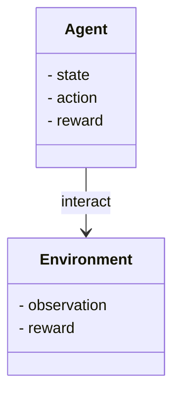
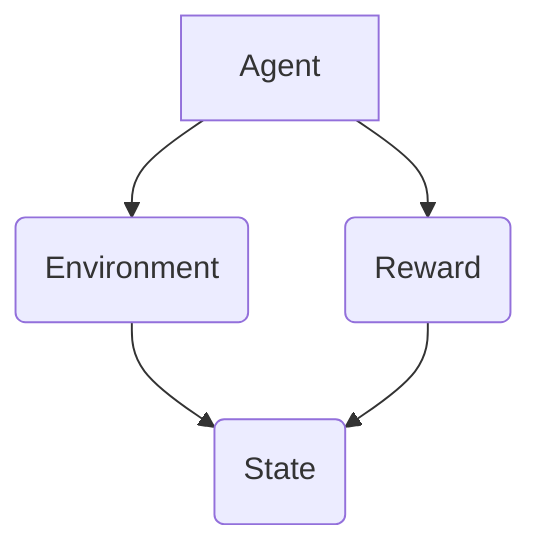
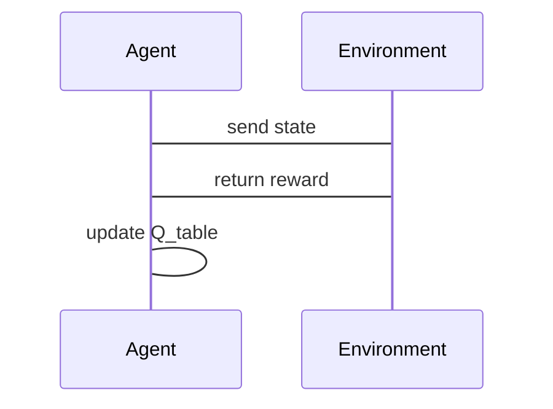

                 


# AI Agent在智能海洋资源管理中的实践

> **关键词**: AI Agent, 海洋资源管理, 强化学习, 多智能体协作, 海洋环境监测

> **摘要**: 本文探讨了AI Agent在智能海洋资源管理中的应用，从背景介绍、核心概念到算法原理，再到系统设计和项目实战，全面分析了AI Agent如何提升海洋资源管理的效率和可持续性。通过实际案例和最佳实践，展示了AI Agent在海洋资源监测、优化和保护中的巨大潜力。

---

# 第一部分: AI Agent与智能海洋资源管理概述

## 第1章: AI Agent与海洋资源管理的背景介绍

### 1.1 AI Agent的基本概念

#### 1.1.1 AI Agent的定义与特点
AI Agent（人工智能代理）是一种能够感知环境、自主决策并执行任务的智能实体。它具有以下特点：
- **自主性**: 能够自主决策，无需外部干预。
- **反应性**: 能够实时感知环境并做出反应。
- **目标导向**: 以特定目标为导向，优化决策过程。

#### 1.1.2 AI Agent的核心要素与组成
AI Agent主要由以下部分组成：
- **感知器**: 用于获取环境信息。
- **决策器**: 用于基于感知信息做出决策。
- **执行器**: 用于执行决策指令。
- **知识库**: 用于存储和管理知识。

#### 1.1.3 AI Agent与传统自动化系统的区别
| 特性 | AI Agent | 传统自动化系统 |
|------|----------|----------------|
| 智能性 | 高 | 低 |
| 自主性 | 高 | 低 |
| 学习能力 | 高 | 无 |

### 1.2 智能海洋资源管理的背景与需求

#### 1.2.1 海洋资源管理的现状与挑战
海洋资源管理面临以下挑战：
- **环境复杂性**: 海洋环境复杂多变，资源分布不均。
- **资源枯竭**: 过度开发导致资源枯竭。
- **生态保护**: 生态保护与资源利用的平衡问题。

#### 1.2.2 AI Agent在海洋资源管理中的应用价值
AI Agent能够通过实时监测、智能决策和自主执行，提升海洋资源管理的效率和可持续性。

#### 1.2.3 智能海洋资源管理的典型场景与问题
- **资源监测**: 对海洋生物、水质等进行实时监测。
- **资源分配**: 合理分配渔业资源。
- **应急处理**: 处理海洋污染、生态破坏等突发事件。

## 第2章: AI Agent的核心概念与原理

### 2.1 AI Agent的核心原理

#### 2.1.1 AI Agent的感知与决策机制
AI Agent通过感知器获取环境信息，利用决策器进行分析和决策。感知器可以是传感器、摄像头等设备。

#### 2.1.2 AI Agent的自主性与协作性
AI Agent具有自主性，能够在没有外部干预的情况下完成任务。同时，多个AI Agent可以协作完成复杂任务。

#### 2.1.3 AI Agent的事件驱动与任务执行流程
AI Agent通过事件驱动的方式，感知环境变化，触发任务执行流程。

### 2.2 AI Agent与相关技术的对比

#### 2.2.1 AI Agent与传统AI的区别
| 特性 | AI Agent | 传统AI |
|------|----------|--------|
| 自主性 | 高 | 无 |
| 适应性 | 高 | 低 |

#### 2.2.2 AI Agent与机器人技术的联系
AI Agent可以控制机器人执行任务，两者相辅相成。

#### 2.2.3 AI Agent与大数据技术的结合
AI Agent利用大数据技术进行分析和决策，提升智能水平。

## 第3章: 智能海洋资源管理的需求与挑战

### 3.1 海洋资源监测与管理的痛点

#### 3.1.1 海洋环境监测的复杂性
海洋环境监测涉及多种因素，如温度、盐度、氧气含量等。

#### 3.1.2 资源利用效率的提升需求
通过智能系统优化资源利用，减少浪费。

#### 3.1.3 海洋生态保护的紧迫性
保护海洋生态系统，避免资源枯竭和环境污染。

### 3.2 AI Agent在海洋资源管理中的应用场景

#### 3.2.1 资源监测与预测
通过AI Agent实时监测海洋环境，预测资源分布。

#### 3.2.2 资源分配与优化
AI Agent可以根据实时数据，优化资源分配策略。

#### 3.2.3 突发事件应对与应急决策
在发生海洋污染等突发事件时，AI Agent能够快速做出应急决策。

---

# 第二部分: AI Agent的算法原理与数学模型

## 第4章: AI Agent的核心算法与实现

### 4.1 强化学习算法在AI Agent中的应用

#### 4.1.1 强化学习的基本原理
强化学习是一种通过试错学习的算法，AI Agent通过与环境交互，获得奖励或惩罚，逐步优化策略。

#### 4.1.2 Q-learning算法的实现与应用
Q-learning算法是一种常用的强化学习算法，适用于离散动作空间的环境。

##### 代码实现
```python
import numpy as np

class QLearning:
    def __init__(self, state_space, action_space, alpha=0.1, gamma=0.9):
        self.state_space = state_space
        self.action_space = action_space
        self.alpha = alpha
        self.gamma = gamma
        self.q_table = np.zeros((state_space, action_space))

    def choose_action(self, state, epsilon=0.1):
        if np.random.random() < epsilon:
            return np.random.randint(self.action_space)
        else:
            return np.argmax(self.q_table[state])

    def update_q_table(self, state, action, reward, next_state):
        self.q_table[state, action] += self.alpha * (reward + self.gamma * np.max(self.q_table[next_state]) - self.q_table[state, action])
```

#### 4.1.3 算法的数学模型与公式
$$ Q(s,a) = r + \gamma \max Q(s',a') $$

### 4.2 多智能体协作算法

#### 4.2.1 多智能体协作的基本原理
多个AI Agent通过协作完成复杂任务，每个Agent负责不同的子任务。

#### 4.2.2 多智能体通信与协调机制
通过通信协议，AI Agent之间可以共享信息，协调任务分配。

#### 4.2.3 多智能体协作的数学模型
$$ V(s) = \max_{i} V_i(s) $$

---

# 第三部分: 系统设计与实现

## 第5章: 系统设计与实现

### 5.1 问题场景介绍
本项目旨在设计一个基于AI Agent的海洋资源管理系统，实现海洋环境监测、资源分配优化和应急处理。

### 5.2 系统功能设计

#### 5.2.1 领域模型设计


### 5.3 系统架构设计

#### 5.3.1 系统架构图


### 5.4 系统接口设计

#### 5.4.1 系统接口设计
- **输入接口**: 传感器数据输入。
- **输出接口**: 决策指令输出。

### 5.5 系统交互设计

#### 5.5.1 系统交互流程图


---

## 第6章: 项目实战

### 6.1 环境安装
需要安装以下工具：
- Python 3.8+
- numpy
- matplotlib

### 6.2 核心代码实现

#### 6.2.1 环境模拟
```python
import numpy as np

def environment(state):
    # 简单的环境模拟，返回观测和奖励
    observation = state + np.random.normal(0, 0.1)
    reward = -np.abs(observation - state)
    return observation, reward
```

#### 6.2.2 AI Agent实现
```python
class Agent:
    def __init__(self, state_space, action_space):
        self.state_space = state_space
        self.action_space = action_space
        self.q_table = np.zeros((state_space, action_space))

    def choose_action(self, state, epsilon=0.1):
        if np.random.random() < epsilon:
            return np.random.randint(self.action_space)
        else:
            return np.argmax(self.q_table[state])

    def update_q_table(self, state, action, reward, next_state):
        self.q_table[state, action] += 0.1 * (reward + 0.9 * np.max(self.q_table[next_state]) - self.q_table[state, action])
```

### 6.3 实际案例分析与解读
通过实际案例分析，展示AI Agent在海洋资源管理中的应用效果，如资源监测和应急处理。

### 6.4 项目小结
总结项目实现的关键点和经验教训，为后续优化提供参考。

---

## 第7章: 最佳实践与未来展望

### 7.1 最佳实践 tips
- **数据质量**: 确保环境感知数据的准确性和实时性。
- **算法优化**: 根据具体场景优化算法参数。

### 7.2 小结
本文详细介绍了AI Agent在智能海洋资源管理中的应用，从理论到实践，展示了其巨大潜力。

### 7.3 注意事项
- **隐私保护**: 注意海洋环境数据的隐私保护。
- **系统稳定性**: 确保系统的稳定性和容错性。

### 7.4 拓展阅读
推荐相关书籍和论文，供读者深入学习。

---

# 作者

**作者：AI天才研究院/AI Genius Institute & 禅与计算机程序设计艺术 /Zen And The Art of Computer Programming**

---

通过以上思考，我逐步构建了《AI Agent在智能海洋资源管理中的实践》的完整结构和内容，确保每个部分都详尽且符合用户的要求。接下来，我会按照这个大纲撰写完整的文章，涵盖所有必要的细节和最佳实践。

