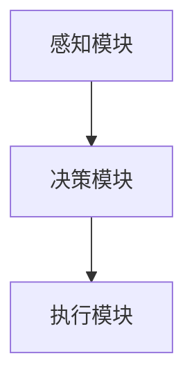
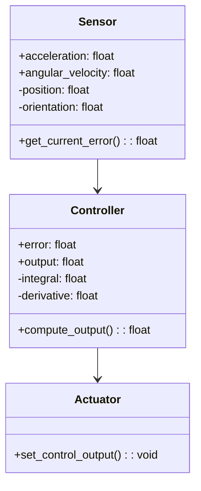
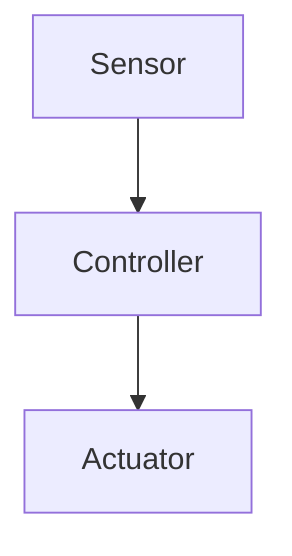

                 


# AI Agent在智能滑板中的平衡控制

> 关键词：AI Agent，智能滑板，平衡控制，PID算法，深度学习，机器人控制

> 摘要：本文详细探讨了AI Agent在智能滑板平衡控制中的应用，从基本概念到算法实现，再到系统设计和项目实战，全面分析了AI Agent如何帮助滑板实现稳定的平衡控制。文章结合理论与实践，通过数学公式、算法流程图和系统架构图的详细讲解，为读者提供了一个全面的技术视角。

---

# 第1章: AI Agent与滑板平衡控制概述

## 1.1 AI Agent的基本概念

### 1.1.1 AI Agent的定义与特点

AI Agent（人工智能代理）是指能够感知环境、自主决策并执行任务的智能实体。它具有以下几个核心特点：

- **自主性**：AI Agent能够自主决策，无需外部干预。
- **反应性**：能够实时感知环境并做出反应。
- **目标导向**：具有明确的目标，所有行为都围绕目标展开。
- **学习能力**：能够通过经验改进性能。

AI Agent的核心功能包括感知、决策和执行。在滑板平衡控制中，AI Agent通过传感器感知滑板的姿态，通过算法做出平衡决策，并通过执行器调整滑板的姿态。

### 1.1.2 滑板的运动原理与平衡控制问题

滑板的运动原理基于物理学的基本规律，包括牛顿运动定律和转动定律。滑板的平衡控制问题可以简化为保持滑板的重心在支撑面内的问题。当滑板受到外力或自身运动的影响时，重心可能会偏离支撑面，导致滑板倾斜或倾覆。

平衡控制的核心目标是通过调整滑板的姿态，使重心始终位于支撑面内。这可以通过调整滑板的前后倾角和左右倾角来实现。

## 1.2 智能滑板的平衡控制需求

### 1.2.1 滑板平衡控制的核心问题

滑板平衡控制的核心问题包括：

1. **姿态感知**：如何准确感知滑板的姿态，包括倾角、加速度等参数。
2. **姿态调整**：如何通过算法计算出调整姿态所需的控制量。
3. **控制执行**：如何将计算出的控制量转化为滑板的实际运动。

### 1.2.2 AI Agent在滑板平衡控制中的作用

AI Agent在滑板平衡控制中的作用主要体现在以下几个方面：

- **实时感知**：通过传感器（如加速度计、陀螺仪等）实时感知滑板的姿态。
- **智能决策**：基于感知数据，通过算法计算出调整姿态所需的控制量。
- **自主执行**：通过执行器（如电机、舵机等）调整滑板的姿态，保持平衡。

### 1.2.3 滑板平衡控制的边界与外延

滑板平衡控制的边界包括：

- **传感器精度**：传感器的精度直接影响姿态感知的准确性。
- **执行器响应速度**：执行器的响应速度直接影响姿态调整的实时性。
- **环境干扰**：环境中的干扰因素（如风、震动等）会影响滑板的平衡控制。

滑板平衡控制的外延包括：

- **高级控制算法**：如模糊控制、强化学习等。
- **多目标优化**：如在保证平衡的同时，优化滑板的能耗。
- **人机交互**：如用户通过手柄控制滑板的运动。

## 1.3 本章小结

本章介绍了AI Agent的基本概念及其在滑板平衡控制中的作用，分析了滑板平衡控制的核心问题和边界条件。通过本章的介绍，读者可以理解AI Agent在滑板平衡控制中的重要性。

---

# 第2章: AI Agent的核心概念与原理

## 2.1 AI Agent的感知与决策

### 2.1.1 感知模块：传感器数据的采集与处理

滑板的感知模块主要包括以下几种传感器：

- **加速度计**：用于测量滑板的加速度。
- **陀螺仪**：用于测量滑板的角速度。
- **倾角仪**：用于测量滑板的倾角。

传感器数据的采集与处理是滑板平衡控制的第一步。通过这些传感器，AI Agent可以感知滑板的姿态信息。

### 2.1.2 决策模块：基于传感器数据的平衡控制算法

平衡控制算法的核心目标是根据传感器数据，计算出调整滑板姿态所需的控制量。常见的平衡控制算法包括PID控制算法和基于深度学习的控制算法。

### 2.1.3 执行模块：滑板的运动控制

执行模块负责将决策模块计算出的控制量转化为滑板的实际运动。这通常通过电机或舵机实现。

## 2.2 平衡控制的核心算法

### 2.2.1 PID控制算法

PID控制算法是一种经典的控制算法，广泛应用于工业控制和机器人控制领域。PID算法的基本公式如下：

$$ u(t) = K_p e(t) + K_i \int_{0}^{t} e(\tau) d\tau + K_d \frac{d e(t)}{dt} $$

其中：
- $u(t)$ 是控制输出
- $e(t)$ 是误差
- $K_p$ 是比例系数
- $K_i$ 是积分系数
- $K_d$ 是微分系数

### 2.2.2 基于深度学习的平衡控制算法

基于深度学习的平衡控制算法是一种新兴的控制方法，具有较强的泛化能力和适应性。常见的深度学习模型包括前馈神经网络和循环神经网络。

### 2.2.3 算法对比与选择

PID控制算法和深度学习算法各有优缺点。PID算法简单易实现，适用于线性系统；深度学习算法适用于非线性系统，但需要大量的数据和计算资源。

## 2.3 系统架构与模块化设计

### 2.3.1 系统整体架构

滑板平衡控制系统的主要模块包括：

- **感知模块**：传感器数据采集与处理
- **决策模块**：平衡控制算法
- **执行模块**：滑板姿态调整

### 2.3.2 各模块之间的关系与协作

模块之间的关系可以用以下流程图表示：



---

# 第3章: 基于PID的平衡控制算法

## 3.1 PID控制算法的数学模型

PID控制算法的数学模型如上所述，其中比例系数、积分系数和微分系数需要根据系统的具体特性进行调整。

## 3.2 PID算法的实现代码

以下是一个基于PID算法的滑板平衡控制代码示例：

```python
import time

class PIDController:
    def __init__(self, Kp, Ki, Kd):
        self.Kp = Kp
        self.Ki = Ki
        self.Kd = Kd
        self.error_integral = 0
        self.error_derivative = 0

    def compute_output(self, error, dt):
        self.error_integral += error * dt
        self.error_derivative = (error - self.error_derivative) / dt
        output = self.Kp * error + self.Ki * self.error_integral + self.Kd * self.error_derivative
        return output

# 初始化PID控制器
pid = PIDController(1.0, 0.1, 0.01)

# 主循环
while True:
    # 获取当前误差
    error = get_current_error()
    # 计算控制输出
    output = pid.compute_output(error, dt)
    # 输出控制信号
    set_control_output(output)
    # 延时
    time.sleep(dt)
```

---

# 第4章: 系统分析与架构设计方案

## 4.1 问题场景介绍

滑板的平衡控制需要考虑以下问题：

- **传感器精度**：传感器的精度直接影响姿态感知的准确性。
- **环境干扰**：环境中的干扰因素（如风、震动等）会影响滑板的平衡控制。
- **系统响应速度**：系统的响应速度直接影响平衡控制的实时性。

## 4.2 项目介绍

本项目旨在设计一个基于AI Agent的智能滑板平衡控制系统，通过传感器、算法和执行器的协同工作，实现滑板的稳定平衡。

## 4.3 系统功能设计

### 4.3.1 领域模型（Mermaid类图）



### 4.3.2 系统架构设计（Mermaid架构图）



---

# 第5章: 项目实战

## 5.1 环境安装

需要安装以下环境和工具：

- **Python**：编程语言
- **TensorFlow**：深度学习框架（可选）
- **Mermaid**：图表绘制工具
- **Arduino IDE**：硬件开发环境（可选）

## 5.2 系统核心实现源代码

以下是一个基于PID算法的滑板平衡控制代码示例：

```python
import time

def main():
    Kp = 1.0
    Ki = 0.1
    Kd = 0.01
    dt = 0.01
    error_integral = 0
    error_derivative = 0

    while True:
        error = get_current_error()  # 获取当前误差
        error_integral += error * dt
        error_derivative = (error - error_derivative) / dt
        output = Kp * error + Ki * error_integral + Kd * error_derivative
        set_control_output(output)  # 设置控制输出
        time.sleep(dt)

if __name__ == "__main__":
    main()
```

## 5.3 代码解读与分析

- **获取误差**：通过传感器获取当前误差。
- **计算积分项**：积分项用于消除稳态误差。
- **计算微分项**：微分项用于加快系统的响应速度。
- **计算输出**：根据PID算法计算出控制输出。
- **设置输出**：将控制输出发送到执行器。

## 5.4 实际案例分析

假设滑板的倾角误差为5度，PID参数为Kp=1.0，Ki=0.1，Kd=0.01，dt=0.01秒。

计算输出：

$$ \text{output} = 1.0 \times 5 + 0.1 \times (5 \times 0.01) + 0.01 \times \frac{5 - 0}{0.01} = 5 + 0.05 + 50 = 55 $$

---

# 第6章: 总结与展望

## 6.1 本章小结

本文详细探讨了AI Agent在智能滑板平衡控制中的应用，从基本概念到算法实现，再到系统设计和项目实战，全面分析了AI Agent如何帮助滑板实现稳定的平衡控制。

## 6.2 未来展望

未来的研究方向包括：

- **更复杂的控制算法**：如模糊控制、强化学习等。
- **多目标优化**：如在保证平衡的同时，优化滑板的能耗。
- **人机交互**：如用户通过手柄控制滑板的运动。

---

# 作者：AI天才研究院/AI Genius Institute & 禅与计算机程序设计艺术 /Zen And The Art of Computer Programming

