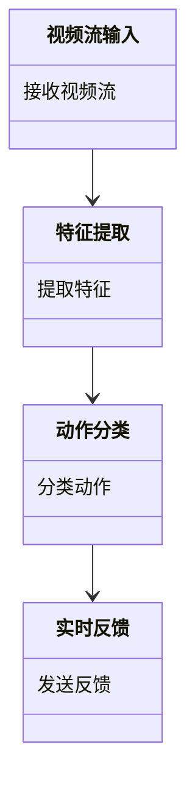
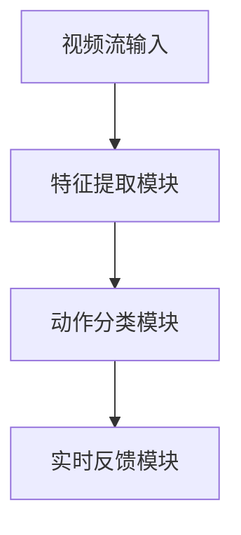
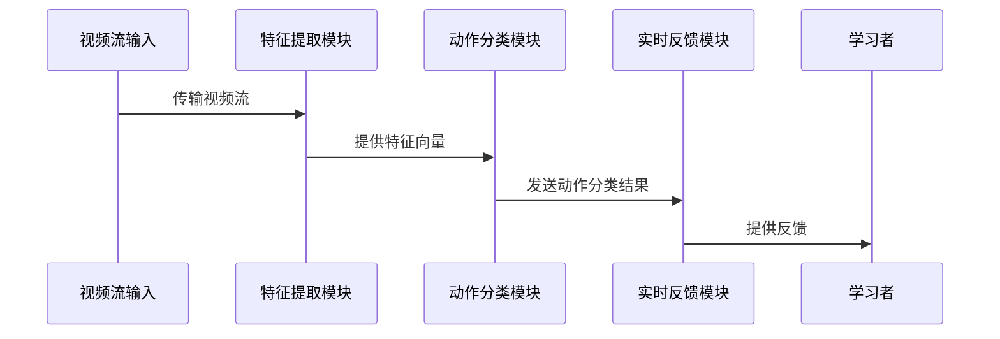

                 


# 《AI Agent在智能滑板中的技巧学习指导》

---

## 关键词：
AI Agent, 滑板技巧, 强化学习, 动作识别, 个性化指导, 实时反馈

---

## 摘要：
本文将深入探讨AI Agent在智能滑板中的应用，分析其在滑板技巧学习中的核心作用。通过结合AI技术与滑板运动，本文将详细阐述AI Agent的基本概念、算法原理、系统架构设计以及实际项目实现。我们还将探讨如何利用强化学习和监督学习等算法，实现滑板动作的识别与分析，并提供个性化的技巧指导。最终，本文将展示一个基于AI Agent的滑板技巧学习系统，帮助学习者快速掌握滑板技巧。

---

# 第三章: AI Agent的算法原理

## 3.1 强化学习算法

### 3.1.1 强化学习的基本原理
强化学习是一种通过智能体与环境交互来学习策略的方法。智能体通过与环境交互，获得奖励或惩罚，并通过调整策略来最大化累计奖励。在滑板技巧学习中，AI Agent可以作为智能体，通过强化学习来优化动作选择。

#### 算法流程：
1. **状态识别**：AI Agent感知当前滑板状态（如速度、角度、位置等）。
2. **动作选择**：基于当前状态，AI Agent选择一个动作（如加速、转弯、跳跃等）。
3. **环境反馈**：执行动作后，AI Agent获得反馈（奖励或惩罚）。
4. **策略更新**：根据反馈更新策略，优化动作选择。

### 3.1.2 Q-learning算法的实现
Q-learning是一种经典的强化学习算法，适用于离散动作空间的情况。

#### 算法步骤：
1. 初始化Q表（Q-learning的核心数据结构）。
2. 重复以下步骤直到终止条件满足：
   - 选择当前状态下的动作（探索或利用）。
   - 执行动作，获得奖励和新状态。
   - 更新Q表：$Q(s, a) = Q(s, a) + \alpha [r + \gamma \max Q(s', a')]$，其中$\alpha$是学习率，$\gamma$是折扣因子。

#### 代码示例：
```python
import numpy as np

class QLearning:
    def __init__(self, state_space, action_space, alpha=0.1, gamma=0.9):
        self.Q = np.zeros((state_space, action_space))
        self.alpha = alpha
        self.gamma = gamma

    def choose_action(self, state, epsilon=0.1):
        if np.random.random() < epsilon:
            return np.random.randint(0, action_space)
        else:
            return np.argmax(self.Q[state, :])

    def update_Q(self, state, action, reward, next_state):
        self.Q[state, action] = self.Q[state, action] + self.alpha * (reward + self.gamma * np.max(self.Q[next_state, :]))
```

### 3.1.3 Deep Q-Network (DQN)算法的应用
DQN结合了深度学习和强化学习，适用于高维状态空间的情况。通过神经网络近似Q值函数，DQN可以处理复杂的滑板动作。

#### 算法流程：
1. 使用神经网络近似Q值函数。
2. 通过经验回放和目标网络减少样本偏差。
3. 实时更新神经网络参数。

#### 代码示例：
```python
import torch
import torch.nn as nn
import torch.optim as optim

class DQN(nn.Module):
    def __init__(self, input_dim, hidden_dim, output_dim):
        super(DQN, self).__init__()
        self.fc1 = nn.Linear(input_dim, hidden_dim)
        self.fc2 = nn.Linear(hidden_dim, output_dim)
        self.relu = nn.ReLU()
        self.softmax = nn.Softmax(dim=1)

    def forward(self, x):
        x = self.fc1(x)
        x = self.relu(x)
        x = self.fc2(x)
        return self.softmax(x)

# 初始化DQN
input_dim = 4  # 示例状态空间
hidden_dim = 10
output_dim = 3  # 示例动作空间
dqn = DQN(input_dim, hidden_dim, output_dim)
optimizer = optim.Adam(dqn.parameters(), lr=0.001)
criterion = nn.MSELoss()

# 假设有一个状态s和目标Q值target_Q
s = torch.randn(input_dim)
target_Q = torch.randn(output_dim)

# 前向传播
outputs = dqn(s)

# 计算损失
loss = criterion(outputs, target_Q)
loss.backward()
optimizer.step()
```

## 3.2 监督学习算法

### 3.2.1 监督学习的基本概念
监督学习通过标记数据训练模型，使其能够预测新的数据。在滑板技巧学习中，监督学习可以用于滑板动作的分类和识别。

### 3.2.2 滑板动作识别的监督学习模型
常用的支持向量机（SVM）和随机森林（Random Forest）等监督学习算法可以用于滑板动作的分类。

#### 代码示例：
```python
from sklearn import svm, metrics
from sklearn.ensemble import RandomForestClassifier

# 示例数据集：滑板动作的特征向量
X = [[v1, v2, v3, v4], ...]  # 特征向量
y = ['直行', '转弯', '跳跃']  # 标签

# 使用SVM进行训练
clf_svm = svm.SVC()
clf_svm.fit(X, y)

# 使用Random Forest进行训练
clf_rf = RandomForestClassifier()
clf_rf.fit(X, y)

# 预测新样本
new_sample = [[0.5, 0.3, 0.8, 0.2]]
print("SVM预测结果:", clf_svm.predict(new_sample))
print("Random Forest预测结果:", clf_rf.predict(new_sample))
```

### 3.2.3 模型训练与优化
通过交叉验证和超参数调优，可以优化监督学习模型的性能。

---

## 3.3 算法的数学模型与公式

### 3.3.1 Q-learning算法的数学模型
$$ 
Q(s, a) = Q(s, a) + \alpha [r + \gamma \max Q(s', a')]
$$

### 3.3.2 DQN算法的损失函数
$$ 
\mathcal{L} = \mathbb{E}[ (r + \gamma Q(s', a') - Q(s, a))^2 ]
$$

### 3.3.3 监督学习的损失函数
$$ 
\mathcal{L} = \frac{1}{N}\sum_{i=1}^{N} (y_i - \hat{y}_i)^2
$$

---

# 第四章: 滑板动作识别系统的详细设计

## 4.1 问题场景介绍
滑板动作识别系统需要实时分析滑板运动的视频流，识别出具体的滑板动作（如直行、转弯、跳跃等）。

## 4.2 项目介绍
本项目基于AI Agent开发滑板动作识别系统，利用计算机视觉和机器学习技术，实现滑板动作的实时识别与分类。

## 4.3 系统功能设计
### 4.3.1 功能模块
1. **视频流输入**：接收滑板运动的视频流。
2. **特征提取**：提取视频流中的滑板动作特征（如速度、加速度、角度等）。
3. **动作分类**：利用机器学习模型（如SVM、随机森林等）进行动作分类。
4. **实时反馈**：将识别结果反馈给学习者。

### 4.3.2 领域模型（类图）


## 4.4 系统架构设计

### 4.4.1 系统架构图


### 4.4.2 系统接口设计
1. **输入接口**：接收视频流数据。
2. **输出接口**：发送动作识别结果。
3. **内部接口**：模块之间的数据交互。

### 4.4.3 系统交互图


---

## 4.5 项目实战

### 4.5.1 环境安装
安装所需的库：
```bash
pip install numpy
pip install scikit-learn
pip install opencv-python
```

### 4.5.2 系统核心实现源代码
```python
import cv2
from sklearn.svm import SVC
from sklearn.metrics import accuracy_score

# 示例视频流处理
cap = cv2.VideoCapture('滑板视频.mp4')

# 提取特征
features = []
labels = []
while cap.isOpened():
    ret, frame = cap.read()
    if not ret:
        break
    # 提取特征（简化示例）
    features.append([frame.mean(), frame.std()])
    # 假设labels已知
    labels.append('直行')

# 训练SVM模型
clf = SVC()
clf.fit(features, labels)

# 测试模型
test_features = [[视频流中某一帧的特征]]
print("预测结果:", clf.predict(test_features))
```

### 4.5.3 代码应用解读与分析
上述代码展示了如何利用视频流数据进行滑板动作的特征提取和分类。SVM模型用于动作分类，输出预测结果。

---

## 4.6 项目小结
本章详细介绍了滑板动作识别系统的架构设计和实现过程，展示了如何利用AI Agent技术实现滑板动作的实时识别与分类。

---

## 总结与展望

### 5.1 总结
本文全面探讨了AI Agent在智能滑板中的应用，从算法原理到系统架构设计，再到项目实战，详细阐述了AI Agent在滑板技巧学习中的核心作用。通过强化学习和监督学习算法，我们能够实现滑板动作的识别与分类，并提供个性化的技巧指导。

### 5.2 展望
未来，随着AI技术的不断发展，AI Agent在智能滑板中的应用将更加广泛。我们可以进一步优化算法，提高动作识别的精度和实时性，同时探索更多AI技术在滑板运动中的创新应用。

---

## 最佳实践 Tips
- 在实际项目中，建议结合滑板运动的特点，选择合适的AI算法。
- 确保数据质量和多样性，以提高模型的泛化能力。
- 及时优化模型参数，提升系统的性能和用户体验。

---

## 小结
通过本文的介绍，读者可以深入了解AI Agent在智能滑板中的技巧学习指导，掌握相关的核心算法和系统设计方法。希望本文能够为滑板运动与人工智能的结合提供有价值的参考。

---

## 注意事项
- 在实际应用中，确保系统的实时性和稳定性，避免因算法延迟影响用户体验。
- 数据安全和隐私保护也是需要重点关注的问题。

---

## 拓展阅读
1. 《强化学习入门：基于Python的实现》
2. 《机器学习实战：基于Scikit-Learn和TensorFlow》
3. 《计算机视觉：算法与应用》

---

## 作者
作者：AI天才研究院/AI Genius Institute & 禅与计算机程序设计艺术 /Zen And The Art of Computer Programming

