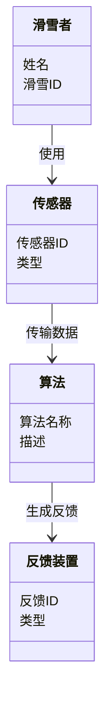
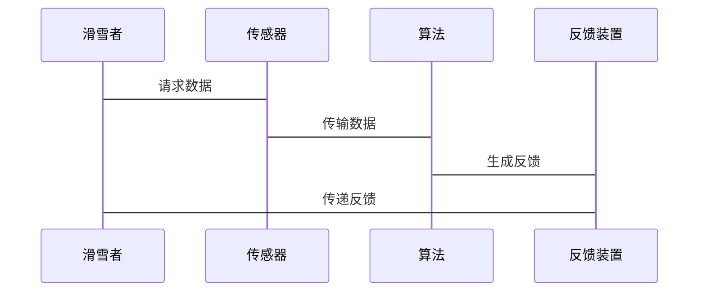

                 


# AI Agent在智能滑雪板中的技巧改进指导

> 关键词：AI Agent, 智能滑雪板, 技巧改进, 强化学习, 系统架构

> 摘要：本文探讨了AI Agent在智能滑雪板中的应用，通过分析滑雪技巧改进的需求，结合强化学习算法，提出了一种基于AI Agent的滑雪板智能化解决方案。文章详细阐述了AI Agent的核心概念、算法原理、系统架构设计，以及实际项目实现，并总结了最佳实践和未来发展方向。

---

## 第1章: AI Agent与滑雪板的背景介绍

### 1.1 问题背景
#### 1.1.1 智能滑雪板的发展现状
滑雪运动是一项结合了技巧、体力和策略的运动，传统滑雪板的改进主要集中在材料和结构优化上。然而，随着人工智能技术的发展，滑雪板的智能化成为新的趋势。智能滑雪板通过集成传感器、AI算法和无线通信技术，能够实时感知滑雪者的动作、雪况和环境变化，提供个性化的技巧指导。

#### 1.1.2 AI Agent在滑雪运动中的应用潜力
AI Agent（智能体）是一种能够感知环境并采取行动以实现目标的实体。在滑雪板中，AI Agent可以实时分析滑雪者的动作数据，提供即时反馈，帮助滑雪者优化技巧。此外，AI Agent还可以根据天气、雪质和地形等因素，动态调整滑雪板的参数，以提高滑雪体验和安全性。

#### 1.1.3 传统滑雪技巧的局限性
传统滑雪技巧的改进主要依赖于教练的主观指导和滑雪者的自我练习。这种模式存在以下问题：
- 教练的指导可能因人而异，难以覆盖所有滑雪者的个性化需求。
- 滑雪者在练习过程中缺乏实时反馈，难以及时纠正动作错误。
- 传统技巧改进方法效率低下，且难以量化改进效果。

### 1.2 问题描述
#### 1.2.1 滑雪者的技术改进需求
滑雪者在练习过程中，往往需要面对复杂的环境和技术挑战。如何快速掌握高级技巧、避免受伤、提高滑雪效率是滑雪者的核心需求。

#### 1.2.2 AI Agent在滑雪技巧优化中的角色
AI Agent可以通过以下方式帮助滑雪者改进技巧：
- 实时分析滑雪者的动作数据，提供个性化反馈。
- 根据环境变化动态调整滑雪板的参数，优化滑雪体验。
- 提供虚拟教练功能，模拟不同场景下的最佳动作。

#### 1.2.3 滑雪板智能化的技术挑战
滑雪板智能化需要解决以下技术难题：
- 如何高效采集滑雪者的动作数据。
- 如何设计高效的AI算法，实时处理大量数据。
- 如何确保系统的可靠性和安全性。

### 1.3 问题解决
#### 1.3.1 AI Agent的核心作用
AI Agent在滑雪板中的核心作用包括：
- 实时感知滑雪者的动作和环境。
- 分析数据并生成优化建议。
- 提供即时反馈和个性化指导。

#### 1.3.2 滑雪板智能化的实现路径
滑雪板智能化的实现路径可以分为以下几个步骤：
1. **数据采集**：通过传感器采集滑雪者的动作数据和环境数据。
2. **数据处理**：利用AI算法分析数据，生成优化建议。
3. **反馈与执行**：将优化建议通过滑雪板的反馈装置（如震动或声音）传递给滑雪者。

#### 1.3.3 技巧改进的具体应用场景
AI Agent在滑雪技巧改进中的具体应用场景包括：
- 帮助滑雪者掌握基本动作，如平衡、转弯和停止。
- 提供高级技巧训练，如跳跃、倒滑和花式动作。
- 在复杂环境中（如陡峭山坡或障碍物）提供实时指导。

### 1.4 边界与外延
#### 1.4.1 AI Agent在滑雪板中的应用边界
AI Agent的应用边界包括：
- 数据采集范围：仅限于滑雪板本身和滑雪者的动作数据。
- 算法处理能力：仅限于实时数据处理和优化建议生成。
- 系统交互方式：仅限于滑雪板和滑雪者之间的交互。

#### 1.4.2 滑雪板智能化的外延领域
滑雪板智能化的外延领域包括：
- 智能滑雪设备的开发，如智能雪橇、智能滑雪杖。
- 智能滑雪场的设计，如智能标记、智能救援系统。
- 智能滑雪App的开发，如路线规划、视频分析。

#### 1.4.3 相关技术的对比分析
以下是几种相关技术的对比分析：
- **传统滑雪教练**：依赖人工经验，反馈延迟，个性化能力有限。
- **虚拟现实技术**：提供虚拟训练环境，但缺乏实时反馈。
- **AI Agent**：结合实时数据和AI算法，提供个性化和即时反馈。

### 1.5 概念结构与核心要素
#### 1.5.1 AI Agent的定义与组成
AI Agent由以下几部分组成：
- **感知模块**：负责采集环境和动作数据。
- **决策模块**：负责分析数据并生成优化建议。
- **执行模块**：负责将优化建议传递给滑雪者。

#### 1.5.2 滑雪板智能化的核心要素
滑雪板智能化的核心要素包括：
- **传感器**：用于采集滑雪者的动作和环境数据。
- **AI算法**：用于分析数据并生成优化建议。
- **反馈装置**：用于将优化建议传递给滑雪者。

#### 1.5.3 相关技术的关联性分析
以下是相关技术的关联性分析：
- **传感器技术**：传感器是AI Agent获取数据的基础。
- **AI算法**：AI算法是数据处理的核心。
- **反馈装置**：反馈装置是优化建议的输出方式。

### 1.6 本章小结
本章介绍了AI Agent在滑雪板中的背景和应用潜力，分析了传统滑雪技巧的局限性，并提出了滑雪板智能化的实现路径。通过对比分析，明确了AI Agent的核心作用和相关技术的关联性。

---

## 第2章: AI Agent的核心概念与联系

### 2.1 核心概念原理
#### 2.1.1 AI Agent的基本原理
AI Agent的基本原理可以概括为：
1. **感知环境**：通过传感器采集环境和动作数据。
2. **分析数据**：利用AI算法对数据进行分析和处理。
3. **生成建议**：根据分析结果生成优化建议。
4. **反馈执行**：将优化建议传递给滑雪者。

#### 2.1.2 滑雪板智能化的核心机制
滑雪板智能化的核心机制包括：
- **数据采集**：通过传感器采集滑雪者的动作和环境数据。
- **数据处理**：利用AI算法分析数据，生成优化建议。
- **反馈与执行**：将优化建议通过反馈装置传递给滑雪者。

#### 2.1.3 技巧改进的实现逻辑
技巧改进的实现逻辑可以分为以下几个步骤：
1. **数据采集**：采集滑雪者的动作数据。
2. **数据分析**：分析数据，识别动作中的问题。
3. **生成建议**：根据分析结果生成优化建议。
4. **反馈执行**：将优化建议传递给滑雪者。

### 2.2 核心概念属性特征对比
以下是AI Agent与传统滑雪教练的对比分析：

| **属性**          | **AI Agent**                     | **传统滑雪教练**               |
|--------------------|----------------------------------|------------------------------|
| **反馈速度**       | 实时反馈                        | 延时反馈                      |
| **个性化能力**     | 强大的个性化能力                | 有限的个性化能力              |
| **效率**           | 高效                            | 较低                          |
| **可靠性**         | 高度可靠                        | 取决于教练的经验和能力        |

### 2.3 ER实体关系图
以下是AI Agent在滑雪板中的实体关系图：

```mermaid
erDiagram
    actor 滑雪者 {
        string 姓名
        string 滑雪ID
    }
    sensor 传感器 {
        int 传感器ID
        string 类型
    }
    ai算法 算法 {
        string 算法名称
        string 描述
    }
    feedback 反馈装置 {
        int 反馈ID
        string 类型
    }
    滑雪者 o-| 采集 | 传感器
    传感器 o-| 传输 | 数据流
    数据流 o-| 处理 | 算法
    算法 o-| 生成 | 建议
    建议 o-| 输出 | 反馈装置
```

---

## 第3章: AI Agent的算法原理讲解

### 3.1 算法原理概述
AI Agent的核心算法是强化学习（Reinforcement Learning）。强化学习是一种通过试错机制，学习最优策略的方法。在滑雪板中，AI Agent通过强化学习算法，优化滑雪者的动作和滑雪板的参数。

### 3.2 强化学习算法
#### 3.2.1 强化学习的基本原理
强化学习的基本原理可以概括为：
1. **状态（State）**：环境中的当前情况。
2. **动作（Action）**：智能体采取的行动。
3. **奖励（Reward）**：智能体采取行动后获得的反馈。
4. **策略（Policy）**：智能体采取行动的概率分布。

#### 3.2.2 Q-learning算法
Q-learning是一种经典的强化学习算法，其核心思想是通过Q值表来记录状态-动作对的期望奖励。公式如下：

$$ Q(s, a) = Q(s, a) + \alpha (r + \gamma \max Q(s', a') - Q(s, a)) $$

其中：
- \( Q(s, a) \)：当前状态 \( s \) 和动作 \( a \) 的Q值。
- \( \alpha \)：学习率。
- \( r \)：奖励。
- \( \gamma \)：折扣因子。
- \( s' \)：下一个状态。
- \( \max Q(s', a') \)：下一个状态下的最大Q值。

#### 3.2.3 算法实现
以下是Q-learning算法的Python实现示例：

```python
import numpy as np

class QLearning:
    def __init__(self, state_space, action_space, learning_rate=0.1, gamma=0.9):
        self.state_space = state_space
        self.action_space = action_space
        self.learning_rate = learning_rate
        self.gamma = gamma
        self.q_table = np.zeros((state_space, action_space))
    
    def choose_action(self, state, epsilon=0.1):
        if np.random.random() < epsilon:
            return np.random.randint(self.action_space)
        else:
            return np.argmax(self.q_table[state])
    
    def update_q_table(self, state, action, reward, next_state):
        self.q_table[state, action] = self.q_table[state, action] + self.learning_rate * (reward + self.gamma * np.max(self.q_table[next_state]) - self.q_table[state, action])
```

### 3.3 算法应用
在滑雪板中，AI Agent通过Q-learning算法，优化滑雪者的动作和滑雪板的参数。例如，当滑雪者在练习转弯时，AI Agent会根据当前状态（如速度、角度）选择最佳的动作，并根据反馈调整Q值表，优化未来的动作选择。

---

## 第4章: 系统分析与架构设计方案

### 4.1 问题场景介绍
滑雪板智能化的系统需要解决以下问题：
- 如何高效采集滑雪者的动作数据。
- 如何设计高效的AI算法，实时处理数据。
- 如何确保系统的可靠性和安全性。

### 4.2 系统功能设计
#### 4.2.1 领域模型类图
以下是领域模型类图：



#### 4.2.2 系统架构设计
以下是系统架构设计图：


#### 4.2.3 接口和交互序列图
以下是接口和交互序列图：



---

## 第5章: 项目实战

### 5.1 环境安装
以下是项目实战所需的环境：
- **硬件**：传感器、滑雪板、反馈装置。
- **软件**：Python、TensorFlow、Keras。

### 5.2 系统核心实现源代码
以下是Q-learning算法的Python实现：

```python
import numpy as np

class QLearning:
    def __init__(self, state_space, action_space, learning_rate=0.1, gamma=0.9):
        self.state_space = state_space
        self.action_space = action_space
        self.learning_rate = learning_rate
        self.gamma = gamma
        self.q_table = np.zeros((state_space, action_space))
    
    def choose_action(self, state, epsilon=0.1):
        if np.random.random() < epsilon:
            return np.random.randint(self.action_space)
        else:
            return np.argmax(self.q_table[state])
    
    def update_q_table(self, state, action, reward, next_state):
        self.q_table[state, action] = self.q_table[state, action] + self.learning_rate * (reward + self.gamma * np.max(self.q_table[next_state]) - self.q_table[state, action])
```

### 5.3 代码应用解读与分析
- **初始化**：初始化Q表，记录每个状态-动作对的Q值。
- **选择动作**：根据epsilon-greedy策略选择动作。
- **更新Q表**：根据奖励和下一个状态更新Q值。

### 5.4 实际案例分析
以下是一个实际案例分析：
1. **数据采集**：传感器采集滑雪者的动作数据。
2. **数据处理**：算法分析数据，生成优化建议。
3. **反馈与执行**：将优化建议传递给滑雪者。

### 5.5 项目小结
本章通过实际案例展示了AI Agent在滑雪板中的应用，详细讲解了系统的实现过程，并分析了项目的优缺点。

---

## 第6章: 总结与展望

### 6.1 总结
本文详细探讨了AI Agent在智能滑雪板中的应用，通过强化学习算法，优化滑雪者的动作和滑雪板的参数。系统设计和项目实战展示了AI Agent的核心概念和实现过程。

### 6.2 展望
未来，随着AI技术的发展，智能滑雪板将更加智能化和个性化。AI Agent将在滑雪技巧改进、滑雪安全和滑雪体验提升方面发挥更大的作用。

---

## 第7章: 最佳实践 tips

### 7.1 小结
AI Agent在智能滑雪板中的应用前景广阔，通过实时数据处理和个性化反馈，帮助滑雪者优化技巧，提高滑雪体验。

### 7.2 注意事项
- 数据隐私和安全问题需要高度重视。
- 系统的泛化能力需要进一步提升。
- 算法的实时性和准确性需要不断优化。

### 7.3 拓展阅读
以下是推荐的拓展阅读材料：
- 《强化学习实战》
- 《人工智能在运动领域中的应用》
- 《智能滑雪板的设计与实现》

---

## 作者

作者：AI天才研究院/AI Genius Institute & 禅与计算机程序设计艺术 /Zen And The Art of Computer Programming

---

希望这篇文章能够为您提供有价值的信息和启发！如果需要进一步探讨或补充，请随时联系我。

