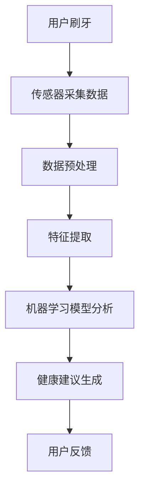
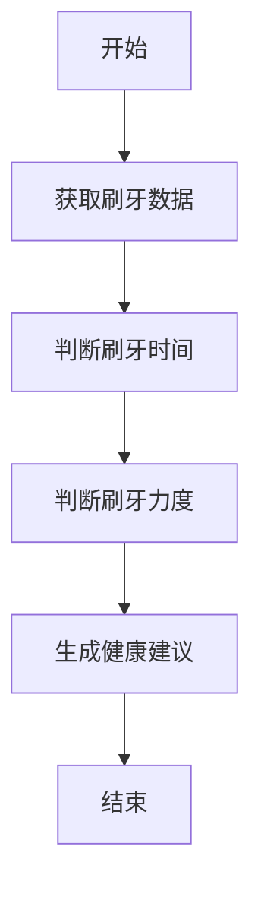
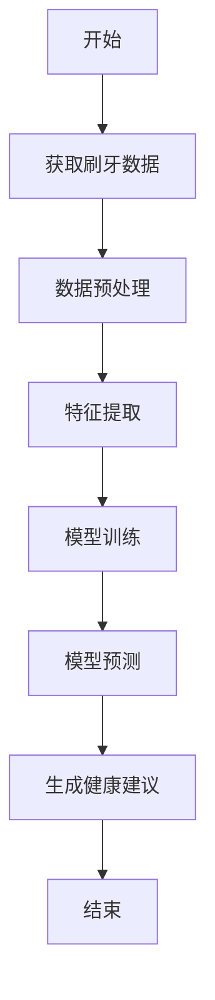
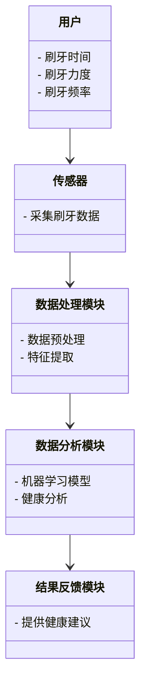
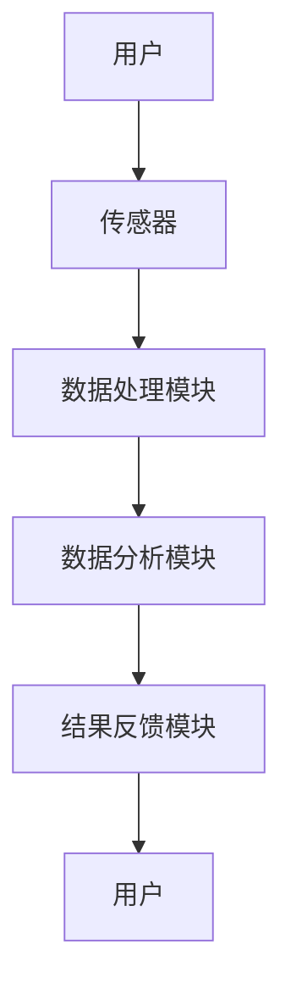

                 


# AI Agent在智能牙刷中的口腔健康分析

> 关键词：AI Agent，智能牙刷，口腔健康，数据分析，机器学习

> 摘要：本文深入探讨了AI Agent在智能牙刷中的应用，分析了其如何通过数据采集、处理和分析来评估用户的口腔健康状况。文章详细介绍了AI Agent的核心概念、算法原理、系统架构，并通过实际案例展示了如何利用这些技术实现智能牙刷的健康分析功能。最后，文章总结了当前的技术成果，并展望了未来的发展方向。

---

## 第一部分: AI Agent在智能牙刷中的口腔健康分析概述

### 第1章: AI Agent与智能牙刷的背景介绍

#### 1.1 AI Agent的基本概念
AI Agent，即人工智能代理，是一种能够感知环境、执行任务并做出决策的智能实体。它能够通过传感器或数据输入获取信息，并利用预设的算法进行分析和推理，从而实现特定的目标。

**AI Agent的核心特征：**
1. **自主性**：能够在没有外部干预的情况下独立运行。
2. **反应性**：能够实时感知环境并做出反应。
3. **学习能力**：通过数据和经验不断优化自身的算法和决策能力。
4. **交互性**：能够与用户或其他系统进行有效的信息交互。

AI Agent在智能设备中的应用非常广泛，尤其是在需要实时数据分析和决策支持的场景中。智能牙刷作为一种结合了传感器和人工智能技术的设备，AI Agent在其功能中扮演了至关重要的角色。

#### 1.2 智能牙刷的发展历程
智能牙刷是一种结合了传统牙刷功能和现代智能技术的创新产品。它通过内置的传感器和AI算法，能够实时监测用户的口腔健康状况，并提供个性化的建议和反馈。

**智能牙刷的定义与分类：**
- **定义**：智能牙刷是一种利用传感器和人工智能技术，能够监测用户的刷牙习惯、口腔健康状况，并提供反馈的智能设备。
- **分类**：根据功能的不同，智能牙刷可以分为基础款（如监测刷牙时间、力度）和高端款（如口腔健康分析、疾病预警）。

**智能牙刷的技术发展趋势：**
1. **传感器技术的进步**：更高精度和更低功耗的传感器使得智能牙刷能够采集更多的数据。
2. **算法优化**：AI Agent的算法不断优化，能够更准确地分析口腔健康状况。
3. **用户交互体验的提升**：通过语音助手、手机App等方式，用户能够更方便地获取健康建议。

#### 1.3 口腔健康分析的重要性
口腔健康是整体身体健康的重要组成部分。通过智能牙刷中的AI Agent，用户可以实时了解自己的口腔状况，并采取相应的措施来预防和改善口腔健康问题。

**口腔健康的多维度评估：**
- **口腔清洁度**：刷牙时间、力度、频率等。
- **口腔疾病风险**：牙龈炎、龋齿等疾病的早期预警。
- **口腔健康建议**：根据数据分析结果，提供个性化的刷牙建议和口腔护理方案。

**AI Agent在智能牙刷中的作用：**
AI Agent通过实时分析用户的刷牙数据和口腔健康信息，能够帮助用户更好地了解自己的口腔状况，并提供针对性的健康建议。这不仅提高了用户的口腔健康水平，还能够预防和减少口腔疾病的发生。

---

## 第二部分: AI Agent的核心概念与联系

### 第2章: AI Agent的核心概念

#### 2.1 AI Agent的核心原理
AI Agent通过传感器获取数据，利用算法进行分析和推理，最终生成决策或反馈。在智能牙刷中，AI Agent的主要任务是分析用户的刷牙数据和口腔健康信息。

**AI Agent的核心原理：**
1. **数据采集**：通过传感器获取刷牙时间、力度、频率等数据。
2. **数据处理**：对采集到的数据进行预处理和特征提取。
3. **数据分析**：利用机器学习算法对数据进行分析，识别用户的口腔健康问题。
4. **决策与反馈**：根据分析结果，生成相应的健康建议和反馈。

#### 2.2 智能牙刷中的数据流分析
在智能牙刷中，数据流从传感器开始，经过处理、分析和反馈的流程，最终为用户提供个性化的健康建议。

**数据流分析的步骤：**
1. **数据采集**：传感器收集刷牙数据。
2. **数据预处理**：去除噪声，提取有用特征。
3. **数据分析**：利用AI算法分析数据，识别健康问题。
4. **结果反馈**：将分析结果以用户友好的方式呈现。

**数据流分析的流程图：**


#### 2.3 AI Agent与智能牙刷的关系
AI Agent是智能牙刷的核心技术，它通过分析用户的刷牙数据和口腔健康信息，为用户提供个性化的健康建议。智能牙刷则是AI Agent的应用载体，通过传感器和用户界面实现数据的采集和反馈。

**AI Agent与智能牙刷的关系：**
- AI Agent是智能牙刷的“大脑”，负责数据分析和决策。
- 智能牙刷是AI Agent的“身体”，负责数据采集和用户交互。

---

## 第三部分: AI Agent的算法原理

### 第3章: AI Agent的算法原理

#### 3.1 基于规则的推理算法
基于规则的推理是一种简单但有效的算法，适用于规则明确的场景。在智能牙刷中，基于规则的推理算法可以用于判断用户的刷牙习惯是否良好。

**基于规则的推理算法的流程图：**


**规则的具体实现：**
- 刷牙时间过短（<2分钟）：建议延长刷牙时间。
- 刷牙力度过大：建议调整力度，避免牙龈出血。

#### 3.2 机器学习模型
机器学习模型能够通过大量的数据训练，自动识别用户的口腔健康问题，并提供个性化的建议。

**机器学习模型的流程图：**


**数学模型：**
- **条件概率**：用于判断用户是否存在牙龈炎的风险。
  $$ P(牙龈炎 | 刷牙力度过大) = \frac{P(刷牙力度过大 | 牙龈炎) \cdot P(牙龈炎)}{P(刷牙力度过大)} $$
- **损失函数**：用于模型优化，常用交叉熵损失函数。
  $$ \text{损失} = -\frac{1}{N}\sum_{i=1}^{N} [y_i \cdot \log(p_i) + (1 - y_i) \cdot \log(1 - p_i)] $$

---

## 第四部分: 智能牙刷的系统架构

### 第4章: 智能牙刷的系统架构

#### 4.1 系统功能设计
智能牙刷的系统功能包括数据采集、数据处理、数据分析和结果反馈。

**系统功能设计的类图：**


#### 4.2 系统架构设计
智能牙刷的系统架构包括传感器、数据处理模块、数据分析模块和结果反馈模块。

**系统架构设计的架构图：**


---

## 第五部分: 项目实战

### 第5章: 项目实战

#### 5.1 环境安装
- **Python环境**：安装Python 3.8及以上版本。
- **依赖库安装**：使用pip安装numpy、scikit-learn、mermaid等库。

#### 5.2 核心功能实现
- **数据采集模块**：编写代码采集刷牙数据。
- **数据处理模块**：对数据进行预处理和特征提取。
- **模型训练模块**：训练机器学习模型，进行健康分析。
- **结果反馈模块**：生成健康建议并反馈给用户。

#### 5.3 代码实现
```python
import numpy as np
from sklearn.model_selection import train_test_split
from sklearn.linear_model import LogisticRegression

# 数据预处理
def preprocess(data):
    # 假设data是一个包含刷牙时间、力度、频率的二维数组
    # 这里进行简单的标准化处理
    processed_data = (data - np.mean(data, axis=0)) / np.std(data, axis=0)
    return processed_data

# 特征提取
def extract_features(data):
    # 提取刷牙时间、力度、频率作为特征
    features = data[:, :3]
    return features

# 模型训练
def train_model(features, labels):
    # 使用逻辑回归模型
    model = LogisticRegression()
    model.fit(features, labels)
    return model

# 模型预测
def predict_health(model, features):
    return model.predict(features)

# 示例代码
data = np.array([[2, 3, 1], [3, 2, 2], [4, 1, 3]])
processed_data = preprocess(data)
features = extract_features(processed_data)
labels = np.array([0, 1, 0])  # 假设0表示健康，1表示异常
model = train_model(features, labels)
new_features = np.array([[3, 2, 2]])
prediction = predict_health(model, new_features)
print("健康建议：", prediction[0])
```

---

## 第六部分: 最佳实践与总结

### 第6章: 最佳实践

#### 6.1 数据隐私保护
在智能牙刷的设计中，必须重视用户数据的隐私保护。所有数据必须加密存储，并且在传输过程中使用安全协议。

#### 6.2 模型优化
为了提高模型的准确性，可以尝试不同的算法和优化策略，如集成学习、超参数调优等。

#### 6.3 用户教育
用户需要了解智能牙刷的功能和使用方法，才能充分发挥其健康分析的作用。

---

## 总结

AI Agent在智能牙刷中的应用，不仅提升了用户的口腔健康管理水平，还为智能设备的发展提供了新的思路。通过实时数据分析和个性化建议，AI Agent能够帮助用户更好地维护口腔健康。未来，随着技术的进步，智能牙刷的功能将更加智能化和个性化，为用户的健康保驾护航。

---

## 作者

作者：AI天才研究院/AI Genius Institute & 禅与计算机程序设计艺术/Zen And The Art of Computer Programming

