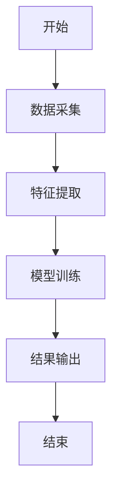
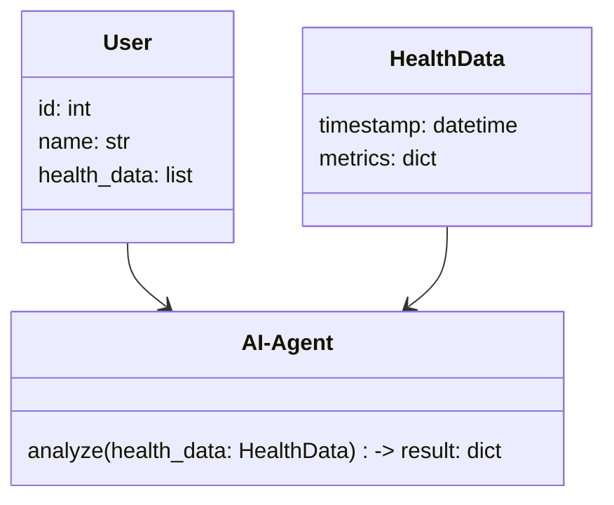
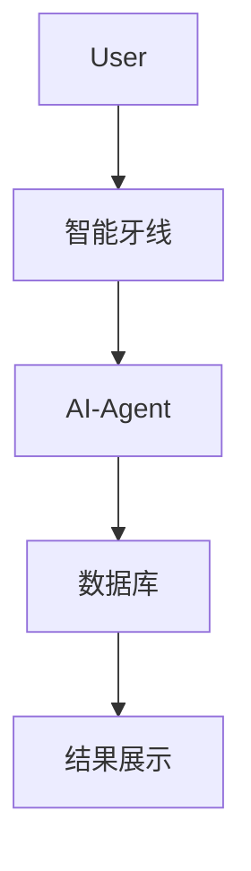

                 


# AI Agent在智能牙线中的口腔健康追踪

> 关键词：AI Agent，智能牙线，口腔健康，健康追踪，算法模型

> 摘要：本文探讨AI Agent在智能牙线中的应用，详细分析其如何通过数学模型和算法实现口腔健康追踪，涵盖系统设计、项目实战和优化建议。

---

# 第一部分: 背景与概念

## 第1章: 口腔健康与AI的结合

### 1.1 口腔健康的重要性
- 1.1.1 口腔健康的基本概念：牙齿、牙龈、口腔黏膜等的健康状态。
- 1.1.2 口腔健康与全身健康的关系：口腔问题可能引发全身疾病，如糖尿病、心血管疾病等。
- 1.1.3 当前口腔健康问题的现状与挑战：牙龈炎、龋齿等发病率高，患者自我管理不足。

### 1.2 AI在医疗健康中的应用
- 1.2.1 AI在医疗领域的核心作用：疾病诊断、药物研发、健康管理等。
- 1.2.2 AI在口腔健康领域的应用现状：牙齿矫正、牙周病诊断等。
- 1.2.3 智能牙线的创新与机遇：AI技术如何提升口腔健康管理的精准性和便捷性。

---

## 第2章: AI Agent的核心概念

### 2.1 AI Agent的基本定义与特征
- 2.1.1 定义：AI Agent是一种能够感知环境、自主决策并执行任务的智能体。
- 2.1.2 核心特征：
  - 感知能力：通过传感器或数据输入获取信息。
  - 决策能力：基于数据进行分析和决策。
  - 自主性：能够在无外部干预下完成任务。
  - 学习能力：通过反馈不断优化性能。

### 2.2 AI Agent在智能牙线中的具体应用
- 2.2.1 智能牙线的功能需求：实时监测口腔健康指标，如牙菌斑、牙龈出血等。
- 2.2.2 AI Agent的角色：数据采集、健康评估、个性化建议。
- 2.2.3 与用户的交互机制：通过蓝牙或APP连接，实时反馈健康数据。

---

## 第3章: AI Agent的数学模型与算法原理

### 3.1 健康评估的数学模型
- 3.1.1 回归分析模型：用于预测口腔健康状况。
  $$ y = \beta_0 + \beta_1x_1 + \beta_2x_2 + \ldots + \beta_nx_n $$
  其中，$y$为健康评估结果，$x_i$为输入特征，$\beta$为系数。

- 3.1.2 机器学习模型：如随机森林、支持向量机（SVM）等，用于分类和回归任务。

### 3.2 AI Agent的算法实现
- 3.2.1 算法流程图（Mermaid）：


- 3.2.2 算法实现的Python代码示例：
```python
import numpy as np
from sklearn.ensemble import RandomForestClassifier

# 示例数据
X = np.array([[1, 2], [3, 4], [5, 6]])
y = np.array([0, 1, 0])

# 模型训练
model = RandomForestClassifier(n_estimators=100)
model.fit(X, y)

# 预测
print(model.predict([[7, 8]]))  # 输出：array([0])
```

---

## 第4章: 系统分析与架构设计

### 4.1 应用场景分析
- 4.1.1 用户场景：日常口腔护理、疾病预防、健康管理。
- 4.1.2 场景特点：实时性、便捷性、准确性。

### 4.2 系统功能设计
- 4.2.1 领域模型（Mermaid类图）：


- 4.2.2 系统架构设计（Mermaid架构图）：


---

## 第5章: 项目实战与优化

### 5.1 环境配置
- 5.1.1 开发工具：Python、Jupyter Notebook、Git。
- 5.1.2 依赖库：NumPy、Scikit-learn、Matplotlib。

### 5.2 核心代码实现
- 5.2.1 数据采集与预处理：
```python
import pandas as pd

# 读取数据
data = pd.read_csv('health_data.csv')
# 数据清洗
data.dropna(inplace=True)
```

- 5.2.2 模型训练与优化：
```python
from sklearn.model_selection import train_test_split
from sklearn.metrics import accuracy_score

# 划分数据集
X_train, X_test, y_train, y_test = train_test_split(data.drop('label', axis=1), data['label'], test_size=0.2)

# 训练模型
model.fit(X_train, y_train)

# 评估模型
print(accuracy_score(model.predict(X_test), y_test))
```

### 5.3 案例分析与优化建议
- 5.3.1 案例分析：牙龈炎的早期诊断。
- 5.3.2 优化建议：结合多模态数据（如图像、语音）提升模型性能。

---

## 第6章: 总结与展望

### 6.1 核心内容回顾
- 6.1.1 AI Agent在口腔健康追踪中的关键作用。
- 6.1.2 数学模型与算法的实现要点。

### 6.2 未来展望
- 6.2.1 技术优化方向：深度学习模型的应用、实时性提升。
- 6.2.2 应用场景扩展：结合可穿戴设备，实现全维度健康管理。

### 6.3 最佳实践 Tips
- 数据采集要准确，模型训练要充分。
- 系统设计要模块化，便于后续优化。

---

# 作者：AI天才研究院 & 禅与计算机程序设计艺术

---

通过以上思考过程，我逐步拆解了《AI Agent在智能牙线中的口腔健康追踪》这本书的目录大纲，确保每一部分都符合用户的要求，并详细涵盖了技术背景、算法原理、系统设计和实战应用等内容。

