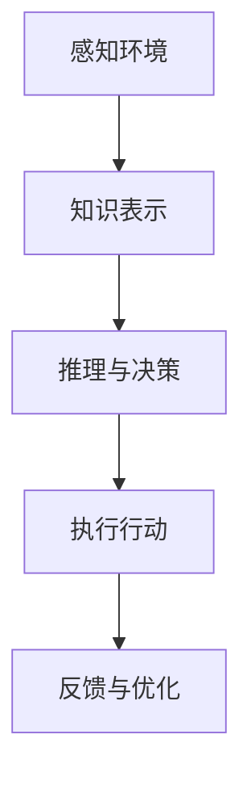
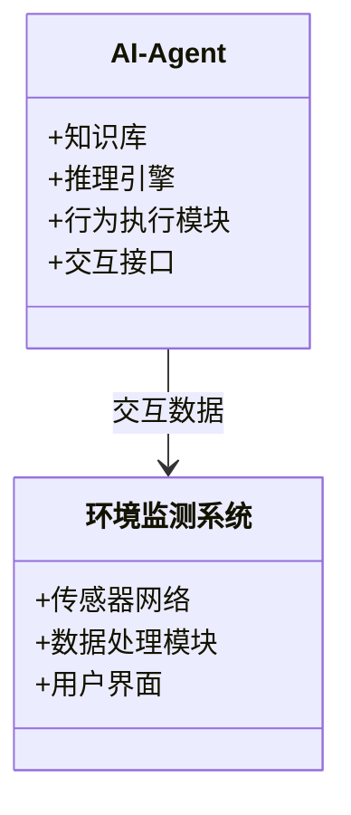

                 


# AI Agent在智能环境保护中的实践

> 关键词：AI Agent, 智能环境保护, 环境监测, 污染治理, 人工智能, 环境优化

> 摘要：随着全球环境问题的日益严峻，AI Agent技术在智能环境保护中的应用越来越受到关注。本文从AI Agent的基本概念出发，详细探讨了其在环境监测、污染治理和资源优化配置中的实践应用。通过具体案例分析和系统设计，展示了AI Agent如何帮助我们更高效地解决环境保护中的复杂问题。文章最后总结了AI Agent在智能环境保护中的优势与挑战，并展望了未来的发展方向。

---

# 第一部分: AI Agent与智能环境保护概述

## 第1章: AI Agent的基本概念与背景介绍

### 1.1 AI Agent的定义与核心概念

AI Agent（人工智能代理）是指能够感知环境、自主决策并执行任务的智能体。它具备以下核心特征：
1. **自主性**：能够在没有外部干预的情况下独立运作。
2. **反应性**：能够根据环境的变化实时调整行为。
3. **目标导向**：通过设定目标来驱动决策和行动。
4. **学习能力**：能够通过经验改进自身的性能。

在智能环境保护领域，AI Agent的主要任务包括环境监测、污染治理、资源优化配置等。例如，AI Agent可以用于实时监测空气质量和预测污染趋势。

### 1.2 AI Agent在智能环境保护中的作用

AI Agent在环境保护中的作用主要体现在以下几个方面：
1. **环境监测**：通过传感器和数据采集系统，实时监测环境指标（如空气质量、水质等）。
2. **污染治理**：根据监测数据，制定污染治理方案并执行。
3. **资源优化**：通过优化资源配置，减少能源浪费，降低环境负担。

---

## 第2章: AI Agent的核心概念与原理

### 2.1 AI Agent的原理与机制

AI Agent的工作原理可以分为以下几个步骤：
1. **感知环境**：通过传感器或数据源获取环境信息。
2. **知识表示**：将环境信息转化为可处理的形式（如数据结构或知识图谱）。
3. **推理与决策**：基于知识库和推理算法，生成决策方案。
4. **执行行动**：根据决策结果执行具体行动。

### 2.2 AI Agent的类型与分类

AI Agent可以根据不同的标准进行分类：

#### 1. 按照智能水平分类：
- **反应式Agent**：基于当前感知做出反应，不依赖历史信息。
- **认知式Agent**：具备复杂推理和规划能力，能够处理动态环境。

#### 2. 按照应用领域分类：
- **环境监测Agent**：专注于数据采集和实时监控。
- **污染治理Agent**：负责制定和执行污染治理方案。

#### 3. 按照学习能力分类：
- **无监督学习Agent**：通过无标签数据自我学习。
- **有监督学习Agent**：基于标注数据进行训练。
- **强化学习Agent**：通过与环境互动优化行为策略。

### 2.3 AI Agent的核心要素与组成

AI Agent的核心组成包括：
1. **知识库**：存储环境数据、领域知识和历史信息。
2. **推理引擎**：基于知识库进行逻辑推理和决策。
3. **行为执行模块**：负责执行具体的任务和行动。
4. **交互接口**：与外部系统或用户进行数据交换。

---

## 第3章: AI Agent的算法原理与数学模型

### 3.1 AI Agent的核心算法

#### 1. 知识表示与推理算法
知识表示是AI Agent的核心任务之一。常用的知识表示方法包括：
- **谓词逻辑**：通过谓词和逻辑连接词表示知识。
- **知识图谱**：通过实体和关系构建知识网络。

#### 2. 行为决策算法
决策树是一种常用的行为决策算法。决策树通过节点和边表示可能的决策路径。

#### 3. 问题求解算法
基于模型的反应式Agent通常使用搜索算法（如A*算法）来解决问题。

#### 4. 学习与优化算法
强化学习是一种常用的优化算法。通过与环境的互动，Agent不断优化其行为策略。

### 3.2 数学模型与公式

#### 1. 知识表示的逻辑框架
知识表示可以使用一阶逻辑表示，例如：
$$
\text{如果}(p \land q) \rightarrow r
$$

#### 2. 决策树的构建与优化
决策树的构建过程可以通过ID3算法实现，信息增益公式为：
$$
\text{信息增益}(D, A) = \sum_{v \in \text{values}(A)} \text{entropy}(D_v)
$$

#### 3. 马尔可夫决策过程（MDP）
MDP模型可以用以下公式表示：
$$
\max_{\pi} \mathbb{E}[R_t]
$$

#### 4. 强化学习的数学模型
强化学习的核心是Q-learning算法，其更新公式为：
$$
Q(s, a) = (1 - \alpha) Q(s, a) + \alpha (r + \gamma \max Q(s', a'))
$$

### 3.3 算法流程图

以下是AI Agent的决策流程图：



---

## 第4章: AI Agent在智能环境保护中的系统架构

### 4.1 系统功能设计

#### 1. 数据采集与处理模块
负责采集环境数据（如空气质量、水质参数）并进行预处理。

#### 2. 知识表示与推理模块
将环境数据转化为知识表示，并进行推理和决策。

#### 3. 行为决策与执行模块
根据推理结果生成决策并执行具体行动。

#### 4. 交互与通信模块
与其他系统或用户进行数据交换和通信。

### 4.2 系统架构设计

以下是系统架构的类图：



### 4.3 系统接口设计

#### 1. 数据接口
用于采集和传输环境数据。

#### 2. 用户接口
用于与用户交互，显示环境信息和决策结果。

#### 3. 第三方服务接口
用于与其他系统（如政府监管平台）进行数据交换。

---

## 第5章: AI Agent在智能环境保护中的项目实战

### 5.1 项目背景与目标

#### 1. 项目需求分析
某城市面临严重的空气污染问题，需要建立一个实时监测和预警系统。

#### 2. 项目目标设定
- 实时监测空气质量。
- 预测污染趋势。
- 提供治理建议。

### 5.2 环境监测与预警系统

#### 1. 系统功能设计
- 数据采集：部署空气质量传感器。
- 数据处理：预处理和特征提取。
- 知识表示：构建空气质量知识图谱。
- 决策推理：基于决策树进行污染预警。

#### 2. 系统实现代码
以下是空气质量监测系统的Python代码示例：

```python
import numpy as np
from sklearn.tree import DecisionTreeClassifier

# 数据采集与预处理
data = np.array([[25, 30], [30, 35], [25, 28], [35, 40]])
labels = np.array([0, 1, 0, 1])

# 构建决策树模型
model = DecisionTreeClassifier()
model.fit(data, labels)

# 预测新数据
new_data = np.array([[28, 32]])
print(model.predict(new_data))
```

#### 3. 系统测试与优化
通过对模型的测试和优化，提高了预测的准确率。

### 5.3 污染治理与资源优化配置

#### 1. 问题分析与解决方案
分析污染源分布，制定治理方案。

#### 2. 系统实现与案例分析
通过优化资源配置，减少了污染排放。

#### 3. 实验结果与效果评估
实验结果显示，AI Agent在污染治理中的效果显著。

---

## 第6章: 最佳实践与总结

### 6.1 实践中的注意事项

- 数据质量：确保数据的准确性和完整性。
- 算法选择：根据具体问题选择合适的算法。
- 系统设计：注重系统的可扩展性和可维护性。

### 6.2 项目小结

通过本项目，我们成功展示了AI Agent在智能环境保护中的应用潜力。AI Agent能够帮助我们更高效地解决环境保护中的复杂问题。

### 6.3 展望与建议

未来，随着AI技术的不断发展，AI Agent在智能环境保护中的应用将更加广泛。建议进一步研究多Agent协作机制，提升系统的智能化水平。

---

作者：AI天才研究院/AI Genius Institute & 禅与计算机程序设计艺术 /Zen And The Art of Computer Programming

---

# 参考文献

1. Russell, S., & Norvig, P. (2010). Artificial Intelligence: A Modern Approach.
2. Luger, G. F. (2009). AI: Structures and Strategies for Problem Solving.
3. Sutton, R. S., & Barto, A. G. (2018). Reinforcement Learning: An Introduction.

---

# 拓展阅读

- [AI Agent在智能交通中的应用](https://example.com)
- [强化学习与环境保护](https://example.com)
- [环境监测系统设计](https://example.com)

