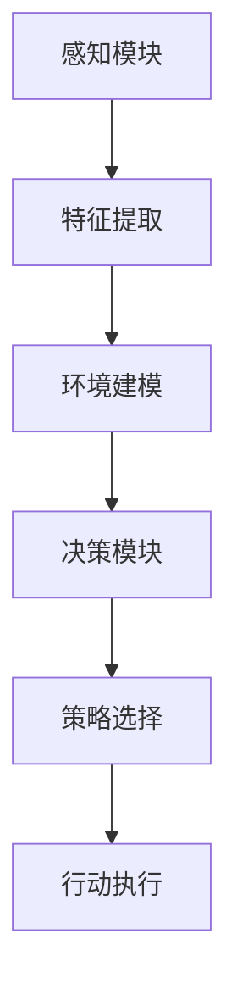
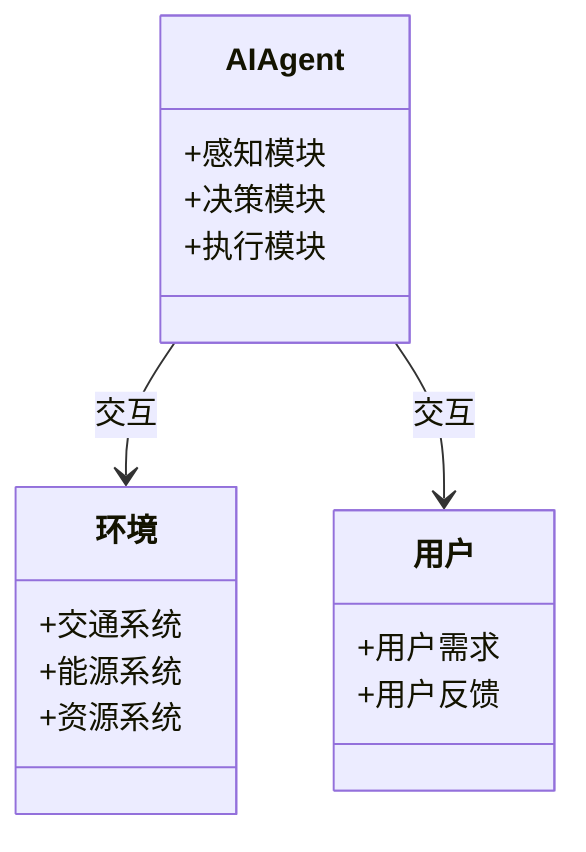
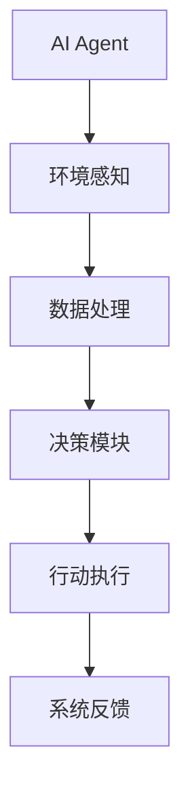
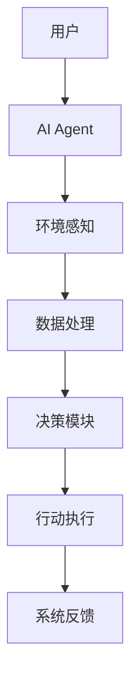

                 


# AI Agent在智能环境影响评估中的实践

**关键词**：AI Agent、智能环境、影响评估、多目标优化、系统架构、算法原理

**摘要**：本文详细探讨了AI Agent在智能环境影响评估中的实践应用。从AI Agent的基本概念、核心原理到实际系统设计，再到项目实战，全面分析了AI Agent在智能环境影响评估中的技术细节与应用场景。通过多目标优化模型、强化学习算法和系统架构设计，展示了AI Agent如何高效、智能地评估和优化智能环境的影响。

---

# 第一部分: AI Agent与智能环境影响评估基础

## 第1章: AI Agent的基本概念与背景

### 1.1 AI Agent的定义与核心特征

#### 1.1.1 AI Agent的定义

AI Agent（人工智能代理）是指一种能够感知环境、做出决策并执行行动的智能实体。它通过与环境的交互，实现特定目标的自主系统。AI Agent可以是软件程序、机器人或其他智能设备，核心目标是通过智能化手段优化任务执行效率。

#### 1.1.2 AI Agent的核心特征

AI Agent具有以下核心特征：

1. **自主性**：能够在没有外部干预的情况下自主运行。
2. **反应性**：能够实时感知环境变化并做出反应。
3. **目标导向性**：通过目标驱动进行决策和行动。
4. **学习能力**：能够通过经验改进自身性能。
5. **适应性**：能够根据环境变化调整策略。

| 特性 | 描述 |
|------|------|
| 自主性 | 独立运行，无需外部干预 |
| 反应性 | 实时感知环境并做出反应 |
| 目标导向性 | 以目标为导向进行决策 |
| 学习能力 | 通过经验优化性能 |
| 适应性 | 根据环境变化调整策略 |

#### 1.1.3 AI Agent与传统智能系统的区别

AI Agent与传统智能系统的主要区别在于其自主性和适应性。传统智能系统通常依赖于预定义的规则和程序，而AI Agent能够自主决策、学习和适应环境变化。

---

### 1.2 智能环境的概念与分类

#### 1.2.1 智能环境的定义

智能环境是指通过智能化技术构建的能够与人或系统进行交互的环境。它通常包含传感器、执行器、计算设备和通信网络，能够实现环境的感知、决策和控制。

#### 1.2.2 智能环境的分类

智能环境可以分为以下几类：

1. **物理智能环境**：如智能家居、智能工厂等，通过传感器和执行器实现环境的智能化。
2. **虚拟智能环境**：如虚拟现实、增强现实环境，通过虚拟空间实现智能化交互。
3. **混合智能环境**：结合物理和虚拟环境，实现更复杂的智能化应用。

#### 1.2.3 智能环境的典型应用场景

智能环境的典型应用场景包括：

1. 智能家居：通过AI Agent实现家电的自动化控制。
2. 智能交通：通过AI Agent优化交通流量和自动驾驶。
3. 智能医疗：通过AI Agent辅助医疗决策和患者护理。

---

### 1.3 智能环境影响评估的背景与意义

#### 1.3.1 智能环境影响评估的背景

随着智能环境的广泛应用，评估其对社会、经济和环境的影响变得越来越重要。智能环境的影响评估需要考虑其对能源消耗、资源利用、用户体验等多个方面的影响。

#### 1.3.2 智能环境影响评估的意义

智能环境影响评估的意义在于：

1. 优化智能环境的性能，提高资源利用效率。
2. 减少智能环境对环境的负面影响。
3. 提供科学依据，指导智能环境的合理规划和应用。

#### 1.3.3 智能环境影响评估的挑战

智能环境影响评估的挑战包括：

1. 多目标优化：需要在多个目标之间找到平衡点。
2. 不确定性：智能环境的复杂性和动态性增加了评估的难度。
3. 数据量大：需要处理大量的环境数据和用户反馈。

---

## 第2章: AI Agent在智能环境中的作用

### 2.1 AI Agent的核心功能

#### 2.1.1 感知与理解环境

AI Agent通过传感器和数据采集设备感知环境，理解环境的状态和变化。例如，在智能家居中，AI Agent可以通过温度传感器感知室内温度，并通过用户行为数据理解用户的习惯。

#### 2.1.2 决策与规划

AI Agent根据感知到的环境信息，结合预设的目标和策略，进行决策和规划。例如，在智能交通系统中，AI Agent可以根据实时交通数据，规划最优的路线。

#### 2.1.3 执行与反馈

AI Agent根据决策结果执行相应的操作，并通过反馈机制不断优化自身的性能。例如，在智能医疗系统中，AI Agent可以根据患者的健康数据，执行相应的诊断和治疗建议。

---

### 2.2 AI Agent与智能环境的交互机制

#### 2.2.1 信息感知与数据采集

AI Agent通过传感器、摄像头、麦克风等设备感知环境信息，并采集相关的数据。例如，在智能安防系统中，AI Agent可以通过摄像头采集视频数据，识别异常行为。

#### 2.2.2 行为决策与策略优化

AI Agent根据感知到的信息，结合预设的策略和目标，进行行为决策。例如，在智能推荐系统中，AI Agent可以根据用户的偏好和行为数据，推荐个性化的内容。

#### 2.2.3 系统反馈与自适应调整

AI Agent通过系统反馈不断优化自身的决策和行动策略。例如，在智能学习系统中，AI Agent可以根据学生的学习效果，调整教学策略。

---

### 2.3 AI Agent在智能环境影响评估中的优势

#### 2.3.1 高效性

AI Agent能够快速处理大量的环境数据，提高评估的效率。

#### 2.3.2 智能性

AI Agent通过学习和优化，能够做出更智能的决策。

#### 2.3.3 自适应性

AI Agent能够根据环境的变化自适应地调整评估策略，提高评估的准确性。

---

# 第二部分: AI Agent的核心原理与算法

## 第3章: AI Agent的感知与决策机制

### 3.1 感知模块的核心原理

#### 3.1.1 数据采集与预处理

AI Agent通过传感器和数据采集设备获取环境数据，并进行预处理。例如，在智能农业中，AI Agent可以通过温度、湿度传感器采集数据，并进行数据清洗和标准化。

#### 3.1.2 特征提取与识别

AI Agent对预处理后的数据进行特征提取和识别。例如，在智能安防系统中，AI Agent可以通过图像处理技术，识别视频中的异常行为。

#### 3.1.3 环境建模与状态表示

AI Agent根据感知到的环境信息，构建环境模型，并表示环境的状态。例如，在智能交通系统中，AI Agent可以根据实时交通数据，构建交通网络模型。

---

### 3.2 决策模块的核心算法

#### 3.2.1 基于规则的决策算法

基于规则的决策算法是一种简单但有效的决策方法。例如，在智能家居系统中，AI Agent可以根据预设的规则，自动开启或关闭家电设备。

#### 3.2.2 基于强化学习的决策算法

强化学习是一种通过试错学习的算法。例如，在智能游戏AI中，AI Agent可以通过强化学习，学习最优的策略。

#### 3.2.3 基于概率推理的决策算法

概率推理是一种基于概率论的决策方法。例如，在智能医疗系统中，AI Agent可以通过概率推理，评估患者的患病概率。

---

### 3.3 算法流程图



---

## 第4章: 智能环境影响评估的数学模型

### 4.1 影响评估的基本数学模型

影响评估的基本数学模型通常包括以下几个部分：

1. **目标函数**：定义评估的目标。
2. **约束条件**：定义评估的约束。
3. **优化算法**：用于求解优化问题。

例如，在能源消耗评估中，目标函数可以是能源消耗的最小化，约束条件可以是能源需求和供应的平衡。

### 4.2 多目标优化模型

#### 4.2.1 多目标优化的基本概念

多目标优化是指在多个目标之间找到一个最优的平衡点。例如，在智能交通系统中，AI Agent需要在减少交通拥堵和减少能源消耗之间找到平衡。

#### 4.2.2 基于AI Agent的多目标优化

基于AI Agent的多目标优化通常采用强化学习或遗传算法。例如，在智能电网中，AI Agent可以通过强化学习，优化能源分配。

---

## 第5章: 系统分析与架构设计

### 5.1 问题场景介绍

智能环境影响评估的核心问题是如何在复杂的环境下，通过AI Agent实现对环境的优化和评估。例如，在智能城市中，如何通过AI Agent优化交通、能源和资源的利用。

---

### 5.2 项目介绍

假设我们正在开发一个智能城市影响评估系统，目标是通过AI Agent优化城市的交通、能源和资源利用。

---

### 5.3 系统功能设计

#### 5.3.1 领域模型设计

以下是智能城市影响评估系统的领域模型：



#### 5.3.2 系统架构设计

以下是系统的架构设计：



#### 5.3.3 系统接口设计

系统接口设计包括：

1. AI Agent与环境的接口。
2. AI Agent与用户的接口。
3. 内部接口，如数据处理与决策模块之间的接口。

---

### 5.4 系统交互流程图

以下是系统交互流程图：



---

## 第6章: 项目实战

### 6.1 环境安装

假设我们正在开发一个基于Python的AI Agent系统，首先需要安装以下环境：

```bash
pip install numpy
pip install pandas
pip install matplotlib
pip install tensorflow
```

---

### 6.2 系统核心实现源代码

以下是AI Agent的核心代码：

```python
class AI-Agent:
    def __init__(self):
        self.sensors = []
        self actuators = []
        self.decision_model = None

    def perceive(self):
        # 获取环境数据
        return [sensor.read() for sensor in self.sensors]

    def decide(self, data):
        # 调用决策模型
        return self.decision_model.predict(data)

    def act(self, action):
        # 执行动作
        for actuator in self.actuators:
            actuator.execute(action)

# 示例用法
agent = AI-Agent()
agent.sensors.append(TemperatureSensor())
agent.actuators.append(AirConditioner())
agent.decision_model = ReinforcementLearningModel()
agent.perceive()
agent.decide(perceived_data)
agent.act(predicted_action)
```

---

### 6.3 代码应用解读与分析

上述代码展示了AI Agent的基本结构。感知模块通过传感器获取环境数据，决策模块通过模型进行决策，执行模块通过执行器执行动作。通过这种方式，AI Agent能够实现对环境的感知、决策和执行。

---

### 6.4 实际案例分析

以智能交通系统为例，AI Agent可以通过感知交通流量，决策最优的信号灯控制策略，从而优化交通流量。

---

### 6.5 项目小结

通过上述项目实战，我们可以看到AI Agent在智能环境影响评估中的强大能力。通过感知、决策和执行模块的协同工作，AI Agent能够有效地优化环境的性能。

---

## 第7章: 最佳实践与总结

### 7.1 最佳实践

1. **数据预处理**：确保数据的准确性和完整性。
2. **模型优化**：选择适合的算法和模型，优化性能。
3. **系统测试**：进行全面的系统测试，确保系统的稳定性和可靠性。

### 7.2 小结

本文详细探讨了AI Agent在智能环境影响评估中的实践应用。从AI Agent的基本概念、核心原理到实际系统设计，再到项目实战，全面分析了AI Agent在智能环境影响评估中的技术细节与应用场景。

### 7.3 注意事项

1. AI Agent的性能依赖于数据的质量和模型的优化。
2. 系统的设计需要充分考虑环境的动态性和不确定性。

### 7.4 拓展阅读

1. 《强化学习入门》
2. 《智能系统设计与实现》
3. 《环境影响评估方法》

---

# 作者：AI天才研究院/AI Genius Institute & 禅与计算机程序设计艺术 /Zen And The Art of Computer Programming

