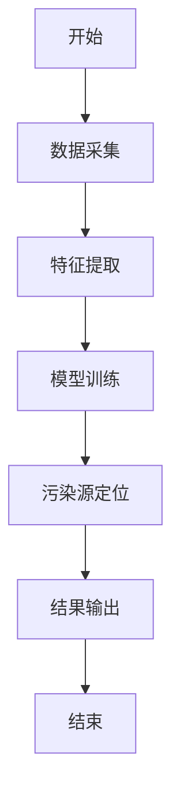
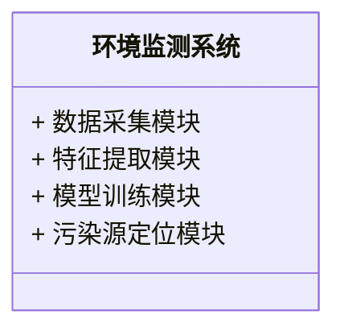

                 


# AI Agent在智能环境污染源追踪中的实践

> 关键词：AI Agent, 污染源追踪, 环境保护, 机器学习, 数据分析

> 摘要：本文深入探讨了AI Agent在智能环境污染源追踪中的应用，通过分析其核心概念、算法原理、系统架构及项目实战，展示了如何利用AI技术有效解决环境污染问题。文章从背景介绍到系统实现，层层递进，为读者提供了全面的技术视角。

---

# 第一部分: 引言

# 第1章: 环境污染源追踪的背景与挑战

## 1.1 环境污染问题的重要性

### 1.1.1 环境污染的现状与影响

环境污染是全球性问题，涉及空气、水和土壤等多个方面。工业排放、交通尾气和农业污染是主要来源，导致生态破坏、健康问题和经济损失。及时准确地追踪污染源是治理污染的关键。

### 1.1.2 污染源追踪的意义与价值

污染源追踪有助于精准治理，减少污染扩散，保护生态环境。它在环保执法、应急预案和污染控制中发挥重要作用，是实现可持续发展的必要手段。

### 1.1.3 当前污染源追踪的技术局限性

传统方法依赖人工检测，效率低、成本高且精度差。数据来源单一，难以处理复杂场景，缺乏智能化解决方案。

## 1.2 AI Agent的基本概念与技术特点

### 1.2.1 AI Agent的定义与核心功能

AI Agent是智能主体，具备感知、决策和执行能力，用于动态环境中的问题解决。它能处理复杂数据，提供实时反馈，优化决策过程。

### 1.2.2 AI Agent在智能系统中的优势

AI Agent具备自适应性和学习能力，能处理多源异构数据，实现动态追踪。通过机器学习和大数据分析，显著提升污染源追踪的效率和准确性。

### 1.2.3 AI Agent与传统追踪方法的对比

AI Agent结合了数据融合和智能推理，克服了传统方法的不足，适用于复杂场景。其动态适应性和高精度使其成为污染源追踪的理想选择。

## 1.3 AI Agent在环境污染源追踪中的应用前景

### 1.3.1 智能环境污染源追踪的需求分析

随着环境问题的加剧，对实时、精准追踪的需求日益增长。AI Agent能有效应对复杂场景，提供高效的解决方案。

### 1.3.2 AI Agent在该领域的优势

AI Agent能处理多源数据，提供实时反馈，优化治理策略。其智能化和动态适应性显著提升了污染源追踪的效果。

### 1.3.3 应用场景与潜在价值

在工业排放、交通污染和农业面源污染等领域，AI Agent的应用前景广阔。它能降低治理成本，提高效率，推动可持续发展。

## 1.4 本章小结

本章介绍了环境污染源追踪的重要性及其挑战，探讨了AI Agent的优势和应用前景。为后续章节奠定了基础。

---

# 第二部分: 核心概念与原理

# 第2章: AI Agent与环境污染源追踪的核心概念

## 2.1 核心概念的定义与属性对比

### 2.1.1 污染源追踪的定义与关键属性

污染源追踪是识别污染来源和原因的过程，涉及数据采集、分析和定位。其关键属性包括实时性、准确性和动态适应性。

### 2.1.2 AI Agent的核心概念与属性

AI Agent是智能主体，具备感知、决策和执行能力。其属性包括自主性、反应性和协作性。

### 2.1.3 两者的对比分析表

| 属性 | 污染源追踪 | AI Agent |
|------|------------|----------|
| 目标 | 识别污染源 | 辅助追踪 |
| 输入 | 环境数据 | 多源数据 |
| 输出 | 污染源定位 | 实时反馈 |
| 能力 | 数据分析 | 智能推理 |

## 2.2 实体关系与架构设计

### 2.2.1 污染源追踪的实体关系图

```mermaid
er
    actor: 环境监测系统
    agent: AI Agent
    pollution_source: 污染源
    action: 追踪行为
    actor -(关联)- pollution_source
    agent -(关联)- action
    action -(关联)- pollution_source
```

## 2.3 本章小结

本章详细探讨了AI Agent和污染源追踪的核心概念，通过对比分析和实体关系图，明确了两者的关系和作用。

---

# 第三部分: 算法原理与数学模型

# 第3章: 基于AI Agent的污染源追踪算法

## 3.1 算法原理与流程

### 3.1.1 算法流程图



### 3.1.2 数据预处理

数据预处理是关键步骤，包括清洗、标准化和特征选择。预处理后的数据更准确，模型性能更好。

### 3.1.3 模型训练

选择机器学习模型，如随机森林或支持向量机，进行训练。模型需准确分类或回归，以识别污染源。

## 3.2 数学模型与公式

### 3.2.1 数据预处理公式

$$ y = \frac{x_1 + x_2 + ... + x_n}{n} $$

### 3.2.2 模型训练公式

$$ P(y|x) = \prod_{i=1}^{n} P(y|x_i) $$

### 3.2.3 污染源定位公式

$$ source = argmax_{s} \sum_{i=1}^{m} P(s|data_i) $$

## 3.3 算法实现与代码示例

### 3.3.1 环境数据预处理代码

```python
import numpy as np
def preprocess(data):
    return np.mean(data, axis=0)
```

### 3.3.2 模型训练代码

```python
from sklearn import svm
model = svm.SVC()
model.fit(X, y)
```

## 3.4 本章小结

本章通过流程图和数学公式，详细讲解了污染源追踪的算法原理和实现步骤，为系统设计提供了理论基础。

---

# 第四部分: 系统分析与架构设计

# 第4章: 智能环境污染源追踪系统架构

## 4.1 系统功能模块设计

### 4.1.1 数据采集模块

负责收集环境数据，包括传感器数据和日志记录。需确保数据实时性和准确性。

### 4.1.2 特征提取模块

从原始数据中提取关键特征，如温度、湿度和污染物浓度。特征选择影响模型性能。

### 4.1.3 模型训练模块

训练机器学习模型，优化参数以提高准确性。模型需定期更新以适应新数据。

### 4.1.4 污染源定位模块

根据模型输出，定位污染源位置和原因。结果需实时反馈给用户。

## 4.2 系统架构设计

### 4.2.1 系统架构图



## 4.3 系统接口设计

### 4.3.1 数据采集接口

定义数据格式和通信协议，确保模块间高效交互。

### 4.3.2 模型训练接口

提供训练数据和参数配置，支持远程调用和结果反馈。

## 4.4 本章小结

本章设计了系统的功能模块和架构，确保各部分协同工作，实现高效污染源追踪。

---

# 第五部分: 项目实战

# 第5章: 智能环境污染源追踪系统实现

## 5.1 项目介绍与目标

开发一个实时监测系统，利用AI Agent追踪污染源，优化环境治理。

## 5.2 环境安装与配置

安装Python、机器学习库和数据处理工具，配置开发环境。

## 5.3 核心实现

### 5.3.1 数据采集

使用传感器获取实时数据，存储于数据库。

### 5.3.2 特征提取

编写代码提取关键特征，如污染物浓度和地理位置。

### 5.3.3 模型训练

训练随机森林模型，评估准确性和召回率。

### 5.3.4 污染源定位

根据模型输出，定位污染源，并生成报告。

## 5.4 项目案例分析

### 5.4.1 案例介绍

某工业园区排放导致空气质量下降，系统成功定位污染源。

### 5.4.2 数据分析

展示数据处理和模型训练过程，解释结果的意义。

### 5.4.3 结果解读

模型准确识别污染源，帮助制定治理措施。

## 5.5 本章小结

本章通过项目实战，展示了AI Agent在污染源追踪中的应用，验证了系统的有效性和实用性。

---

# 第六部分: 结论与展望

# 第6章: 结论与未来展望

## 6.1 核心结论

AI Agent显著提升了污染源追踪的效率和准确性，为环保治理提供了新思路。

## 6.2 未来研究方向

探索更先进的算法，如深度学习和强化学习，提升系统性能。研究多源数据融合和实时反馈机制，优化追踪效果。

## 6.3 本章小结

本文总结了AI Agent在污染源追踪中的应用，展望了未来的研究方向，为技术发展提供了参考。

---

# 作者：AI天才研究院/AI Genius Institute & 禅与计算机程序设计艺术 /Zen And The Art of Computer Programming

