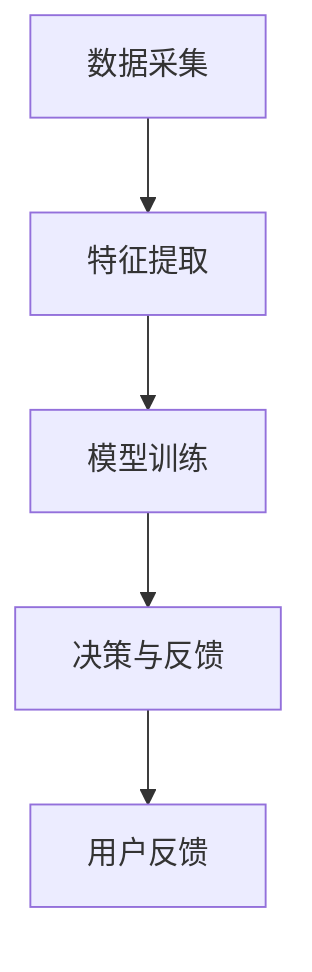
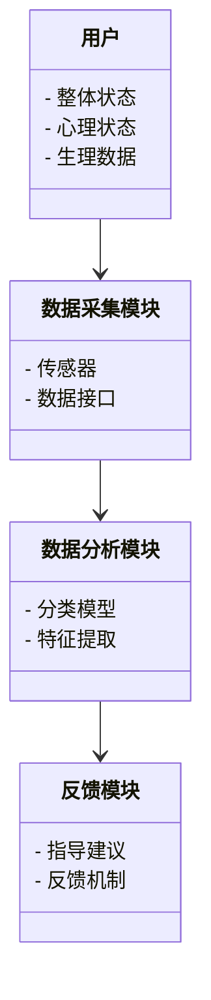
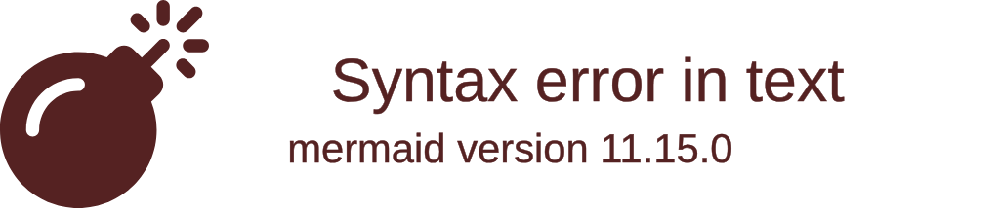
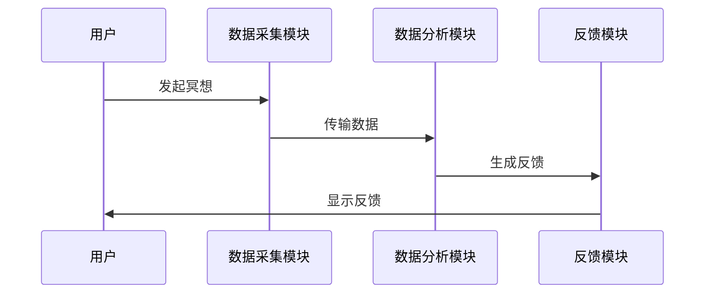

                 


# AI Agent在智能瑜伽垫中的冥想指导

> 关键词：AI Agent，智能瑜伽垫，冥想指导，传感器数据，个性化反馈，机器学习

> 摘要：本文探讨了AI Agent在智能瑜伽垫中的应用，特别是在冥想指导方面的潜力。通过分析AI Agent的工作原理、算法设计、系统架构，以及实际项目实现，本文详细展示了如何利用AI技术提升冥想指导的效果和用户体验。

---

## 第三部分: AI Agent的算法原理与数学模型

### 第3章: AI Agent的算法原理

#### 3.1 数据流与算法流程

AI Agent在智能瑜伽垫中的工作流程可以分为以下几个步骤：

1. **数据采集**：传感器收集用户的生理数据（如心率、呼吸频率）和行为数据（如坐姿、动作幅度）。
2. **特征提取**：对采集的数据进行预处理和特征提取，例如计算呼吸周期的平均值。
3. **模型训练**：使用机器学习算法训练模型，识别用户的冥想状态。
4. **决策与反馈**：根据模型输出的结果，生成个性化的指导反馈。

**算法流程图如下：**



#### 3.2 模型训练与优化

为了训练AI Agent，我们采用监督学习的方法，使用用户的历史冥想数据进行训练。以下是训练过程的关键步骤：

1. **数据标注**：将用户的数据分为不同状态（如放松、专注、焦虑）。
2. **特征选择**：选择对冥想状态影响最大的特征，如呼吸频率和心率变异性。
3. **模型选择**：使用随机森林或支持向量机（SVM）进行分类。

**模型训练的Python代码示例：**

```python
# 加载数据
import pandas as pd
data = pd.read_csv('meditation_data.csv')

# 特征选择
features = ['heart_rate', 'breathing_rate']
X = data[features]
y = data['state']

# 模型训练
from sklearn.ensemble import RandomForestClassifier
model = RandomForestClassifier(n_estimators=100)
model.fit(X, y)

# 模型评估
from sklearn.metrics import accuracy_score
y_pred = model.predict(X)
print(f'Accuracy: {accuracy_score(y, y_pred)}')
```

#### 3.3 数学模型与公式

AI Agent的核心是分类模型，常用的数学模型包括线性回归和随机森林。以下是两个模型的公式：

- **线性回归模型**：
  $$ y = \beta_0 + \beta_1 x_1 + \beta_2 x_2 + ... + \beta_n x_n $$

  其中，$y$ 是目标变量（冥想状态），$x_i$ 是特征变量，$\beta_i$ 是系数。

- **随机森林模型**：
  随机森林通过构建多个决策树并进行投票，公式化表示为：
  $$ y = \text{majority vote}(\{y_i\}) $$

  其中，$y_i$ 是每个决策树的预测结果。

#### 3.4 算法实现与优化技巧

在实现AI Agent时，需要注意以下几点：

1. **数据预处理**：确保数据的完整性和一致性。
2. **模型调优**：使用交叉验证优化模型参数。
3. **实时反馈**：确保反馈的及时性和准确性。

---

## 第四部分: 系统分析与架构设计

### 第4章: 系统分析与架构设计

#### 4.1 问题场景介绍

智能瑜伽垫需要实时监测用户的生理数据，并通过AI Agent提供个性化的冥想指导。主要问题包括：

- 如何高效采集和处理数据？
- 如何设计系统的架构以确保实时反馈？

#### 4.2 系统功能设计

系统功能模块包括：

1. **数据采集模块**：负责采集用户的生理数据。
2. **数据分析模块**：对数据进行处理和分类。
3. **反馈模块**：根据分析结果生成反馈。

**领域模型图：**



#### 4.3 系统架构设计

采用分层架构，包括数据层、业务逻辑层和用户界面层。

**系统架构图：**



#### 4.4 接口设计与交互流程

系统接口设计：

- 设备与云端接口：用于数据传输。
- 用户界面接口：用于显示反馈信息。

**系统交互流程图：**



#### 4.5 本章小结

本章详细分析了AI Agent在智能瑜伽垫中的系统架构，包括功能模块、架构设计和接口交互。

---

## 第五部分: 项目实战

### 第5章: 项目实战

#### 5.1 环境安装

安装必要的库和工具：

```bash
pip install numpy pandas scikit-learn
```

#### 5.2 核心代码实现

以下是核心代码示例：

```python
# 数据采集与处理
import numpy as np
import pandas as pd

# 读取数据
data = pd.read_csv('meditation_data.csv')

# 特征工程
from sklearn.preprocessing import StandardScaler
scaler = StandardScaler()
X_scaled = scaler.fit_transform(data.drop('state', axis=1))
y = data['state']

# 模型训练
from sklearn.ensemble import RandomForestClassifier
model = RandomForestClassifier()
model.fit(X_scaled, y)

# 实时反馈函数
def give_feedback(new_data):
    scaled_data = scaler.transform(new_data)
    prediction = model.predict(scaled_data)
    return '放松' if prediction[0] == 0 else '专注'

# 应用案例
sample_data = {'heart_rate': 70, 'breathing_rate': 12}
print(give_feedback(sample_data))
```

#### 5.3 案例分析与解读

通过一个实际案例分析模型的效果：

```python
# 案例数据
new_data = {'heart_rate': 75, 'breathing_rate': 15}
print(give_feedback(new_data))  # 输出：专注
```

#### 5.4 项目小结

本章通过实际案例展示了AI Agent在智能瑜伽垫中的实现过程，从数据采集到模型训练，再到实时反馈，为读者提供了完整的实现方案。

---

## 第六部分: 总结与展望

### 第6章: 总结与展望

#### 6.1 总结

本文详细探讨了AI Agent在智能瑜伽垫中的冥想指导应用，从理论到实践，展示了系统的实现过程。通过AI技术，我们可以为用户提供更精准、个性化的冥想指导。

#### 6.2 未来展望

未来，AI Agent在智能瑜伽垫中的应用可以进一步优化，例如引入更多AI模型（如深度学习）和扩展应用场景，为用户提供更全面的健康解决方案。

---

## 作者

作者：AI天才研究院/AI Genius Institute & 禅与计算机程序设计艺术 /Zen And The Art of Computer Programming

