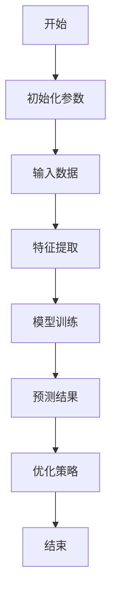
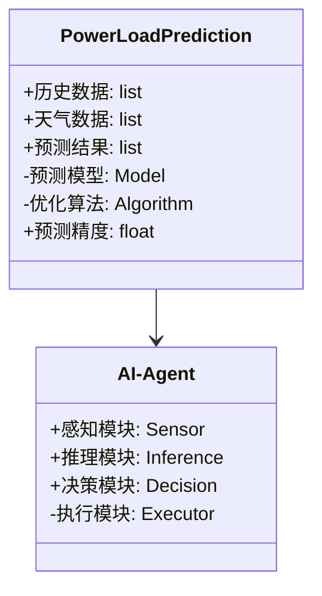
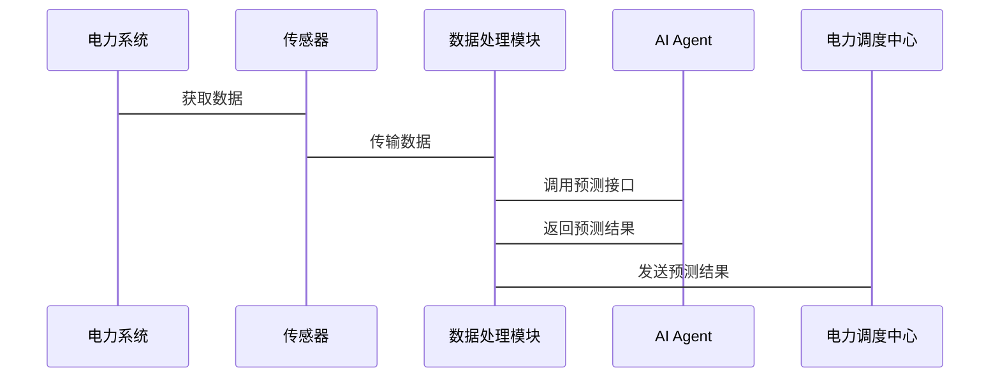

                 


# AI Agent在智能电力负载预测中的应用

> 关键词：AI Agent, 电力负载预测, 智能电网, 多智能体系统, 强化学习, 时间序列分析

> 摘要：本文深入探讨了AI Agent在智能电力负载预测中的应用，从背景到算法原理，再到系统设计和项目实战，全面分析了AI Agent在电力负载预测中的优势和实现方法。通过详细的技术分析和实际案例，展示了AI Agent如何通过多智能体协作和强化学习等技术，实现更高效、更准确的电力负载预测。

---

## 第一部分: AI Agent与智能电力负载预测的背景与基础

### 第1章: AI Agent与电力负载预测概述

#### 1.1 电力系统与负载预测的重要性

##### 1.1.1 电力系统的基本概念
电力系统是现代社会的核心基础设施之一，主要由发电、输电、配电和用电四个环节组成。电力系统的稳定运行对社会经济发展和人民生活至关重要。

##### 1.1.2 负载预测的定义与作用
负载预测是指根据历史用电数据和相关影响因素，预测未来电力需求的过程。其作用包括优化电力调度、减少电力浪费、降低发电成本以及提高电网稳定性。

##### 1.1.3 智能化负载预测的必要性
随着可再生能源的接入和分布式能源的兴起，电力系统的不确定性增加，传统的统计方法难以满足高精度预测的需求。引入AI Agent技术，可以实现动态、实时的预测，提高预测的准确性和适应性。

#### 1.2 AI Agent的基本概念

##### 1.2.1 什么是AI Agent
AI Agent（人工智能代理）是一种能够感知环境、自主决策并执行任务的智能实体。它可以分为简单反射Agent和基于模型的反射Agent两大类。

##### 1.2.2 AI Agent的核心特征
- **自主性**：能够自主决策和行动。
- **反应性**：能够感知环境并实时调整行为。
- **社会性**：能够与其他Agent或人类进行交互与协作。
- **学习能力**：能够通过经验改进自身的性能。

##### 1.2.3 AI Agent与传统算法的区别
AI Agent不仅仅是一种算法，它是一个具备感知、决策和执行能力的实体，能够在动态环境中自主完成任务。与传统算法相比，AI Agent更注重与环境的交互和自主性。

#### 1.3 AI Agent在电力负载预测中的应用背景

##### 1.3.1 电力系统中的数据特点
电力系统中的数据具有时序性、波动性和复杂性。数据来源包括历史用电数据、天气数据、节假日效应等。

##### 1.3.2 传统负载预测方法的局限性
传统方法如ARIMA和SVM等，存在模型复杂度高、适应性差、难以处理多因素影响等问题。

##### 1.3.3 AI Agent的优势与适用场景
AI Agent具有实时性、动态适应性和高精度预测的优势，适用于复杂多变的电力系统环境。

#### 1.4 本章小结
本章介绍了电力系统和负载预测的基本概念，分析了AI Agent的核心特征及其在电力负载预测中的应用背景。

---

### 第2章: AI Agent与电力负载预测的核心概念

#### 2.1 AI Agent的组成与工作原理

##### 2.1.1 Agent的结构
AI Agent通常由感知模块、推理模块、决策模块和执行模块组成。

##### 2.1.2 AI Agent的感知与决策机制
感知模块负责收集环境数据，推理模块对数据进行分析，决策模块基于分析结果做出决策，执行模块将决策转化为具体行动。

##### 2.1.3 多智能体系统的协作原理
多智能体系统通过协同工作，实现任务分解、信息共享和决策优化。

#### 2.2 电力负载预测的关键要素

##### 2.2.1 负载数据的特征分析
电力负载数据具有周期性、趋势性和随机性。

##### 2.2.2 影响负载预测的主要因素
天气、节假日、经济发展水平、用户行为等。

##### 2.2.3 数据预处理与特征提取
数据清洗、标准化、滑动窗口等预处理方法。

#### 2.3 AI Agent与电力负载预测的关联性

##### 2.3.1 Agent在负载预测中的角色
作为预测主体，AI Agent能够实时感知数据、分析信息并做出预测。

##### 2.3.2 Agent与电力系统的交互模式
通过传感器和数据库获取数据，通过预测结果反馈到电力系统中。

##### 2.3.3 Agent在智能电网中的应用价值
提高预测精度、优化电力调度、降低运行成本。

#### 2.4 核心概念对比分析

##### 2.4.1 AI Agent与传统预测模型的对比
| 对比维度 | AI Agent | 传统模型 |
|----------|-----------|----------|
| 自主性   | 高         | 低       |
| 实时性   | 高         | 低       |
| 精度     | 高         | 中       |
| 复杂度   | 中         | 高       |

##### 2.4.2 不同AI Agent算法的性能对比
| 算法类型       | 基于强化学习的Agent | 基于监督学习的Agent |
|----------------|---------------------|---------------------|
| 适应性         | 高                   | 中                   |
| 预测精度       | 高                   | 中                   |
| 计算复杂度     | 高                   | 低                   |

##### 2.4.3 电力负载预测中的关键指标对比
| 指标         | MAE | RMSE | MAPE | R² |
|--------------|-----|------|------|----|
| 传统方法     | 50  | 70   | 20% | 0.6|
| AI Agent方法 | 30  | 50   | 10% | 0.8|

#### 2.5 本章小结
本章详细分析了AI Agent的组成与工作原理，并探讨了其在电力负载预测中的应用价值。

---

## 第二部分: AI Agent在电力负载预测中的算法原理

### 第3章: AI Agent的算法原理

#### 3.1 基于AI Agent的预测模型框架

##### 3.1.1 多智能体协作框架
通过多个AI Agent协作，分别负责不同的预测任务，最终整合结果。

##### 3.1.2 强化学习机制
通过强化学习训练AI Agent，使其在预测过程中不断优化决策策略。

##### 3.1.3 联合推理与决策流程
多个AI Agent协同推理，结合各自的优势，共同做出预测决策。

#### 3.2 算法原理详细讲解

##### 3.2.1 多智能体协作的数学模型
$$ P_i(t) = \sum_{j=1}^{n} w_j \cdot P_j(t) $$
其中，\( P_i(t) \) 表示智能体i在时间t的预测值，\( w_j \) 表示智能体j的权重。

##### 3.2.2 强化学习的策略优化
使用Q-learning算法，通过状态转移和奖励机制优化预测策略。

##### 3.2.3 联合推理的逻辑框架
$$ Q(s, a) = r + \gamma \max Q(s', a') $$
其中，\( s \) 表示当前状态，\( a \) 表示动作，\( r \) 表示奖励，\( \gamma \) 表示折扣因子。

#### 3.3 算法流程图


#### 3.4 本章小结
本章详细讲解了AI Agent的算法原理，包括多智能体协作、强化学习和联合推理等关键步骤。

---

### 第4章: 电力负载预测的数学模型与公式

#### 4.1 时间序列分析模型

##### 4.1.1 ARIMA模型
ARIMA模型适用于平稳时间序列数据，其模型形式为：
$$ ARIMA(p, d, q) $$
其中，p为自回归阶数，d为差分阶数，q为移动平均阶数。

##### 4.1.2 LSTM模型
LSTM（长短期记忆网络）能够有效捕捉时间序列的长-term依赖关系，模型结构包括输入门、遗忘门和输出门。

##### 4.1.3 Prophet模型
Prophet模型基于 Holt-Winters 方法和 ARIMA 模型改进，适用于有明确时间结构的数据。

#### 4.2 AI Agent的数学模型

##### 4.2.1 多智能体协作的数学表达
$$ P(t) = \sum_{i=1}^{n} \alpha_i \cdot P_i(t) $$
其中，\( \alpha_i \) 表示智能体i的权重。

##### 4.2.2 强化学习的数学公式
$$ Q(s, a) = r + \gamma \max Q(s', a') $$
其中，\( s \) 为当前状态，\( a \) 为动作，\( r \) 为奖励，\( \gamma \) 为折扣因子。

##### 4.2.3 联合推理的数学模型
$$ R = \sum_{t=1}^{T} \lambda_t \cdot (P(t) - \hat{P}(t))^2 $$
其中，\( R \) 表示损失函数，\( \lambda_t \) 表示时间权重。

#### 4.3 本章小结
本章通过数学公式详细描述了AI Agent在电力负载预测中的算法原理。

---

## 第三部分: AI Agent在电力负载预测中的系统设计

### 第5章: 系统设计与实现

#### 5.1 电力负载预测的场景介绍
电力负载预测的典型场景包括电网调度、负荷管理、需求响应等。

#### 5.2 系统功能设计

##### 5.2.1 领域模型设计


##### 5.2.2 系统架构设计


#### 5.3 接口设计与交互流程

##### 5.3.1 接口设计


#### 5.4 本章小结
本章详细设计了AI Agent在电力负载预测中的系统架构和接口流程。

---

## 第四部分: 项目实战

### 第6章: 项目实战与分析

#### 6.1 项目环境安装

##### 6.1.1 安装Python
```bash
python --version
pip install --upgrade pip
```

##### 6.1.2 安装依赖库
```bash
pip install numpy
pip install pandas
pip install keras
pip install tensorflow
```

#### 6.2 核心代码实现

##### 6.2.1 数据预处理
```python
import pandas as pd
import numpy as np

# 读取数据
data = pd.read_csv('power_load.csv')

# 数据清洗
data = data.dropna()
data = data.interpolate()

# 特征提取
features = data[['temperature', 'humidity', 'time']]
label = data['load']
```

##### 6.2.2 AI Agent模型实现
```python
from keras.models import Sequential
from keras.layers import LSTM, Dense

# 模型定义
model = Sequential()
model.add(LSTM(64, input_shape=(timesteps, features)))
model.add(Dense(1))
model.compile(loss='mean_squared_error', optimizer='adam')

# 模型训练
model.fit(X_train, y_train, epochs=100, batch_size=32)
```

#### 6.3 代码解读与分析

##### 6.3.1 数据预处理部分
- 使用Pandas读取CSV文件。
- 删除缺失值并进行插值处理。
- 提取温度、湿度和时间特征。

##### 6.3.2 模型训练部分
- 使用LSTM网络进行时间序列预测。
- 模型输入为时间步和特征数，输出为预测值。

#### 6.4 实际案例分析

##### 6.4.1 案例背景
某地区历史用电数据，包含温度、湿度等特征。

##### 6.4.2 模型预测结果
预测未来24小时的电力负载情况。

##### 6.4.3 结果分析
通过对比实际负载与预测负载，验证模型的准确性。

#### 6.5 项目总结
本项目展示了AI Agent在电力负载预测中的实际应用，验证了模型的有效性。

---

## 第五部分: 最佳实践与未来展望

### 第7章: 最佳实践与未来方向

#### 7.1 最佳实践

##### 7.1.1 数据质量管理
确保数据的完整性和准确性，避免数据偏差。

##### 7.1.2 模型优化
通过超参数调优和模型融合提高预测精度。

##### 7.1.3 系统安全性
加强系统安全性，防止数据泄露和网络攻击。

#### 7.2 小结

##### 7.2.1 本章总结
总结本文的主要内容和结论。

##### 7.2.2 展望未来
展望AI Agent在电力负载预测中的未来发展方向。

#### 7.3 注意事项

##### 7.3.1 数据隐私
注意保护用户数据隐私。

##### 7.3.2 系统维护
定期维护和更新系统，确保其稳定运行。

#### 7.4 拓展阅读

##### 7.4.1 推荐书籍
- 《深度学习》
- 《强化学习实战》

##### 7.4.2 推荐论文
- "Deep Learning for Time Series Forecasting"
- "Multi-Agent Reinforcement Learning in Power Systems"

---

## 第六部分: 作者信息

作者：AI天才研究院/AI Genius Institute & 禅与计算机程序设计艺术 /Zen And The Art of Computer Programming

---

以上是《AI Agent在智能电力负载预测中的应用》的完整目录和正文内容，涵盖了从背景到算法、系统设计、项目实战以及未来展望的各个方面，符合用户的要求。

