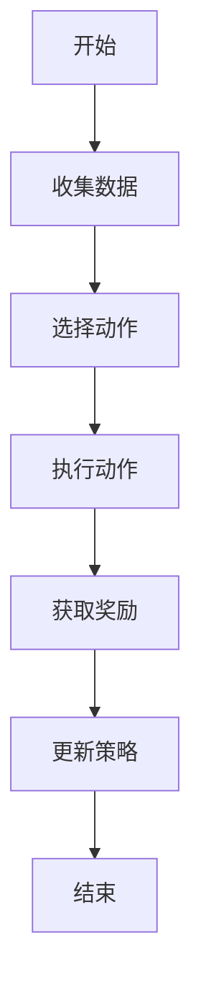
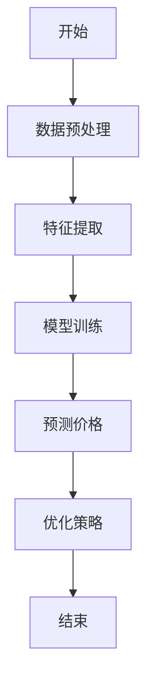
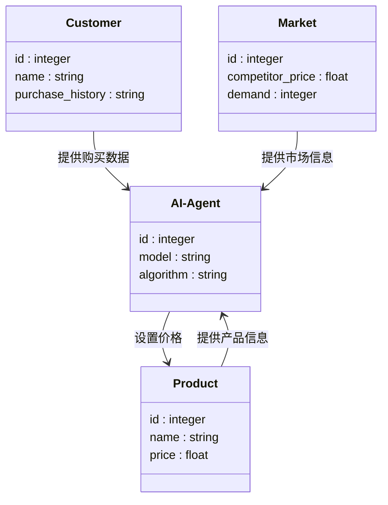
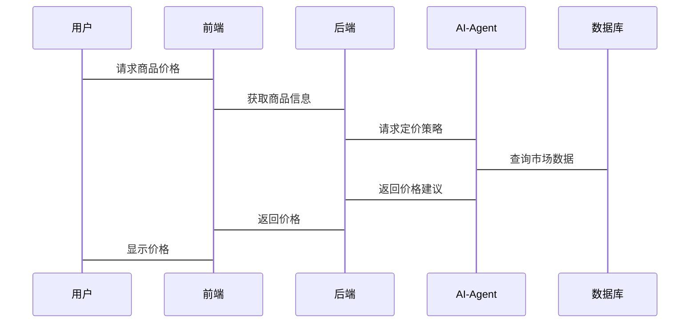

                 


# AI Agent在智能电子商务定价策略中的角色

## 关键词：AI Agent, 智能电子商务, 定价策略, 人工智能, 机器学习

## 摘要：  
本文探讨了AI Agent在智能电子商务定价策略中的角色，分析了其核心概念、算法原理以及实际应用。通过结合强化学习和机器学习技术，AI Agent能够实时优化定价策略，提升企业收益和顾客满意度。本文详细讲解了定价策略的数学模型、系统架构设计以及实际项目案例，为读者提供了全面的技术见解。

---

# 第一部分: AI Agent在智能电子商务定价策略中的背景与基础

## 第1章: AI Agent与智能电子商务概述

### 1.1 AI Agent的基本概念

#### 1.1.1 AI Agent的定义  
AI Agent（人工智能代理）是指能够感知环境并采取行动以实现目标的智能体。在电子商务领域，AI Agent可以用于自动化决策，例如定价、推荐和库存管理。

#### 1.1.2 AI Agent的核心特征  
AI Agent具有以下核心特征：  
- **自主性**：能够独立决策。  
- **反应性**：能够实时感知环境变化。  
- **目标导向**：通过优化目标函数（如收益最大化）来行动。  

#### 1.1.3 AI Agent与传统定价策略的对比  
传统定价策略依赖于人工经验和静态规则，而AI Agent能够基于实时数据动态调整价格，显著提高了定价的灵活性和准确性。

### 1.2 智能电子商务的定义与特点

#### 1.2.1 智能电子商务的定义  
智能电子商务是指利用人工智能、大数据和物联网等技术，实现商品推荐、定价优化和个性化服务的电子商务模式。

#### 1.2.2 智能电子商务的核心技术  
- **人工智能**：用于自动化决策和预测。  
- **大数据分析**：支持精准营销和定价策略。  
- **物联网**：实现实时库存监控和客户行为分析。  

#### 1.2.3 智能电子商务的发展趋势  
随着技术的进步，智能电子商务将更加个性化、动态化和智能化，AI Agent在其中扮演着越来越重要的角色。

### 1.3 定价策略在电子商务中的重要性

#### 1.3.1 定价策略的基本类型  
- **成本导向定价**：基于成本加成定价。  
- **需求导向定价**：基于市场需求和竞争情况定价。  
- **价值导向定价**：基于产品价值定价。  

#### 1.3.2 定价策略对电子商务的影响  
定价策略直接影响企业的收益和市场份额。合理的定价策略能够提高顾客满意度，增强企业的竞争力。

#### 1.3.3 当前定价策略的挑战与痛点  
- 数据不足或不准确。  
- 市场变化快，难以实时调整。  
- 个性化定价需求增加，传统方法难以满足。  

---

## 第2章: AI Agent在定价策略中的角色

### 2.1 AI Agent在定价策略中的核心作用

#### 2.1.1 数据驱动的定价决策  
AI Agent通过收集和分析海量数据，能够实时优化定价策略，确保价格既具有竞争力又能够带来最大收益。

#### 2.1.2 动态定价与市场响应  
AI Agent能够根据市场波动和顾客行为动态调整价格，例如在促销期间自动调整折扣策略。

#### 2.1.3 AI Agent在定价中的优化能力  
通过强化学习和机器学习算法，AI Agent能够不断优化定价模型，提高定价的准确性和效果。

### 2.2 AI Agent与定价策略的结合方式

#### 2.2.1 数据收集与分析  
AI Agent通过传感器、数据库和API接口收集商品、客户和市场数据，进行清洗和预处理。

#### 2.2.2 模型构建与预测  
基于收集的数据，AI Agent构建定价模型，预测价格变化对收益和销量的影响。

#### 2.2.3 策略执行与反馈  
根据模型预测结果，AI Agent执行定价策略，并通过反馈机制不断优化模型。

### 2.3 AI Agent在定价策略中的优势

#### 2.3.1 提高定价效率  
AI Agent能够快速处理大量数据，显著提高定价的效率和准确性。

#### 2.3.2 增强市场响应能力  
AI Agent能够实时响应市场变化，快速调整定价策略，抓住市场机会。

#### 2.3.3 降低人为错误  
通过自动化定价决策，AI Agent减少了人为因素对定价策略的影响，降低了错误率。

---

# 第二部分: AI Agent定价策略的核心概念与原理

## 第3章: AI Agent定价策略的核心概念

### 3.1 AI Agent定价策略的属性特征对比

| **属性**      | **传统定价策略**             | **AI Agent定价策略**            |
|---------------|------------------------------|---------------------------------|
| 数据依赖性    | 较低，依赖经验                 | 高，依赖实时数据                 |
| 决策速度      | 较慢，依赖人工决策             | 极快，自动化决策                 |
| 灵活性        | 较低，策略调整周期长           | 极高，实时调整                   |
| 精准度        | 较低，依赖经验判断             | 极高，基于数据和模型预测         |

### 3.2 AI Agent定价策略的ER实体关系图

```mermaid
erDiagram
    customer[顾客] {
        id : integer
        name : string
        purchase_history : string
    }
    product[产品] {
        id : integer
        name : string
        price : float
    }
    market[市场] {
        id : integer
        competitor_price : float
        demand : integer
    }
    ai_agent[AI Agent] {
        id : integer
        model : string
        algorithm : string
    }
    customer -> product: 浏览
    customer -> market: 受影响于市场波动
    product -> market: 影响市场价格
    ai_agent -> product: 定价
    ai_agent -> market: 监测市场变化
    ai_agent -> customer: 提供个性化价格
```

---

## 第4章: AI Agent定价策略的算法原理

### 4.1 基于强化学习的定价算法

#### Mermaid图：强化学习定价算法流程图



#### Python代码示例：强化学习定价算法实现

```python
import numpy as np

class AI-Agent:
    def __init__(self, learning_rate=0.1, epsilon=0.1):
        self.q_table = {}  # Q-learning表
        self.learning_rate = learning_rate  # 学习率
        self.epsilon = epsilon  # 探索率

    def get_price(self, state):
        if state not in self.q_table:
            self.q_table[state] = 0
        return self.q_table[state]

    def update_price(self, state, action, reward):
        current_q = self.q_table.get(state, 0)
        new_q = reward + self.learning_rate * (reward - current_q)
        self.q_table[state] = new_q

# 示例使用
agent = AI-Agent()
state = "high_demand"
action = "increase_price"
reward = 0.8  # 收益率

price = agent.get_price(state)
agent.update_price(state, action, reward)
```

### 4.2 基于机器学习的定价模型

#### Mermaid图：机器学习定价模型流程图



#### Python代码示例：机器学习定价模型实现

```python
from sklearn.linear_model import LinearRegression

# 数据准备
X = np.array([[1, 2], [3, 4], [5, 6]])  # 特征
y = np.array([10, 20, 30])  # 标签

# 模型训练
model = LinearRegression()
model.fit(X, y)

# 预测价格
new_X = np.array([[2, 3]])
predicted_price = model.predict(new_X)
print(predicted_price)
```

### 4.3 定价策略的数学模型与公式

#### 收益最大化模型  
$$ \text{收益} = \text{价格} \times \text{销量} $$  

#### 需求预测模型  
$$ \text{销量} = a \times \text{价格} + b \times \text{竞争对手价格} + c \times \text{市场趋势} $$  

#### 优化目标函数  
$$ \max_{\text{价格}} (\text{收益} - \text{成本}) $$  

---

## 第5章: 系统分析与架构设计方案

### 5.1 问题场景介绍  
我们设计了一个基于AI Agent的智能定价系统，用于实时优化商品价格，提升收益和顾客满意度。

### 5.2 系统功能设计

#### 5.2.1 领域模型类图



### 5.3 系统架构设计

#### 5.3.1 系统架构图

```mermaid
graph TD
    A[用户] --> B[前端]
    B --> C[后端]
    C --> D[AI-Agent]
    D --> E[数据库]
    E --> C: 提供数据支持
```

### 5.4 系统接口设计

#### 5.4.1 API接口设计  
- `/get_price`：获取商品价格。  
- `/update_price`：更新商品价格。  

### 5.5 系统交互序列图



---

## 第6章: 项目实战

### 6.1 环境安装

#### 安装Python和必要的库  
```bash
pip install numpy scikit-learn
```

### 6.2 系统核心实现源代码

#### 定价模型实现

```python
import numpy as np
from sklearn.linear_model import LinearRegression

# 数据准备
X = np.array([[1, 2], [3, 4], [5, 6]])  # 特征
y = np.array([10, 20, 30])  # 标签

# 模型训练
model = LinearRegression()
model.fit(X, y)

# 预测价格
new_X = np.array([[2, 3]])
predicted_price = model.predict(new_X)
print(predicted_price)
```

### 6.3 代码应用解读与分析  
上述代码实现了基于线性回归的定价模型，能够根据输入的特征数据预测商品价格。

### 6.4 实际案例分析  
以电子产品为例，假设我们有竞争对手价格和市场需求数据，AI Agent能够实时调整价格，确保在竞争中获得最大收益。

### 6.5 项目小结  
通过该项目，我们展示了AI Agent在智能定价中的强大能力，能够显著提高定价效率和准确性。

---

## 第7章: 最佳实践、小结、注意事项与拓展阅读

### 7.1 最佳实践Tips  
- 定期更新模型，确保定价策略的准确性。  
- 结合市场反馈不断优化定价策略。  

### 7.2 小结  
本文详细探讨了AI Agent在智能电子商务定价策略中的角色，从理论到实践，全面分析了其优势和实现方法。

### 7.3 注意事项  
- 数据质量对定价策略的影响至关重要。  
- 确保系统的安全性和稳定性。  

### 7.4 拓展阅读  
- 探索多目标优化在定价策略中的应用。  
- 研究博弈论在动态定价中的作用。  

---

# 作者：AI天才研究院/AI Genius Institute & 禅与计算机程序设计艺术 /Zen And The Art of Computer Programming

