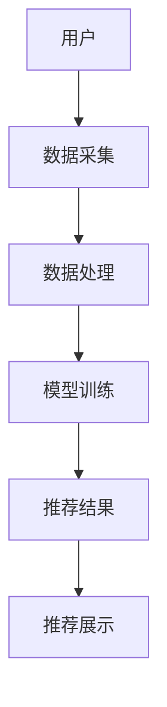
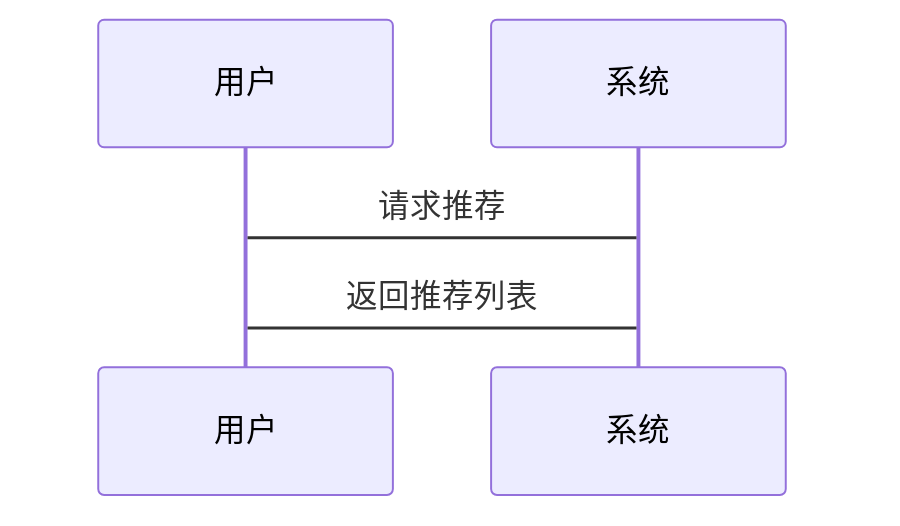

                 

# AI Agent在智能电子商务推荐中的角色

> 关键词：AI Agent，智能电子商务，推荐系统，协同过滤，个性化推荐，混合推荐

> 摘要：本文探讨了AI Agent在智能电子商务推荐系统中的角色及其应用。通过分析推荐系统的分类、AI Agent的核心原理、系统架构设计以及项目实战，详细阐述了AI Agent如何提升电子商务推荐的智能化水平。结合实际案例和数学模型，本文深入探讨了AI Agent在推荐系统中的优势与挑战，并展望了未来的发展趋势。

---

# 第一部分: AI Agent在智能电子商务推荐中的背景与概述

## 第1章: AI Agent与智能电子商务推荐概述

### 1.1 AI Agent的基本概念

#### 1.1.1 什么是AI Agent
AI Agent（人工智能代理）是一种能够感知环境并采取行动以实现目标的智能实体。它能够通过数据处理、学习和推理来优化决策过程。AI Agent在电子商务推荐系统中，能够根据用户行为和偏好，实时调整推荐策略。

#### 1.1.2 AI Agent的核心特点
- **自主性**：AI Agent能够独立决策和行动。
- **反应性**：能够实时感知环境变化并做出响应。
- **学习能力**：通过机器学习算法不断优化推荐策略。
- **社交能力**：能够与用户和其他系统进行交互。

#### 1.1.3 AI Agent与传统推荐系统的区别
传统的推荐系统主要基于协同过滤或内容推荐，而AI Agent推荐系统结合了多种推荐方法，并能够动态调整推荐策略，提供更个性化的服务。

### 1.2 智能电子商务推荐的背景

#### 1.2.1 电子商务的发展历程
电子商务从最初的在线购物平台发展到如今的智能化推荐系统，技术的进步推动了推荐系统的不断优化。

#### 1.2.2 智能推荐系统的兴起
随着大数据和人工智能技术的发展，推荐系统逐渐智能化，能够根据用户行为和偏好实时调整推荐策略。

#### 1.2.3 AI Agent在推荐系统中的角色
AI Agent在推荐系统中扮演着关键角色，能够实时分析用户行为、优化推荐策略并动态调整推荐结果。

---

## 第2章: AI Agent的核心技术基础

### 2.1 AI Agent的技术架构

#### 2.1.1 AI Agent的基本架构
AI Agent推荐系统通常包括感知层、推理层和执行层。感知层负责收集用户行为数据，推理层通过机器学习算法分析数据，执行层根据推理结果生成推荐。

#### 2.1.2 AI Agent的核心技术
- **数据处理**：包括数据清洗、特征提取和数据预处理。
- **机器学习**：包括协同过滤、深度学习和自然语言处理技术。
- **推荐算法**：包括基于规则的推荐、基于协同过滤的推荐和基于内容的推荐。

#### 2.1.3 AI Agent与推荐系统的结合
AI Agent通过整合多种推荐算法，优化推荐结果，提升用户体验。

### 2.2 推荐系统的分类与特点

#### 2.2.1 基于协同过滤的推荐
协同过滤是基于用户行为数据的推荐方法，包括基于用户的协同过滤和基于物品的协同过滤。

#### 2.2.2 基于内容的推荐
内容推荐是基于商品属性和用户偏好进行推荐的方法，适用于商品属性丰富的场景。

#### 2.2.3 混合推荐模型
混合推荐模型结合了协同过滤和内容推荐的优点，能够在复杂场景下提供更精准的推荐。

---

## 第3章: 智能电子商务推荐的现状与挑战

### 3.1 现有推荐系统的优缺点

#### 3.1.1 协同过滤的优势与局限
协同过滤能够利用用户行为数据，但存在数据稀疏性和冷启动问题。

#### 3.1.2 基于内容推荐的优缺点
内容推荐能够提供精准的推荐，但需要丰富的商品信息。

#### 3.1.3 混合推荐的现状
混合推荐结合了协同过滤和内容推荐的优势，但实现复杂度较高。

### 3.2 AI Agent在推荐系统中的应用现状

#### 3.2.1 AI Agent在推荐系统中的应用案例
AI Agent在电商推荐系统中的应用案例包括动态推荐、个性化推荐和实时反馈优化。

#### 3.2.2 当前AI Agent推荐系统的挑战
当前AI Agent推荐系统面临数据隐私、计算资源和实时性等挑战。

#### 3.2.3 未来AI Agent推荐系统的趋势
未来AI Agent推荐系统将更加智能化、个性化和动态化，能够实时响应用户需求。

---

# 第二部分: AI Agent的核心原理

## 第4章: AI Agent的推荐算法原理

### 4.1 协同过滤算法

#### 4.1.1 协同过滤的原理
协同过滤是基于用户相似性进行推荐的方法，包括基于用户的协同过滤和基于物品的协同过滤。

#### 4.1.2 协同过滤的数学模型
协同过滤的数学模型可以表示为：
$$
sim(i,j) = \frac{\sum_{k} (r_{ik} - \bar{r_i})(r_{jk} - \bar{r_j})}{\sqrt{\sum_{k} (r_{ik} - \bar{r_i})^2} \cdot \sqrt{\sum_{k} (r_{jk} - \bar{r_j})^2}}
$$
其中，$sim(i,j)$ 表示用户i和用户j的相似度，$r_{ik}$ 表示用户i对商品k的评分，$\bar{r_i}$ 表示用户i的平均评分。

#### 4.1.3 协同过滤的优缺点
协同过滤的优点是简单易实现，缺点是计算复杂度高，容易受到数据稀疏性的影响。

### 4.2 基于内容的推荐算法

#### 4.2.1 基于内容的推荐原理
基于内容的推荐算法是根据商品的属性特征进行推荐，例如商品的类别、品牌和价格等。

#### 4.2.2 基于内容的数学模型
基于内容的推荐可以使用余弦相似度计算商品之间的相似性：
$$
sim(c_i, c_j) = \frac{\sum_{k} w_{ik} \cdot w_{jk}}{\sqrt{\sum_{k} w_{ik}^2} \cdot \sqrt{\sum_{k} w_{jk}^2}}
$$
其中，$w_{ik}$ 表示商品i在属性k上的权重，$sim(c_i, c_j)$ 表示商品i和商品j的相似度。

#### 4.2.3 基于内容推荐的优缺点
基于内容的推荐优点是推荐结果精准，缺点是难以处理用户行为数据。

### 4.3 混合推荐模型

#### 4.3.1 混合推荐的原理
混合推荐模型结合了协同过滤和内容推荐的优点，能够提供更精准的推荐结果。

#### 4.3.2 混合推荐的数学模型
混合推荐可以通过加权平均的方式结合协同过滤和内容推荐的结果：
$$
score(i,j) = \alpha \cdot sim_{cf}(i,j) + (1-\alpha) \cdot sim_{cb}(i,j)
$$
其中，$\alpha$ 是协同过滤的权重，$sim_{cf}(i,j)$ 是协同过滤相似度，$sim_{cb}(i,j)$ 是内容推荐相似度。

#### 4.3.3 混合推荐的优缺点
混合推荐的优点是推荐结果更精准，缺点是实现复杂度较高。

---

# 第三部分: 系统架构与设计

## 第5章: 推荐系统的架构设计

### 5.1 推荐系统的整体架构

#### 5.1.1 推荐系统的组成
推荐系统通常包括数据层、算法层、服务层和用户层。

#### 5.1.2 推荐系统的流程
推荐系统流程包括数据收集、特征提取、模型训练和结果输出。

#### 5.1.3 推荐系统的架构图

### 5.2 电商推荐系统的设计

#### 5.2.1 电商推荐系统的核心模块
电商推荐系统的核心模块包括数据采集模块、特征提取模块、模型训练模块和推荐展示模块。

#### 5.2.2 电商推荐系统的数据流
电商推荐系统的数据流包括用户行为数据、商品属性数据和推荐结果数据。

#### 5.2.3 电商推荐系统的交互流程

---

# 第四部分: 项目实战

## 第6章: 实施AI Agent推荐系统

### 6.1 环境搭建

#### 6.1.1 安装必要的库
安装Python的机器学习库，例如numpy、pandas和scikit-learn。

### 6.2 数据处理

#### 6.2.1 数据清洗
对原始数据进行清洗，处理缺失值和异常值。

#### 6.2.2 特征提取
提取用户行为特征和商品属性特征。

### 6.3 模型训练

#### 6.3.1 协同过滤模型
使用协同过滤算法训练推荐模型。

#### 6.3.2 内容推荐模型
使用基于内容的推荐算法训练推荐模型。

### 6.4 系统实现

#### 6.4.1 推荐系统代码实现
编写推荐系统的核心代码，实现数据处理、模型训练和结果输出。

### 6.5 测试与优化

#### 6.5.1 测试推荐系统
测试推荐系统的准确性和实时性。

#### 6.5.2 优化推荐算法
优化推荐算法，提高推荐效果。

---

# 第五部分: 总结与展望

## 第7章: 总结与展望

### 7.1 总结
本文详细探讨了AI Agent在智能电子商务推荐中的角色和应用，分析了推荐系统的分类、AI Agent的核心原理、系统架构设计和项目实战。

### 7.2 展望
未来，AI Agent推荐系统将更加智能化和个性化，能够实时响应用户需求，提升用户体验。

---

# 作者：AI天才研究院/AI Genius Institute & 禅与计算机程序设计艺术 /Zen And The Art of Computer Programming

