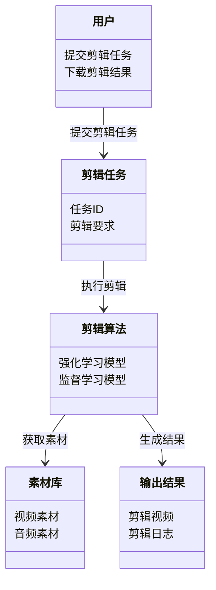
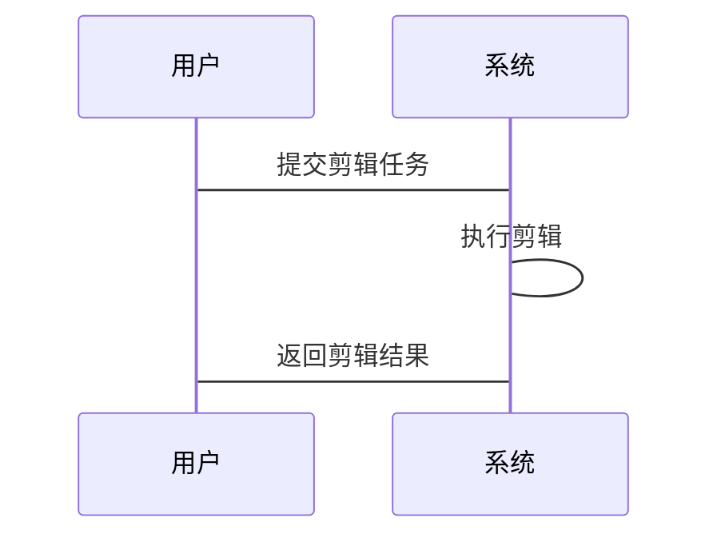

                 


# AI Agent在智能电影剪辑中的实践

## 关键词
AI Agent, 智能剪辑, 电影剪辑, 人工智能, 剪辑系统, 强化学习

## 摘要
本文详细探讨了AI Agent在智能电影剪辑中的应用实践。首先介绍了AI Agent的基本概念和电影剪辑的流程，分析了AI Agent在电影剪辑中的价值。然后深入讲解了AI Agent的核心概念、算法原理、系统架构设计以及项目实战。通过实际案例分析，展示了AI Agent在剪辑过程中的具体应用，包括环境搭建、代码实现和效果展示。最后总结了最佳实践和未来发展方向。

---

## 第一部分: AI Agent在智能电影剪辑中的背景与概念

### 第1章: AI Agent与智能电影剪辑概述

#### 1.1 AI Agent的基本概念
- **1.1.1 什么是AI Agent**
  AI Agent（人工智能代理）是指能够感知环境、自主决策并执行任务的智能实体。它通过传感器获取信息，利用算法进行分析，然后采取行动以实现目标。

- **1.1.2 AI Agent的核心特征**
  AI Agent具有智能性、自主性、反应性、社交性和学习性等特征。它能够在复杂环境中自主决策，适应变化并不断优化自身的行为。

- **1.1.3 AI Agent与传统电影剪辑的区别**
  传统剪辑依赖人工操作，效率较低且受主观因素影响较大。AI Agent通过自动化处理和智能决策，显著提高了剪辑的效率和质量。

#### 1.2 智能电影剪辑的定义与流程
- **1.2.1 传统电影剪辑流程**
  传统剪辑通常包括素材收集、剪辑、特效添加、音效处理等步骤，整个过程耗时且依赖人工经验。

- **1.2.2 智能电影剪辑的定义**
  智能电影剪辑是指利用AI技术辅助或完全自动化完成电影剪辑的过程。AI Agent能够自动选择最佳镜头、调整节奏、添加特效等。

- **1.2.3 智能电影剪辑的核心环节**
  智能剪辑的核心环节包括素材分析、场景识别、剪辑决策、特效生成和效果优化。

#### 1.3 AI Agent在电影剪辑中的应用价值
- **1.3.1 提高剪辑效率**
  AI Agent能够快速分析大量素材，自动完成剪辑任务，显著提高工作效率。

- **1.3.2 增强创意表达**
  AI Agent通过学习大量电影作品，能够提供创意性的剪辑建议，帮助导演实现更多创新的表达方式。

- **1.3.3 降低制作成本**
  自动化剪辑减少了对专业剪辑师的依赖，降低了制作成本，同时提高了制作效率。

### 第2章: AI Agent与电影剪辑的结合背景

#### 2.1 电影剪辑行业的现状与挑战
- **2.1.1 传统剪辑工作中的痛点**
  传统剪辑工作繁琐，效率低，且容易受到主观因素的影响，难以实现标准化和高效化。

- **2.1.2 人工剪辑的效率瓶颈**
  随着电影长度和复杂度的增加，人工剪辑的效率难以满足现代电影制作的需求。

- **2.1.3 技术驱动行业变革的趋势**
  随着AI技术的快速发展，电影剪辑行业正逐步向智能化方向转型，AI Agent的应用成为行业变革的重要推动力。

#### 2.2 AI技术的发展与应用前景
- **2.2.1 AI技术的快速发展**
  近年来，AI技术在计算机视觉、自然语言处理和机器学习领域取得了显著进展，为电影剪辑的智能化提供了坚实的技术基础。

- **2.2.2 AI在影视行业的应用案例**
  AI技术已经在影视内容生成、特效制作和观众反馈分析等领域得到了广泛应用。

- **2.2.3 AI Agent在电影剪辑中的潜力**
  AI Agent具有强大的感知和决策能力，能够在剪辑过程中实现自动化处理和优化，未来将在电影剪辑中发挥越来越重要的作用。

#### 2.3 本章小结
本章介绍了AI Agent的基本概念和电影剪辑的流程，分析了AI Agent在电影剪辑中的应用价值。同时，探讨了电影剪辑行业的现状与挑战，以及AI技术的发展与应用前景，为后续章节的深入分析奠定了基础。

---

## 第二部分: AI Agent的核心概念与技术原理

### 第3章: AI Agent的核心概念与工作原理

#### 3.1 AI Agent的感知能力
- **3.1.1 视觉感知**
  AI Agent通过计算机视觉技术，能够识别和分析视频中的场景、人物、动作和表情等信息。例如，使用卷积神经网络（CNN）进行目标检测和图像分割。

- **3.1.2 听觉感知**
  AI Agent通过语音识别技术，能够识别和分析音频中的对话、音乐和音效等内容。例如，使用循环神经网络（RNN）进行语音识别和情感分析。

- **3.1.3 多模态感知**
  多模态感知结合了视觉和听觉信息，能够更全面地理解电影内容。例如，结合视频内容和音频信息，进行场景分类和情感分析。

#### 3.2 AI Agent的决策机制
- **3.2.1 基于规则的决策**
  基于预定义的规则进行决策，适用于任务简单且规则明确的场景。例如，根据预设的剪辑规则选择镜头。

- **3.2.2 基于学习的决策**
  基于机器学习算法，通过训练数据进行模型训练，实现自主决策。例如，使用强化学习（Reinforcement Learning）进行剪辑优化。

- **3.2.3 增量式学习与自适应决策**
  增量式学习能够根据新数据不断优化模型，使得AI Agent能够自适应地调整决策策略。例如，根据用户反馈逐步优化剪辑效果。

#### 3.3 AI Agent的执行能力
- **3.3.1 自动剪辑工具的调用**
  AI Agent能够调用自动剪辑工具，如Adobe Premiere或Final Cut Pro的API，实现自动剪辑操作。

- **3.3.2 与剪辑师的协作**
  AI Agent可以与人类剪辑师协作，提供剪辑建议和优化方案，帮助剪辑师提高工作效率。

- **3.3.3 剪辑效果的实时反馈**
  AI Agent能够实时分析剪辑效果，并根据反馈进行调整，确保最终效果符合预期。

---

## 第三部分: 剪辑系统的算法原理

### 第4章: 剪辑系统的算法原理

#### 4.1 剪辑系统的算法框架
- **4.1.1 强化学习算法**
  强化学习算法通过试错方式优化剪辑策略。例如，使用深度强化学习（DRL）进行剪辑决策。

#### 4.2 剪辑系统的算法实现
- **4.2.1 强化学习算法的实现步骤**
  1. 环境初始化：定义剪辑任务和目标。
  2. 智能体选择动作：基于当前状态选择剪辑操作。
  3. 执行动作：执行剪辑操作并观察结果。
  4. 反馈与学习：根据反馈调整策略，更新模型参数。

#### 4.3 剪辑系统的数学模型
- **4.3.1 强化学习模型**
  使用策略网络（Policy Network）和价值网络（Value Network）进行剪辑决策。策略网络用于选择动作，价值网络用于评估状态的价值。

$$
V(s) = \max_{a} Q(s,a)
$$

其中，$V(s)$表示状态$s$的价值，$Q(s,a)$表示状态$s$下动作$a$的价值。

#### 4.4 算法的实现代码
以下是强化学习算法的实现代码示例：

```python
import numpy as np
import tensorflow as tf

class Agent:
    def __init__(self, state_space, action_space):
        self.state_space = state_space
        self.action_space = action_space
        self.model = self.build_model()

    def build_model(self):
        model = tf.keras.Sequential([
            tf.keras.layers.Dense(64, activation='relu', input_dim=self.state_space),
            tf.keras.layers.Dense(self.action_space, activation='softmax')
        ])
        model.compile(optimizer='adam', loss='sparse_categorical_crossentropy')
        return model

    def act(self, state):
        prediction = self.model.predict(np.array([state]))
        action = np.argmax(prediction[0])
        return action

    def train(self, state, action, reward, next_state):
        target = np.zeros((1, self.action_space))
        target[0][action] = reward
        self.model.fit(np.array([state]), target, epochs=1, verbose=0)
```

---

## 第四部分: 系统分析与架构设计

### 第5章: 系统分析与架构设计

#### 5.1 系统需求分析
- **5.1.1 问题场景**
  现有的电影剪辑系统效率低下，依赖人工操作，难以满足现代电影制作的需求。

- **5.1.2 项目介绍**
  开发一个基于AI Agent的智能剪辑系统，实现自动化的电影剪辑流程。

#### 5.2 系统功能设计
- **5.2.1 领域模型**
  领域模型包括用户、剪辑任务、素材库、剪辑算法和输出结果等核心元素。



- **5.2.2 系统架构**
  系统架构采用分层设计，包括数据层、算法层、服务层和用户层。


- **5.2.3 系统接口设计**
  系统接口包括用户提交任务、获取剪辑结果和状态查询等操作。



---

## 第五部分: 项目实战

### 第6章: 项目实战

#### 6.1 环境搭建
- **6.1.1 安装Python**
  安装Python 3.8以上版本。

- **6.1.2 安装依赖库**
  使用以下命令安装所需的依赖库：
  ```
  pip install numpy tensorflow keras matplotlib
  ```

#### 6.2 系统核心实现
- **6.2.1 剪辑算法实现**
  实现强化学习算法，用于剪辑决策。

```python
class ReinforcementLearningAgent:
    def __init__(self, state_size, action_size):
        self.state_size = state_size
        self.action_size = action_size
        self.model = self.build_model()

    def build_model(self):
        model = tf.keras.Sequential([
            tf.keras.layers.Dense(64, activation='relu', input_dim=self.state_size),
            tf.keras.layers.Dense(self.action_size, activation='softmax')
        ])
        model.compile(optimizer='adam', loss='sparse_categorical_crossentropy')
        return model

    def act(self, state):
        prediction = self.model.predict(np.array([state]))
        action = np.argmax(prediction[0])
        return action

    def train(self, state, action, reward):
        target = np.zeros((1, self.action_size))
        target[0][action] = reward
        self.model.fit(np.array([state]), target, epochs=1, verbose=0)
```

- **6.2.2 剪辑工具调用**
  使用Python调用自动剪辑工具的API，实现自动化剪辑。

```python
import subprocess

def call_editor(command):
    try:
        subprocess.run(command, check=True, shell=True)
        return True
    except subprocess.CalledProcessError as e:
        print(f"Error occurred: {e}")
        return False

# 示例：调用Adobe Premiere的剪辑命令
call_editor("premiere_pro_cli --command 'trim clip1 0 10'")
```

#### 6.3 实际案例分析
- **6.3.1 案例介绍**
  以一部短片为例，展示AI Agent如何进行自动剪辑。

- **6.3.2 剪辑效果展示**
  展示自动剪辑前后的对比视频，分析AI Agent在剪辑中的表现。

- **6.3.3 代码实现与分析**
  详细分析代码实现，解释每一步的作用。

#### 6.4 本章小结
本章通过实际案例分析和代码实现，展示了AI Agent在智能剪辑中的具体应用。通过环境搭建和系统实现，验证了AI Agent的有效性和实用性。

---

## 第六部分: 总结与展望

### 第7章: 总结与展望

#### 7.1 最佳实践
- **7.1.1 数据质量的重要性**
  高质量的训练数据是AI Agent性能的基础，需确保数据的多样性和代表性。

- **7.1.2 模型训练的注意事项**
  在模型训练过程中，需合理设置超参数，避免过拟合和欠拟合。

- **7.1.3 系统部署与维护**
  系统部署后需定期更新模型和优化算法，确保系统的稳定性和高效性。

#### 7.2 未来发展方向
- **7.2.1 更智能的AI Agent**
  未来，AI Agent将更加智能，能够理解上下文和情感，实现更复杂的剪辑任务。

- **7.2.2 多模态剪辑**
  多模态剪辑将结合视觉、听觉和文本等多种信息，实现更全面的剪辑优化。

- **7.2.3 个性化剪辑服务**
  根据用户偏好和风格，提供个性化的剪辑服务，满足多样化的需求。

#### 7.3 本章小结
本文总结了AI Agent在智能剪辑中的应用，并展望了未来的发展方向。通过不断优化算法和系统，AI Agent将在电影剪辑中发挥越来越重要的作用。

---

## 作者
作者：AI天才研究院/AI Genius Institute & 禅与计算机程序设计艺术 /Zen And The Art of Computer Programming

---

感谢您的阅读！如需进一步了解AI Agent在智能电影剪辑中的实践，欢迎访问我们的官方网站或联系相关团队。

